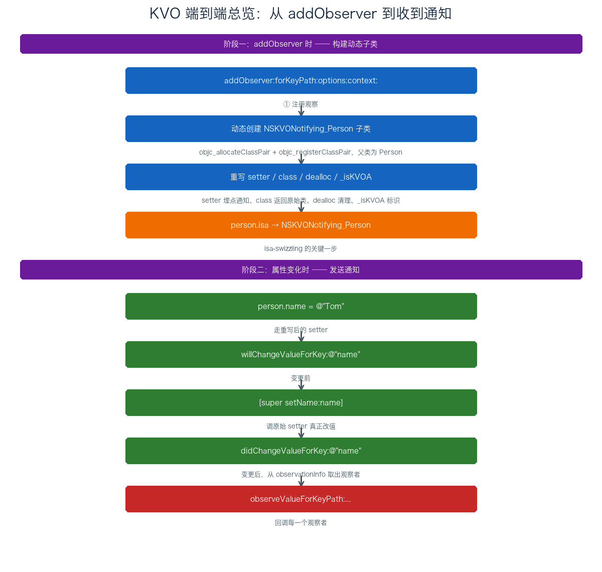
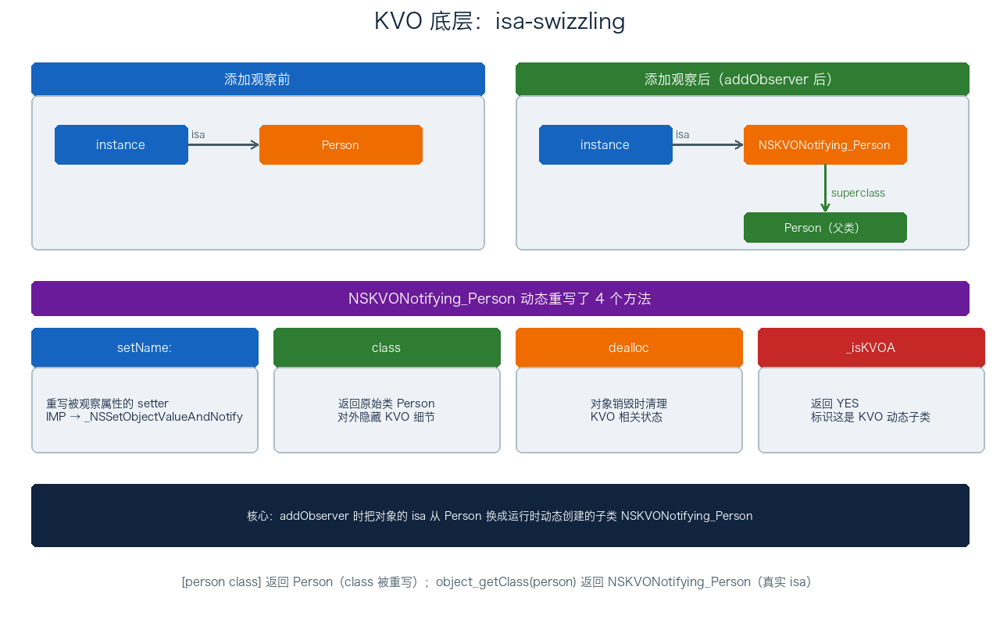
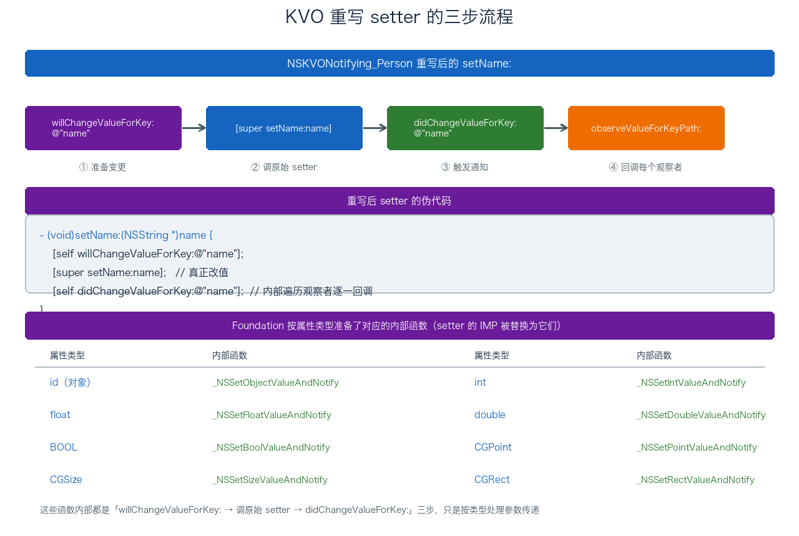
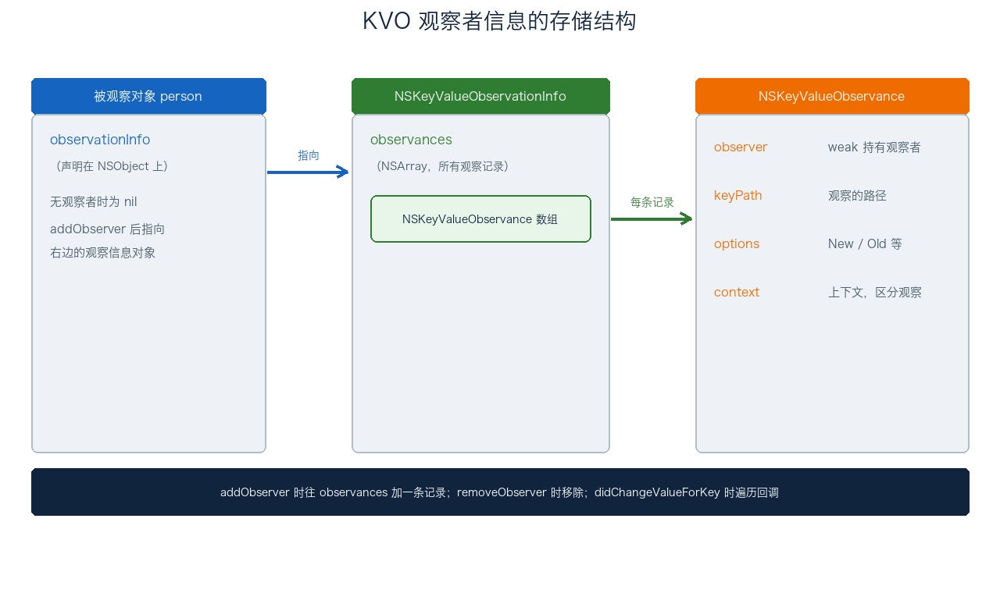

# 06. KVO 机制分析

> KVO（Key-Value Observing，键值观察）是 OC 基于 KVC 实现的一套观察者模式，让一个对象能监听另一个对象某个属性的变化。这篇从用法讲起，重点拆它的底层实现 isa-swizzling（动态子类 + 重写 setter），再讲观察者信息怎么存、手动 KVO、依赖键、集合观察，最后落到几个必须注意的坑和 Swift 里的变化。上一篇 KVC 是这篇的地基，`setValue:forKey:` 会自动触发 KVO 这个点会反复用到。

## 目录

- [一、KVO 概述](#一kvo-概述)
- [二、KVO 底层实现：isa-swizzling](#二kvo-底层实现isa-swizzling)
- [三、重写 setter 的三步流程](#三重写-setter-的三步流程)
- [四、观察者信息的存储](#四观察者信息的存储)
- [五、手动触发 KVO](#五手动触发-kvo)
- [六、直接修改实例变量能否触发](#六直接修改实例变量能否触发)
- [七、依赖键与集合观察](#七依赖键与集合观察)
- [八、KVO 的注意事项](#八kvo-的注意事项)
- [九、Swift 中的 KVO](#九swift-中的-kvo)
- [附：高频速记](#附高频速记)

---

## 一、KVO 概述

### 1. KVO 是什么

KVO 是观察者模式的 OC 实现：一个对象（观察者）注册去监听另一个对象（被观察者）的某个属性，属性一变，观察者就收到通知。完整用法是三段式：

```objc
// 1. 注册观察
[person addObserver:self
         forKeyPath:@"name"
            options:NSKeyValueObservingOptionNew | NSKeyValueObservingOptionOld
            context:nil];

// 2. 接收通知
- (void)observeValueForKeyPath:(NSString *)keyPath
                      ofObject:(id)object
                        change:(NSDictionary *)change
                       context:(void *)context {
    if ([keyPath isEqualToString:@"name"]) {
        NSLog(@"%@ → %@", change[NSKeyValueChangeOldKey], change[NSKeyValueChangeNewKey]);
    }
}

// 3. 移除观察
- (void)dealloc {
    [person removeObserver:self forKeyPath:@"name"];
}
```

### 2. KVO 与 KVC 的关系

KVO 建立在 KVC 之上。触发 KVO 通知的入口是 `willChangeValueForKey:` / `didChangeValueForKey:` 这一对方法，而 KVC 的 `setValue:forKey:` 内部恰好会自动调它们。所以上一篇文章说的「KVC 设值会自动触发 KVO」就是这个原因。KVO 本身不直接操作属性，它只负责在属性变化前后「埋点」。

---

## 二、KVO 底层实现：isa-swizzling

KVO 的核心机制是 **isa-swizzling**：给对象添加观察者时，Runtime 在运行期动态创建它所属类的一个子类，然后把对象的 `isa` 指针指向这个新子类。之后属性变化走的是子类里重写的方法。

整个 KVO 从注册到收到通知，是一条「构建子类 → 改 isa → 埋点通知」的链路，一张图看全貌：



下面把这条链路拆开讲。



### 1. 动态创建子类

第一次对某个类的实例调 `addObserver:forKeyPath:options:context:` 时，Runtime 会：

1. 检查 `NSKVONotifying_ClassName` 这个子类是否已存在，不存在就用 `objc_allocateClassPair` 创建（父类是原始类）、`objc_registerClassPair` 注册；
2. 把被观察对象的 `isa` 从 `ClassName` 改成 `NSKVONotifying_ClassName`；
3. 在动态子类上重写被观察属性的 setter、class、dealloc、_isKVOA 四个方法。

```text
添加观察前：instance.isa → Person
添加观察后：instance.isa → NSKVONotifying_Person（superclass → Person）
```

注意两点：这个子类是**按类创建的、一个类只建一次**，同一个类所有被观察的实例共用一个动态子类；对象本身没变，只是 `isa` 指到了别处。Foundation 内部用 dispatch_once 或全局哈希表保证线程安全，并发 addObserver 也不会重复创建。

#### isa 是什么、为什么叫 swizzling

isa（is-a）是 OC 对象头部的第一个字段，类型是 `Class`，含义是「我这个对象是什么」：实例的 isa 指向它的类、类的 isa 指向它的元类、元类的 isa 指向根元类，链路最终指向 NSObject。OC 消息发送从对象的 isa 开始、沿 superclass 链向上查方法表。isa-swizzling 改的就是这一步——把实例对象的 isa 换成动态子类，之后所有消息都从新类开始查找。

OC 里还有个 method swizzling（方法调配），通过交换两个方法的 IMP 截获调用。isa-swizzling 是更高层的 swizzle：直接换类引用、整体替换方法查找入口。一个类未观察的属性 setter 没被重写、走 superclass 链找到原始实现、仍然能正常工作，只是没触发 KVO。这就是为什么 KVO 只重写 setName 而不必把每个属性的 setter 都换一遍。

### 2. 重写 class 方法

动态子类会重写 `class` 方法，返回原始类而不是 `NSKVONotifying_` 前缀的子类，目的就是对外藏住 KVO 的痕迹。重写后的实现大致是：

```objc
- (Class)class {
    return class_getSuperclass(object_getClass(self));
}
```

`object_getClass(self)` 拿到真实 isa（NSKVONotifying_Person），`class_getSuperclass` 再取它的父类，也就是原始类 Person，返回给调用方。所以：

```objc
Person *p = [[Person alloc] init];
[p addObserver:self forKeyPath:@"name" options:0 context:nil];

NSLog(@"%@", [p class]);            // Person（class 被重写，返回原始类）
NSLog(@"%@", object_getClass(p));   // NSKVONotifying_Person（真实 isa）
```

`[p class]` 和 `object_getClass(p)` 在这里给出不同结果，就是因为前者被重写、后者直接读 isa。面试里「为什么 `[p class]` 还是 Person」答案就在这。

### 3. 重写 dealloc 和 _isKVOA

除了 class，动态子类还重写了两个方法：

- `dealloc`：对象销毁时做 KVO 相关的清理；
- `_isKVOA`：返回 YES，标识这是 KVO 动态生成的类，供 Runtime 内部判断。

### 4. 动态子类的元类链

添加观察后，对象的完整类链变成：

```text
person.isa                              → NSKVONotifying_Person         (实例所属类)
NSKVONotifying_Person 的元类.isa        → 根元类
NSKVONotifying_Person 的元类.superclass → NSKVONotifying_Person
... → NSObject 的元类 → 根元类
```

这条链和原始类相比只多了第一段「NSKVONotifying_Person」。实例方法（setter、class、dealloc 等）的查找起点在 NSKVONotifying_Person，类方法（+load、+initialize 等）的查找起点在它的元类，沿 superclass 链向上都能找到原始类的实现——除了动态子类自己重写的 4 个方法，其他都正常继承。这就是为什么动态子类不会破坏类原有的方法调用。

### 5. Runtime 实测 isa-swizzling

可以直接用 Runtime API 在运行期把 KVO 的动作印出来，最有说服力的是：观察前后分别打印对象真实类和动态子类的方法列表：

```objc
- (void)logClassInfo:(id)obj label:(NSString *)label {
    Class cls = object_getClass(obj);
    NSLog(@"%@: [obj class] = %@, object_getClass = %@",
          label, NSStringFromClass([obj class]), NSStringFromClass(cls));

    unsigned int methodCount = 0;
    Method *methods = class_copyMethodList(cls, &methodCount);
    NSLog(@"  %@ 上 %u 个方法：", NSStringFromClass(cls), methodCount);
    for (unsigned int i = 0; i < methodCount; i++) {
        NSLog(@"    - %@", NSStringFromSelector(method_getName(methods[i])));
    }
    free(methods);
}

Person *p = [[Person alloc] init];
[self logClassInfo:p label:@"添加观察前"];

[p addObserver:self forKeyPath:@"name" options:0 context:nil];
[self logClassInfo:p label:@"添加观察后"];
```

输出大致是：

```text
添加观察前：[obj class] = Person, object_getClass = Person
  Person 上 N 个方法：
    - setName:
    - name
    - dealloc
    - class
    - ... (其他)

添加观察后：[obj class] = Person, object_getClass = NSKVONotifying_Person
  NSKVONotifying_Person 上 4 个方法：
    - setName:
    - class
    - dealloc
    - _isKVOA
```

从输出能直接看出来的几个点：

- `[p class]` 还是 Person，但 `object_getClass(p)` 已经是 NSKVONotifying_Person——印证重写 class 返回原始父类；
- 动态子类上只有 4 个方法（setter、class、dealloc、_isKVOA），其他方法沿 superclass 链到 Person 上找——印证元类链分析；
- 观察前的 setName 是 Person 自己的实现，观察后的 setName 是 NSKVONotifying_Person 重写的，调用走的是动态子类。

### 6. setter 在动态子类上的查找路径

以观察 `name` 属性为例，对象发消息的过程：

```text
[person setName:@"Tom"]
  → objc_msgSend(person, @selector(setName:))
  → 从 person.isa = NSKVONotifying_Person 开始查方法表
  → 命中重写的 setName:，IMP 是 _NSSetObjectValueAndNotify
  → 内部走 willChange → super setName → didChange
```

没观察的属性（比如只观察 name，没观察 age）走 setter 时 `object_getClass(person)` 还是 NSKVONotifying_Person，但 setAge: 在动态子类上找不到，沿 superclass 链到 Person 上找原始实现、正常改值——只是因为没埋点、所以不触发 KVO。这就是为什么「只观察需要的 keyPath」就够，不必每个属性都加。

### 7. removeObserver 后的 isa 行为

`removeObserver:forKeyPath:` 把对应观察记录从 observationInfo 拿掉后，isa 指针是否变回原始类，是 Foundation 的内部实现细节，Apple 公开文档没有保证：

- 现代实现里（iOS 11 之后基本稳定），观察关系全部解除后 Foundation 内部通常会把 isa 还原成原始类，避免动态子类的方法表无意义挂在那里；
- 这是优化策略，不是公开契约，不同 iOS 版本或边界条件可能不一致。

业务代码不要靠 `object_getClass(p)` 的返回值推断「对象是否还有 KVO 观察」，这个值受实现细节影响。判断 KVO 是否仍然有效，应当看 `observeValueForKeyPath:` 回调是否被调用，或者直接用 Swift 的 block-based KVO API（NSKeyValueObservation 持有即有效、释放即自动移除）。

---

## 三、重写 setter 的三步流程

动态子类最关键的改动，是重写被观察属性的 setter。重写后的 setter 内部就三步：



```objc
- (void)setName:(NSString *)name {
    [self willChangeValueForKey:@"name"];   // ① 变更前
    [super setName:name];                    // ② 调原始 setter 真正改值
    [self didChangeValueForKey:@"name"];     // ③ 变更后，遍历观察者回调
}
```

`didChangeValueForKey:` 内部会找出监听这个 key 的所有观察者，逐个调它们的 `observeValueForKeyPath:ofObject:change:context:`。

实际上，这个 setter 的 IMP 不是用上面的 OC 代码实现的，而是被替换成了 Foundation 里预定义的 C 函数 `_NSSetXXXValueAndNotify` 系列。因为不同类型参数传递方式不同（对象传指针、基本类型传值、结构体按成员传），Foundation 给每种类型都准备了一个函数：

| 属性类型 | 内部函数 |
| --- | --- |
| id（对象） | `_NSSetObjectValueAndNotify` |
| int | `_NSSetIntValueAndNotify` |
| float / double | `_NSSetFloatValueAndNotify` / `_NSSetDoubleValueAndNotify` |
| BOOL | `_NSSetBoolValueAndNotify` |
| CGPoint / CGSize / CGRect | `_NSSetPointValueAndNotify` / `_NSSetSizeValueAndNotify` / `_NSSetRectValueAndNotify` |
| NSRange | `_NSSetRangeValueAndNotify` |

这些函数内部逻辑都一样，就是上面那三步，只是按类型处理参数。

### 通知里的 change 字典和 options 选项

`observeValueForKeyPath:ofObject:change:context:` 收到的 change 字典，key 是 `NSKeyValueChangeKey` 类型，常用这几个：

| key | 含义 |
| --- | --- |
| `NSKeyValueChangeKindKey` | 变更类型（设置 / 插入 / 删除 / 替换） |
| `NSKeyValueChangeNewKey` | 新值（options 里带了 New 才有） |
| `NSKeyValueChangeOldKey` | 旧值（options 里带了 Old 才有） |
| `NSKeyValueChangeIndexesKey` | 集合变更时，具体变更的索引 |
| `NSKeyValueChangeNotificationIsPriorKey` | 变更前通知的标记（options 里带了 Prior） |

其中 `NSKeyValueChangeKindKey` 对应的值是 `NSKeyValueChange` 枚举：

```objc
typedef NS_ENUM(NSUInteger, NSKeyValueChange) {
    NSKeyValueChangeSetting = 1,       // 设置（普通属性赋值）
    NSKeyValueChangeInsertion = 2,     // 插入（集合加元素）
    NSKeyValueChangeRemoval = 3,       // 删除（集合删元素）
    NSKeyValueChangeReplacement = 4,   // 替换（集合替换元素）
};
```

要不要带 new / old 值，取决于 `addObserver:...options:` 传了什么选项。options 是位掩码，四个常用值：

| 选项 | 作用 |
| --- | --- |
| `NSKeyValueObservingOptionNew` | 通知里带上新值 |
| `NSKeyValueObservingOptionOld` | 通知里带上旧值 |
| `NSKeyValueObservingOptionInitial` | 注册后立刻先发一次通知，带上初始值 |
| `NSKeyValueObservingOptionPrior` | 变更前后各发一次，变更前那次带 `NotificationIsPrior` 标记 |

`Initial` 和 `Prior` 用得少，但在「注册时要先拿一次初始值」「需要在改动前拦截」这两个场景有用。

---

## 四、观察者信息的存储

观察者信息存在被观察对象身上，链式结构：对象的 `observationInfo` 属性（声明在 `NSObject` 上）→ `NSKeyValueObservationInfo` 对象 → 一组 `NSKeyValueObservance` 记录。



`NSKeyValueObservationInfo` 里就是个 `observances` 数组，装着所有观察关系：

```objc
@interface NSKeyValueObservationInfo : NSObject
@property (nonatomic, strong) NSArray<NSKeyValueObservance *> *observances;
@end
```

每条 `NSKeyValueObservance` 记录一个观察关系，字段大概是：

```objc
@interface NSKeyValueObservance : NSObject
@property (nonatomic, weak) id observer;     // 观察者（weak，避免循环引用）
@property (nonatomic, copy) NSString *keyPath;
@property (nonatomic) NSKeyValueObservingOptions options;
@property (nonatomic) void *context;
@end
```

`addObserver:forKeyPath:options:context:` 就做一件事：把 observer、keyPath、options、context 打包成一条记录塞进 `observationInfo`；`removeObserver:forKeyPath:` 则移除对应记录；`didChangeValueForKey:` 时从里面找出该 keyPath 的所有记录，逐一回调。观察者用 weak 持有，所以被观察对象不会因为 KVO 而强引用观察者。

这个存储结构可以打印验证：没观察者时 `observationInfo` 是 nil，加了观察者之后变成一个内部对象：

```objc
Person *person = [[Person alloc] init];
NSLog(@"%p", person.observationInfo);   // 0x0（无观察者，是 nil）

[person addObserver:self forKeyPath:@"name" options:0 context:nil];
NSLog(@"%@", person.observationInfo);   // 打印出观察信息的内部对象
```

---

## 五、手动触发 KVO

默认情况下，通过 setter 改属性会自动触发 KVO（自动 KVO）。想自己控制通知时机，可以手动。

### 1. 关闭自动 KVO

```objc
+ (BOOL)automaticallyNotifiesObserversForKey:(NSString *)key {
    if ([key isEqualToString:@"name"]) {
        return NO;   // 关闭 name 的自动通知
    }
    return [super automaticallyNotifiesObserversForKey:key];
}
```

### 2. 手动触发

```objc
- (void)setName:(NSString *)name {
    if (![_name isEqualToString:name]) {   // 值有变化才通知
        [self willChangeValueForKey:@"name"];
        _name = name;
        [self didChangeValueForKey:@"name"];
    }
}
```

手动 KVO 的典型场景：合并多个属性变更为一次通知、只在值真正变化时通知、在非 setter 方法里改属性也要触发通知。

---

## 六、直接修改实例变量能否触发

不能。直接 `person->_name = @"Tom"` 不会触发 KVO，因为 KVO 的通知埋点设在重写后的 setter 里，直接改 ivar 绕过了 setter。

```objc
person->_name = @"Tom";       // 不触发 KVO
person.name = @"Tom";         // 触发（走 setter）
[person setName:@"Tom"];      // 触发（走 setter）
```

但有一个例外：**通过 KVC 的 `setValue:forKey:` 改，即使类没有 setter，也会触发**。因为 KVC 直接设 ivar 时内部也会调 `willChangeValueForKey:` / `didChangeValueForKey:`：

```objc
[person setValue:@"Tom" forKey:@"name"];   // 无 setter 也触发 KVO
```

这个点把 KVC 和 KVO 串了起来，也是面试爱问的连环题。

---

## 七、依赖键与集合观察

### 1. 依赖键（Dependent Keys）

当一个属性由其他属性派生而来，可以让被依赖属性变化时，自动触发派生属性的 KVO 通知：

```objc
// fullName 依赖 firstName 和 lastName
+ (NSSet<NSString *> *)keyPathsForValuesAffectingFullName {
    return [NSSet setWithObjects:@"firstName", @"lastName", nil];
}

- (NSString *)fullName {
    return [NSString stringWithFormat:@"%@ %@", self.firstName, self.lastName];
}
```

这样 `firstName` 或 `lastName` 一变，观察 `fullName` 的观察者也会收到通知。也可以按 `<Key>` 命名约定写成 `keyPathsForValuesAffectingFullName`（上面的就是），或统一用 `keyPathsForValuesAffectingValueForKey:` 分发。

### 2. 集合观察

对 NSArray、NSSet 这类集合属性，直接 `[array addObject:]` 不会触发 KVO。要走 KVC 的集合代理方法：

```objc
[self.items addObject:newItem];                              // 不触发
[[self mutableArrayValueForKey:@"items"] addObject:newItem];  // 触发
```

`mutableArrayValueForKey:` 返回的是代理数组，对它的操作会自动包裹在 `willChange:valuesAtIndexes:forKey:` / `didChange:valuesAtIndexes:forKey:` 之间，通知里还带精确的变更信息（插入、删除、替换及对应索引）。

---

## 八、KVO 的注意事项

### 1. 必须移除观察者

观察者销毁前必须 `removeObserver:forKeyPath:`，否则被观察对象属性变化时会向已释放的观察者发消息，野指针崩溃。这也是为什么 KVO 比 block 通知更容易出事——移除时机要自己盯着。

### 2. 不能重复移除

对同一个 keyPath 重复 `removeObserver:` 会抛异常。要用标志位或 `@try/@catch` 保护，或者干脆用 Swift 的 block API（自动管理）。

### 3. 缺乏类型安全

keyPath 是字符串，拼错没有编译期警告。可以用 `NSStringFromSelector(@selector(name))` 或 Swift 的 `#keyPath()` 降低拼错概率。

### 4. context 参数要正确用

父类和子类同时观察同一个 keyPath 时，用 context 区分通知归属：

```objc
static void *MyContext = &MyContext;
[p addObserver:self forKeyPath:@"name" options:0 context:MyContext];

- (void)observeValueForKeyPath:(NSString *)keyPath
                      ofObject:(id)object change:(NSDictionary *)change
                       context:(void *)context {
    if (context == MyContext) {
        // 自己处理的观察
    } else {
        [super observeValueForKeyPath:keyPath ofObject:object change:change context:context];
    }
}
```

### 5. 线程安全

KVO 通知是在属性变化所在线程同步发送的，不一定在主线程。回调里更新 UI 要手动切主线程。

---

## 九、Swift 中的 KVO

Swift 里用 KVO 有两个前提：被观察类继承 `NSObject`，被观察属性标记 `@objc dynamic`。这两个条件不是随便加的，背后是 Swift 与 ObjC Runtime 两套派发机制的差异。

```swift
class Person: NSObject {
    @objc dynamic var name: String = ""
}

// block-based API（推荐）
let observation = person.observe(\.name, options: [.new, .old]) { person, change in
    print("\(change.oldValue ?? "") → \(change.newValue ?? "")")
}
// observation 释放时自动移除观察，无需手动 removeObserver
```

### 1. 为什么必须继承 NSObject

KVO 的底层是 isa-swizzling：Runtime 动态创建子类、替换对象的 isa 指针。这套机制只在 ObjC 对象上成立——只有继承 NSObject 的对象才带 ObjC 的 isa 指针、才参与 ObjC 的消息派发，Runtime 才能对它做「建子类 + 换 isa + 重写 setter」这套操作。

纯 Swift 类不继承 NSObject 时，内存布局里没有 ObjC 的 isa 指针，也不走 `objc_msgSend` 消息派发，Runtime 对它够不着，自然做不了 isa-swizzling。另外 KVO 一整套基础设施（`addObserver:forKeyPath:`、`observationInfo`、`willChangeValueForKey:` 等）都定义在 NSObject 上，不继承就拿不到这些入口。

### 2. 为什么必须 @objc dynamic

`@objc` 和 `dynamic` 是两个不同的关键字，各管一件事，缺一不可：

- **`@objc`：把成员暴露给 ObjC Runtime。** Swift 的属性和方法默认是「编译期确定派发目标」的，不进入 ObjC 的方法表。KVO 要在运行时替换 setter 的 IMP，前提是这个 setter 得让 Runtime 看得见、找得到——`@objc` 就是干这个的，它给成员生成 ObjC 符号、登记进方法表。
- **`dynamic`：让调用走 ObjC 动态派发。** 光有 `@objc` 还不够：Swift 内部访问这个属性时，仍然可能走它自己的静态派发或 vtable 派发，编译期就把实现地址写死了，不会去 Runtime 查表。这样 KVO 在动态子类里重写的 setter 根本不会被命中。`dynamic` 强制每次访问都走 `objc_msgSend`、运行时查方法表，重写后的 setter 才真正生效。

两个关键字的分工就是：`@objc` 负责「Runtime 能看到」，`dynamic` 负责「调用时真的走 Runtime」。只加 `@objc` 不加 `dynamic`，Swift 内部直接改属性不会触发 KVO；补上 `dynamic` 才行。

对比一下，KVC 只要 `@objc` 就够了——`setValue:forKey:` 本身是通过字符串在 Runtime 里查 setter，天然走动态派发，不需要 `dynamic`。KVO 多要一个 `dynamic`，是因为它还得保证 Swift 自己的调用路径也被 Runtime 拦截。

Swift 的 block-based KVO 相比 OC 的老式 API 有几个好处：`\.name` 编译期检查 keyPath；返回 `NSKeyValueObservation` 对象，持有即保持观察、释放即自动移除；不用重写 `observeValueForKeyPath:` 去集中处理 if-else。

纯 Swift 类（不继承 NSObject）不支持 KVO，因为 KVO 依赖 ObjC Runtime 的 isa-swizzling。纯 Swift 场景用 Combine 的 `@Published` 或 Swift Observation（iOS 17+ 的 `@Observable`）替代。

---

## 附：高频速记

- **KVO 是什么**：观察者模式，监听对象属性变化，基于 KVC，靠 `willChange/didChangeValueForKey:` 埋点。
- **底层机制 isa-swizzling**：addObserver 时动态创建 `NSKVONotifying_ClassName` 子类，把对象 isa 指向它。
- **动态子类重写 4 个方法**：setter（埋点通知）、class（返回原始类）、dealloc（清理）、_isKVOA（标识）。
- **`[p class]` 返回原始类，`object_getClass(p)` 返回 NSKVONotifying 子类**，因为 class 被重写。
- **重写 setter 三步**：`willChangeValueForKey:` → 调原始 setter → `didChangeValueForKey:`（遍历观察者回调）。
- **setter IMP 被换成 `_NSSetXXXValueAndNotify` 系列**，按属性类型区分（对象/int/float/BOOL/CGPoint 等）。
- **观察者存储**：对象 `observationInfo` → `NSKeyValueObservationInfo.observances` → 每条 `NSKeyValueObservance`（observer/keyPath/options/context，observer 用 weak）。
- **直接改 ivar 不触发 KVO**，但 KVC `setValue:forKey:` 触发（内部自动调 will/didChange）。
- **手动 KVO**：`automaticallyNotifiesObserversForKey:` 返回 NO 关闭自动，再手动调 will/didChange。
- **依赖键**：`keyPathsForValuesAffecting<Key>` 声明派生关系；**集合观察**用 `mutableArrayValueForKey:`。
- **坑**：必须 removeObserver、不能重复移除、keyPath 缺类型安全、context 区分父子观察、通知在变化线程同步发送。
- **change 字典 key**：`KindKey` / `NewKey` / `OldKey` / `IndexesKey` / `NotificationIsPriorKey`；带不带 new / old 由 options 决定。
- **options 四值**：`New`（带新值）、`Old`（带旧值）、`Initial`（注册即发一次）、`Prior`（变更前后各发一次）。
- **isa 是什么**：OC 对象头第一字段、类型 Class，实例 isa 指类、类 isa 指元类；消息发送从 isa 沿 superclass 链查方法表，isa-swizzling 改的就是这一步。
- **isa-swizzling vs method swizzling**：前者换类引用、整体替换查找入口，后者只换 IMP；动态子类只重写被观察属性的 setter，没观察的属性沿 superclass 链找原始实现、不破坏正常调用。
- **动态子类单例**：一个类只建一次动态子类、多实例共享；Foundation 用 dispatch_once 或全局表保证线程安全，并发 addObserver 不会重复创建。
- **动态子类上只有 4 个方法**：被观察属性 setter、class、dealloc、_isKVOA；其他方法沿 superclass 链到原始类。
- **removeObserver 后 isa 行为**：Foundation 实现细节、无公开保证；业务代码不应靠 `object_getClass(p)` 判断 KVO 是否仍在生效，用回调或 Swift `NSKeyValueObservation` 更稳。
- **Swift KVO 两前提**：类继承 NSObject（拿 isa 指针 + KVO 基础设施），属性标 `@objc dynamic`（`@objc` 暴露给 Runtime、`dynamic` 走 objc_msgSend 动态派发）；KVC 只要 `@objc`，KVO 多要一个 `dynamic` 保证 Swift 调用也被拦截。
