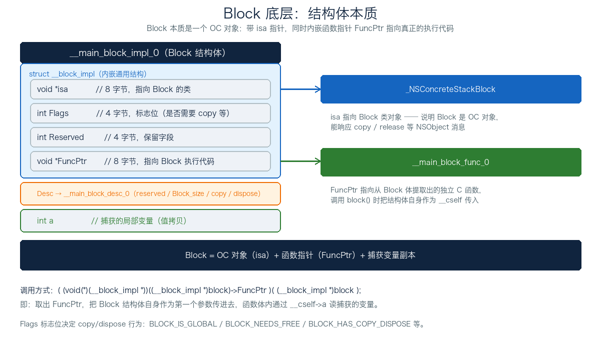
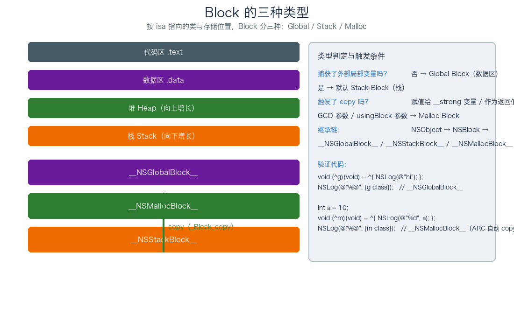
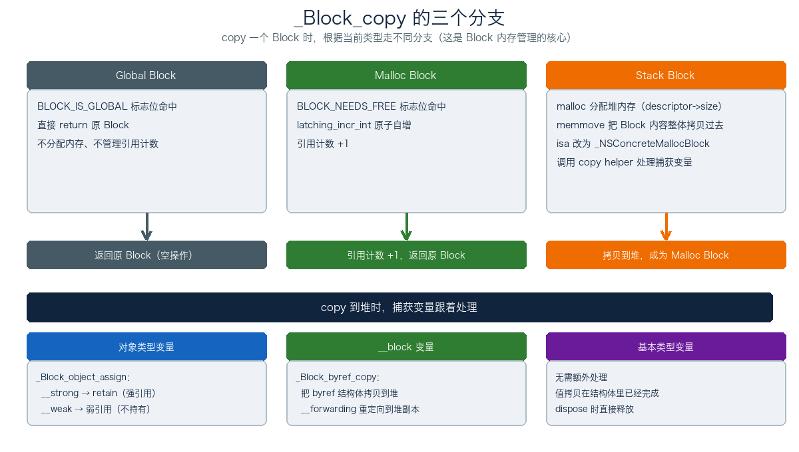
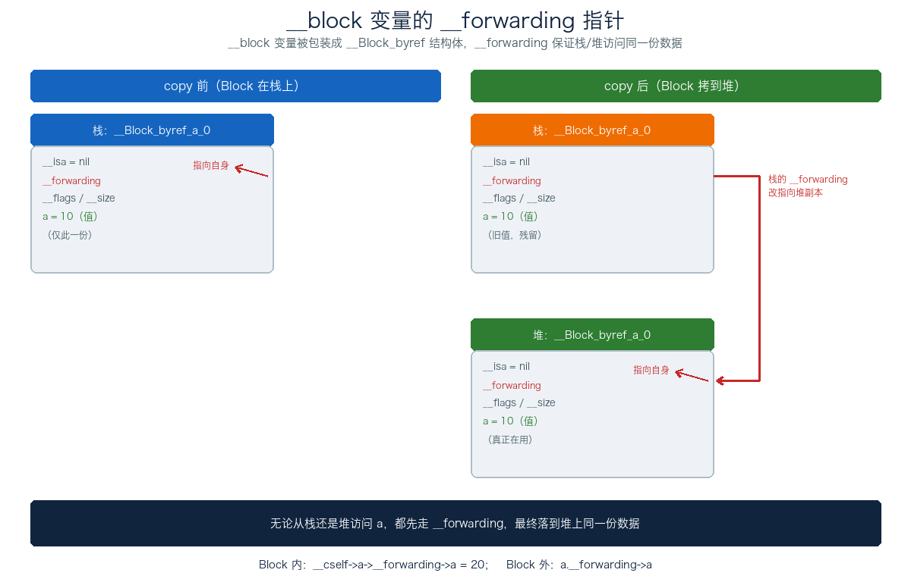
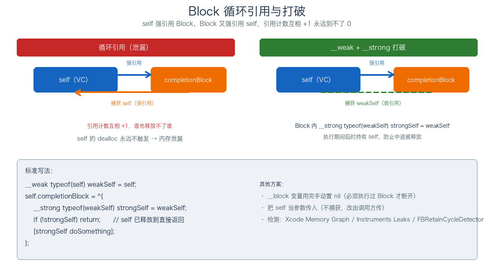

# 07. Block 底层分析

> Block 本质上是一个 OC 对象，底层是带 `isa` 指针的 C 结构体，同时内嵌一个函数指针 `FuncPtr` 指向真正的执行代码。这篇先讲它是什么（结构体本质 + 三种类型），再讲 copy 做了什么、变量怎么被捕获、`__block` 怎么实现、循环引用怎么形成和打破，最后落到「Block 属性为什么要用 `copy`」和编译运行的完整流程。前面 KVC 是「字符串找方法」的间接访问，Block 是「带捕获变量的函数对象」，两条线索分别撑起 OC 的两个底层机制。

## 目录

- [一、Block 是什么](#一block-是什么)
- [二、Block 的本质：结构体](#二block-的本质结构体)
- [三、Block 的三种类型](#三block-的三种类型)
- [四、Block 的 copy 操作](#四block-的-copy-操作)
- [五、变量捕获机制](#五变量捕获机制)
- [六、`__block` 的实现](#六`__block`-的实现)
- [七、循环引用](#七循环引用)
- [八、Block 属性为什么用 copy](#八block-属性为什么用-copy)
- [九、Block 编译与运行时全流程](#九block-编译与运行时全流程)
- [附：高频速记](#附高频速记)

---

## 一、Block 是什么

### 1. 一句话

Block 是 OC 里的匿名函数对象：可以像函数一样调用，可以捕获定义时所在作用域的变量，可以作为参数传递、作为返回值。它在 C 语法上看起来像 `^{ ... }` 一段代码，但运行时它是一个真正的 OC 对象，能响应 `copy`、`release`、`class` 等消息。

```objc
void (^block)(void) = ^{
    NSLog(@"Hello Block");
};
block();   // 像函数一样调用
```

### 2. 三种典型用法

```objc
// 1. 赋值给变量
void (^printBlock)(int) = ^(int n){ NSLog(@"%d", n); };

// 2. 作为函数参数（GCD、数组排序、动画）
dispatch_async(dispatch_get_main_queue(), ^{
    self.view.backgroundColor = [UIColor whiteColor];
});
NSArray *sorted = [arr sortedArrayUsingComparator:^NSComparisonResult(id a, id b){
    return [a compare:b];
}];

// 3. 作为回调属性（最常见）
@property (nonatomic, copy) void (^onFinish)(BOOL success);
```

### 3. 用 `clang -rewrite-objc` 看真相

Block 看起来是 C 语法扩展，编译时 Clang 把它转成普通 C 代码：把 Block 体提取成一个独立 C 函数，把 `^{ ... }` 表达式替换成结构体构造和调用。把下面这段：

```objc
int a = 10;
void (^block)(void) = ^{
    NSLog(@"%d", a);
};
block();
```

放到 `.m` 文件里跑 `clang -rewrite-objc main.m`，会展开成 `main.cpp`。核心结构是这样的：

```c
struct __block_impl {
    void *isa;
    int Flags;
    int Reserved;
    void *FuncPtr;
};

struct __main_block_impl_0 {
    struct __block_impl impl;
    struct __main_block_desc_0 *Desc;
    int a;                              // 捕获的变量
};
```

接下来两节会基于这个结构体一点点拆开看。

---

## 二、Block 的本质：结构体



### 1. 通用实现 `__block_impl`

每个 Block 结构体最前面都嵌一个 `__block_impl`，这是 Block 的「通用头」：

| 字段 | 大小 | 作用 |
| --- | --- | --- |
| `isa` | 8 字节 | 指向 Block 的类对象，类型不同（Global / Stack / Malloc）指不同类 |
| `Flags` | 4 字节 | 标志位，记录是否需要 copy / dispose、是否 Global 等 |
| `Reserved` | 4 字节 | 保留字段 |
| `FuncPtr` | 8 字节 | 指向从 Block 体提取出的独立 C 函数 |

### 2. Desc 描述信息

`Desc` 是 `__main_block_desc_0 *`，存的是 Block 的元信息：

```c
struct __main_block_desc_0 {
    unsigned long reserved;
    unsigned long Block_size;              // Block 结构体的总大小
    void (*copy)(struct __main_block_impl_0 *, struct __main_block_impl_0 *);
    void (*dispose)(struct __main_block_impl_0 *);
};
```

`copy` 和 `dispose` 是辅助函数：捕获了对象类型变量或 `__block` 变量时才需要，Block 被 copy 到堆时调 copy 处理引用，Block 释放时调 dispose 解引用。

### 3. 捕获的变量存哪

Block 结构体末尾的成员就是它捕获的变量。上面例子里捕获了 `a`，结构体里就有 `int a`。捕获多个变量时按定义顺序排列，每个变量占一个成员。

```c
struct __main_block_impl_0 {
    struct __block_impl impl;
    struct __main_block_desc_0 *Desc;
    int a;                  // 捕获的局部变量
    int b;                  // 再捕获一个
    NSString *name;         // 对象类型也是值拷贝（指针值）
};
```

捕获成员也可能带来内存对齐：结构体里装着 8 字节的 `isa` / `FuncPtr` / `Desc` 指针，整个结构体大小要按 8 字节对齐，所以捕获一个 `int a`（4 字节）时，末尾可能补 4 字节 padding。这是面试偶尔问的冷门细节，记住「结构体按最大成员对齐」就行。

### 4. 调用 Block 时发生了什么

调用 `block()` 的本质是取出 `FuncPtr`，把 Block 结构体自身作为第一个参数传进去：

```c
((void (*)(__block_impl *))((__block_impl *)block)->FuncPtr)((__block_impl *)block);
//              ↑ 函数指针                ↑ 第一个参数 __cself
```

这就是为什么 `__main_block_func_0` 的第一个参数一定是 `__cself`——它要通过 `__cself->a` 读捕获的变量：

```c
static void __main_block_func_0(struct __main_block_impl_0 *__cself) {
    int a = __cself->a;   // 从结构体读
    NSLog(@"%d", a);
}
```

### 5. 继承链

Block 是 OC 对象，继承链是：

```
NSObject → NSBlock → __NSConcreteGlobalBlock__（具体类）
                       __NSConcreteStackBlock__
                       __NSConcreteMallocBlock__
```

这意味着 Block 能响应 `NSObject` 的所有方法：`class`、`isKindOfClass:`、`respondsToSelector:` 等。打印 `[block class]` 能看到 `__NSGlobalBlock__` 之类的具体类名就是这个原因。

### 6. Flags 关键位

`Flags` 是个位掩码，把引用计数和一堆标志位塞进一个 32 位字段里，Block 的很多行为都由它决定：

| 宏 | 值 | 含义 |
| --- | --- | --- |
| `BLOCK_DEALLOCATING` | 0x0001 | Block 正在被释放（运行时使用） |
| `BLOCK_REFCOUNT_MASK` | 0xfffe | 引用计数掩码：低 16 位里的高 15 位存引用计数 |
| `BLOCK_NEEDS_FREE` | 1 << 24 | 堆 Block，需要 free 释放 |
| `BLOCK_HAS_COPY_DISPOSE` | 1 << 25 | 有 copy / dispose 辅助函数（捕获对象或 `__block` 变量时置位） |
| `BLOCK_HAS_CTOR` | 1 << 26 | 有 C++ 构造函数 / 析构函数 |
| `BLOCK_IS_GC` | 1 << 27 | GC 标记（已废弃） |
| `BLOCK_IS_GLOBAL` | 1 << 28 | Global Block |
| `BLOCK_HAS_STRET` | 1 << 29 | 返回值通过结构体返回（已废弃） |
| `BLOCK_HAS_SIGNATURE` | 1 << 30 | Block 带类型签名 |

几个关键的：`BLOCK_REFCOUNT_MASK`（0xfffe）就是低 16 位里的高 15 位，最低位 0x0001 被 `BLOCK_DEALLOCATING` 占走；`BLOCK_HAS_COPY_DISPOSE` 最常见——Block 捕获了对象或 `__block` 变量时编译器会置位，并生成 copy / dispose 辅助函数。这些标志位在 `_Block_copy`、`_Block_dispose` 等底层函数里都会被检查。

### 7. 构造函数

编译器给每个 Block 生成一个构造函数，创建 Block 时把函数指针、描述信息、捕获变量一起塞进结构体，同时初始化 isa 和 Flags：

```c
__main_block_impl_0(void *fp, struct __main_block_desc_0 *desc, int _a, int flags = 0)
    : a(_a) {
    impl.isa = &_NSConcreteStackBlock;   // 默认指向栈 Block 类，copy 后才可能改成 Malloc
    impl.Flags = flags;
    impl.FuncPtr = fp;                    // 指向 __main_block_func_0
    Desc = desc;
}
```

`main` 里那句 `void (^block)(void) = ^{...}` 展开后，其实就是调这个构造函数：

```c
void (*block)(void) = (void (*)())&__main_block_impl_0(
    (void *)__main_block_func_0,   // FuncPtr
    &__main_block_desc_0_DATA,     // Desc
    a                              // 捕获变量，构造时值拷贝
);
```

注意 isa 默认指向 `_NSConcreteStackBlock`——这印证了「捕获了局部变量的 Block 出生在栈上」，要等 `_Block_copy` 才搬到堆、isa 改成 `_NSConcreteMallocBlock`。

---

## 三、Block 的三种类型



Block 按 `isa` 指向的类和存储位置分三种：

| 类型 | isa 指向 | 存储位置 | 触发条件 | 生命周期 |
| --- | --- | --- | --- | --- |
| `__NSGlobalBlock__` | `_NSConcreteGlobalBlock` | 数据区 `.data` | 不捕获任何外部局部变量 | 程序运行期间一直存在 |
| `__NSStackBlock__` | `_NSConcreteStackBlock` | 栈 | 捕获了外部局部变量，且未 copy | 当前函数作用域结束即销毁 |
| `__NSMallocBlock__` | `_NSConcreteMallocBlock` | 堆 | 对 Stack Block 执行 copy | 引用计数为 0 时销毁 |

### 1. Global Block

不捕获任何外部局部变量（访问全局变量、`static` 变量不影响类型）。编译器在编译期就确定它的内容，存到数据区。

```objc
void (^g)(void) = ^{
    NSLog(@"I am a global block");
};
NSLog(@"%@", [g class]);   // __NSGlobalBlock__
```

对 Global Block 调 `copy` / `retain` / `release` 都是空操作，没必要做引用管理。

### 2. Stack Block

捕获了外部局部变量的 Block 默认在栈上。栈上的内存随函数作用域结束被回收，Block 跟着失效。

```objc
int a = 10;
NSLog(@"%@", [^{ NSLog(@"%d", a); } class]);   // __NSStackBlock__
// ^ 这里没赋值给变量，Block 还没被 copy
```

栈 Block 有个危险：函数返回后还通过指针访问它，栈帧已经回收，要么崩溃要么读到错数据。ARC 下编译器通常自动 copy，所以基本遇不到裸的 Stack Block。

### 3. Malloc Block

对 Stack Block 执行 `copy`，Block 被搬到堆上，成为 `__NSMallocBlock__`，引用计数管理生命周期。

```objc
int a = 10;
void (^m)(void) = ^{ NSLog(@"%d", a); };
NSLog(@"%@", [m class]);   // __NSMallocBlock__（ARC 下赋值时自动 copy）
```

ARC 下绝大多数 Block 实际都是 Malloc Block，赋值给 `__strong` 变量那一刻编译器就插入 `_Block_copy` 调用了。

### 4. 内存分布总览

```
进程内存空间：
┌──────────────────────────────────────────┐
│ 代码区 .text  │ FuncPtr 指向的 C 函数     │
├──────────────────────────────────────────┤
│ 数据区 .data  │ __NSGlobalBlock__        │
├──────────────────────────────────────────┤
│ 堆（向上增长） │ __NSMallocBlock__        │
├──────────────────────────────────────────┤
│ 栈（向下增长） │ __NSStackBlock__         │
└──────────────────────────────────────────┘
```

---

## 四、Block 的 copy 操作



Block 的内存管理靠 `copy`，`copy` 走哪个分支由 `Flags` 决定：

| 源类型 | copy 后行为 |
| --- | --- |
| `__NSGlobalBlock__` | 直接返回原 Block（空操作） |
| `__NSStackBlock__` | 从栈拷贝到堆，isa 改成 `_NSConcreteMallocBlock` |
| `__NSMallocBlock__` | 引用计数 +1，返回原 Block |

### 1. `_Block_copy` 核心实现

```c
void *_Block_copy(const void *arg) {
    struct Block_layout *aBlock = (struct Block_layout *)arg;

    // Global Block：直接返回
    if (aBlock->flags & BLOCK_IS_GLOBAL) return aBlock;

    // Malloc Block：引用计数 +1
    if (aBlock->flags & BLOCK_NEEDS_FREE) {
        latching_incr_int(&aBlock->flags);   // 原子自增
        return aBlock;
    }

    // Stack Block：拷到堆上
    struct Block_layout *result = malloc(aBlock->descriptor->size);
    memmove(result, aBlock, aBlock->descriptor->size);
    result->flags |= BLOCK_NEEDS_FREE | 1;  // 标记堆 Block，引用计数 1
    result->isa = _NSConcreteMallocBlock;
    _Block_call_copy_helper(result, aBlock);
    return result;
}
```

`BLOCK_NEEDS_FREE` 标志位复用 `Flags` 字段的高位，低 16 位是引用计数（用 `latching_incr_int` 原子自增）。这个复用设计是 Block 实现里挺巧妙的一点。

### 2. copy 时对捕获变量的处理

Block 从栈拷到堆时，捕获的变量也要跟着处理：

```c
// 编译器为捕获了对象类型变量的 Block 生成的 copy helper
static void __main_block_copy_0(struct __main_block_impl_0 *dst,
                                 struct __main_block_impl_0 *src) {
    _Block_object_assign(&dst->array, src->array, BLOCK_FIELD_IS_OBJECT);
}

// 对应的 dispose helper
static void __main_block_dispose_0(struct __main_block_impl_0 *src) {
    _Block_object_dispose(src->array, BLOCK_FIELD_IS_OBJECT);
}
```

`_Block_object_assign` 内部按变量的所有权修饰符做不同处理：

| 修饰符 | copy 时行为 | 效果 |
| --- | --- | --- |
| `__strong`（默认） | 对对象执行 `retain` | Block 持有对象 |
| `__weak` | 创建弱引用 | Block 不持有对象 |
| `__unsafe_unretained` | 直接赋值指针 | 悬垂指针风险 |

捕获 `__block` 变量时走另一条路（见下节），捕获基本类型变量时无需额外处理（值拷贝已经在结构体里完成了）。

### 3. ARC 下编译器自动 copy 的场景

ARC 下大部分 Stack Block 在你看不见的时候就被自动 copy 了：

1. 赋值给 `__strong` 修饰的变量（包括 `@property`）
2. 作为函数或方法的返回值
3. 作为 Cocoa API 中 `usingBlock` 方法的参数
4. 作为 GCD API 的参数

底层都是编译器在赋值时插入 `objc_retainBlock` 调用，它内部最终走到 `_Block_copy`。所以 ARC 下基本看不到裸的 Stack Block。

---

## 五、变量捕获机制

Block 在定义时会捕获所在作用域的变量，但「怎么捕获」因变量类型而异，捕获规则是面试高频题。

### 1. 捕获规则总览

| 变量类型 | 是否捕获 | 捕获方式 | Block 内能否修改 | 原理 |
| --- | --- | --- | --- | --- |
| 局部自动变量（auto） | 捕获 | 值拷贝 | 不能（编译器报错） | 拷贝了一份独立副本 |
| `static` 局部变量 | 捕获 | 指针拷贝 | 能 | 持有变量地址，通过指针间接访问 |
| 全局变量 | 不捕获 | 直接访问 | 能 | 编译期地址确定，任何代码直接访问 |
| `__block` 修饰的局部变量 | 捕获 | 包装成 byref 结构体后捕获指针 | 能 | 通过 `__forwarding` 间接访问 |
| 对象类型局部变量 | 捕获 | 指针值拷贝 + 引用管理 | 能改对象内容，不能改指针 | `_Block_object_assign` 管理引用 |

### 2. auto 变量：值拷贝

```objc
int a = 10;
int b = 20;
void (^block)(void) = ^{
    NSLog(@"a = %d, b = %d", a, b);
};
a = 100; b = 200;
block();   // 输出 a = 10, b = 20（不是 100、200）
```

编译器在 Block 结构体里加了 `int a` 和 `int b` 两个成员，Block 创建时把值拷贝进去。Block 内的 `a`、`b` 跟外部的 `a`、`b` 是两份独立内存，互不影响。

那为什么 Block 内不能改 `a`？因为 Block 里访问的是副本，修改副本对外部的 `a` 没意义。编译器干脆直接禁止，避免写出语义混乱的代码。

### 3. `static` 变量：指针拷贝

```objc
static int count = 0;
void (^block)(void) = ^{
    count++;
    NSLog(@"count = %d", count);
};
count = 100;
block();   // 输出 count = 101
```

`static` 变量在数据区，生命周期跟程序一致，没「作用域结束销毁」的问题。Block 捕获的是变量的地址，Block 内通过 `*count` 间接改原值：

```c
struct __main_block_impl_0 {
    struct __block_impl impl;
    struct __main_block_desc_0 *Desc;
    int *count;          // 指针拷贝
};

static void __main_block_func_0(struct __main_block_impl_0 *__cself) {
    int *count = __cself->count;
    (*count)++;          // 通过指针改原值
}
```

### 4. 全局变量：不捕获

全局变量和静态全局变量的地址在编译期就确定，任何代码都能直接访问，Block 不需要额外捕获，结构体里也不会加对应成员。

### 5. 对象类型

```objc
NSMutableArray *array = [NSMutableArray array];
void (^block)(void) = ^{
    [array addObject:@1];     // OK：能改对象内容
    array = nil;               // 报错：不能改指针指向
};
```

捕获对象类型时，结构体里存的是指针值（值拷贝），但 Block 还要管理对象的引用关系：copy 时 retain（或按 `__weak`/`__unsafe_unretained` 走别的路径），dispose 时 release。这就是为什么 `_Block_object_assign` 要按 `BLOCK_FIELD_IS_OBJECT` 这类 flag 区分。

---

## 六、`__block` 的实现

`auto` 变量在 Block 内不能改，`static` 变量在 Block 内能改但有副作用（破坏作用域），「既要在 Block 内改、又不想影响作用域」就要用 `__block`。

### 1. 编译器把 `__block` 变量包装成结构体

```objc
__block int a = 10;
```

经过 Clang 转换后，`a` 不再是 `int`，而是一个结构体：

```c
struct __Block_byref_a_0 {
    void *__isa;                                 // 通常为 nil
    struct __Block_byref_a_0 *__forwarding;      // 指向自身（关键！）
    int __flags;
    int __size;
    int a;                                       // 真正的变量值
};
```

创建时初始化成 `{ .isa=NULL, .forwarding=&a, .flags=0, .size=sizeof(...), .a=10 }`。`__forwarding` 初始指向自身。

### 2. `__forwarding` 的精妙设计



`__forwarding` 存在的目的只有一个：保证无论从栈还是堆访问 `a`，最终操作的都是同一份数据。

**copy 前**（Block 在栈上）：

```
栈上 byref：
┌─────────────────────┐
│  __Block_byref_a_0  │
│  __forwarding ──┐   │
│  a = 10         │   │
│         ↑       │   │
│         └───────┘   │   __forwarding 指向自身
└─────────────────────┘
```

**copy 后**（Block 拷到堆上）：

```
栈上 byref（残留）：              堆上 byref（新）：
┌─────────────────────┐        ┌─────────────────────┐
│  __Block_byref_a_0  │        │  __Block_byref_a_0  │
│  __forwarding ─────────────→│  __forwarding ──┐   │
│  a = 10（旧值）     │        │  a = 10         │   │
└─────────────────────┘        │         ↑       │   │
                               │         └───────┘   │
                               └─────────────────────┘
```

copy 之后做了两件事：

1. 堆上多了一份 byref 副本，堆上副本的 `__forwarding` 指向自身
2. 栈上那份的 `__forwarding` 被改写，指向堆上副本

这样无论从栈上 Block 还是堆上 Block 访问 `a`，都先走 `__forwarding`，最终落到堆上同一份数据。访问代码被改写成：

```c
// Block 内修改
__cself->a->__forwarding->a = 20;

// Block 外访问
a.__forwarding->a;
```

### 3. `__block` 对象的内存管理

`__block` 修饰的是对象类型时，byref 结构体里会多出 copy / dispose 辅助函数：

```c
struct __Block_byref_obj_0 {
    void *__isa;
    struct __Block_byref_a_0 *__forwarding;
    int __flags;
    int __size;
    void (*__Block_byref_id_object_copy)(void *, void *);
    void (*__Block_byref_id_object_dispose)(void *);
    NSObject *obj;
};
```

`__Block_byref_copy` 由 `_Block_copy` 在搬 Block 时调用：第一次 copy 把 byref 拷到堆上，后续 copy 只增加 byref 的引用计数，保证多个 Block 共享同一个 `__block` 变量时始终操作同一份数据。

byref 的 copy / dispose 逻辑同样看对象的所有权修饰符：`__strong` 修饰的 `__block` 对象，copy 时 retain、dispose 时 release；`__weak` 只建弱引用、不持有；`__unsafe_unretained` 直接赋值指针。这套规则跟普通对象变量的 `_Block_object_assign` 一致，只是作用在 byref 结构体上。

### 4. `__block` 不是随便用的

`__block` 主要解决 Block 内修改基本类型变量的问题（或者在 MRC 下避免循环引用，ARC 下不推荐）。如果只是要在 Block 内读外部变量，根本不需要 `__block`——按上面的捕获规则，auto 变量值拷贝已经能读了。

---

## 七、循环引用

Block 用得最多的场景是「作为 self 的属性 / 字段」，这天然容易出循环引用。

### 1. 形成条件

self 直接或间接强引用 Block，同时 Block 强引用 self，引用计数互相 +1，谁也释放不掉谁。必须**同时**满足这两条才会循环引用。

### 2. 典型场景

**场景一：Block 属性直接用 self**

```objc
self.completionBlock = ^{
    [self doSomething];   // self → block → self，循环
};
```

**场景二：访问 self 的属性**（隐式捕获 self）

```objc
self.completionBlock = ^{
    NSLog(@"%@", _name);   // 访问 _name 等价于 self->_name，捕获了 self
};
```

**场景三：多层间接持有**

```objc
self.manager.completionBlock = ^{
    [self handleResult];   // self → manager → block → self
};
```

### 3. 解决方案



**方案一：`__weak` + `__strong`（推荐）**

```objc
__weak typeof(self) weakSelf = self;
self.completionBlock = ^{
    __strong typeof(weakSelf) strongSelf = weakSelf;
    if (!strongSelf) return;          // self 已释放直接退出
    [strongSelf doSomething];
};
```

为什么要 Block 内的 `__strong`？如果只用 `weakSelf`，在多线程下可能第一行还有值，到第二行时 `self` 在其他线程被释放了。`__strong` 保证 Block 整个执行期间持有 `self`。

**方案二：`__block` 变量手动置 nil**（MRC 下常用）

```objc
__block MyViewController *blockSelf = self;
self.completionBlock = ^{
    [blockSelf doSomething];
    blockSelf = nil;        // 手动断开
};
```

坑：必须执行过 Block 才会断开。如果 Block 一直没被调用，循环引用还在。

**方案三：把 self 当参数传入**

```objc
@property (nonatomic, copy) void (^completionBlock)(MyViewController *vc);
self.completionBlock = ^(MyViewController *vc) {
    [vc doSomething];       // vc 是参数，不是捕获的变量
};
self.completionBlock(self);
```

### 4. 不会产生循环引用的场景

不是所有 Block 都会循环引用，下面这些场景 self 持有 Block 关系不存在，Block 自由用 `self`：

```objc
// 1. UIView 动画 Block：self 不持有该 Block
[UIView animateWithDuration:0.3 animations:^{
    self.view.alpha = 0;
}];

// 2. GCD Block：Block 被 GCD 系统持有
dispatch_async(dispatch_get_main_queue(), ^{
    [self doSomething];   // 安全，只是 self 释放会延迟到 Block 执行完
});

// 3. 局部变量 Block：不被任何对象持有
void (^localBlock)(void) = ^{
    [self doSomething];
};
localBlock();
```

判断方法就一条：**沿着引用链走，看 self 和 Block 是不是被同一个对象链互相持有**。

有个容易漏的间接循环引用：`NSNotificationCenter` 的 block 版本 API。它的 `usingBlock` 会被通知中心持有，通知中心又把 observer 作为返回值交给你，如果 self 顺手把 observer 存成自己的属性，链就闭环了：

```objc
id observer = [[NSNotificationCenter defaultCenter]
    addObserverForName:@"MyNotif" object:nil queue:nil
    usingBlock:^(NSNotification *note) {
        [self doSomething];   // block 强引用 self
    }];
self.observer = observer;     // self 强引用 observer → self → observer → block → self，循环！
```

关键在于：block 本身不循环引用，是 self 多存了一个指向该 observer 的属性，才把链闭起来。解决方式要么 block 里用 `weakSelf`，要么在 dealloc 里 `removeObserver:`。

### 5. 检测工具

- Xcode Memory Graph Debugger：可视化对象引用关系
- Instruments - Leaks：运行时检测泄漏
- 第三方：MLeaksFinder、FBRetainCycleDetector（Debug 模式自动检测）

---

## 八、Block 属性为什么用 copy

`@property` 修饰 Block 一般写 `copy`，不是 `strong` 或 `retain`，原因要分 MRC 和 ARC 两种情况看。

### 1. MRC 下：必须

捕获了局部变量的 Block 默认在栈上（Stack Block），`retain` 只增加引用计数、不做内存拷贝，函数返回后栈帧销毁，Block 变成悬垂指针，访问就是崩溃。`copy` 会触发 `_Block_copy`，把 Block 从栈搬到堆（变成 Malloc Block），生命周期由引用计数管。

MRC 下 `retain` 一个 Stack Block 是常见坑。

### 2. ARC 下：和 strong 效果一样

ARC 下编译器在 Block 赋值时自动插入 `_Block_copy` 调用，`copy` 和 `strong` 效果一样。但还是推荐 `copy`：

1. **语义清晰**：明确表达「这个属性持有的是 Block 的副本」
2. **向后兼容**：即使代码迁回 MRC 编译也能正确工作
3. **习惯延续**：社区约定就是 `copy`，代码 review 不会有人问

### 3. 结论

```objc
// 推荐
@property (nonatomic, copy) void (^onFinish)(BOOL success);

// ARC 下也能跑但别写
@property (nonatomic, strong) void (^onFinish)(BOOL success);
```

---

## 九、Block 编译与运行时全流程

把整条链路串起来看 Block 从源码到运行的全貌。

### 1. 编译到运行的总流程

```
源码 ^{ ... }
    ↓
Clang 前端解析
    ↓
转换成 Block 结构体 + 独立 C 函数
    ↓
是否捕获了外部局部变量？
├── 否 → Global Block（数据区，编译期确定）
└── 是 → Stack Block（当前栈帧上）
         ↓
    是否触发 copy？
    ├── 是（__strong 赋值 / 返回值 / GCD / usingBlock）→ _Block_copy()：
    │       1. malloc 分配堆内存
    │       2. memmove 拷贝 Block 内容
    │       3. isa 改为 _NSConcreteMallocBlock
    │       4. 处理捕获变量：
    │          - 对象类型：_Block_object_assign（retain/weak）
    │          - __block 变量：_Block_byref_copy + __forwarding 重定向
    │       → Malloc Block（堆上，引用计数管理）
    └── 否 → Stack Block（函数返回后栈帧销毁，Block 失效）
```

### 2. Block 调用流程

```
调用 block()
    ↓
取出 FuncPtr
    ↓
把 Block 自身作为 __cself 传入
    ↓
执行 __main_block_func_0
    ↓
通过 __cself->a 读捕获的变量
（__block 变量再走 __forwarding 落到堆上）
```

### 3. 与变量作用域的关系总结

| 变量存储位置 | 捕获方式 | Block 内能否修改 | 作用域结束后的安全性 |
| --- | --- | --- | --- |
| 栈（局部 auto 变量） | 值拷贝到 Block 结构体 | 不能 | 安全（独立副本） |
| 数据区（static 变量） | 指针拷贝到 Block 结构体 | 能 | 安全（生命周期与程序一致） |
| 数据区（全局变量） | 不捕获，直接访问 | 能 | 安全 |
| 栈（`__block` 变量） | 包装为 byref 结构体，捕获指针 | 能 | copy 后安全（byref 拷到堆，`__forwarding` 重定向保证一致性） |
| 堆（对象类型变量） | 指针值拷贝 + 引用管理 | 能改对象内容，不能改指针 | 安全（copy 时 retain） |

---

## 附：高频速记

- **Block 本质**：带 `isa` 指针的 OC 对象 + 函数指针 `FuncPtr` 指向提取出的 C 函数
- **三种类型**：Global（数据区/不捕获）/ Stack（栈/捕获未 copy）/ Malloc（堆/copy 后）；ARC 下赋值即 copy，基本只有 Global 和 Malloc
- **copy 三分支**：Global 空操作 / Malloc 引用计数 +1 / Stack malloc + memmove + 改 isa + copy helper
- **变量捕获规则**：auto 值拷贝、static 指针拷贝、全局不捕获、对象类型值拷贝 + 引用管理
- **Block 内不能改 auto 变量**：访问的是值拷贝后的副本，修改无意义，编译器直接禁止
- **`__block` 的核心**：`__forwarding` 指针，copy 后栈的 `__forwarding` 改指堆副本，保证栈/堆访问同一份数据
- **多个 Block 共享 `__block` 变量**：第一次 copy 把 byref 拷到堆，后续只加 byref 引用计数
- **循环引用条件**：self 强引用 Block + Block 强引用 self，两条同时成立
- **打破循环引用**：`__weak + __strong`（推荐）/ `__block` 置 nil / self 当参数传入
- **Block 属性用 copy**：MRC 下必须（retain Stack Block 是悬垂指针）；ARC 下和 strong 等价但语义清晰
- **ARC 自动 copy 场景**：`__strong` 赋值 / 函数返回值 / GCD 参数 / `usingBlock` 参数
- **继承链**：`NSObject → NSBlock → __NSConcreteGlobalBlock__/__NSConcreteStackBlock__/__NSConcreteMallocBlock__`
- **Block 调用本质**：取出 `FuncPtr`，把 Block 自身作为 `__cself` 传入 C 函数
- **Flags 是位掩码**：`BLOCK_IS_GLOBAL`(1<<28) / `BLOCK_NEEDS_FREE`(1<<24) / `BLOCK_HAS_COPY_DISPOSE`(1<<25) / `BLOCK_HAS_SIGNATURE`(1<<30)，引用计数占低 16 位的高 15 位（`BLOCK_REFCOUNT_MASK`=0xfffe）
- **构造函数**：创建 Block 时初始化 isa（默认 `_NSConcreteStackBlock`）/ Flags / FuncPtr / Desc，捕获变量构造时值拷贝
- **NSNotificationCenter 的 block API**：self 存了 observer 属性会形成 `self → observer → block → self` 间接循环引用
