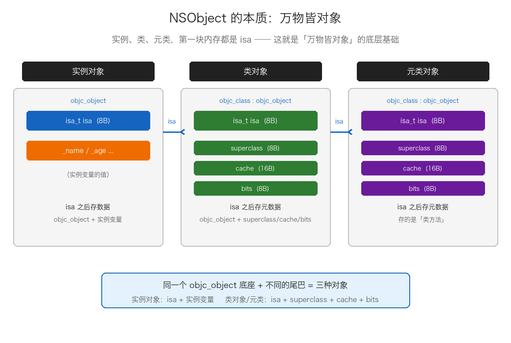
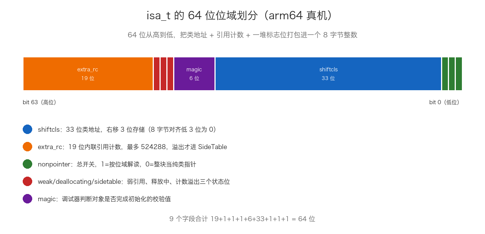
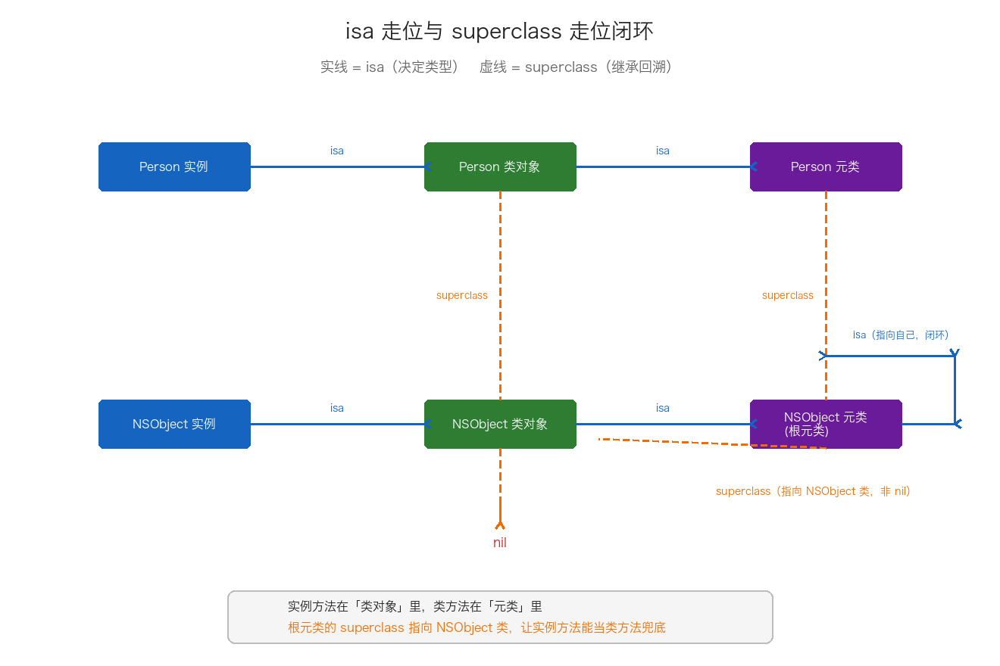
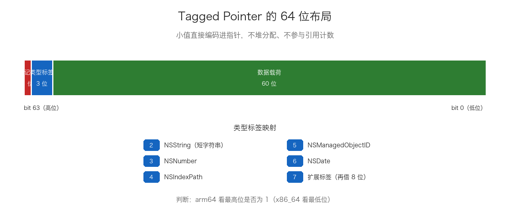
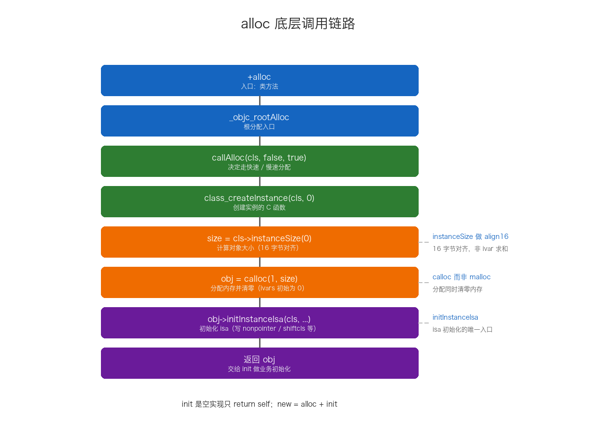
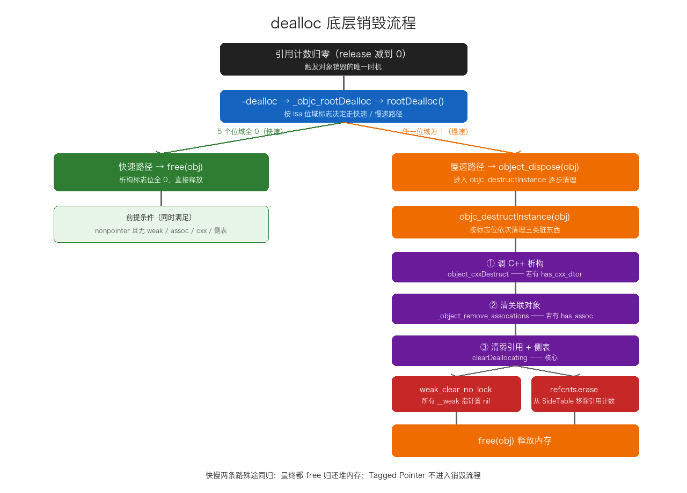

# 08. NSObject 底层分析

> 从「所有对象的根」NSObject 出发，讲清三个层次的问题：NSObject 在内存里到底是个什么（objc_object 结构体）、isa 指针从纯指针到 Non-Pointer 位域如何演进、以及 isa 走位 / Tagged Pointer / alloc / dealloc / 内存对齐这些围绕「对象」展开的机制。重点回答：为什么 OC 里「万物皆对象」能成立，对象从创建到销毁的每一步运行时做了什么。

## 目录

- [一、NSObject 的本质：objc_object 结构体](#一nsobject-的本质objc_object-结构体)
- [二、isa 的演进：从纯指针到 Non-Pointer isa](#二isa-的演进从纯指针到-non-pointer-isa)
- [三、isa 走位与元类闭环](#三isa-走位与元类闭环)
- [四、Tagged Pointer：小对象的极致优化](#四tagged-pointer小对象的极致优化)
- [五、对象的创建：alloc 与 init 与 new 底层全流程](#五对象的创建alloc-与-init-与-new-底层全流程)
- [六、对象的内存布局与对齐](#六对象的内存布局与对齐)
- [七、isKindOfClass 与 isMemberOfClass](#七iskindofclass-与-ismemberofclass)
- [八、对象的销毁：dealloc 底层流程](#八对象的销毁dealloc-底层流程)
- [九、NSObject 的常用方法与 NSObjectProtocol](#九nsobject-的常用方法与-nsobjectprotocol)
- [附：高频速记](#附高频速记)

---

## 一、NSObject 的本质：objc_object 结构体

### 1. 三个对象层次：实例对象、类对象、元类对象

在谈 NSObject 的本质之前，先把「对象」这个词掰开。OC 里的对象不是一个笼统的概念，运行时把它分成了三个层次，面试里也常让你把这三者说清楚：

| 对象 | 是什么 | 数量 | isa 指向谁 | 内存里装什么 |
| --- | --- | --- | --- | --- |
| 实例对象（instance） | 你 `alloc` / `init` 出来的那个东西，存具体数据 | 每 alloc 一个就多一个 | 类对象 | isa + 实例变量的值 |
| 类对象（class object） | 描述「某一类实例」的模具，存方法列表 / 属性 / 协议等元信息 | 每个类全局唯一 | 元类对象 | isa + superclass + cache + bits |
| 元类对象（meta-class object） | 描述「类对象本身」的那个类，存类方法 | 每个类全局唯一 | 根元类 | isa + superclass + cache + bits |

三者的关系用 isa 串起来，就是一条链：

```text
实例对象 ──isa──▶ 类对象 ──isa──▶ 元类对象 ──isa──▶ 根元类（最后指回自己）
```

- 实例对象的 isa 指向**类对象**，所以实例方法（`-method`）从类对象里查；
- 类对象的 isa 指向**元类对象**，所以类方法（`+method`）从元类对象里查；
- 元类对象的 isa 再往上指向根元类，最后根元类指回自己，形成闭环。

这里最关键的一个认知是：**类对象和元类对象本身也是对象**。它们跟实例对象一样，底层都是同一个 `objc_object` 结构体、第一块内存都是 isa，区别只在于 isa 之后存的东西不一样——实例存的是实例变量值，类对象和元类对象存的是 superclass / cache / bits 这些「描述信息」。所以「类也是对象」不是一句空话，而是内存层面的客观事实，这正是「万物皆对象」的另一半含义。

这条链的完整走位（包括 superclass 继承链、根元类为什么指向 NSObject 类）放到第三章专门展开，这里先记住「实例 → 类 → 元类」这三层就行。

### 2. NSObject 的真身：objc_object 结构体

在 OC 里几乎所有的类最终都继承自 NSObject（另一个根类是 NSProxy，走消息转发，很冷门）。打开 runtime 源码，NSObject 的底层真身是一个极简的 C 结构体：

```c
// objc-runtime-new.h（精简）
typedef struct objc_object NSObject;

struct objc_object {
private:
    isa_t isa;   // 8 字节：指向对象所属的类
};
```

整个结构体只有一个成员——`isa`。也就是说，`NSObject *obj = [[NSObject alloc] init];` 这行代码，底层做的是在堆上 `malloc` 一块至少 8 字节（一个 isa 指针大小）的内存，把这块内存当成一个 `objc_object` 结构体，再让 `isa` 指向 NSObject 这个类。

这里有一个贯穿全文的关键认知：**objc_object 是所有对象的公共底座**。实例对象是「objc_object + 实例变量」，类对象是「objc_object + superclass/cache/bits」。无论实例、类还是元类，第一块内存都是 isa，运行时靠它统一完成消息派发——这就是「万物皆对象」的底层基础。



三句话概括这张图：

- 任何对象的第一块内存都是 `isa`，指向它所属的「类」；
- 类本身也是对象，所以类也有 isa，指向「元类」；
- 实例对象在 isa 之后存的是实例变量的值，类对象在 isa 之后存的是 superclass/cache/bits——两者的内存布局在 isa 之后彻底分道扬镳。

### 3. NSProxy：另一个根类

OC 其实有两个根类：NSObject 和 NSProxy。NSProxy 是一个抽象基类，不继承 NSObject，本身几乎没实现任何方法，专用于「消息转发代理」场景——它把收到的一切消息都转给目标对象。因为消息转发那套流程（`forwardingTargetForSelector:` / `forwardInvocation:`）对 NSProxy 是「全量转发」，比 NSObject 少走很多 NSObject 自带方法的查找，所以某些代理库（如 Aspect、WeakProxy）会用 NSProxy。日常开发里 99% 的对象都是 NSObject 的后代，本文只聚焦 NSObject。

---

## 二、isa 的演进：从纯指针到 Non-Pointer isa

isa 是「对象与其类之间的连接」。它经历了从「纯指针」到「Non-Pointer isa」两代演进，这是理解对象底层最硬核的一块。

### 1. 传统 isa：就是一根指针

32 位时代，isa 简单直接，就是一个指向类对象的指针：

```c
typedef struct objc_class *Class;

struct objc_object {
    Class isa;   // 直接指向 objc_class
};
```

`obj->isa` 就是类地址，用的时候直接解引用。缺点是：这个 8 字节（32 位下 4 字节）的空间只存了一个地址，其他位全浪费了。

### 2. Non-Pointer isa：把空闲位榨干

64 位系统下，地址空间非常大，但对象地址远用不满 64 位。苹果把 isa 从一个「纯指针」改成「位域联合体 `isa_t`」，在存类地址的同时，把引用计数、关联对象标志、弱引用标志等元信息一起塞进同一个 64 位整数里。

理解 isa_t 之前，先补两个 C 语言的底层概念。

**联合体（union）**：所有成员共享同一块内存，大小由最大成员决定，任一时刻只有一个成员的值有效。isa_t 用它实现「同一块 8 字节，既能当纯指针读，也能当位域读」——这就是类型双关（type punning）。

```c
union Example {
    int    intValue;    // 4 字节
    float  floatValue;  // 4 字节
};
// 整个 union 大小 = 4 字节，两个成员共享
```

**位域（bit field）**：精确指定一个成员占多少个二进制位，语法是 `类型 成员名 : 位数;`。一个 BOOL 本来要占 1 字节（8 bit），但表示 0/1 只需 1 bit，位域能把多个标志压缩进同一块内存的不同位。

```c
struct Flags {
    unsigned int isVisible : 1;  // 1 bit
    unsigned int isEnabled : 1;  // 1 bit
    unsigned int state     : 3;  // 3 bits，取值 0~7
};
// 三个字段总共只要 5 bits
```

### 3. isa_t 的完整位域划分

理解了联合体和位域，再看 isa_t 的完整定义（arm64 真机布局）：

```c
union isa_t {
    Class cls;   // 解读方式一：纯指针（nonpointer = 0 时）

    struct {     // 解读方式二：位域（nonpointer = 1 时）
        uintptr_t nonpointer        : 1;  // 0=纯指针，1=非指针 isa
        uintptr_t has_assoc         : 1;  // 是否有关联对象（无则析构更快）
        uintptr_t has_cxx_dtor      : 1;  // 是否有 C++ 析构函数（无则析构更快）
        uintptr_t shiftcls          : 33; // 类对象指针（右移 3 位存储）
        uintptr_t magic             : 6;  // 调试器判断对象是否完成初始化
        uintptr_t weakly_referenced : 1;  // 是否被弱引用指向过
        uintptr_t deallocating      : 1;  // 是否正在释放
        uintptr_t has_sidetable_rc  : 1;  // 引用计数是否溢出到侧表
        uintptr_t extra_rc          : 19; // 内联引用计数（减 1 后的值）
        // 合计 1+1+1+33+6+1+1+1+19 = 64 位
    } bits;
};
```



三个关键设计点：

1. **shiftcls 只有 33 位却存得下类地址**：因为对象和类都 8 字节对齐，地址低 3 位恒为 0，存储时右移 3 位、读取时左移 3 位还原，省下 3 位给标志位用；
2. **extra_rc 19 位**：能存 0~524287，即引用计数 1~524288。绝大多数对象的计数都很小，直接内联在 isa 里，免去查 SideTable 哈希表的开销；
3. **nonpointer 是总开关**：为 0 时整块 8 字节就是一个纯类指针（`cls` 视角），为 1 时按位域解读（`bits` 视角）。运行时读 isa 前先看这一位。

**空间收益**：不用位域时，6 个布尔标志（6 字节）+ 类指针（8 字节）+ magic（4 字节）+ 引用计数（4~8 字节）加起来要 22~26 字节；用位域后全部塞进 8 字节，省了近三分之二。运行时有成千上万个对象，这个优化非常可观。

> 架构差异：上面是 arm64 真机布局。x86_64（模拟器）的 isa_t 里 shiftcls 是 44 位、extra_rc 只有 8 位，且没有 deallocating 位（那一位是 unused）。所以写 `obj->isa.bits.extra_rc` 这类调试代码时，模拟器和真机结果会不一样。

---

## 三、isa 走位与元类闭环

上一章讲的是「isa 内部长什么样」，这一章讲「isa 指向哪里」——这是面试里最常考的关系图。

### 1. 两条链：isa 链和 superclass 链

运行时里同时存在两条链，别混淆：

| 链 | 走向 | 用途 |
| --- | --- | --- |
| isa 链 | 实例 → 类 → 元类 → 根元类 → 自己 | 决定「我是什么类型」，是方法查找的起点 |
| superclass 链 | 类 → 父类 → … → NSObject → nil | 方法查找的上升路径（当前类找不到就沿此链向上） |

**isa 链**走位：

1. 实例对象的 isa → 类对象（查实例方法）；
2. 类对象的 isa → 元类对象（查类方法）；
3. 元类对象的 isa → 根元类（NSObject 的元类）；
4. 根元类的 isa → 根元类自己，形成闭环。

**superclass 链**走位：

- 类对象继承链：`SubClass → SuperClass → … → NSObject → nil`；
- 元类继承链：`SubClass 元类 → SuperClass 元类 → … → 根元类 → NSObject 类对象 → nil`。



### 2. 一个刻意的设计：根元类的 superclass 指向 NSObject 类

注意元类继承链的最后一环：**根元类的 superclass 指向的不是 nil，而是 NSObject 类对象**。这不是 bug，是一个刻意的设计，目的是让 NSObject 的实例方法能作为「类方法的兜底」。

举例：NSObject 定义了实例方法 `-description`，但没定义类方法 `+description`。当调用 `[NSObject description]` 时，查找路径是：

```text
1. 通过 isa 找到根元类，查 +description → 没找到
2. 根元类的 superclass 指向 NSObject 类对象，继续在类对象里查 → 找到 -description
3. 执行
```

所以 `[NSObject description]` 能正常返回内容，而不是崩溃。理解了这一环，isa/superclass 的关系图才算真正吃透。

### 3. 取类地址：ISA_MASK

Non-Pointer isa 里类地址只占了 shiftcls 那 33 位，运行时怎么把类地址取出来？用掩码：

```c
// 取 isa 里的类指针
#define ISA_MASK 0x0000000ffffffff8ULL
cls = (Class)(isa.bits & ISA_MASK);
```

`ISA_MASK` 把标志位全部清零、只留 shiftcls，再左移 3 位还原出类地址。`objc_msgSend` 汇编里第一步就是 `and x16, x13, #ISA_MASK` 做这件事，然后才去查方法缓存。

---

## 四、Tagged Pointer：小对象的极致优化

Non-Pointer isa 优化的是「堆上对象的 isa 指针」。而 Tagged Pointer 更进一步——对于足够小的值，直接把数据编码进「指针」本身，**根本不在堆上分配对象**。

### 1. 问题背景

```objc
NSNumber *age = @(25);
```

常规流程下，系统要在堆上分配一个 NSNumber 对象（至少 16 字节：8 字节 isa + 8 字节存值），再让 age 指针指向它。但整数 25 只需要几个 bit 就能表示。为这么小的值做一次 malloc、维护引用计数、最后还要 free，开销和价值完全不成比例。

### 2. 核心思想

当对象的值足够小时，把「类型标记 + 值」一起编码进指针的 64 位空间里，让指针本身就成了数据。这个「指针」不指向任何堆内存，它自己就承载了完整的对象信息。

### 3. 内存布局

Tagged Pointer 的 64 位空间被划分为三部分：

| 位范围 | 字段 | 说明 |
| --- | --- | --- |
| bit 63 | 标记位 | 1 = Tagged Pointer，0 = 普通指针 |
| bit 62~60 | 类型标签 | 标识对象类型（3 位，可编码 8 种） |
| bit 59~0 | 数据载荷 | 存储实际的值（60 位） |



类型标签的常见映射：

| 标签值 | 类型 |
| --- | --- |
| 0 | NSAtom（保留） |
| 1 | 保留 |
| 2 | NSString（短字符串） |
| 3 | NSNumber |
| 4 | NSIndexPath |
| 5 | NSManagedObjectID |
| 6 | NSDate |
| 7 | 扩展标签（从数据载荷再借 8 位当扩展标签） |

```objc
NSNumber *a = @(1);        // Tagged Pointer，值编码进指针
NSNumber *b = @(3.14);     // Tagged Pointer（浮点也可，取决于精度）
NSNumber *c = @(LONG_MAX); // 可能堆分配，值超出载荷位数
```

### 4. 性能优势

| 维度 | 普通对象 | Tagged Pointer |
| --- | --- | --- |
| 内存分配 | 堆上 malloc | 无需分配，值就在指针里 |
| 引用计数 | 需要维护（isa 或侧表） | 不参与引用计数 |
| 释放 | 需要 free | 无需释放 |
| 访问速度 | 解引用指针访问堆内存 | 直接从指针提取值，无间接访问 |
| 缓存友好 | 堆对象分散 | 值在栈/寄存器，缓存命中率高 |

### 5. 运行时特判

因为 Tagged Pointer 不是真正的堆对象，运行时很多操作都要对它特判：

- **retain / release**：直接返回，什么都不做（没有引用计数可维护）；
- **dealloc**：永远不会被调用；
- **弱引用**：不支持对 Tagged Pointer 建弱引用（没有侧表，也永远不会释放）；
- **isa 访问**：Tagged Pointer 没有 isa 字段，运行时靠标签位识别类型并返回对应类对象。

判断逻辑（arm64 检查最高位）：

```c
static inline bool _objc_isTaggedPointer(const void * _Nullable ptr) {
    return ((uintptr_t)ptr & _OBJC_TAG_MASK) == _OBJC_TAG_MASK;
}
```

### 6. 安全性：指针混淆

从 iOS 14 / macOS 11 开始，苹果对 Tagged Pointer 做了混淆：进程启动时生成随机值 `objc_debug_taggedpointer_obfuscator`，存储时与随机值异或、读取时再异或回来：

```c
static inline uintptr_t _objc_decodeTaggedPointer(const void * _Nullable ptr) {
    return (uintptr_t)ptr ^ objc_debug_taggedpointer_obfuscator;
}
```

这样攻击者无法直接从内存读出或伪造 Tagged Pointer 的值。

### 7. Tagged Pointer 与 Non-Pointer isa 的区别

两者都是 64 位下的指针空间优化，但优化对象和层次不同：

| 对比维度 | Non-Pointer isa | Tagged Pointer |
| --- | --- | --- |
| 优化目标 | 堆对象的 isa 指针里的空闲位 | 小值对象的指针本身 |
| 是否有堆分配 | 有 | 无 |
| 引用计数 | 需要维护 | 不需要 |
| 适用对象 | 所有 OC 对象 | NSNumber、短 NSString、NSDate 等小值 |
| 判断方式 | isa 里的 nonpointer 位 | 指针最高位（arm64）/ 最低位（x86_64） |

Tagged Pointer 的性能收益更显著，因为它完全跳过了堆分配、引用计数、释放的全部流程。

---

## 五、对象的创建：alloc 与 init 与 new 底层全流程

`[[NSObject alloc] init]` 是每个 OC 程序员写的第一行代码，但很少有人追问底层发生了什么。这章把 `alloc`、`init`、`new` 三个方法一层层拆开，看运行时到底在背后做了什么。

### 1. 三层职责：先分清三者各干什么

在深入源码前，先建立整体认知。创建对象这件事，运行时拆成了三个层次：

- **alloc 负责「分配内存 + 初始化 isa」**：`calloc` 划一块内存，把 isa 指向类对象。这一步结束后，对象在内存里已经「成形」了——它有 isa、所有 ivar 都是 0，但业务上还没准备好；
- **init 负责「业务初始化」**：NSObject 的 `init` 是空实现，它存在的意义是给子类一个重写点，让子类在这里初始化自己的成员；
- **new 是语法糖**：`new` 内部就是 `[self alloc] init` 的合并，只是它不能自定义 init 系列方法。

记住这三层，下面每个方法展开时都能对上号。

### 2. alloc 的完整调用链

先把整条链画出来，再逐层贴源码：

```text
+alloc
  └─ _objc_rootAlloc
       └─ callAlloc(cls, false, true)
            ├─ 快速路径：_objc_rootAllocWithZone
            │    └─ class_createInstance(cls, 0)
            │         └─ _class_createInstanceFromZone
            │              ├─ size = cls->instanceSize(0)      // 计算大小
            │              ├─ obj = calloc(1, size)            // 分配并清零
            │              └─ obj->initInstanceIsa(cls, ...)   // 初始化 isa
            └─ 慢速路径：objc_msgSend(cls, @selector(alloc))   // 类重写了 alloc
```



下面是每一层的源码和它到底做了什么。

#### 2.1 入口：+alloc

```objc
+ (id)alloc {
    return _objc_rootAlloc(self);
}

id _objc_rootAlloc(Class cls) {
    return callAlloc(cls, false /*checkNil*/, true /*allocWithZone*/);
}
```

`+alloc` 什么都没干，直接甩给 `_objc_rootAlloc`，后者调 `callAlloc`。这里两个参数值得注意：`checkNil=false` 表示这里不检查 cls 是否为空（能调 alloc 说明已经有类对象了）；`allocWithZone=true` 表示接下来走 allocWithZone 那条分支。

#### 2.2 callAlloc：快速路径 vs 慢速路径（核心）

`callAlloc` 是整条链的枢纽，它决定走「快速」还是「慢速」：

```objc
static ALWAYS_INLINE id
callAlloc(Class cls, bool checkNil, bool allocWithZone = false)
{
    if (slowpath(checkNil && !cls)) return nil;
    if (fastpath(!cls->ISA()->hasCustomAWZ())) {
        // 快速路径：类（及父类）没重写 alloc / allocWithZone:
        return _objc_rootAllocWithZone(cls, nil);
    }
    // 慢速路径：类自定义了 alloc，老老实实走消息发送
    if (allocWithZone) {
        return ((id(*)(id, SEL, struct _NSZone *))objc_msgSend)(cls, @selector(allocWithZone:), nil);
    }
    return ((id(*)(id, SEL))objc_msgSend)(cls, @selector(alloc));
}
```

关键就在 `hasCustomAWZ()` 这个判断。AWZ 是 allocWithZone 的缩写，`hasCustomAWZ()` 检查**这个类（或者它继承链上的某个父类）有没有重写过 `alloc` 或 `allocWithZone:`**：

- 没重写 → 走快速路径 `_objc_rootAllocWithZone`，跳过消息发送的查找/缓存环节，直接调 C 函数，省一次 objc_msgSend；
- 重写过 → 走慢速路径 `objc_msgSend`，重新发起一次消息发送，最终派发到子类自定义的 `alloc` 实现。因为你重写了 alloc，运行时就老老实实尊重你的实现，不能再走默认快速通道。

顺带一提，`fastpath` / `slowpath` 只是两个给 CPU 分支预测器的提示宏，不影响结果，只是把「大概率走这条」的分支排在前面对性能更好。

#### 2.3 class_createInstance：分配内存 + 设 isa

快速路径进到 `_objc_rootAllocWithZone`，它忽略 zone 参数后调 `class_createInstance`：

```objc
id _objc_rootAllocWithZone(Class cls, malloc_zone_t *zone __unused) {
    return _class_createInstanceFromZone(cls, 0, nil, OBJECT_CONSTRUCT_CALL_BADALLOC);
}

id class_createInstance(Class cls, size_t extraBytes) {
    return _class_createInstanceFromZone(cls, extraBytes, nil, OBJECT_CONSTRUCT_CALL_BADALLOC);
}
```

真正干活的是 `_class_createInstanceFromZone`，它的核心就三件事——算大小、分配内存、设 isa：

```objc
static ALWAYS_INLINE id
_class_createInstanceFromZone(Class cls, size_t extraBytes, void *zone, int construct_flags)
{
    bool hasCxxCtor = cls->hasCxxCtor();
    bool hasCxxDtor = cls->hasCxxDtor();
    bool fast = cls->canAllocNonpointer();

    size_t size = cls->instanceSize(extraBytes);   // ① 算大小

    id obj = (id)calloc(1, size);                  // ② 分配并清零
    if (slowpath(!obj)) {
        return _objc_callBadAllocHandler(cls);     // 分配失败：回调 badAlloc
    }

    if (fast) {
        obj->initInstanceIsa(cls, hasCxxDtor);     // ③ 初始化 isa
    } else {
        obj->initIsa(cls);                          // 不支持 nonpointer 时用纯指针
    }

    if (fastpath(!hasCxxCtor)) {
        return obj;                                 // 没有 C++ 构造函数，直接返回
    }
    return object_cxxConstructFromClass(obj, cls, construct_flags); // 有 C++ 构造，调构造
}
```

几个容易忽略的细节：

- **calloc 而不是 malloc**：`calloc(1, size)` 在分配的同时把整块内存清零，这是「新对象所有 ivar 初始为 0 / nil」的底层来源，不是 init 干的；
- **canAllocNonpointer()**：绝大多数类都支持 Non-Pointer isa，走 `initInstanceIsa`；只有极少数需要 raw isa 的场景（比如某些跟 zone 或自定义引用计数打交道的旧代码）才退化成纯指针 `initIsa(cls)`；
- **C++ 构造函数**：如果这个类（或它持有 ivar 的 C++ 类型）有 C++ 构造函数，还会额外调 `object_cxxConstructFromClass`。纯 OC 类一般没有，所以日常这条分支不会触发。

#### 2.4 instanceSize：对象大小怎么算

`instanceSize` 回答「这个对象到底要多大」：

```objc
inline size_t instanceSize(size_t extraBytes) const {
    if (fastpath(cache.hasFastInstanceSize(extraBytes))) {
        return cache.fastInstanceSize(extraBytes);   // 命中缓存直接返回
    }
    size_t size = alignedInstanceSize() + extraBytes;
    if (size < 16) size = 16;                        // CF 要求对象至少 16 字节
    return size;
}

uint32_t alignedInstanceSize() const {
    return word_align(unalignedInstanceSize());      // 8 字节对齐
}
```

几点说明：

- 优先走缓存 `fastInstanceSize`，大多数情况下不用重算；
- `unalignedInstanceSize()` 读的是 `ro->instanceSize`，也就是编译期就确定的 ivar 总大小（加上对象的头部）；
- `alignedInstanceSize()` 做的是 **word_align，也就是 8 字节对齐**，再叠加 `extraBytes`（`+alloc` 传的是 0，只有 `class_createInstance` 带 extraBytes 时才非零）；
- 最后兜底：**所有对象最小 16 字节**，这是 CF（Core Foundation）的硬性要求。

注意区分：这里 `instanceSize` 只保证「至少 16 字节 + 8 字节对齐」，而内存里真正看到的 `malloc_size` 是 16 字节对齐，那是 malloc 分配器自己的行为，两者不是一回事——这个区别放到第六章「class_getInstanceSize 与 malloc_size」里细讲。

#### 2.5 initInstanceIsa：isa 是怎么被写出来的

算好大小、分配完内存后，就轮到给对象写 isa 了：

```objc
inline void objc_object::initInstanceIsa(Class cls, bool hasCxxDtor) {
    initIsa(cls, true, hasCxxDtor);
}

inline void objc_object::initIsa(Class cls, bool nonpointer, bool hasCxxDtor) {
    isa_t newisa(0);

    if (!nonpointer) {
        newisa.setClass(cls, this);          // 纯指针：isa 直接存类地址
    } else {
        newisa.bits = ISA_MAGIC_VALUE;       // 写入 magic 值（含 nonpointer 位）
        newisa.has_cxx_dtor = hasCxxDtor;    // 是否含 C++ 析构
        newisa.setClass(cls, this);          // shiftcls = 类地址
        newisa.extra_rc = 1;                 // 初始引用计数 = 1
    }

    isa = newisa;
}
```

这段正好跟第二章的 isa 位域对上号——第二章讲的是 isa「有哪些位」，这里讲的是这些位「第一次怎么被写进去」：

- `ISA_MAGIC_VALUE` 一次性把 magic 值和 nonpointer 位写进去；
- `setClass` 把类地址塞进 shiftcls 那 33 位；
- `extra_rc = 1` 是重点：**新对象一出生引用计数就是 1**。这就是为什么 alloc 出来的对象不需要再 retain，它的「第一票」在设 isa 时就已经记进 extra_rc 了（超出 19 位上限才溢出到 SideTable，详见内存管理那篇）。

到这里，一个「结构完整」的对象就诞生了——有 isa、有清零的内存、引用计数为 1，只是业务字段还都是默认值，等着 init 去填。

### 3. alloc 真正调的是 allocWithZone:

上面快速路径最后落到 `_objc_rootAllocWithZone`，其实 `+alloc` 本质上就是 `+allocWithZone:`：

```objc
+ (id)allocWithZone:(struct _NSZone *)zone {
    return _objc_rootAllocWithZone(self, (malloc_zone_t *)zone);
}
```

`NSZone` 是 Objective-C 早期（NeXT 时代）的内存分区概念，设计初衷是让开发者把相关对象分配在同一块内存区域里，提高缓存局部性、方便整体释放。现在这套机制基本废了——`NSZoneMalloc`、`NSAllocateObject`、`NSZone` 相关 API 在现在的 runtime 里要么被忽略、要么已标记 deprecated，`allocWithZone:` 里的 zone 参数在现代 ObjC 下就是被直接丢弃的。

所以面试里有人问「alloc 和 allocWithZone 什么关系」，答案就是：alloc 内部走的就是 allocWithZone 这条路，zone 是历史遗留，现在参数不生效。

### 4. init 其实什么都没做

NSObject 的 `init` 是个空实现，只是把 self 原样返回：

```objc
- (id)init {
    return _objc_rootInit(self);
}

id _objc_rootInit(id obj) {
    return obj;
}
```

`init` 不分配内存、不碰 isa，它存在的意义是给子类一个**重写点**——子类在 `init` 里做自己的初始化工作。所以「分配内存」这件事在 alloc 阶段就全部完成了，init 只是收尾的业务初始化。

这也顺带引出一个类型细节：为什么 `init` 的返回值要写成 `instancetype` 而不是 `id`？

- `id` 不限定返回类型，编译器不做任何类型检查，返回啥都行；
- `instancetype` 表示「返回与接收者同类型的实例」，编译器能据此做类型推断和检查，`[[Foo alloc] init]` 能直接推断出 `Foo *` 而不是 `id`。

因为 init 可以被子类重写并返回「跟接收者类型一致的实例」，用 `instancetype` 才能让编译器正确推断，这也是为什么 `[[Foo alloc] init]` 拿到的指针类型是对的。

### 5. new = alloc + init

```objc
+ (id)new {
    return [callAlloc(self, false /*checkNil*/) init];
}
```

`new` 就是 `alloc + init` 的语法糖。注意它内部 `callAlloc` 的第三个参数（allocWithZone）没传，默认 false，所以无论快速还是慢速路径，最终都落到 `objc_msgSend(cls, @selector(alloc))`，跟你手写 `[[self alloc] init]` 走的是同一条路。

它和 `alloc init` 的差别只有一个：`new` 只能走默认的 `init`，没法自定义初始化方法（比如 `initWithName:`、`initWithFrame:`）。所以日常更推荐显式 `alloc init`，需要定制初始化时 `new` 就用不了。

### 6. 为什么 alloc 和 init 要拆开

这是面试爱追问的设计。为什么不像 C++ 那样把「分配 + 构造」合成一个操作，而要拆成 alloc 和 init 两步？

- **职责分离**：alloc 负责「分配内存 + 设 isa」这种底层内存动作，init 负责「业务初始化」，两者本来就不是一件事；
- **灵活组合**：同一个对象可以在不同的 init 方法之间选择初始化方式（`initWithFrame:` / `initWithCoder:` / `initWithNibName:`），拆开后这些 init 方法才能互相复用同一套 alloc 逻辑；
- **init 可能返回一个不同的对象**：类簇（Class Cluster）就是典型——`[[NSArray alloc] init]` 实际返回的是内部的 `__NSArray0` 之类子类实例，单例也会在 init 里返回已存在的那个实例。正因为 init 的返回值不一定等于 alloc 出来的那个对象，所以这两步必须分开，不能合成一个原子操作。

把这三点串起来，就是 OC 创建对象的两段式设计：**alloc 保证「有一个对象可用」，init 决定「这个对象长什么样」**。

---

## 六、对象的内存布局与对齐

### 1. 实例对象的内存布局

一个实例在堆上的完整布局，从低地址到高地址依次是：

1. **isa 指针**（8 字节）；
2. **父类实例变量**（从根类到直接父类，按继承顺序排）；
3. **本类实例变量**；
4. **对齐填充 padding**（把整体大小对齐到 16 字节倍数）。

举个具体例子：

```objc
@interface Animal : NSObject { @public int _legCount; } @end
@interface Dog : Animal { @public NSString *_name; BOOL _isGoodBoy; } @end
```

`Dog *d = [[Dog alloc] init];` 在堆上的布局（64 位）：

| 偏移 | 内容 | 说明 |
| --- | --- | --- |
| 0x0~0x7 | isa_t isa | 指向 Dog 类，含位域信息 |
| 0x8~0xB | int _legCount | 父类 Animal 的 ivar |
| 0xC~0xF | padding | 对齐填充 |
| 0x10~0x17 | NSString *_name | 本类 ivar（指针 8 字节） |
| 0x18 | BOOL _isGoodBoy | 本类 ivar（1 字节） |
| 0x19~0x1F | padding | 对齐到 8 的倍数 |

### 2. 内存对齐规则

OC 对象的内存对齐遵循两条：

- **成员对齐**：每个 ivar 的起始地址必须是自身大小的倍数（8 字节指针要 8 对齐，4 字节 int 要 4 对齐）；
- **整体对齐**：结构体总大小必须是最大成员大小的倍数；OC 运行时统一按 **16 字节** 对齐（这是 `instanceSize` 里的 `align16`）。

为什么是 16 字节而不是 8 字节？因为 16 字节对齐后，对象的地址低 4 位恒为 0，这既满足了 isa 里 shiftcls 右移存储的假设，也让 malloc 的分块更规整、缓存行利用更好。

### 3. class_getInstanceSize 与 malloc_size 的区别

这是经典面试题。两个 API 返回的值不一样：

```objc
NSObject *obj = [[NSObject alloc] init];
NSLog(@"%zu", class_getInstanceSize([NSObject class]));   // 8
NSLog(@"%zu", malloc_size((__bridge const void *)obj));   // 16
```

- `class_getInstanceSize` 返回 `cls->alignedInstanceSize()`，即「成员变量对齐后的大小」。NSObject 只有一个 isa（8 字节），所以是 8；
- `malloc_size` 返回 `malloc` 实际分配的内存块大小。alloc 里 `instanceSize` 做了 16 字节对齐，所以实际分到 16 字节。

一句话：**class_getInstanceSize 是「对象需要多少」的理论值，malloc_size 是「实际分到多少」的真实值**，后者 ≥ 前者。

---

## 七、isKindOfClass 与 isMemberOfClass
`isKindOfClass:` / `isMemberOfClass:` 是 NSObject 里最容易把人绕晕的两个方法，因为它们的**实例方法**和**类方法**语义完全不同。

### 1. 四个方法的实现

```objc
// 实例方法：从「对象的类」开始沿 superclass 链向上找
- (BOOL)isKindOfClass:(Class)cls {
    for (Class tcls = [self class]; tcls; tcls = tcls->superclass) {
        if (tcls == cls) return YES;
    }
    return NO;
}

// 实例方法：严格相等
- (BOOL)isMemberOfClass:(Class)cls {
    return [self class] == cls;
}

// 类方法：从「类对象的元类」开始沿 superclass 链向上找
+ (BOOL)isKindOfClass:(Class)cls {
    for (Class tcls = self->ISA(); tcls; tcls = tcls->superclass) {
        if (tcls == cls) return YES;
    }
    return NO;
}

// 类方法：严格相等
+ (BOOL)isMemberOfClass:(Class)cls {
    return self->ISA() == cls;
}
```

核心差异：实例方法拿 `self`（实例）的 isa 找类对象；类方法拿 `self`（类对象）的 isa 找元类对象。起点不同，结果天差地别。

### 2. 经典四连问

```objc
BOOL r1 = [[NSObject class] isKindOfClass:[NSObject class]];  // YES
BOOL r2 = [[NSObject class] isMemberOfClass:[NSObject class]]; // NO
BOOL r3 = [[Person class] isKindOfClass:[Person class]];       // NO
BOOL r4 = [[Person class] isMemberOfClass:[Person class]];     // NO
```

逐个拆解：

- **r1 = YES**：类方法 `isKindOfClass:`，从 NSObject 元类开始沿 superclass 链。NSObject 元类的 superclass 恰好指向 NSObject 类对象，所以能匹配到 → YES。这是第三章「根元类 superclass 指向 NSObject 类」的直接应用；
- **r2 = NO**：类方法 `isMemberOfClass:` 是严格相等，NSObject 元类 ≠ NSObject 类对象 → NO；
- **r3 = NO**：从 Person 元类沿 superclass 链：Person 元类 → NSObject 元类 → NSObject 类 → nil，一路都碰不到 Person 类对象 → NO；
- **r4 = NO**：Person 元类 ≠ Person 类对象 → NO。

实例方法一侧就正常得多：

```objc
Person *p = [[Person alloc] init];
[p isKindOfClass:[Person class]];     // YES
[p isKindOfClass:[NSObject class]];   // YES
[p isMemberOfClass:[Person class]];   // YES
[p isMemberOfClass:[NSObject class]]; // NO
```

> 记忆口诀：`isKindOfClass` 认「亲戚」（沿 superclass 链），`isMemberOfClass` 认「亲爹」（严格相等）；实例方法看类，类方法看元类。

---

## 八、对象的销毁：dealloc 底层流程

对象从创建（alloc）到销毁（dealloc），构成一个完整的生命周期闭环。`dealloc` 是对象在内存里存在的最后一站，但它不是简单地 `free` 掉就完事——对象身上可能挂着三样「脏东西」：C++ 析构、关联对象、弱引用，都得在内存归还前一一清理干净。这一章把这条销毁链路从「为什么触发」讲到「每一层函数做了什么」。

### 1. 触发时机：引用计数归零

`dealloc` 不是手动调用的，ARC 下编译器自动管理。它唯一的触发时机是：**引用计数减到 0**。

完整的触发链是这样的：

```text
release（引用计数 -1）
  └─ objc_release
       └─ rootRelease
            └─ 引用计数减到 0 → 调 dealloc
```

引用计数每 `retain` 一次 +1，每 `release` 一次 -1。当最后一次 `release` 把计数压到 0，说明「没人再持有这个对象了」，runtime 才调用 `dealloc` 开始销毁。计数没到 0 之前，对象一直「活着」，`dealloc` 绝不会被触发。

这里有个细节值得注意：引用计数减到 0 的判定发生在 `rootRelease` 内部——它先做 -1，发现归零后，不是返回给调用者，而是直接转去执行销毁流程。这也是为什么「过度 release」（多 release 一次）会 crash：计数已经 0 了再 -1，会走到 `dealloc` 之后的悬垂指针访问，或者触发 runtime 的 `overrelease` 断言。

引用计数的存储细节——isa 的 `extra_rc` 位域 + SideTable 侧表——属于「01 iOS 内存管理」的引用计数章节，这里只承接「归零之后」的部分。

### 2. 完整调用链

归零之后，销毁流程的完整链路是：

```text
-dealloc
  └─ _objc_rootDealloc(self)
       └─ rootDealloc()
            ├─ Tagged Pointer？→ 直接 return（不销毁）
            ├─ 快速路径：free(obj)          // 5 个标志位全 0
            └─ 慢速路径：object_dispose(obj)
                 └─ objc_destructInstance(obj)
                      ├─ ① object_cxxDestruct          // C++ 析构
                      ├─ ② _object_remove_assocations  // 清关联对象
                      └─ ③ clearDeallocating           // 清弱引用 + 侧表
                 └─ free(obj)                          // 释放内存
```



这条链的关键是 `rootDealloc()` 里的**快速/慢速路径分流**，以及慢速路径里 `objc_destructInstance` 的**三步清理**。下面逐层拆开。

### 3. rootDealloc：快速路径 vs 慢速路径（核心）

`rootDealloc` 是整个销毁流程的中枢，它用一个 `if` 判断决定对象是「直接 free」还是「慢慢清理」。源码（objc4 精简）：

```cpp
inline void
objc_object::rootDealloc()
{
    if (isTaggedPointer()) return;   // Tagged Pointer 没有堆内存，不销毁

    if (fastpath(isa.nonpointer                &&
                 !isa.weakly_referenced        &&
                 !isa.has_assoc                &&
                 !isa.has_cxx_dtor             &&
                 !isa.has_sidetable_rc))
    {
        // 快速路径：对象身上干干净净，直接释放
        assert(!sidetable_present());
        free(this);
    }
    else {
        // 慢速路径：有脏东西要清理
        object_dispose((id)this);
    }
}
```

先看第一行：**Tagged Pointer 直接 return**。Tagged Pointer 的值直接编码在指针里，没有独立堆内存，也就不存在「销毁」这回事，`isTaggedPointer()` 为真时直接返回（对应第四章）。

再看核心判断：`fastpath` 里并列了 5 个条件，全部为真才走快速路径：

- `isa.nonpointer`：是优化过的 Non-Pointer isa（现代 64 位默认都是）；
- `!isa.weakly_referenced`：从没被 `__weak` 指向过；
- `!isa.has_assoc`：从没挂过关联对象；
- `!isa.has_cxx_dtor`：没有 C++ 析构（对象里没嵌 C++ 成员）；
- `!isa.has_sidetable_rc`：引用计数没溢出到 SideTable（一直待在 `extra_rc` 里）。

这 5 个都是「是否曾经有」的标志位，只有「都没有」时对象才是「干净的」，直接 `free(this)` 一行完事。这是绝大多数对象的归宿——一个普通的 `NSString`、`NSArray`、自定义的纯 OC 模型，往往 5 项全 0，销毁快到几乎无感。

`fastpath` / `slowpath` 是编译器宏，本质是给 CPU 的分支预测提示（`__builtin_expect`）：告诉 CPU「大概率走快速路径」，让它提前预取这条分支的指令。它不改变逻辑，只是性能优化。

只要 5 项里有任意一项为 1，就走慢速路径 `object_dispose`。

### 4. object_dispose 与 objc_destructInstance

慢速路径进入 `object_dispose`，它只有两件事：

```c
id
object_dispose(id obj)
{
    if (!obj) return nil;

    objc_destructInstance(obj);   // 第一步：清理成员
    free(obj);                    // 第二步：释放内存

    return nil;
}
```

顺序很关键：**先清理、后 free**。清理阶段还要访问对象里的成员（C++ 析构要调成员析构、关联对象要从对象身上摘、弱引用表要用对象地址做 key），所以必须先 `objc_destructInstance`，等都摘干净了，最后才 `free` 掉这块内存。反过来先 free 再清理，就是访问已释放内存，直接 crash。

`objc_destructInstance` 是真正的清理主体：

```c
void *objc_destructInstance(id obj)
{
    if (obj) {
        bool cxx = obj->hasCxxDtor();
        bool assoc = obj->hasAssociatedObjects();

        // 顺序很重要
        if (cxx)   object_cxxDestruct(obj);
        if (assoc) _object_remove_assocations(obj, /*deallocating*/true);
        obj->clearDeallocating();
    }
    return obj;
}
```

它做的三件事，每件都先看一个标志位：

1. `hasCxxDtor()` 为真 → 调 `object_cxxDestruct`（C++ 析构）；
2. `hasAssociatedObjects()` 为真 → 调 `_object_remove_assocations`（清关联对象）；
3. 最后无条件调 `clearDeallocating`（清弱引用 + 侧表，这一步内部自己判断）。

为什么先一次性读出 `cxx` 和 `assoc` 两个 bool？源码注释写得很直白：**Read all of the flags at once for performance**——把这些位一次性读进寄存器，避免反复从内存取 isa。

### 5. 三步清理的细节

#### 5.1 ① C++ 析构：object_cxxDestruct

OC 对象里可以嵌 C++ 对象（比如一个 `std::string` 成员），C++ 对象有自己的析构函数要执行。`object_cxxDestruct` 做的事就是从当前类往上，一路调用每一层类里 `.cxx_destruct` 方法（编译器为含 C++ 成员的类自动生成）：

```cpp
void object_cxxDestruct(id obj)
{
    if (!obj) return;
    if (obj->isTaggedPointer()) return;
    object_cxxDestructFromClass(obj, obj->ISA());
}

static void object_cxxDestructFromClass(id obj, Class cls)
{
    void (*dtor)(id);
    for ( ; cls; cls = cls->getSuperclass()) {
        if (!cls->hasCxxDtor()) return;
        dtor = (void(*)(id))lookupMethodInClassAndLoadCache(cls, SEL_cxx_destruct);
        if (dtor != _objc_msgForward_impcache) {
            dtor(obj);
        }
    }
}
```

逐层向上调用，是为了让「子类成员的析构」先于「父类成员的析构」执行，和 C++ 对象析构的逆序一致。

#### 5.2 ② 关联对象：_object_remove_assocations

`objc_setAssociatedObject` 挂上去的关联对象是强引用、存在全局的 `AssociationsManager` 哈希表里，不会因为对象本身释放而自动消失，必须在这里主动摘掉：

```c
void
_object_remove_assocations(id object, bool deallocating)
{
    ObjectAssociationMap refs{};

    AssociationsManager manager;
    AssociationsHashMap &associations(manager.get());

    // 从全局哈希表取出这个对象的关联表
    AssociationsHashMap::iterator i = associations.find(disguise(object));
    if (i != associations.end()) {
        refs.swap(i->second);
        if (!deallocating) {
            // 非销毁场景下，SYSTEM_OBJECT 级别的关联要保留
            // ...
        }
        if (!didReInsert) associations.erase(i);
    }

    // 锁外统一 release 每个关联值
    for (auto &i: refs) {
        releaseValue(i.second, i.first);
    }
}
```

两个要点：

- **关联对象是强引用**：移除时对每个关联值调用 `releaseValue`（本质是 `release`），把它持有的对象引用计数 -1。所以关联对象被移除后，被关联的那个对象如果没人再持有，会跟着一起销毁。
- **`deallocating` 参数区分场景**：这里传 `true` 表示「对象正在销毁」，直接全清；而 `objc_removeAssociatedObjects`（手动移除）传的是 `false`，此时 `OBJC_ASSOCIATION_SYSTEM_OBJECT` 级别的系统关联会被保留。

顺带提一句：函数名里 `assocations` 少了个 `o`，是苹果源码里的历史拼写错误，一直没改，面试看到别以为是自己眼花了。

#### 5.3 ③ clearDeallocating

前两步都有标志位兜底（没 C++ 成员 / 没关联对象就跳过），但 `clearDeallocating` 是无条件执行的——因为弱引用和侧表引用计数的清理逻辑，放在它自己内部的判断里。这是三步里最复杂的一步，单独放下一节。

### 6. clearDeallocating 的三种分支

```cpp
inline void
objc_object::clearDeallocating()
{
    if (slowpath(!isa.nonpointer)) {
        // 分支一：纯指针 isa（老对象）
        sidetable_clearDeallocating();
    }
    else if (slowpath(isa.weakly_referenced || isa.has_sidetable_rc)) {
        // 分支二：Non-Pointer isa 但有弱引用 / 侧表计数
        clearDeallocating_slow();
    }
    // 分支三：Non-Pointer isa 且两项都没有 → 什么都不用做
}
```

三种分支覆盖了「弱引用和侧表计数」的所有情况：

**分支三（什么都不做）**：Non-Pointer isa 下，`weakly_referenced` 和 `has_sidetable_rc` 都为 0，说明既没被弱引用过、引用计数也没溢出到侧表，自然没有可清理的东西，直接跳过。这是最常见的情况。

**分支二（`clearDeallocating_slow`）**：Non-Pointer isa 下，至少有一项为真，需要动侧表：

```cpp
NEVER_INLINE void
objc_object::clearDeallocating_slow()
{
    SideTable& table = SideTables()[this];
    table.lock();
    if (isa.weakly_referenced) {
        weak_clear_no_lock(&table.weak_table, (id)this);  // 清弱引用
    }
    if (isa.has_sidetable_rc) {
        table.refcnts.erase(this);                         // 移除侧表计数
    }
    table.unlock();
}
```

`SideTable` 是全局的侧表，每个对象按地址哈希到其中一张，内部结构是「自旋锁 + 引用计数表 `refcnts` + 弱引用表 `weak_table`」。销毁时要做的两件事：

- **`weak_clear_no_lock`**：在 `weak_table` 里找到这个对象的 `weak_entry`，遍历里面记录的所有 `__weak` 指针地址，把它们逐个置 `nil`，然后把整个 entry 从表里摘掉。这就是「对象释放后 weak 变量自动变 nil」的底层实现。
- **`refcnts.erase`**：引用计数溢出部分存在 `refcnts` 表里，对象要销毁了，这条记录没用了，从表中抹掉。

**分支一（`sidetable_clearDeallocating`）**：纯指针 isa 的老对象，没有 Non-Pointer 位域可用，只能老老实实去侧表里查：

```cpp
void
objc_object::sidetable_clearDeallocating()
{
    SideTable& table = SideTables()[this];
    table.lock();
    RefcountMap::iterator it = table.refcnts.find(this);
    if (it != table.refcnts.end()) {
        if (it->second & SIDE_TABLE_WEAKLY_REFERENCED) {
            weak_clear_no_lock(&table.weak_table, (id)this);  // 弱引用标志在侧表计数里
        }
        table.refcnts.erase(it);
    }
    table.unlock();
}
```

和分支二的区别在于：纯指针 isa 里存不下 `weakly_referenced` 这个位，所以「是否被弱引用过」这个信息也塞进了侧表的引用计数记录里（用 `SIDE_TABLE_WEAKLY_REFERENCED` 标志位），清理时要先从计数记录里读出这个标志，判断要不要清弱引用。现代 64 位系统几乎全是 Non-Pointer isa，分支一基本只存在于老代码或特殊场景。

### 7. isa 位域如何加速析构

回顾整条链路会发现，每一步都先看一个 isa 位域标志再决定干不干活。这正是 Non-Pointer isa 的设计价值所在：

- 没被弱引用过（`weakly_referenced = 0`）→ 跳过弱引用表遍历；
- 没有关联对象（`has_assoc = 0`）→ 跳过关联对象清理；
- 没有 C++ 析构（`has_cxx_dtor = 0`）→ 跳过析构调用；
- 引用计数没溢出（`has_sidetable_rc = 0`）→ 跳过侧表操作。

这四项全 0，对象就走快速路径直接 `free`。绝大多数对象都命中这个分支，所以 `dealloc` 在普通场景下快得惊人。苹果把「是否曾经有」这些标志位塞进 isa（而不是每次销毁都去查全局表、遍历弱引用表），就是为了让「干净对象的销毁」几乎零开销。

### 8. dealloc 里的注意事项（面试坑）

`dealloc` 本身由 runtime 调度，但子类经常要重写它来做资源清理。重写时有几个经典坑：

- **ARC 下不能手动调 `[super dealloc]`**：编译器会自动在子类 `dealloc` 末尾插入对父类 `dealloc` 的调用，手动再调一次会直接编译报错（ARC 禁止）。MRC 时代则必须手写 `[super dealloc]` 且放在最后一行，这是两套内存管理方式最直观的区别之一。
- **dealloc 里不要访问成员变量**：`dealloc` 里对象正在被销毁，成员变量可能已经在前面几步被析构/清空（比如 C++ 成员已经析构了），此时访问成员是未定义行为。需要清理的资源，优先在 `dealloc` 里只做「释放/注销」这类不依赖对象状态的操作。
- **dealloc 里不要调用会触发 KVO 的方法**：对某个属性调用 setter，如果该属性被 KVO 观察，会触发通知，而观察者此时可能已经释放，导致崩溃。KVO、通知、定时器、代理这些「外部持有」，要在对象销毁前解除，习惯上放 `dealloc`（或配合 `deinit` 时机）里注销。
- **dealloc 里不要依赖 weak self**：对象已经在销毁，`__weak` 指针读出来是 nil，依赖它做后续逻辑会得到意料之外的空值。

一句话总结整章：**dealloc 不是「free 一下」那么简单——它先判断对象干不干净，干净就走快速路径直接 free，不干净就走慢速路径把 C++ 析构、关联对象、弱引用三样脏东西依次摘掉，最后才 free。isa 里的那几个「是否曾经有」标志位，决定了这条路能走多快。**

---

## 九、NSObject 的常用方法与 NSObjectProtocol

除了 alloc/dealloc，NSObject 还提供了一批基础方法，面试常问它们的用途和默认行为。

### 1. 类型与继承相关

| 方法 | 说明 |
| --- | --- |
| `class` | 返回对象的类（实例方法返回类对象，类方法返回元类） |
| `superclass` | 返回父类 |
| `isKindOfClass:` / `isMemberOfClass:` | 类型判断（见第七章） |
| `respondsToSelector:` | 能否响应某方法 |
| `conformsToProtocol:` | 是否遵循某协议 |

### 2. 复制相关

NSObject 默认**不实现** `copy` / `mutableCopy`，直接调用会抛异常。要支持复制，类必须实现 `NSCopying`（`copyWithZone:`）或 `NSMutableCopying`（`mutableCopyWithZone:`）协议。区别：

- `copy`：产生不可变副本（通常浅拷贝）；
- `mutableCopy`：产生可变副本。

### 3. 比较与描述相关

| 方法 | 说明 |
| --- | --- |
| `isEqual:` | 默认实现比较指针地址（等同 `==`），子类按需重写（如 NSString 比内容） |
| `hash` | 与 isEqual 配套，isEqual 相等的对象 hash 必须相等 |
| `description` / `debugDescription` | 打印描述，默认返回「类名 + 地址」，可重写 |

### 4. 消息相关

- `performSelector:` 系列：延迟或带参执行某方法，底层走 `objc_msgSend`；
- `methodSignatureForSelector:` / `forwardInvocation:`：消息转发相关（Runtime 篇章已展开）。

### 5. NSObjectProtocol

`NSObjectProtocol` 是一个协议，NSObject 和 NSProxy 都遵循它。它声明了对象应具备的基本能力（`isEqual:`、`hash`、`class`、`isKindOfClass:` 等），让「id\<NSObject\>」这种泛型约束能表达「某个遵守 NSObject 协议的对象」。日常里直接用 NSObject 就够了，只有需要同时兼容 NSProxy 时才显式用 NSObjectProtocol。

---

## 附：高频速记

- **NSObject 本质 = objc_object**：只有一个成员 `isa_t isa`，万物皆对象的公共底座。
- **两个根类**：NSObject（99% 对象）和 NSProxy（消息转发代理，很冷门）。
- **isa 两代演进**：32 位纯指针 → 64 位 Non-Pointer isa（位域联合体 isa_t）。
- **isa_t 位域（arm64）**：nonpointer(1) + has_assoc(1) + has_cxx_dtor(1) + shiftcls(33) + magic(6) + weakly_referenced(1) + deallocating(1) + has_sidetable_rc(1) + extra_rc(19) = 64 位。
- **shiftcls 33 位够存类地址**：8 字节对齐低 3 位为 0，右移 3 位省 3 位给标志。
- **extra_rc 19 位**：内联引用计数（减 1 后的值），最多 524288，溢出才进 SideTable。
- **isa 链**：实例→类→元类→根元类→自己（闭环）；**superclass 链**：类→父类→…→NSObject→nil。
- **根元类 superclass 指向 NSObject 类**：让 NSObject 实例方法能当类方法兜底（`[NSObject description]` 不崩）。
- **Tagged Pointer**：小值直接编码进指针，不堆分配、不参与引用计数、不支持弱引用；bit63 标记 + bit62-60 类型 + bit59-0 数据；iOS 14+ 有混淆。
- **alloc 链路**：alloc → callAlloc → class_createInstance → calloc(1,size) 清零 + initInstanceIsa 设 isa。
- **init 是空实现**，只 return self，是子类的重写点；`new = alloc + init`。
- **class_getInstanceSize vs malloc_size**：前者是成员对齐后的理论值（NSObject=8），后者是 16 字节对齐后实际分配值（=16）。
- **isKindOfClass 认亲戚（沿 superclass 链）、isMemberOfClass 认亲爹（严格相等）；实例方法看类、类方法看元类**。
- **dealloc 链路**：dealloc → object_dispose → objc_destructInstance（C++ 析构/关联对象/弱引用）+ free。
- **isa 位域加速析构**：has_assoc / has_cxx_dtor / weakly_referenced 三个标志决定析构时跳过哪些清理。
