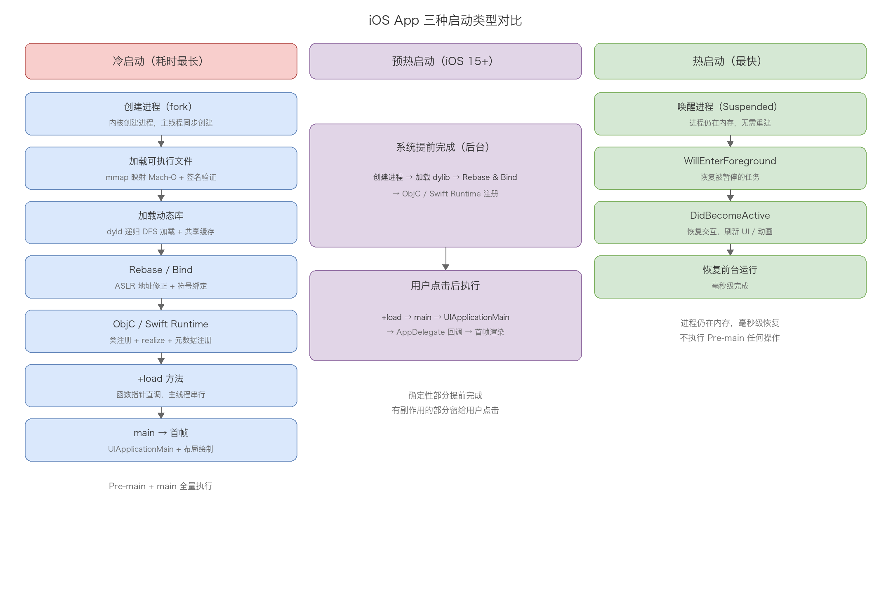
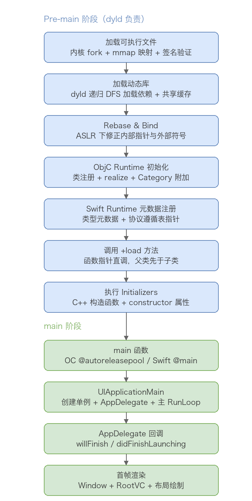
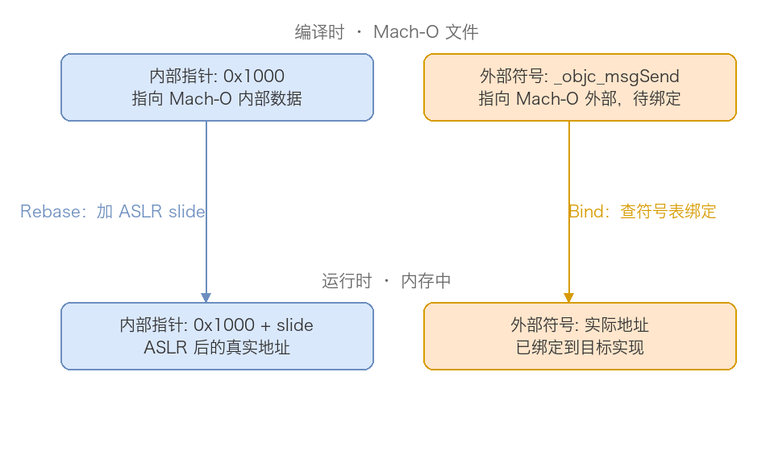

# 15. iOS App 启动过程分析

> 本文分析 iOS App 从点击图标到首帧显示的完整启动过程。先给出冷启动、热启动、预热启动三种类型的全景对比，再沿冷启动主线深入 Pre-main 阶段（内核加载可执行文件、dyld 加载动态库、Rebase/Bind、ObjC 与 Swift Runtime 初始化、+load、Initializers）与 main 阶段（UIApplicationMain、AppDelegate 回调、首帧渲染），最后覆盖 dyld 版本演进、启动优化关键节点与常见面试问题。启动优化的一切手段，都建立在对这条链路的理解之上。

## 目录

- 一、启动类型概览
- 二、冷启动：Pre-main 阶段
- 三、冷启动：main() 阶段
- 四、热启动
- 五、预热启动
- 六、dyld 版本演进
- 七、启动流程关键节点总结
- 八、常见面试问题
- 附：高频速记

## 一、启动类型概览

iOS 应用的启动分为三种类型，性能表现和内部流程差异很大：

| 启动类型 | 描述 | 特点 |
|---------|------|------|
| 冷启动（Cold Launch） | App 完全不在内存中，从头开始加载 | 耗时最长，需要完整执行所有启动流程 |
| 热启动（Warm Launch） | App 在后台被挂起（Suspended），重新进入前台 | 最快，只需恢复状态，不重新创建进程 |
| 预热启动（Pre-warm Launch） | 系统预测用户可能启动 App，提前在后台执行部分启动流程 | iOS 15+ 引入，介于冷启动和热启动之间 |

三种类型的流程对比：



冷启动是唯一完整执行 Pre-main 与 main 两大阶段的类型，也是启动优化的主要关注点，后面几章均围绕冷启动展开。

## 二、冷启动：Pre-main 阶段

Pre-main 阶段指从用户点击 App 图标到 main 函数执行之前的过程，主要由 dyld（动态链接器）负责。完整流程如下：



注意一个细节：主线程并不是 main 函数里创建的，而是内核 fork 创建进程时同步创建的第一个线程。Pre-main 的所有工作都在这条主线程上串行执行，这也是 Pre-main 耗时直接拖慢启动的原因。

### 2.1 加载可执行文件

用户点击图标后，系统依次完成四件事：内核创建进程、加载 Mach-O 到内存、验证代码签名、启动 dyld。

创建进程由内核 fork 系统调用完成，为新进程分配独立的虚拟地址空间，同时创建主线程。随后内核使用 mmap 把可执行文件映射到进程的虚拟地址空间——是映射而非直接读取，这是惰性加载的基础，只有实际访问到的页面才会被载入物理内存。

内核解析 Mach-O 头部信息，并据此做出决策：

| 信息 | 读取后的处理 |
|-----|-------------|
| Magic Number | 验证文件格式（0xFEEDFACF 表示 64 位 Mach-O） |
| CPU 类型和子类型 | 检查与当前设备架构是否匹配（如 arm64），不匹配则拒绝加载 |
| 文件类型 | 识别是可执行文件（MH_EXECUTE）还是动态库（MH_DYLIB） |
| Load Commands 数量和大小 | 计算需要读取的 Load Commands 区域范围 |
| Flags | 检查特殊标记（如 PIE、TWOLEVEL），决定后续处理方式 |

接着内核遍历所有 Load Commands，针对每种类型执行不同操作：

| Load Command | 内核执行的操作 |
|-------------|--------------|
| LC_SEGMENT_64 | 调用 mmap 将段映射到虚拟内存的指定地址，并根据段属性设置权限（__TEXT 只读可执行，__DATA 可读写） |
| LC_LOAD_DYLIB | 提取动态库路径加入待加载队列，记录版本要求 |
| LC_MAIN | 保存程序入口点相对 __TEXT 段的偏移，结合 ASLR 偏移量计算 main 的实际虚拟地址 |
| LC_CODE_SIGNATURE | 定位代码签名数据的位置和大小，为签名验证做准备 |
| LC_DYLD_INFO_ONLY | 保存 Rebase、Bind、Export 信息的位置，后续交给 dyld 完成地址修正 |
| LC_ENCRYPTION_INFO_64 | 若段被加密（App Store 加密），记录加密范围，访问时自动解密 |

处理完所有 LC_SEGMENT_64 后，进程虚拟内存的大致布局（从低地址到高地址）：

```
__TEXT        只读、可执行（代码和常量）
__DATA        可读、可写（全局变量）
__LINKEDIT    符号表、签名等链接信息
Heap          堆区，向上增长
Stack         栈区，向下增长
```

__TEXT 段可读可执行但不可写，防止代码被篡改；__DATA 段可读可写但不可执行。两者权限互斥是安全设计的基本盘。最后系统验证 Mach-O 的代码签名，确保 App 来源可信且未被篡改，随后把控制权交给 dyld。

### 2.2 加载动态库

dyld 负责加载 App 依赖的所有动态库，这是 Pre-main 阶段最耗时的操作之一。一个典型 App 的依赖关系是一棵树：主程序依赖 UIKit 和自定义 Framework，UIKit 又依赖 Foundation，Foundation 依赖 CoreFoundation。

dyld 的工作流程：

1. 从主程序 Mach-O 读取 LC_LOAD_DYLIB，得到所有依赖库的路径和版本要求
2. 按搜索规则查找动态库的实际位置（系统库优先从共享缓存中查找）
3. 用 mmap 将动态库映射到进程虚拟地址空间，各 Segment 按权限分段映射
4. 验证动态库的代码签名
5. 递归加载每个动态库自己的依赖，直到所有依赖加载完毕
6. 按依赖关系构建初始化顺序

递归加载使用深度优先搜索，每个库只加载一次（内部有缓存避免重复），被依赖的库会先于依赖方加载——Foundation 在 UIKit 之前加载。所有库加载完后，dyld 构建出自底向上的初始化顺序：

```
1. libSystem.dylib（最底层，被所有库依赖）
2. CoreFoundation.framework
3. Foundation.framework
4. CoreGraphics.framework
5. libswiftCore.dylib（Swift Runtime，如果 App 使用 Swift）
6. UIKit.framework
7. 自定义 Framework A
8. 自定义 Framework B
9. App 主程序（最后初始化）
```

这个顺序保证了一个库的初始化代码执行时，它依赖的所有库已经初始化完毕。

关于 Swift Runtime 有个版本分界：iOS 12.2 起 Swift 标准库位于系统共享缓存中，无需嵌入 App；12.2 以下则要打包进 App Bundle，会增加包体积。Swift Runtime 加载时会通过 _dyld_register_func_for_add_image 向 dyld 注册回调，用于后续的元数据注册（见 2.5 节）。

系统框架还有一层共享缓存优化：常用系统框架（UIKit、Foundation 等）被预先打包到 dyld shared cache 中，位于 /System/Library/Caches/com.apple.dyld/。库在共享缓存中时直接映射，速度远快于从磁盘加载单个文件；多个进程还能共享同一份物理内存中的系统框架代码，且共享缓存内的符号地址已预先绑定，减少了后续 Rebase/Bind 的工作量。

### 2.3 Rebase 与 Bind

由于 ASLR（Address Space Layout Randomization），App 每次启动时 Mach-O 加载到虚拟内存的起始地址都是随机的，因此需要对镜像内的指针做地址修正。修正分两类：

| 操作 | 修正对象 | 修正方式 |
|------|---------|---------|
| Rebase（重定位） | 指向 Mach-O 内部的指针 | 编译时地址加上 ASLR 偏移量（slide） |
| Bind（绑定） | 指向 Mach-O 外部的指针 | 查符号表，绑定到正确的外部符号地址 |



一个典型例子：指向自己全局变量的指针属于内部指针，走 Rebase，只需一次加法；而调用 objc_msgSend 这样的外部函数，符号引用属于外部指针，走 Bind，需要查符号表找到真实地址。Rebase 的开销主要取决于 __DATA 段内需要修正的指针数量，Bind 还要额外付出符号查找的成本。

### 2.4 ObjC Runtime 初始化

dyld 完成 Rebase/Bind 后，会通过 _dyld_objc_notify_register 回调通知 Runtime，触发 _objc_init，完成类注册和 Category 附加。

Runtime 从 Mach-O 的 __DATA 系列段中读取 ObjC 元数据。objc4 源码的 getDataSection() 会依次在 __DATA、__DATA_CONST、__DATA_DIRTY 三个 segment 中查找同名 section——具体落在哪个 segment 由链接器根据 deployment target 和工具链版本决定，例如启用 relative method lists 后，部分只读元数据会被放进 __DATA_CONST 以减少 dirty page。

| Section | 存储内容 |
|---------|---------|
| __objc_classlist | 所有 ObjC 类的指针数组 |
| __objc_nlclslist | 实现了 +load 的非懒加载类列表 |
| __objc_catlist | 所有 Category 的指针数组 |
| __objc_nlcatlist | 实现了 +load 的非懒加载 Category 列表 |
| __objc_protolist | 所有 Protocol 定义 |
| __objc_selrefs | 代码中使用的所有方法选择器 |
| __objc_classrefs | 代码中引用的所有类 |

类分懒加载与非懒加载两种：实现了 +load 的类是非懒加载类，启动时立即初始化；没有 +load 的类是懒加载类，延迟到第一次被使用（首次收到消息）时才初始化。

类注册过程（简化）：

```c
// Runtime 内部的类注册过程（简化）
void _read_images(header_info *hinfo) {
    // 1. 读取类列表，将所有类注册到全局类表
    classref_t *classlist = _getObjc2ClassList(hinfo, &count);
    for (int i = 0; i < count; i++) {
        Class cls = classlist[i];
        addNamedClass(cls, cls->mangledName());
    }

    // 2. 只对非懒加载类立即 realize
    classref_t *nlclslist = _getObjc2NonlazyClassList(hinfo, &nlcount);
    for (int i = 0; i < nlcount; i++) {
        Class cls = remapClass(nlclslist[i]);
        realizeClassWithoutSwift(cls);
    }

    // 懒加载类不在此处 realize，延迟到首次收到消息时：
    // objc_msgSend → lookUpImpOrForward → realizeClassMaybeSwiftMaybeRelock
}
```

所有类都会被注册到全局类表，但只有非懒加载类立即 realize。realize 的过程是把编译期只读的 class_ro_t 包装成运行时可写的 class_rw_t：

```c
// realize 过程（简化）
// 1. 创建 class_rw_t，rw->ro 指向原 ro 数据
// 2. 建立继承链 cls->superclass 与元类关系 cls->isa
// 3. 初始化方法缓存 cache_t
```

| 结构 | 生成时机 | 可否修改 | 存储内容 |
|-----|---------|---------|---------|
| class_ro_t | 编译期 | 只读 | 类名、成员变量布局、基础方法/属性/协议列表 |
| class_rw_t | 运行时首次使用类 | 可读写 | 指向 ro 的指针、Category 附加的方法、运行时添加的方法 |

这套设计有三个动机：一是节省内存，class_ro_t 存在 __DATA_CONST 段可被多进程共享（Copy-On-Write），直接改 ro 会导致整个页被复制；二是支持动态性，Category 方法和 class_addMethod 添加的方法都需要写入 rw；三是延迟初始化，懒加载类只有真正被用到才创建 rw，为启动省时间。

Category 的处理紧随其后。Runtime 遍历 __objc_catlist，按对应类是否已 realize 决定去向：

- 类已 realize（非懒加载类）：立即调用 attachCategories 把 Category 内容附加到类的 class_rw_t
- 类未 realize（懒加载类）：暂存到全局的 unattachedCategories 表，等类 realize 时再附加

```c
// Category 附加过程（简化）
static void attachCategories(Class cls, category_list *cats) {
    // 1. 收集所有 Category 的方法列表
    method_list_t **mlists = malloc(cats->count * sizeof(*mlists));
    for (int i = 0; i < cats->count; i++) {
        mlists[i] = cats->list[i].cat->methodsForMeta(isMeta);
    }
    // 2. 附加到类的 class_rw_t
    prepareMethodLists(cls, mlists, count);
    rw->methods.attachLists(mlists, count);
}
```

Category 方法「覆盖」原类方法的原理：附加时方法被插到方法列表的前面（后编译的 Category 排更前），而运行时查找方法从前往后遍历，所以 Category 的同名方法会先被找到。原方法并未删除，只是不再被优先命中。

### 2.5 Swift Runtime 元数据注册

ObjC Runtime 完成后，dyld 触发 Swift Runtime 之前通过 _dyld_register_func_for_add_image 注册的回调，遍历所有已加载镜像中的 Swift section，把元数据记录的位置指针注册到 Runtime 的全局缓存。

关键点：这个阶段只做轻量的指针注册，并不解析和实例化元数据。真正的解析延迟到首次使用时——首次 as? 触发协议遵循查找、首次 Mirror(reflecting:) 触发字段描述符解析、泛型类型首次实例化时才创建完整 type metadata。

| Section | 存储内容 | 启动时做什么 | 首次使用时才做什么 |
|---------|---------|------------|------------------|
| __swift5_types | 类型元数据记录 | 注册记录的位置指针 | 分配并填充完整 metadata（泛型类型懒创建） |
| __swift5_proto | 协议遵循记录 | 注册 type 到 protocol 的映射条目 | 首次 as?/as! 时查找并缓存 Protocol Witness Table |
| __swift5_fieldmd | 字段描述符 | 注册位置指针 | 首次 Mirror(reflecting:) 解析字段名和类型 |
| __swift5_assocty | 关联类型记录 | 注册位置指针 | 首次涉及关联类型解析时使用 |

协议遵循查找在 iOS 16 迎来一次优化：之前需要遍历所有镜像的 __swift5_proto section，复杂度 O(N)；iOS 16 起 dyld 构建协议遵循缓存（思路类似 dyld 3 的 Launch Closure），App 更新后重新生成，后续启动通过 _dyld_find_protocol_conformance_on_disk 等 API 直接查表，动态类型转换的性能显著提升。

Swift 的元数据注册与 ObjC 的类注册是两套独立机制，二者都在 +load 之前完成。

### 2.6 调用 +load 方法

类注册、Category 附加、Swift 元数据注册都完成后，dyld 调用 Runtime 的 load_images 回调，执行所有 +load 方法。

```c
void call_load_methods(void) {
    // 1. 先调用非懒加载类的 +load（按继承层级顺序）
    do {
        while (loadable_classes_used > 0) {
            call_class_loads();  // 直接通过函数指针调用
        }
        more_categories = call_category_loads();  // 再调用非懒加载 Category 的 +load
    } while (loadable_classes_used > 0 || more_categories);
}
```

+load 最特别的地方是调用方式——直接通过函数指针调用，不经过 objc_msgSend：

```c
static void call_class_loads(void) {
    for (int i = 0; i < loadable_classes_used; i++) {
        Class cls = loadable_classes[i].cls;
        load_method_t load_method = loadable_classes[i].method;
        (*load_method)(cls, @selector(load));  // 函数指针直调
    }
}
```

因此 Category 的 +load 不会「覆盖」主类的 +load，两者都会执行——这与普通方法的覆盖规则完全不同。

+load 的调用顺序有四条规则：

1. 父类优先于子类，确保子类 +load 执行时父类已完成初始化
2. 类优先于 Category，主类的 +load 先于其所有 Category
3. 同一镜像内按编译顺序（Build Phases → Compile Sources 里的文件顺序）
4. 不同镜像按依赖顺序，被依赖的动态库先执行

```objc
// +load 调用顺序示例
@implementation ParentClass
+ (void)load {
    NSLog(@"1. ParentClass +load");  // 第 1 个执行
}
@end

@implementation ChildClass
+ (void)load {
    NSLog(@"2. ChildClass +load");   // 第 2 个执行
}
@end

@implementation ParentClass (Category)
+ (void)load {
    NSLog(@"3. ParentClass+Category +load");  // 第 3 个执行
}
@end
```

+load 的三个特点：直接函数指针调用、在 main 之前于主线程串行同步执行（直接阻塞启动）、全程无需加锁。这三条也解释了为什么启动优化总是拿 +load 开刀——减少 +load 数量是最直接的 Pre-main 优化手段。

### 2.7 执行 Initializers

+load 执行完成后，dyld 会执行各种初始化器（Initializers），这些函数指针存储在 Mach-O 的 __DATA,__mod_init_func section 中。

Initializers 有两个来源：

| 类型 | 说明 | 示例 |
|-----|------|------|
| C++ 静态构造函数 | 全局/静态非平凡对象的构造函数 | `static std::string s = "hello";` |
| __attribute__((constructor)) | GCC/Clang 扩展，标记在 main 之前执行的函数 | `__attribute__((constructor)) void init() {}` |

dyld 的执行顺序：先按镜像依赖顺序遍历（系统库 → 依赖的第三方库 → 主程序），同一镜像内再按优先级和 section 内排列顺序调用。

优先级规则：

| 优先级范围 | 说明 |
|-----------|------|
| 0-100 | 保留给系统使用，开发者不应使用 |
| 101-65535 | 开发者可用，数字越小越早执行 |
| 无优先级 | 等同于 65535，在所有带优先级的之后执行 |

```cpp
// 带优先级的构造函数（101，最早执行）
__attribute__((constructor(101)))
static void EarlyInitializer() {
    printf("1. Early initializer (priority 101)\n");
}

// C++ 全局静态变量的构造函数
class GlobalObject {
public:
    GlobalObject() {
        printf("2. C++ global object constructor\n");
    }
};
static GlobalObject globalObj;

// 不带优先级的构造函数（最晚执行）
__attribute__((constructor))
static void DefaultInitializer() {
    printf("3. Default initializer (no priority)\n");
}
```

C++ 全局/静态变量只有非平凡类型（non-trivial）才需要构造函数调用——`static int globalInt = 42;` 这类平凡类型直接在 __DATA 段完成初始化，不产生 Initializer。

C++ 静态变量还有个著名的坑：同一编译单元内按定义顺序初始化，但不同编译单元之间的顺序是未定义的（Static Initialization Order Fiasco）。如果一个 .cpp 的全局变量在初始化时依赖另一个 .cpp 的全局变量，就可能读到未初始化的值。解决方案是用 Construct On First Use 惯用法：

```cpp
// 安全的做法：保证使用时已初始化
std::string& getConfigPath() {
    static std::string configPath = "/path/to/config";  // 首次调用时初始化
    return configPath;
}
```

dyld 调用 Initializers 的内部流程（简化）：

```cpp
void ImageLoader::runInitializers() {
    // 1. 先递归初始化依赖的库
    for (ImageLoader* dep : fDependencies) {
        dep->runInitializers();
    }
    // 2. 获取 __mod_init_func section 并按顺序调用
    const uint32_t* initFuncs;
    size_t initCount;
    getInitializers(&initFuncs, &initCount);
    for (size_t i = 0; i < initCount; i++) {
        Initializer func = (Initializer)initFuncs[i];
        func();  // 直接调用函数指针
    }
}
```

使用 Initializers 的注意事项：全部在主线程同步执行、直接阻塞启动；不同编译单元的 C++ 静态变量顺序不确定；不要在里面写复杂逻辑；此时 AppDelegate 还未创建，不能依赖它；Initializers 中抛异常会直接导致启动崩溃。

## 三、冷启动：main() 阶段

### 3.1 main 函数入口

Objective-C 的 main 函数：

```objc
// main.m
int main(int argc, char * argv[]) {
    @autoreleasepool {
        return UIApplicationMain(argc, argv, nil, NSStringFromClass([AppDelegate class]));
    }
}
```

为什么 main 里需要 @autoreleasepool？因为 main 函数是程序入口，此时 RunLoop 还没启动，而正常运行时每次 RunLoop 循环会自动创建和销毁 autorelease pool——入口这段代码正好落在两套机制的空档里，需要手动创建。即使 ARC 下，某些与 OC 运行时交互产生的临时对象仍需要 pool 及时释放。

Swift 使用 @main（旧版 @UIApplicationMain）属性隐藏 main 函数：

```swift
@main
class AppDelegate: UIResponder, UIApplicationDelegate {
    // ...
}
```

编译器会自动生成等价代码：

```swift
// 编译器自动生成，开发者看不到
func main() {
    UIApplicationMain(
        CommandLine.argc,
        CommandLine.unsafeArgv,
        nil,
        NSStringFromClass(AppDelegate.self)
    )
}
```

Swift 不需要显式 autoreleasepool 的原因：Swift 默认 ARC 且内存管理比 OC 严格，很少产生 autorelease 对象；调用 OC API（如 UIApplicationMain）时运行时会自动处理必要的 pool。如果想自定义入口，可以创建 main.swift 文件（此时必须移除 AppDelegate 上的 @main 属性，二者互斥）：

```swift
// main.swift
import UIKit

autoreleasepool {
    UIApplicationMain(
        CommandLine.argc,
        CommandLine.unsafeArgv,
        nil,
        NSStringFromClass(AppDelegate.self)
    )
}
```

### 3.2 UIApplicationMain

UIApplicationMain 是 main 阶段的核心。头文件里的声明带着关键注释：

```objc
// If nil is specified for principalClassName, the value for NSPrincipalClass
// from the Info.plist is used. If there is no NSPrincipalClass key specified,
// the UIApplication class is used. The delegate class will be instantiated using init.
UIKIT_EXTERN int UIApplicationMain(int argc, char * _Nullable argv[_Nonnull],
    NSString * _Nullable principalClassName, NSString * _Nullable delegateClassName);
```

注释回答了两个常见疑问：principalClassName 传 nil 时，先取 Info.plist 的 NSPrincipalClass，没配置就用 UIApplication 类；delegate 类通过 init 实例化，所以 AppDelegate 不需要暴露指定的初始化方法。

UIApplicationMain 内部依次完成：

1. 根据 principalClassName 创建 UIApplication 单例
2. 根据 delegateClassName 实例化 AppDelegate 并赋给单例的 delegate
3. 加载 Info.plist（读取 Main storyboard 等配置）
4. 设置并启动主 RunLoop，进入无限事件循环

之后的一切——加载 Main Storyboard、willFinishLaunchingWithOptions:、didFinishLaunchingWithOptions:、首帧渲染——都发生在主 RunLoop 的事件循环里。UIApplicationMain 永不返回，main 里它之后的代码永远不会执行。

主 RunLoop 是懒加载的：首次访问 [NSRunLoop mainRunLoop] 时创建，在 UIApplicationMain 内部启动。启动后常驻，这就是「App 进程为什么不会退出」的答案。

### 3.3 AppDelegate 回调

SDK 头文件里 UIApplicationDelegate 协议定义了启动相关的回调，按调用顺序：

```objc
// 最早期的版本，无 options 参数，已废弃
- (void)applicationDidFinishLaunching:(UIApplication *)application;
// iOS 6 引入，先于 didFinishLaunching 调用
- (BOOL)application:(UIApplication *)application
    willFinishLaunchingWithOptions:(nullable NSDictionary *)launchOptions;
// iOS 3 引入，启动回调的核心
- (BOOL)application:(UIApplication *)application
    didFinishLaunchingWithOptions:(nullable NSDictionary *)launchOptions;
```

willFinishLaunchingWithOptions: 先执行，此时 UI 还未构建，适合做「启动前的最后决策」；didFinishLaunchingWithOptions: 后执行，此时可以开始搭建 UI。头文件注释还提到一个细节：如果这两个方法返回 false，快捷方式（Home Screen quick action）激活 App 的后续回调不会触发。

典型的 didFinishLaunching 用法：

```swift
func application(_ application: UIApplication,
                 didFinishLaunchingWithOptions launchOptions: [UIApplication.LaunchOptionsKey: Any]?) -> Bool {
    // 1. 初始化第三方 SDK
    setupThirdPartySDKs()
    // 2. 配置全局 UI 样式
    setupAppearance()
    return true
}
```

还有一个值得注意的版本演进：Xcode 26 SDK（iOS 26）中，AppDelegate 的生命周期方法全部标记废弃，包括 applicationDidBecomeActive、applicationWillResignActive、applicationDidEnterBackground、applicationWillEnterForeground。头文件注释写得很明确——adopt 了 UIScene lifecycle 之后这些方法不再被调用，替代方案是 UISceneDelegate 的对应方法（sceneDidBecomeActive 等）或同名 Notification。启动回调本身（willFinish/didFinishLaunching）没有废弃，因为它们属于 App 级而非 scene 级。

### 3.4 首帧渲染

首帧渲染指从创建 Window 到第一帧画面上屏的过程：

```
创建 UIWindow
  → 设置 rootViewController
  → viewDidLoad
  → viewWillAppear
  → 布局计算（layoutSubviews）
  → 视图绘制（drawRect）
  → Core Animation 提交图层树
  → Render Server 渲染
  → GPU 合成
  → 首帧显示
```

这条链路的后半段与本文前面讲的布局三阶段（约束、布局、绘制）完全衔接：didFinishLaunching 返回后，RunLoop 的 observer 感知到待处理的布局任务，依次执行 updateConstraints、layoutSubviews 与绘制，最终经 Core Animation 提交、Render Server 合成后上屏。首帧上屏那一刻，才算启动完成。

## 四、热启动

热启动是 App 从后台挂起状态（Suspended）恢复到前台的过程，三种类型里最快：

```
App 在后台被挂起（Suspended）
  → 用户点击图标或切回 App
  → 系统唤醒进程
  → applicationWillEnterForeground / sceneWillEnterForeground
  → applicationDidBecomeActive / sceneDidBecomeActive
  → 恢复前台运行
```

特点：进程仍在内存中，不需要重新创建；Pre-main 阶段的任何操作都不用执行；主要工作是 UI 状态恢复和必要的数据刷新，通常毫秒级完成。

对应的回调（iOS 13+ 推荐 SceneDelegate 版本）：

```swift
// SceneDelegate (iOS 13+)
func sceneWillEnterForeground(_ scene: UIScene) {
    // 即将进入前台，可恢复被暂停的任务
}

func sceneDidBecomeActive(_ scene: UIScene) {
    // 已激活，开始响应用户交互，可刷新 UI、恢复动画
}

// AppDelegate 版本（iOS 26 已废弃，改用 scene 回调）
func applicationWillEnterForeground(_ application: UIApplication) { }
func applicationDidBecomeActive(_ application: UIApplication) { }
```

## 五、预热启动

iOS 15 起系统引入预热启动：根据用户使用习惯预测可能启动的 App，提前在后台执行部分启动流程，缩短实际启动时的等待。

对照 Pre-main 的流程，预热阶段与用户点击阶段的分工：

| Pre-main 阶段 | 预热时完成？ | 说明 |
|--------------|:-----------:|------|
| 加载可执行文件 | 是 | 内核创建进程、mmap 映射、签名验证 |
| 加载动态库 | 是 | dyld 递归加载所有依赖（含 Swift Runtime） |
| Rebase & Bind | 是 | 地址修正与符号绑定已完成 |
| ObjC Runtime 初始化 | 部分 | 类注册、Category 附加已完成；+load 未调用 |
| Swift Runtime 元数据注册 | 是 | __swift5_types 等指针注册已完成 |
| +load 与 Initializers | 否 | 全部延迟到用户实际启动时执行 |

可以看到预热把 Pre-main 中「确定性」的部分（加载、修正、注册）提前做掉了，而「有副作用」的部分（+load、Initializers、main 阶段）仍然留给用户点击之后——这也解释了为什么预热能加速但不会改变 App 的行为。

预热对启动时间统计有直接影响：预热启动时进程创建时间远早于用户点击时间，如果把进程创建当作计时起点，统计出的 Pre-main 耗时会虚高。正确做法是检测预热并调整统计基准：

```swift
func measureLaunchTime() {
    if ProcessInfo.processInfo.environment["ActivePrewarm"] == "1" {
        // 预热启动：只统计从 +load 开始到首帧渲染的时间
    } else {
        // 冷启动：统计完整启动时间
    }
}
```

## 六、dyld 版本演进

### 6.1 dyld 3：Launch Closure（iOS 13）

dyld 3 引入启动闭包（Launch Closure）机制，把启动中「可以提前算好」的部分缓存下来：

- 首次启动：分析 Mach-O、计算依赖、生成 Launch Closure 并缓存到磁盘
- 后续启动：直接读取缓存，跳过分析步骤

Launch Closure 包含三类信息：依赖的动态库列表、Rebase/Bind 信息、初始化顺序。本质上是用「一次解析、多次复用」换启动速度，思路和 2.5 节提到的 iOS 16 协议遵循缓存一脉相承。

### 6.2 dyld 4：进一步优化（iOS 15）

dyld 4 在 dyld 3 基础上继续优化：

| 技术 | 作用 |
|------|------|
| Chained Fixups | 链式修复，减少需要修复的指针数量，降低 Rebase/Bind 开销 |
| Page-in Linking | 按需加载，访问到某页时才做修复，减少启动内存占用 |
| 改进的 Swift 运行时支持 | 更好地支持类型元数据和协议一致性检查 |

## 七、启动流程关键节点总结

把整条链路上每个节点的关键函数与可优化方向放在一起看：

| 阶段 | 关键函数/方法 | 可优化点 |
|------|--------------|---------|
| 加载可执行文件 | 内核 mmap、签名验证 | 减少 Mach-O 体积 |
| 加载动态库 | dyld 加载 | 减少动态库数量、合并动态库 |
| Rebase/Bind | dyld 处理 | 减少 ObjC 类、减少 C++ 虚函数、减少指针数量 |
| ObjC Runtime 初始化 | _objc_init | 减少类数量、减少 Category |
| Swift Runtime 元数据注册 | dyld 回调 | 减少 Swift 类型数量、减少协议遵循 |
| +load 方法 | +load | 用 +initialize 替代、延迟到首次使用 |
| Initializers | C++ 构造函数、constructor 属性 | 延迟初始化、使用懒加载 |
| main 函数 | main() | — |
| didFinishLaunching | AppDelegate | 延迟非必要初始化、异步执行 |
| 首帧渲染 | viewDidAppear | 简化首屏 UI、异步加载、预加载 |

规律很清晰：Pre-main 阶段的优化围绕「减法」（减少库、类、指针、+load），main 阶段的优化围绕「延迟与并行」（非必要任务延后或扔到子线程）。完整的启动时间线：

```
用户点击          dyld 开始         main()           didFinishLaunching    首帧显示
   │                │                │                    │                  │
   ▼                ▼                ▼                    ▼                  ▼
───┼────────────────┼────────────────┼────────────────────┼──────────────────┼───
   │   内核准备      │   Pre-main     │   main 阶段        │   首帧渲染        │
   │  fork 进程     │  加载 dylibs   │  UIApplicationMain │  布局计算          │
   │  加载 Mach-O   │  Rebase/Bind   │  AppDelegate 初始化│  视图绘制          │
   │  签名验证       │  ObjC setup    │  业务初始化         │  CA 提交/GPU 渲染  │
   │                │  +load/构造    │                    │                  │
```

## 八、常见面试问题

### Q1：App 启动的详细流程是什么

按「冷启动、热启动、预热启动」分类回答，重点展开冷启动的两大阶段。

Pre-main 阶段由 dyld 负责，从点击图标到 main 执行之前，主线程在内核 fork 时同步创建，所有工作在主线程串行执行。共七步：

1. 加载可执行文件：内核 fork 创建进程，mmap 映射 Mach-O（惰性加载），解析 Header（Magic Number、CPU 架构、文件类型）和 Load Commands（LC_SEGMENT_64 映射并设权限、LC_LOAD_DYLIB 记录依赖、LC_MAIN 计算入口地址），验证代码签名
2. 加载动态库：dyld 读取 LC_LOAD_DYLIB，优先从共享缓存查找系统库，mmap 映射后验证签名，深度优先递归加载所有依赖（每库只加载一次），按依赖关系构建自底向上的初始化顺序
3. Rebase & Bind：因 ASLR，每次启动加载地址不同。Rebase 修正内部指针（编译地址加 slide），Bind 修正外部指针（查符号表绑定）
4. ObjC Runtime 初始化：_objc_init 回调读取 __DATA 系列段的 ObjC section，所有类注册到全局类表；非懒加载类立即 realize（创建 class_rw_t、建立继承链、初始化缓存），懒加载类延迟到首次收消息；Category 按类是否 realize 决定立即附加或暂存，附加的方法插到列表前面实现「覆盖」
5. Swift Runtime 元数据注册：__swift5_types、__swift5_proto 等只注册位置指针，解析延迟到首次使用（as?、Mirror、泛型实例化）；iOS 16 起有协议遵循缓存
6. 调用 +load：函数指针直调（不经过 objc_msgSend，Category 的 +load 不会覆盖主类），顺序为父类先于子类、类先于 Category、同镜像按编译顺序、跨镜像按依赖顺序
7. 执行 Initializers：遍历 __mod_init_func，按镜像依赖顺序调用 C++ 静态构造函数和 __attribute__((constructor)) 函数

main 阶段三步：main 函数（OC 需手动 @autoreleasepool，因 RunLoop 未启动）→ UIApplicationMain（创建 UIApplication 单例、init 实例化 AppDelegate、加载 Info.plist、启动主 RunLoop 进入无限循环）→ AppDelegate 回调与首帧渲染（willFinishLaunching → didFinishLaunching → 创建 Window/RootVC → 布局绘制 → Core Animation 提交 → 上屏）。

预热启动（iOS 15+）会把上述 1-3 与 5 提前在后台完成，+load 及之后留给用户点击时执行，可用 ActivePrewarm 环境变量检测。

### Q2：dyld 3/4 有哪些优化

dyld 3（iOS 13）引入 Launch Closure：首次启动分析 Mach-O、计算依赖、生成闭包并缓存到磁盘；后续启动直接读缓存跳过分析。闭包含依赖库列表、Rebase/Bind 信息、初始化顺序。

dyld 4（iOS 15）进一步引入 Chained Fixups（链式修复减少指针修正量）、Page-in Linking（按页修复降低内存占用），并改进了 Swift 运行时支持。

### Q3：UIApplicationMain 后面的代码会执行吗？为什么

不会执行。UIApplicationMain 内部会启动主 RunLoop（CFRunLoopRun 进入无限事件循环），持续监听处理触摸、Timer、Source 等事件，永不返回；只有 App 被系统终止时 RunLoop 才退出，而那时进程已结束。

```swift
UIApplicationMain(
    CommandLine.argc,
    CommandLine.unsafeArgv,
    nil,
    NSStringFromClass(AppDelegate.self)
)

// 这行代码永远不会执行
print("This will never print")
```

### Q4：如何做启动优化

思路按阶段拆开。Pre-main 阶段做减法：合并动态库减少数量、减少 ObjC 类与 Category、清理多余的 +load（改用 +initialize 或懒加载）、避免无优先级的 C++ 全局对象构造；二进制层面可用 Chained Fixups 减少修正量。main 阶段做延迟与并行：didFinishLaunching 里只保留启动必需的初始化，第三方 SDK 异步化或按需初始化；首屏 UI 从简，避免首帧前做网络请求；统计上区分冷启动与预热启动（检查 ActivePrewarm），避免数据失真。所有优化的前提是用 Instruments 的 App Launch 模板或 os_signpost 打点，定位真正的耗时阶段再动手。

## 附：高频速记

- 三种启动类型：冷启动全量执行、热启动仅恢复状态、预热启动（iOS 15+）后台提前完成 Pre-main 大部分
- 主线程在内核 fork 时同步创建，不是 main 里创建的；Pre-main 全程在主线程串行
- 内核加载 Mach-O 用 mmap 映射而非读取，惰性加载只有访问到的页才进物理内存
- 动态库递归加载用 DFS，每库只加载一次，被依赖者先初始化；系统库走共享缓存
- Rebase 修内部指针（加 slide），Bind 修外部指针（查符号表）；开销取决于指针数量
- ObjC 类注册：所有类进全局类表，只有非懒加载类（有 +load）立即 realize，懒加载类首次收消息才 realize
- Category 附加：类已 realize 立即附加，否则暂存 unattachedCategories；方法插列表前面实现「覆盖」
- Swift 元数据注册只登记指针不解析，解析延迟到 as?、Mirror、泛型实例化首次使用时
- +load 函数指针直调不经过 objc_msgSend，所以 Category 的 +load 不覆盖主类；顺序：父类先于子类、类先于 Category、同镜像按编译顺序、跨镜像按依赖顺序
- Initializers 存于 __DATA,__mod_init_func；不同编译单元的 C++ 静态变量初始化顺序未定义
- UIApplicationMain 传 nil 时 principalClass 取自 Info.plist 的 NSPrincipalClass，delegate 用 init 实例化；主 RunLoop 在其内部启动且永不返回
- iOS 26 起 AppDelegate 生命周期方法废弃，adopt UIScene lifecycle 后不再调用，改用 UISceneDelegate 的 scene 回调
- 预热启动检测：ProcessInfo 的 ActivePrewarm 环境变量为 "1"；统计启动耗时应排除预热部分
- dyld 3 = Launch Closure 缓存复用；dyld 4 = Chained Fixups + Page-in Linking
