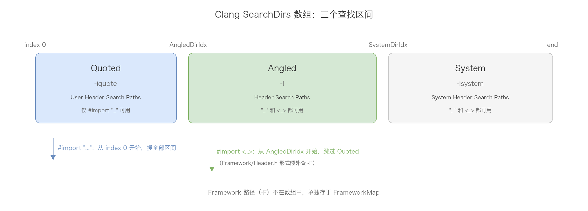
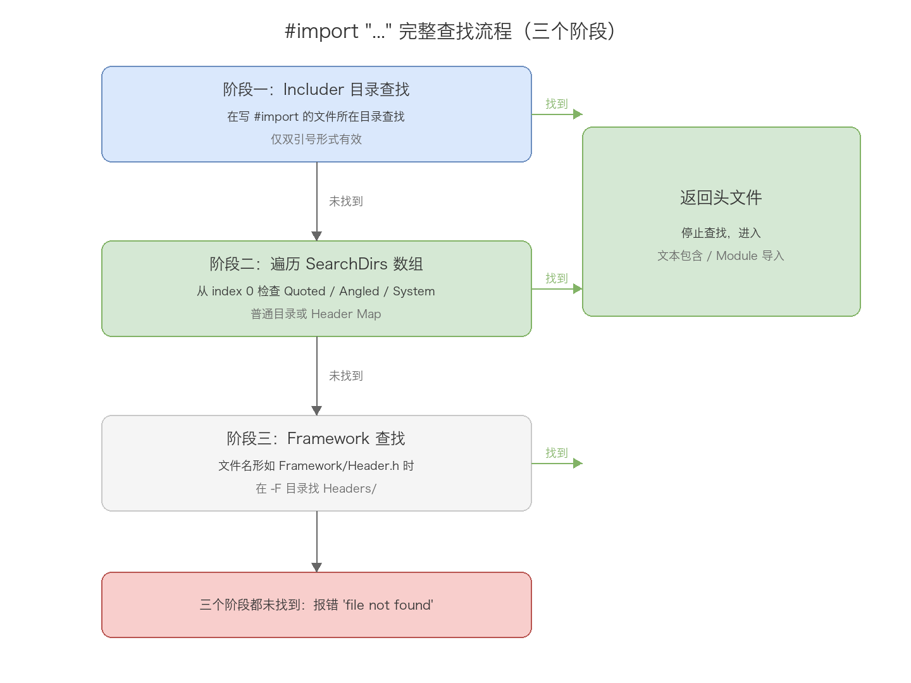
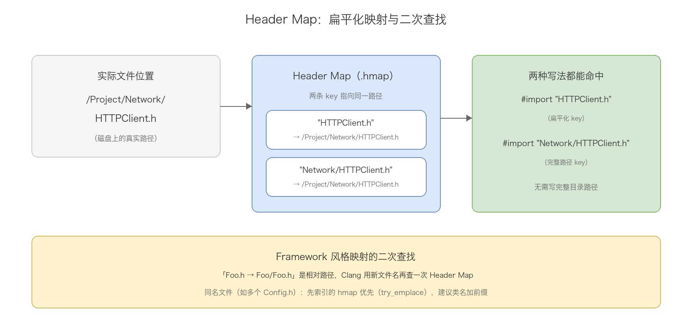
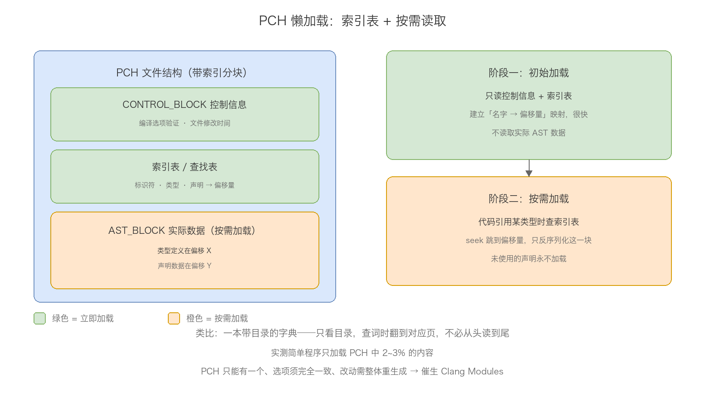
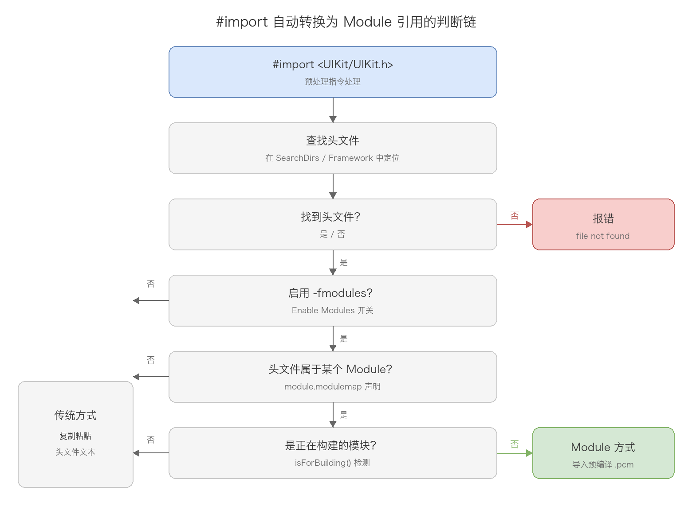
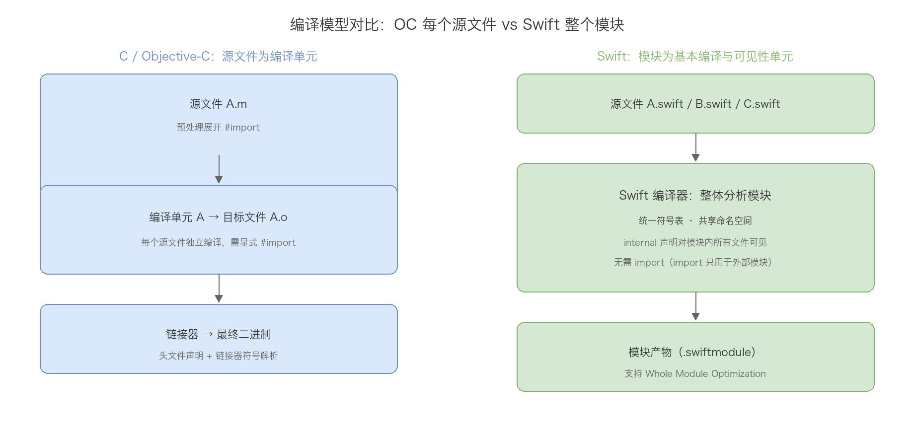
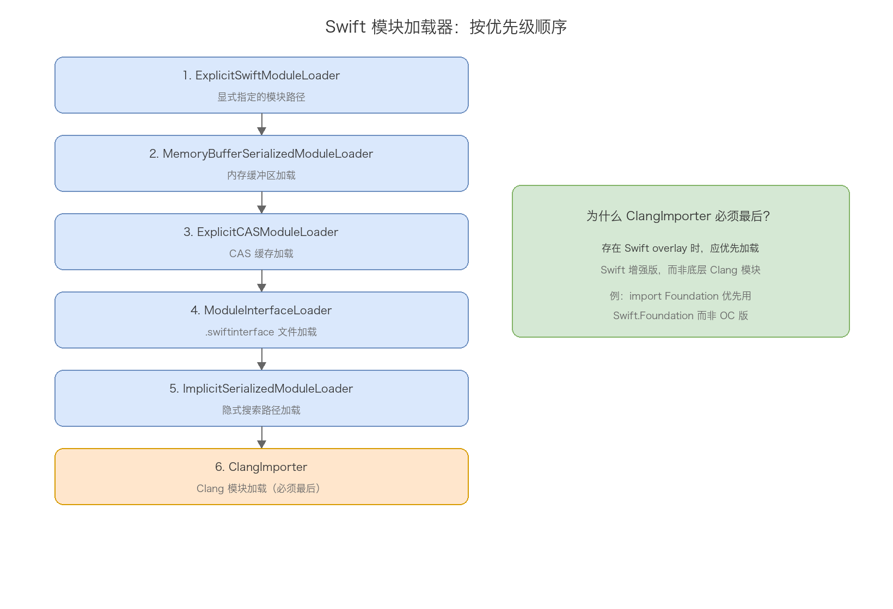
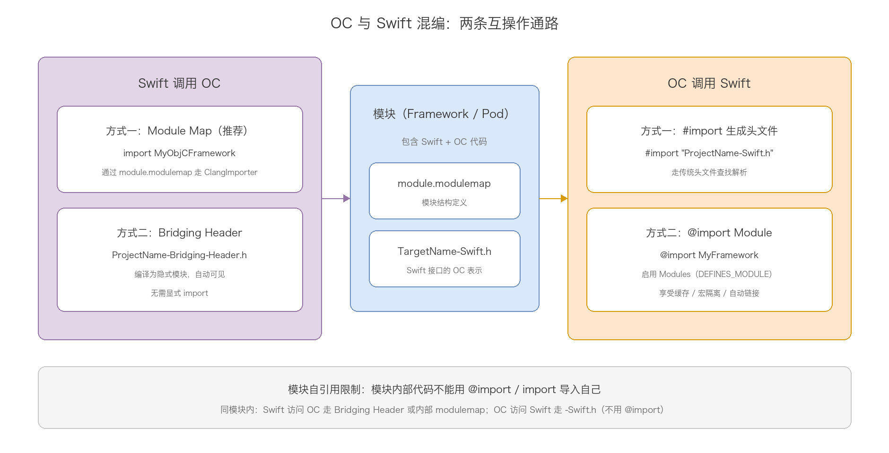

# 16. iOS import 详解

> import 是 iOS 开发里写得最多、却最少被认真研究的一行代码。`#import "A.h"` 和 `#import <A.h>` 差在哪？为什么同一个头文件双引号能找到、尖括号找不到？`@import` 到底比 `#import` 强在哪？Swift 为什么同一个 Target 内不需要 import？本文从 Clang 与 Swift 两个编译器的视角，把 OC 与 Swift 的 import 机制拆开讲透：查找原理、Header Map、PCH 与 Clang Modules、模块文件格式、import 语法与属性，最后落到两语言混编的互操作通路。

## 目录

- 第一部分：Objective-C 中的 import
  - [一、五种引用方式总览](#一五种引用方式总览)
  - [二、#include 与 #import：从复制粘贴说起](#二include-与-import从复制粘贴说起)
  - [三、头文件查找机制：SearchDirs 数组](#三头文件查找机制searchdirs-数组)
  - [四、两种引用方式的完整查找流程](#四两种引用方式的完整查找流程)
  - [五、Header Map 机制](#五header-map-机制)
  - [六、预编译头文件：PCH](#六预编译头文件pch)
  - [七、Clang Modules](#七clang-modules)
  - [八、混编中的 import 与模块自引用限制](#八混编中的-import-与模块自引用限制)
  - [九、CocoaPods 与 Clang Module](#九cocoapods-与-clang-module)
- 第二部分：Swift 中的 import
  - [十、从 Clang Module 到 Swift Module](#十从-clang-module-到-swift-module)
  - [十一、Swift 模块系统](#十一swift-模块系统)
  - [十二、模块文件格式与加载](#十二模块文件格式与加载)
  - [十三、import 语法详解](#十三import-语法详解)
  - [十四、import 属性](#十四import-属性)
  - [十五、import 的语义分析与 canImport](#十五import-的语义分析与-canimport)
- 第三部分：互操作与总结
  - [十六、Swift 与 OC 互操作总结](#十六swift-与-oc-互操作总结)
  - [十七、常见面试问题](#十七常见面试问题)
- [附：高频速记](#附高频速记)

---

# 第一部分：Objective-C 中的 import

## 一、五种引用方式总览

OC 项目里能见到的头文件引用方式一共五种：

| 引用方式 | 语法示例 | 适用场景 |
|---------|---------|---------|
| #include | `#include "Header.h"` | C/C++ 传统方式 |
| #import "..." | `#import "Header.h"` | 项目内部头文件 |
| #import <...> | `#import <Framework/Header.h>` | 系统 / 第三方 Framework |
| @import | `@import Foundation;` | Clang Modules 方式 |
| PCH | Prefix Header 文件 | 预编译公共头文件 |

这五种方式在编译器内部走的是完全不同的路径：前三种本质是预处理器的文本复制，@import 是真正的模块导入，PCH 则是对整组头文件的预编译缓存。后面几章按这个顺序逐层展开。

## 二、#include 与 #import：从复制粘贴说起

### 1. #include 的工作原理

#include 是 C/C++ 的头文件引用方式，工作原理非常直接：预处理器把目标头文件的内容原封不动复制粘贴到当前文件中。

这种方式的死穴是重复引用。多个文件 include 同一个头文件，或者出现循环 include，都会导致编译错误。传统解法是 Include Guard：

```c
// Header.h
#ifndef HEADER_H
#define HEADER_H
// 头文件内容
#endif
```

现代编译器还支持 #pragma once，功能相同但更简洁：

```c
// Header.h
#pragma once
// 头文件内容
```

### 2. #import 的判重增强

#import 是 OC 对 #include 的封装增强，在复制粘贴的基础上加了一层判重逻辑，同一个头文件被重复引用时自动忽略第二次：

```objective-c
// BClass.m
#import "AClass.h"
#import "AClass.h"  // 第二次 import 会被自动忽略
```

但要注意，判重只解决「同一个文件被包含多次」的问题，复制粘贴本身的开销和宏污染问题依然存在——这是第六、七章 PCH 与 Clang Modules 要解决的核心矛盾。

### 3. 双引号与尖括号

日常开发中最常见的两种写法：

```objective-c
#import "MyClass.h"              // 双引号形式
#import <UIKit/UIKit.h>          // 尖括号形式
```

核心区别在搜索路径的范围不同：

| 引用方式 | 搜索范围 | 典型用途 |
|---------|---------|---------|
| "..." | Includer 目录 + Quoted / Angled / System；Framework 形式还会查 -F | 项目内部头文件 |
| <...> | Angled / System；Framework 形式还会查 -F | 系统库、第三方 Framework |

这个差异的具体来源，要看 Clang 的查找机制。

## 三、头文件查找机制：SearchDirs 数组

Xcode 编译时，会把 Build Settings 里的配置转换成 Clang 编译器参数。Clang 解析这些参数后，把所有搜索路径组织进一个统一的 SearchDirs 数组，按特定顺序查找。

### 1. 三区间结构

Clang 用两个索引值把 SearchDirs 数组切成三个区间：



| 区间 | 索引范围 | 对应参数 | Xcode Build Setting |
|------|---------|---------|---------------------|
| Quoted | [0, AngledDirIdx) | -iquote | User Header Search Paths |
| Angled | [AngledDirIdx, SystemDirIdx) | -I | Header Search Paths |
| System | [SystemDirIdx, end) | -isystem | System Header Search Paths |

Framework 路径（-F 参数）不在 SearchDirs 数组里，单独存储在 FrameworkMap 中，只在处理 <Framework/Header.h> 形式的引用时使用。

### 2. 从 Xcode 配置到 Clang 命令

假设 Build Settings 配置如下：

| Build Setting | 配置值 |
|---------------|-------|
| User Header Search Paths | $(SRCROOT)/Headers |
| Header Search Paths | $(SRCROOT)/ThirdParty/include |
| System Header Search Paths | /opt/custom/include |
| Framework Search Paths | $(SRCROOT)/Frameworks |
| Use Header Maps | YES |

生成的 Clang 编译命令：

```bash
clang -x objective-c \
    -iquote /path/to/MyProject-generated-files.hmap \
    -iquote /path/to/MyProject-project-headers.hmap \
    -iquote /Users/dev/MyProject/Headers \
    -I /path/to/MyProject-own-target-headers.hmap \
    -I /Users/dev/MyProject/ThirdParty/include \
    -isystem /opt/custom/include \
    -F /Users/dev/MyProject/Frameworks \
    -c main.m -o main.o
```

对应的 SearchDirs 数组：

```text
SearchDirs[0] = MyProject-generated-files.hmap     ─┐
SearchDirs[1] = MyProject-project-headers.hmap      ├─ Quoted（仅 "..." 可用）
SearchDirs[2] = /Users/dev/MyProject/Headers       ─┘
                                                   ← AngledDirIdx = 3
SearchDirs[3] = MyProject-own-target-headers.hmap  ─┐
SearchDirs[4] = /Users/dev/MyProject/ThirdParty/... ├─ Angled（两种形式都可用）
                                                   ─┘
                                                   ← SystemDirIdx = 5
SearchDirs[5] = /opt/custom/include                ─┐
SearchDirs[6] = /Applications/Xcode.app/.../include ├─ System（两种形式都可用）
...                                                ─┘
```

用 CocoaPods 的项目里，这些路径由 CocoaPods 通过 .xcconfig 自动配置。pod install 之后生成的典型配置：

```text
HEADER_SEARCH_PATHS = $(inherited) "${PODS_ROOT}/Headers/Public" "${PODS_ROOT}/Headers/Public/AFNetworking"
FRAMEWORK_SEARCH_PATHS = $(inherited) "${PODS_CONFIGURATION_BUILD_DIR}/AFNetworking"
```

${PODS_ROOT}/Headers/Public 被加进 Angled 区间（-I 参数），所以 Pod 库的头文件用 #import "AFNetworking.h" 或 #import <AFNetworking.h> 都能引用到。CocoaPods 还会在该目录下为每个 Pod 的公开头文件创建符号链接，配合 Header Map 机制让扁平化引用正确解析。

### 3. 双引号与尖括号的查找差异

差异的源头在 Clang 源码里就一行：

```cpp
// HeaderSearch.cpp 第1085-1086行
ConstSearchDirIterator It =
    isAngled ? angled_dir_begin() : search_dir_begin();
```

search_dir_begin() 返回索引 0（数组开头），angled_dir_begin() 返回 AngledDirIdx（跳过 Quoted 区间）。

实际影响举个例子。项目结构：

```text
MyProject/
├── Headers/
│   └── MyUtils.h          # 项目内部工具类
├── ThirdParty/
│   └── include/
│       └── json.h         # 第三方库头文件
└── Sources/
    └── main.m
```

配置：

```text
User Header Search Paths: $(SRCROOT)/Headers       → -iquote → Quoted 区间
Header Search Paths: $(SRCROOT)/ThirdParty/include → -I      → Angled 区间
```

main.m 中的查找结果：

```objective-c
// 能找到：双引号从 index 0 开始，会搜 Quoted 区间
#import "MyUtils.h"

// 找不到！尖括号从 AngledDirIdx 开始，跳过了 Quoted 区间
#import <MyUtils.h>  // error: 'MyUtils.h' file not found

// 都能找到：Angled 区间对两种形式都开放
#import "json.h"
#import <json.h>
```

如果确实需要 <MyUtils.h> 也能找到，把路径加到 Header Search Paths（-I），让它进入 Angled 区间。

## 四、两种引用方式的完整查找流程

### 1. #import "..." 的三个阶段

双引号形式的查找分三个阶段：



阶段一是 Includer 目录查找。Includer 指执行 #import 指令的那个文件，不是被编译的源文件：

```cpp
// HeaderSearch.cpp 第1000-1080行
if (!Includers.empty() && !isAngled) {
    // 在 includer 的目录中查找
}
```

比如 B.h 里写 #import "C.h"，Clang 先在 B.h 所在目录找 C.h，而不是 main.m 所在目录。

阶段二从 index 0 开始遍历 SearchDirs。每个位置可能是普通目录（直接查文件），也可能是 Header Map（查映射表，可能触发二次查找，见第五章）。

阶段三是 Framework 查找。文件名形如 Framework/Header.h 时，去 -F 指定的目录里找。

### 2. #import <...> 的流程

尖括号形式跳过 Includer 目录和 Quoted 区间，直接从 AngledDirIdx 开始遍历，之后同样走 Framework 查找。这意味着即使 Header Map 通过 -iquote 传递，尖括号也不会用它——尖括号天生适合引用「外部」头文件。

### 3. Framework 目录的特殊处理

路径形如 <FrameworkName/Header.h> 时，Clang 会做一次路径转换：

```cpp
// HeaderSearch.cpp 第689-715行 DoFrameworkLookup
// 首先尝试 Headers 目录
FrameworkName += "Headers/";
auto File = FileMgr.getOptionalFileRef(FrameworkName, ...);

if (!File) {
  // 未找到时，尝试 PrivateHeaders 目录
  const char *Private = "Private";
  FrameworkName.insert(..., Private, ...);
  File = FileMgr.getOptionalFileRef(FrameworkName, ...);
}
```

完整查找顺序：

```text
#import <UIKit/UIView.h> 的查找路径：

1. 在 -F 指定的每个目录中查找：
   └── UIKit.framework/Headers/UIView.h        ← 首先尝试

2. Headers 中未找到时：
   └── UIKit.framework/PrivateHeaders/UIView.h ← 其次尝试
```

PrivateHeaders 存放 Framework 的私有头文件，理论上不应该被外部代码直接引用。

### 4. 验证方法

两个编译器参数可以直观验证查找行为。方法一，-v 查看搜索路径：

```bash
clang -v -c main.m 2>&1 | grep -A 20 "search starts here"
```

```text
#include "..." search starts here:
 /Users/dev/MyProject/Headers                      # Quoted 区间
#include <...> search starts here:
 /Users/dev/MyProject/ThirdParty/include           # Angled 区间
 /opt/custom/include                               # System 区间
 /Applications/Xcode.app/.../SDKs/.../usr/include  # 编译器内置
End of search list.
```

方法二，-H 打印头文件包含层级：

```bash
clang -H -c main.m
```

```text
. /Users/dev/MyProject/Headers/MyUtils.h
.. /Applications/Xcode.app/.../Foundation.h
... /Applications/Xcode.app/.../NSObjCRuntime.h
```

在 Xcode 中验证：Build Settings → Other C Flags 添加 -v 或 -H，看编译日志。

## 五、Header Map 机制

Header Map 是 Xcode/Clang 的查找优化机制，解决两个问题：一是简化引用路径，头文件在 /Project/Network/HTTPClient.h，不用写 #import "Network/HTTPClient.h"，直接写文件名即可；二是提升查找效率，避免大量文件系统 IO。

WWDC2018 的 Behind the Scenes of the Xcode Build Process 里有一句原话：Headermaps are used by the Xcode build system to communicate where those header files are.

### 1. 工作原理

Xcode 在编译前生成 .hmap 二进制文件，内容是头文件名到绝对路径的映射。Clang 优先查 hmap，避免文件系统 IO。Build Settings 里 Use Header Map 默认开启。

用 hmap 工具可以查看内容（brew install milend/taps/hmap）：

```bash
hmap print /path/to/ProjectName-project-headers.hmap
```

```text
// 逻辑结构
{
    "AClass.h" -> "/Users/xxx/Project/Sources/AClass.h",
    "NetworkManager.h" -> "/Users/xxx/Project/Network/NetworkManager.h"
}
```

USE_HEADERMAP=YES 时 Xcode 会生成多个 hmap，分别通过不同参数传递：

- 通过 -iquote 传递的 hmap：仅用于 #import "..."
- 通过 -I 传递的 hmap：#import "..." 和 #import <...> 都能用

### 2. 扁平化映射

HEADERMAP_INCLUDES_FLAT_ENTRIES_FOR_TARGET_BEING_BUILT=YES（默认）时，当前 target 的所有头文件会以扁平化方式加入 Header Map。所谓扁平化，是给同一个头文件创建两种 key——不带目录的文件名和带目录的相对路径，都指向同一个绝对路径：



```text
// 项目结构：/Project/Network/HTTPClient.h
// Header Map 中会有两条映射：
{
    "HTTPClient.h"         -> "/Project/Network/HTTPClient.h",  // 扁平化 key
    "Network/HTTPClient.h" -> "/Project/Network/HTTPClient.h"   // 完整路径 key
}
```

所以无论头文件在项目哪个子目录里，直接写文件名就能引用到。

### 3. 同名文件的处理

项目里存在多个同名头文件时（比如两个模块都有 Config.h），Header Map 构建索引遵循先出现优先：

```cpp
// HeaderSearch.cpp 第405-427行 indexInitialHeaderMaps
auto Callback = [&](StringRef Filename) {
  Index.try_emplace(Filename.lower(), i);  // try_emplace 只在 key 不存在时插入
};
```

try_emplace 只在 key 不存在时才插入，先被索引的 hmap 里的映射会「占位」，后续同名 key 被忽略。具体场景：-iquote 的 hmap 里 "Config.h" 指向 ModuleA，-I 的 hmap 里指向 ModuleB，由于 -iquote 先处理，#import "Config.h" 会解析到 ModuleA 的版本。这也是 OC 社区建议类名加前缀（XXClass.h、YYManager.h）的原因之一。

### 4. Framework 风格映射与二次查找

HEADERMAP_INCLUDES_FRAMEWORK_ENTRIES_FOR_ALL_PRODUCT_TYPES 启用（默认 YES）时，Xcode 会为当前 Target 的头文件创建 Framework 风格映射，格式为 HeaderName.h → TargetName/HeaderName.h（相对路径）：

```text
{
    "MyClass.h"            -> "MyFramework/MyClass.h",     // Framework 风格相对路径
    "MyFramework/MyClass.h" -> "/absolute/path/MyClass.h"  // 绝对路径
}
```

Header Map 返回第一条相对路径时，Clang 会拿这个路径作为新文件名做二次查找：

```cpp
// HeaderSearch.cpp DirectoryLookup::LookupFile 方法
if (llvm::sys::path::is_relative(Dest)) {
  MappedName.append(Dest.begin(), Dest.end());
  Filename = StringRef(MappedName.begin(), MappedName.size());
  Dest = HM->lookupFilename(Filename, Path);  // 二次查找
}
```

这个机制让 #import "MyClass.h" 引用当前 Target 的头文件时，Clang 自动转换成 Framework 风格的 MyFramework/MyClass.h，与 Framework 标准引用方式保持一致，并能正确触发 Clang Module。

性能层面，Clang 会预先索引所有 Header Map 的 key，查找时直接定位；LookupFileCache 缓存查找结果，同一文件名的重复查找走缓存。

## 六、预编译头文件：PCH

前面几章解决的是「怎么找到文件」，但传统 #include/#import 还有更根本的问题：

1. 编译性能。每个源文件都要重新解析头文件。100 个 .m 文件都引用 Foundation.h，Foundation.h 及其依赖就被解析 100 次。Header Map 只加速了「找到文件」，「解析内容」的开销分文未减。
2. 宏污染。头文件里的宏会影响后续代码。比如 SomeHeader.h 里 #define MAX 100，之后引入的 Framework 里如果有 MAX 变量或方法，会被替换成 100，产生难以理解的编译错误。
3. 依赖顺序。不同的 #import 顺序可能导致不同的宏覆盖，产生难以调试的问题。

### 1. PCH 的核心思想

PCH（Precompiled Header）的思路：把一组常用头文件预先编译成二进制格式，后续编译直接加载预编译结果，不再重复解析文本。

```text
传统编译流程:
源文件A.m → #import <Foundation/Foundation.h> → 解析头文件 → AST → 代码生成
源文件B.m → #import <Foundation/Foundation.h> → 解析头文件 → AST → 代码生成
                          ↑ 重复解析

PCH 编译流程:
Step1: 生成 PCH
Prefix.pch → 解析 → 序列化 AST → Prefix.pch.gch

Step2: 使用 PCH
源文件A.m + Prefix.pch.gch → 反序列化 AST（极快） → 代码生成
源文件B.m + Prefix.pch.gch → 反序列化 AST（极快） → 代码生成
                ↑ 无需重复解析
```

生成与使用各一条命令：

```bash
# 生成 PCH
clang -x objective-c-header -emit-pch Prefix.pch -o Prefix.pch.gch

# 使用 PCH 编译
clang -include-pch Prefix.pch.gch main.m -o main.o
```

### 2. 存储的内容

PCH 文件使用 LLVM Bitstream 格式，主要包含五个内容块：

| 内容块 | 说明 |
|-------|------|
| CONTROL_BLOCK | 控制信息（验证编译选项兼容性） |
| AST_BLOCK | AST 主块（类型、声明等） |
| SOURCE_MANAGER_BLOCK | 源码位置管理 |
| PREPROCESSOR_BLOCK | 预处理器状态（宏定义等） |
| INPUT_FILES_BLOCK | 输入文件列表（验证文件是否修改） |

PCH 还保存头文件的状态信息 HeaderFileInfo，包括是否被 #import 过、是否有 #pragma once、include guard 宏等。某个头文件已在 PCH 中被 #import 过，源文件再次 #import 它时，Clang 直接从缓存得知「已引入」，防重复判断也一并加速。

### 3. 懒加载机制

PCH 的关键优化是懒加载：加载时并不立即反序列化所有内容，而是按需读取。它能成立，靠的是 PCH 文件的内部结构设计——不是「全加载或全不加载」的整体，而是带索引的分块结构，支持随机访问：



两阶段加载过程：

1. 初始加载：只读控制信息和索引表，建立「名字 → 文件偏移量」映射，不读实际 AST 数据。这一步非常快。
2. 按需加载：代码引用某个类型或声明时，通过索引表查到偏移量，seek 跳过去，只反序列化那一小块。

Clang 用「外部 AST 源」（External AST Source）模式实现，简化示意：

```cpp
// clang/lib/Serialization/ASTReader.cpp（简化示意）
class ASTReader {
    // 延迟加载的声明：只存储 ID 和偏移量
    DenseMap<DeclID, uint64_t> DeclOffsets;

    Decl *GetDecl(DeclID ID) {
        if (已在缓存中) return 缓存的声明;

        uint64_t offset = DeclOffsets[ID];
        Stream.JumpToBit(offset);       // 跳到文件对应位置

        return ReadDeclRecord(ID);      // 只反序列化这一个声明
    }
};
```

可以把 PCH 想象成一本带详细目录的字典：打开时只看目录，查「UIView」时按目录找到页码直接翻过去，不必从第一页读到最后一页。二进制格式便于快速定位和随机访问，索引结构支持按需读取，二者结合才有「二进制文件 + 懒加载」的共存。

用 -print-stats 能看到实际加载比例：

```text
*** AST File Statistics:
    895/39981 source location entries read (2.238563%)
    19/15315 types read (0.124061%)
    20/82685 declarations read (0.024188%)
    154/58070 identifiers read (0.265197%)
    4/8400 macros read (0.047619%)
```

简单程序只加载 PCH 中 2~3% 的内容。哪怕 PCH 包含整个 UIKit 的几万个声明，源文件只用 UIView 和 NSString，编译器也只反序列化这两个相关的声明及依赖。

### 4. Xcode 配置与局限性

| 设置项 | 说明 |
|-------|------|
| Prefix Header (GCC_PREFIX_HEADER) | PCH 文件路径 |
| Precompile Prefix Header (GCC_PRECOMPILE_PREFIX_HEADER) | 是否启用预编译 |

典型的 Prefix Header：

```objective-c
// ProjectName-Prefix.pch
#ifdef __OBJC__
    #import <UIKit/UIKit.h>
    #import <Foundation/Foundation.h>
#endif
```

PCH 的局限也很明显：

1. 只能有一个：每个编译单元只能用一个 PCH，且必须在文件开头引入
2. 必须完全匹配：编译 PCH 时的编译选项与使用时必须完全一致
3. 修改代价高：PCH 里任何头文件改动都要重新生成整个 PCH
4. 无法解决宏污染：PCH 里的宏仍然影响源文件
5. 维护成本：需要手动维护哪些头文件进 PCH

正是这些局限催生了 Clang Modules。从实现角度看，Modules 是 PCH 的泛化和增强——clang 官方文档 PCHInternals.rst 原话：modules use the same mechanisms as precompiled headers to save a serialized AST file, and are a generalization of precompiled headers.

## 七、Clang Modules

Clang Modules 是 LLVM/Clang 提供的现代代码组织和引用机制，核心思想：把头文件预编译成高效的二进制格式（.pcm 文件，Precompiled Module），编译器直接加载二进制，不再重复解析文本。与 PCH 不同，每个 Module 是独立的、可复用的编译单元。

### 1. 相比 PCH 的五大优势

1. 预编译缓存：Module 只编译一次，结果缓存复用，且支持多个独立缓存（PCH 只能有一个）。系统 Module 缓存在 ~/Library/Developer/Xcode/DerivedData/ModuleCache.noindex/，项目 Module 在 DerivedData 下的 Build/Intermediates.noindex/。
2. 隔离性：这是对 PCH 最大的改进。Module 内部的宏不会泄露到外部，像一个密封盒子；PCH 的宏仍会污染后续代码。
3. 语义化引用：通过 Module 名称引用而非文件路径，编译器能理解模块间的依赖关系。
4. 自动链接：@import 时自动链接对应 Framework，@import CoreLocation; 自动链接 CoreLocation.framework，不用去 Build Phases 手动加。
5. 灵活依赖：PCH 只能形成线性依赖链，Module 支持 DAG（有向无环图）依赖，更符合真实项目。

### 2. @import 语法与 module.modulemap

```objective-c
@import UIKit;           // 导入整个模块
@import UIKit.UIView;    // 导入子模块
```

@import 的查找流程：解析 Module 名称 → 查 Module 缓存（命中直接用）→ 在 Framework Search Paths 中找 ModuleName.framework → 读 Module Map 文件 → 解析并缓存 Module。

Module Map 是定义模块结构的文本文件：

```text
framework module MyFramework {
    umbrella header "MyFramework.h"
    export *
    module * { export * }
}
```

| 字段 | 说明 |
|-----|------|
| framework module | 声明这是 Framework 模块（相对普通 module） |
| MyFramework | 模块名，必须与 Framework 目录名一致 |
| umbrella header | 伞头文件，其中 #import 的所有头文件都会被包含进 Module |
| export * | 重新导出所有子模块内容 |
| module * { export * } | 为伞头文件中的每个头文件自动创建子模块 |

更完整的写法还可以显式声明子模块和私有头文件：

```text
framework module MyFramework {
    umbrella header "MyFramework.h"
    export *
    module * { export * }

    explicit module Advanced {
        header "MyAdvancedFeature.h"
        export *
    }

    private header "MyFramework_Internal.h"
}
```

modulemap 的查找顺序（HeaderSearch.cpp lookupModuleMapFile）：先找 Framework.framework/Modules/module.modulemap（推荐位置），再找已废弃的 Framework.framework/module.map（会产生警告），私有模块用 Modules/module.private.modulemap。

### 3. #import 自动转换为 Module 的原理

启用 Clang Modules 后，#import <Framework/Header.h> 并不是简单复制头文件，而是会被自动转换为 Module 引用。转换发生在预处理阶段，核心判断在 PPDirectives.cpp：

```cpp
// clang/lib/Lex/PPDirectives.cpp HandleIncludeDirective 方法
Module *ModuleToImport = SuggestedModule.getModule();

bool MaybeTranslateInclude = Action == Enter && File && ModuleToImport &&
                             !ModuleToImport->isForBuilding(getLangOpts());
```

四个条件同时满足才转换：

| 条件 | 说明 |
|------|------|
| Action == Enter | 确认要进入（处理）这个头文件，而非跳过 |
| File | 成功找到对应头文件 |
| ModuleToImport | 头文件属于某个已知 Module |
| !isForBuilding() | 该 Module 不是当前正在构建的模块（避免自引用） |

Module 匹配在 HeaderSearch::LookupFile 中完成：检查头文件路径是否在某个 Framework 的 Headers/ 或 PrivateHeaders/ 下，找到对应 module.modulemap，解析确认该头文件属于哪个 Module。确认可转换后，Clang 执行 ImportModule(ModuleToImport) 并提前返回，不再走传统的文本包含。

完整判断链：



### 4. 相关编译器参数

| 参数 | 说明 | Xcode 对应设置 |
|-----|------|---------------|
| -fmodules | 启用 Clang Modules，允许 @import，并把 #import 自动转为模块导入 | Enable Modules (C and Objective-C) |
| -fmodules-cache-path=<path> | 指定 .pcm 缓存路径 | 默认在 DerivedData 下 |
| -fmodule-map-file=<file> | 显式指定要加载的 modulemap（CocoaPods 常用） | - |
| -fmodule-name=<name> | 指定当前正在构建的模块名（自引用检测用） | - |
| -fimplicit-modules | 允许编译器自动发现和构建模块（默认开启） | - |

在编译日志里搜 -fmodules 即可确认 Modules 是否启用。

### 5. 宏污染验证实验

验证一个 Framework 是不是真的走 Module 引入，可以用同名宏做测试：

```objective-c
// FrameworkAClassA.h（Framework 中的头文件）
@interface FrameworkAClassA : NSObject
- (void)eat;
@end

// BClass.m
#define eat  // 定义一个空宏，把所有 "eat" 替换为空

#import "FrameworkAClassA.h"

@implementation BClass
- (void)test {
    FrameworkAClassA *obj = [[FrameworkAClassA alloc] init];
    [obj eat];  // 关键测试点
}
@end
```

结果分析：如果是传统复制粘贴引入，FrameworkAClassA.h 的内容被粘贴到 #define eat 之后，头文件里的 - (void)eat; 被替换为 - (void);（语法错误），编译失败；如果是 Module 引入，Module 是独立编译的，宏不影响 Module 内部代码，编译通过。

注意 Xcode 的 Preprocess 功能（Product → Perform Action → Preprocess）可能显示错误结果——它认为 #import "..." 总是复制粘贴，但实际编译时可能走了 Module。以实际编译结果为准。

## 八、混编中的 import 与模块自引用限制

### 1. OC 调用 Swift

两种方式，取决于是否启用 Modules。方式一，传统头文件：

```objective-c
#import "ProjectName-Swift.h"  // 文件名格式：TargetName-Swift.h

MySwiftClass *obj = [[MySwiftClass alloc] init];
```

方式二，Clang Module（DEFINES_MODULE = YES 时）：

```objective-c
@import MyFramework;

MySwiftClass *obj = [[MySwiftClass alloc] init];
```

Module 方式能成立，是因为 Xcode 构建 Swift Framework 时会生成两个文件：-Swift.h 头文件（Swift 接口的 OC 表示）和引用它的 module.modulemap：

```text
framework module MyFramework {
    umbrella header "MyFramework.h"
    export *
    module * { export * }
}

module MyFramework.Swift {
    header "MyFramework-Swift.h"
    requires objc
}
```

@import 走 Module 机制，享受编译缓存、宏隔离和自动链接。

### 2. Swift 调用 OC

Swift 通过 Bridging Header 访问 OC 代码：

```objective-c
// ProjectName-Bridging-Header.h
// 这里 import 的所有 OC 头文件，Swift 都可以直接使用
#import "MyObjCClass.h"
#import "LegacyNetworkManager.h"
```

配置在 Build Settings → Swift Compiler - General → Objective-C Bridging Header。首次在 Swift 项目里建 OC 文件时 Xcode 会提示自动创建。

### 3. 模块自引用限制

实际开发中有个现象：跨模块引用时，PodA 的 OC 代码可以 @import PodB; 引用 PodB 的 Swift 代码；但模块内部引用时，PodA 的 OC 代码只能 #import "PodA-Swift.h"，不能 @import PodA。

这是 Clang 的模块自引用限制。判断逻辑在 Module::isForBuilding()：

```cpp
// clang/lib/Basic/Module.cpp 第155-169行
bool Module::isForBuilding(const LangOptions &LangOpts) const {
  StringRef TopLevelName = getTopLevelModuleName();
  StringRef CurrentModule = LangOpts.CurrentModule;

  if (!LangOpts.isCompilingModule() && getTopLevelModule()->IsFramework &&
      CurrentModule == LangOpts.ModuleName &&
      !CurrentModule.ends_with("_Private") &&
      TopLevelName.ends_with("_Private"))
    TopLevelName = TopLevelName.drop_back(8);

  return TopLevelName == CurrentModule;  // 模块名匹配 → 正在构建该模块
}
```

isForBuilding() 为 true 时，MaybeTranslateInclude 为 false，#import 不会转换为模块导入。强行 @import 自己所在的模块会直接报错：

```text
err_module_self_import: "import of module '%0' appears within same top-level module '%1'"
err_module_import_in_implementation: "@import of module '%0' in implementation of '%1'; use #import"
```

这个限制的合理性：一是避免循环依赖，模块 A 构建中又要导入 A；二是构建顺序，模块必须先完成构建才能被作为模块导入；三是一致性，模块内部代码应该看到完整的、正在构建的源码，而不是可能过时的缓存模块。

另外三个注意事项：-Swift.h 是编译时自动生成的，项目目录里找不到实际文件；Swift 类要继承 NSObject 或标记 @objc 才能被 OC 调用；Target 名包含特殊字符（-、.）时会被替换为 _。

## 九、CocoaPods 与 Clang Module

CocoaPods 默认不为静态库 Pod 生成 modulemap（不支持 Clang Module）。启用方式三种：

```ruby
# Podfile

# 方式一：全局启用，为所有 Pod 生成 Module
use_modular_headers!

# 方式二：仅为特定 Pod 启用
pod 'AFNetworking', :modular_headers => true

# 方式三：构建为 Framework
use_frameworks!                        # 动态 Framework
use_frameworks! :linkage => :static    # 静态 Framework（推荐）
```

两种配置思路的对比：

| 特性 | use_frameworks! | use_modular_headers! |
|------|-----------------|---------------------|
| 打包方式 | Framework (.framework) | 静态库 (.a) |
| 链接方式 | 可选 static/dynamic | static |
| Module 支持 | 自动支持 | 需要生成 modulemap |
| 启动性能 | dynamic 较慢 | 较快 |

### 1. defines_module? 判断

CocoaPods 通过 PodTarget#defines_module? 决定是否为 Pod 生成 Module，判断优先级：

```ruby
# cocoapods/lib/cocoapods/target/pod_target.rb
def defines_module?
  # 优先级 1: 使用 Swift → 必须定义 Module
  return true if uses_swift?

  # 优先级 2: 构建为 Framework → 必须定义 Module
  return true if build_as_framework?

  # 优先级 3: Podfile 配置了 use_modular_headers! 或 :modular_headers => true
  return true if target_definitions.all? { |td| td.build_pod_as_module?(pod_name) }

  # 优先级 4: Podspec 显式设置 DEFINES_MODULE = YES
  return library_specs.any? { |s|
    s.consumer(platform).pod_target_xcconfig['DEFINES_MODULE'] == 'YES'
  }
end
```

返回 true 时，CocoaPods 生成 module.modulemap、Umbrella Header（PodName.h）并配置 Build Settings。

### 2. DEFINES_MODULE=NO 但 Module 仍然生效

用 use_modular_headers! 后可能观察到：Pod 的 DEFINES_MODULE 仍是 NO，但 Clang Module 正常工作。原因是 CocoaPods 区分了两个概念：

| 概念 | 实现方式 | 作用对象 |
|------|---------|---------|
| Pod "定义" Module | DEFINES_MODULE = YES | Pod 自身 |
| 使用方 "使用" Module | -fmodule-map-file 编译器标志 | App / 依赖方 |

CocoaPods 不改 Pod 自身的 DEFINES_MODULE，而是在使用方的编译参数中加 -fmodule-map-file。看使用方的 xcconfig 可以验证：

```text
# Pods-MyApp.debug.xcconfig 中会看到：
OTHER_CFLAGS = $(inherited) -fmodule-map-file="${PODS_ROOT}/Headers/Public/AFNetworking/AFNetworking.modulemap"
```

这样设计的好处：向后兼容（Pod 仍按普通静态库编译）、灵活（同一 Pod 在不同项目可以有不同 Module 行为）、隔离（modulemap 只对需要的使用方可见）。

---

# 第二部分：Swift 中的 import

## 十、从 Clang Module 到 Swift Module

### 1. Swift 如何继承 Clang Module 的设计

Swift 的模块系统不是从零设计的，而是站在 Clang Module 的肩膀上，继承核心优势并针对 Swift 特性扩展：

| 特性 | Clang Module | Swift Module |
|-----|-------------|-------------|
| 模块定义文件 | module.modulemap | 编译器自动生成 |
| 预编译格式 | .pcm (Precompiled Module) | .swiftmodule（序列化 AST） |
| 文本接口格式 | 不支持 | .swiftinterface（Library Evolution） |
| 懒加载 | 支持 | 支持 |
| 自动链接 | 支持 | 支持 |
| 子模块 | 支持 | 支持 |
| 声明级别导入 | 不支持 | 支持（import class UIKit.UIView） |

三个关键区别：Swift 不需要手写 module.modulemap，编译器自动序列化公开 API；Swift 支持导入特定类型（import struct Darwin.size_t），Clang 只能到模块或子模块粒度；.swiftinterface 文本格式提供跨编译器版本的稳定接口。

### 2. ClangImporter：连接两个世界的桥梁

Swift 通过 ClangImporter 组件导入 C、OC、C++ 代码。它的工作：在 Swift 编译器内部嵌入一个 Clang 实例、启用 Clang Module 支持、用 Clang 的机制加载模块、把 Clang AST 转换成 Swift AST。

```cpp
// lib/ClangImporter/ClangImporter.cpp 第543-547行
// Enable modules.
invocationArgStrs.insert(invocationArgStrs.end(), {
    "-fmodules",
    "-Xclang", "-fmodule-feature", "-Xclang", "swift"
});
```

ClangImporter 自动给 Clang 开 -fmodules，与 OC 侧 @import 的机制完全一致。在 Swift 里写 import MyFramework 时：在 Framework 搜索路径找 MyFramework.framework → 读 Modules/module.modulemap → Clang 加载该模块（生成或复用 .pcm 缓存）→ Clang 声明转换为 Swift 可用形式。

### 3. Swift Overlay：增强 OC API

很多系统框架是 OC 写的，但在 Swift 里用起来却像原生 Swift API，靠的是 Overlay 机制。Overlay 是一个 Swift 模块，导入底层 Clang 模块，为 Clang 类型添加 Swift 风格的扩展和包装。

```swift
// 当你写：
import Foundation

// 实际加载了两个模块：
// 1. Foundation（Clang 模块）——底层 OC 实现
// 2. Swift.Foundation（Swift Overlay）——Swift 扩展和包装
```

Overlay 提供了值语义包装（URL、Date、Data）、Swift 风格 API（String 扩展）、泛型与协议一致性（Array 桥接 NSArray）等。

### 4. Bridging Header vs Module Map

Swift 导入 C/OC 代码有两条路。推荐 Module Map：代码有 module.modulemap 时直接 import MyObjCFramework，模块化、无全局污染、支持懒加载和缓存共享。

遗留代码用 Bridging Header：

```objective-c
// MyProject-Bridging-Header.h
#import "LegacyObjCClass.h"
#import "CUtilities.h"
```

```cpp
// lib/Sema/ImportResolution.cpp 第601-613行
// Implicitly import the bridging header module if needed.
auto bridgingHeaderPath = importInfo.BridgingHeaderPath;
if (!bridgingHeaderPath.empty() &&
    !clangImporter->importBridgingHeader(bridgingHeaderPath, module)) {
  auto *headerModule = clangImporter->getImportedHeaderModule();
  // 将 bridging header 作为一个模块添加到隐式导入中
}
```

ClangImporter 把 Bridging Header 里的所有 #import 编译成一个隐式模块，自动对当前 Swift 模块可见，无需显式 import。代价是：只对当前模块可见、全量导入无法选择、编译性能不如 Module Map（无法充分利用缓存）。最佳实践是优先 Module Map，只在无法修改第三方代码时用 Bridging Header。

Swift 5.9+ 还支持直接导入 C++（Build Settings → C++ and Objective-C Interoperability 开启后 import CxxModule），ClangImporter 会根据配置选择 C、OC、C++ 或 OC++ 语言模式。

## 十一、Swift 模块系统

### 1. 模块是基本编译单元

Swift 开发者的一个常见疑问：为什么同一 Target 下的 Swift 文件可以直接互相访问，不需要 import？

Swift 官方文档的定义：模块是代码分发的单一单元，一个被构建并作为单一单元发布的 Framework 或 Application；源文件是模块内的单个 .swift 文件。关键在于，Swift 里模块（而非源文件）才是基本的编译和可见性单元，同一模块内的所有源文件共享统一命名空间。

两种编译模型的对比：



C/OC 的模型里，每个 .m 是独立编译单元，必须通过 #import 显式引入其他文件的声明；Swift 的模型里，编译器把模块内所有 .swift 文件作为整体分析，import 只用于引入外部模块。

### 2. 访问控制与模块可见性

理解这个行为的关键是 Swift 的访问控制：

| 访问级别 | 可见范围 |
|---------|---------|
| open / public | 模块内 + 导入该模块的其他模块 |
| internal（默认） | 模块内的所有源文件 |
| fileprivate | 仅当前源文件 |
| private | 仅当前声明及其同文件的扩展 |

默认的 internal 访问级别，定义就是「模块内可见」——同一模块内的所有声明自动对模块内所有源文件可见，这就是不需要 import 的原因：

```swift
// FileA.swift（属于 MyApp 模块）
class NetworkManager {  // 默认 internal 访问级别
    func fetchData() { }
}

// FileB.swift（属于 MyApp 模块）
class ViewController {
    let manager = NetworkManager()  // 直接使用，无需 import

    func load() {
        manager.fetchData()  // 可以访问 internal 方法
    }
}
```

编译器实现上：收集模块内所有源文件 → 把 internal 及以上访问级别的声明注册到模块级符号表 → 名称查找时在当前模块符号表中查标识符。

### 3. 整体模块优化（WMO）

模块级编译还带来额外好处。启用 -whole-module-optimization（Release 默认启用）后，编译器可以跨文件内联函数、为具体类型特化泛型、移除未使用代码、做更激进的优化——因为整个模块作为一个单元分析，编译器能看到所有文件的实现细节。

## 十二、模块文件格式与加载

### 1. .swiftmodule：二进制序列化模块

.swiftmodule 类似 Clang 的 .pcm，但信息更丰富：

| 内容 | Clang .pcm | Swift .swiftmodule |
|-----|-----------|-------------------|
| AST | 有 | 有 |
| 类型信息 | 有 | 有 |
| 中间表示 | LLVM IR（可选） | SIL（Swift Intermediate Language） |
| 依赖信息 | 有 | 有 |
| 内联函数体 | 无 | 有（用于跨模块优化） |

```cpp
// lib/Serialization/Serialization.cpp 第7345-7370行
void Serializer::writeToStream(...) {
  Serializer S{SWIFTMODULE_SIGNATURE, DC, options};

  S.writeBlockInfoBlock();
  {
    BCBlockRAII moduleBlock(S.Out, MODULE_BLOCK_ID, 2);
    S.writeHeader();
    S.writeInputBlock();
    S.writeSIL(SILMod);  // 写入 SIL（Clang 不需要这个）
    S.writeAST(DC);
  }
  S.writeToStream(os);
}
```

### 2. .swiftinterface：文本接口文件

这是 Swift 相对 Clang Module 的重要创新。Clang 的 .pcm 是二进制格式，强依赖编译器版本；Swift 提供了 .swiftinterface 文本格式，支撑 Library Evolution（库演进）：

```swift
// swift-interface-format-version: 1.0
// swift-compiler-version: Apple Swift version 5.9
// swift-module-flags: -enable-library-evolution -module-name MyModule
import Swift
import Foundation

@frozen public struct Point {
  @_hasStorage public var x: Double { get set }
  @_hasStorage public var y: Double { get set }
  public init(x: Double, y: Double)
}

@inlinable public func distance(from a: Point, to b: Point) -> Double {
  let dx = b.x - a.x
  let dy = b.y - a.y
  return (dx * dx + dy * dy).squareRoot()
}
```

| 特性 | Clang .pcm | Swift .swiftinterface |
|-----|-----------|---------------------|
| 格式 | 二进制 | 文本 |
| 可读性 | 不可读 | 人类可读 |
| 跨版本兼容 | 依赖编译器版本 | 跨编译器版本 |
| 函数体 | 不包含 | 包含 @inlinable 函数体 |
| 用途 | 编译加速 | 编译加速 + ABI 稳定性 |

文本接口由 AST printer 生成，有三个特点：非 @inlinable 函数体被省略、合成声明（synthesized declarations）被显式写出、opaque result types 需要特殊处理。

### 3. 懒加载

与 Clang Module 一致，Swift 模块也采用懒加载：先加载模块元数据和索引，代码实际引用某个类型或函数时才反序列化该声明，未使用的声明永不加载。即使 import 了 Foundation 这样的大模块，只用 Date 和 URL，编译器也只加载这两个类型的定义。

### 4. 模块加载器架构

Swift 编译器用一组模块加载器查找和加载模块，按优先级排列：



优先级从高到低：ExplicitSwiftModuleLoader（显式指定的模块路径）→ MemoryBufferSerializedModuleLoader（内存缓冲区）→ ExplicitCASModuleLoader（CAS 缓存）→ ModuleInterfaceLoader（.swiftinterface 文件）→ ImplicitSerializedModuleLoader（隐式搜索路径）→ ClangImporter（Clang 模块，必须最后）。

ClangImporter 排最后的原因，Frontend.cpp 的注释写得很清楚：in the presence of overlays and mixed-source frameworks, we want to prefer the overlay or framework module over the underlying Clang module——存在 Swift overlay 时要优先加载 Swift 增强版，而不是底层 Clang 模块。

### 5. 搜索路径与查找流程

Swift 编译器的搜索路径参数与 Clang 保持一致：

| 参数 | 说明 | Xcode 配置 | Clang 等价 |
|-----|------|-----------|-----------|
| -I | 模块搜索路径 | Import Paths | -I |
| -Isystem | 系统模块搜索路径 | - | -isystem |
| -F | Framework 搜索路径 | Framework Search Paths | -F |
| -Fsystem | 系统 Framework 搜索路径 | - | -iframework |
| -sdk | SDK 路径 | SDK 设置 | -isysroot |

执行 import SomeModule 时的查找顺序：

```text
1. 检查是否是 Builtin 模块
2. 检查是否是当前模块自身（用于导入 Clang 子模块）
3. 遍历模块加载器，依次尝试加载
   └── 在每个搜索路径中查找：
       ├── $PATH/SomeModule.swiftmodule/{arch}.swiftmodule
       ├── $PATH/SomeModule.swiftmodule/{arch}.swiftinterface
       ├── $PATH/SomeModule.swiftmodule
       ├── $PATH/SomeModule.framework/...
       └── 最后尝试 Clang 模块（通过 ClangImporter）
```

Framework 的目录结构同时容纳 Swift 模块和 Clang 模块，混编 Framework 因此成为可能：

```text
SomeFramework.framework/
├── Modules/
│   ├── SomeFramework.swiftmodule/
│   │   ├── arm64-apple-ios.swiftmodule
│   │   ├── arm64-apple-ios.swiftinterface
│   └── module.modulemap  ← Clang 模块定义（有 OC 代码时）
├── Headers/
│   └── SomeFramework.h
└── SomeFramework（二进制）
```

## 十三、import 语法详解

### 1. 与 OC 的本质差异

Swift 的 import 是一个声明（Declaration），不是预处理指令。这意味着：它在 AST 里有对应节点（ImportDecl）、在语义分析阶段处理而非预处理阶段、可以有属性修饰（@testable 等）、可以控制访问级别。

### 2. 基本语法

```swift
// 1. 导入整个模块
import Foundation

// 2. 导入特定类型的声明
import struct Darwin.size_t
import class UIKit.UIViewController

// 3. 导入子模块
import Foundation.NSObject

// 4. 带属性的导入
@testable import MyModule
```

编译器的语法定义：

```text
decl-import:
    'import' attribute-list import-kind? import-path
import-kind:
    'typealias' | 'struct' | 'class' | 'enum' | 'protocol' | 'var' | 'func'
import-path:
    any-identifier ('.' any-identifier)*
```

### 3. ImportKind：声明级别导入

Swift 独有的能力——只导入模块中的特定声明，Clang Module 做不到：

```cpp
// include/swift/AST/Import.h 第47-56行
enum class ImportKind : uint8_t {
  Module = 0,  // 导入整个模块
  Type,        // typealias
  Struct,      // struct
  Class,       // class
  Enum,        // enum
  Protocol,    // protocol
  Var,         // var/let
  Func         // func
};
```

```swift
import class Foundation.NSObject
import struct Darwin.size_t
import func Darwin.C.strlen
import protocol Swift.Equatable
```

声明级别导入的两个作用：解决命名冲突（两个模块有同名声明时选择性导入）、提高查找优先级（显式导入的声明在名称查找时优先）：

```swift
// ModuleA 和 ModuleB 都有 Config 类型
import class ModuleA.Config  // 显式导入
import ModuleB

let config = Config()  // 用的是 ModuleA.Config（显式导入优先级更高）
```

Clang 不支持这个特性的原因：Clang Module 基于头文件系统，导入的最小单位是模块或子模块；Swift 从设计之初就把 import 作为声明节点，可以细粒度控制。

### 4. 解析为 ImportDecl

源码 → 词法分析 → Token 流 → 语法分析 → AST → 语义分析。import 在语法分析阶段被解析为 ImportDecl 节点，实现在 Parser::parseDeclImport()：识别 import 关键字 → 解析可选的类型限定符（class、struct 等，映射到 ImportKind）→ 解析模块路径（点号分隔）→ 创建 ImportDecl。

```cpp
// lib/Parse/ParseDecl.cpp 第6735-6867行（节选）
ParserResult<ImportDecl> Parser::parseDeclImport(...) {
  SourceLoc ImportLoc = consumeToken(tok::kw_import);

  // 解析 import-kind（可选）
  ImportKind Kind = ImportKind::Module;
  if (Tok.isKeyword()) {
    switch (Tok.getKind()) {
    case tok::kw_typealias: Kind = ImportKind::Type; break;
    case tok::kw_struct:    Kind = ImportKind::Struct; break;
    case tok::kw_class:     Kind = ImportKind::Class; break;
    // ...
    }
    KindLoc = consumeToken();
  }

  // 解析 import-path
  ImportPath::Builder importPath;
  do {
    importPath.push_back(Identifier(), Tok.getLoc());
    parseAnyIdentifier(importPath.back().Item, ...);
    HasNext = consumeIf(tok::period);
  } while (HasNext);

  // 创建 ImportDecl
  auto *ID = ImportDecl::create(Context, CurDeclContext, ImportLoc, Kind,
                                KindLoc, importPath.get());
  return ID;
}
```

## 十四、import 属性

Swift 支持多种 import 属性控制导入行为，定义在 ImportFlags 枚举中：

```cpp
// include/swift/AST/Import.h 第63-99行
enum class ImportFlags {
  Exported = 0x1,           // @_exported
  Testable = 0x2,           // @testable
  PrivateImport = 0x4,      // @_private
  ImplementationOnly = 0x8, // @_implementationOnly（已废弃）
  SPIAccessControl = 0x10,  // @_spi
  Preconcurrency = 0x20,    // @preconcurrency
  WeakLinked = 0x40,        // @_weakLinked
  SPIOnly = 0x100           // @_spiOnly
};
```

### 1. @testable：测试访问 internal

```swift
// MyModuleTests.swift
@testable import MyModule

func testInternalFunction() {
    let result = internalHelper()  // 可以访问 MyModule 的 internal 声明
}
```

前提条件：被导入模块必须用 -enable-testing 编译（Debug 构建默认满足）。

### 2. @_exported：重导出

```swift
// MyFramework.swift
@_exported import Foundation  // Foundation 对 MyFramework 的使用者也可见

// Client.swift
import MyFramework
let date = Date()  // 无需再 import Foundation
```

这是实现「伞模块」的关键机制，比如 Cocoa 模块重导出 AppKit、Foundation 和 CoreData。

### 3. 访问级别修饰符（SE-0409）

Swift 5.9 引入 import 声明的访问级别控制：

```swift
public import Foundation      // 公开导入，对模块使用者可见
internal import HelperLib     // 内部导入，仅模块内可见（默认）
fileprivate import SecretLib  // 文件私有导入
private import InternalImpl   // 私有导入
```

public import 等同于 @_exported import；internal import 模块内部可见但不暴露给使用者；private / fileprivate 仅当前文件可见。

### 4. @preconcurrency 与 @_spi

@preconcurrency 导入尚未适配 Swift Concurrency 的模块，相关并发警告被降级或抑制，模块中的类型被假定为 Sendable：

```swift
@preconcurrency import LegacyModule
```

@_spi 访问模块的 System Programming Interface：

```swift
@_spi(Internal) import MyFramework
// 可以访问 MyFramework 中标记为 @_spi(Internal) 的声明
```

### 5. @_implementationOnly（已废弃）

标记实现细节的导入，禁止被导入模块的类型出现在公开 API 中：

```swift
@_implementationOnly import InternalHelper

public struct MyStruct {
    // 错误：公开 API 不能使用 @_implementationOnly 导入的类型
    // public var helper: InternalHelper.Type

    // 正确：仅在实现中使用
    private var helper: InternalHelper.Type
}
```

已被 SE-0409 的 internal import 替代，编译器会主动提示迁移。

## 十五、import 的语义分析与 canImport

### 1. performImportResolution 流程

解析器只负责语法层面，真正的模块加载和验证在语义分析阶段。入口是 performImportResolution()：

```cpp
// lib/Sema/ImportResolution.cpp 第299-330行
void swift::performImportResolution(SourceFile &SF) {
  if (SF.ASTStage == SourceFile::ImportsResolved)
    return;

  ImportResolver resolver(SF);

  for (auto D : SF.getTopLevelDecls())
    resolver.visit(D);
  for (auto D : SF.getHoistedDecls())
    resolver.visit(D);

  SF.setImports(resolver.getFinishedImports());
  SF.ASTStage = SourceFile::ImportsResolved;
}
```

ImportResolver 处理每个 import 声明的流程（bindImport 方法）：检查是否自导入（tautological import）→ 加载模块 → 处理 @testable → 获取顶层模块 → 验证 import 选项 → 添加导入 → 处理 Cross-import overlays。

### 2. 隐式导入

Swift 会自动导入一些模块：标准库（Swift）、Bridging Header 编译成的隐式模块、Overlay 场景下的底层 Clang 模块（@_exported self-import）。

### 3. Cross-import overlays

一种特殊机制：同时导入两个特定模块时，编译器自动导入第三个「桥接」模块，为组合提供额外 API：

```swift
import Foundation
import Combine

// 编译器自动导入 _FoundationCombine overlay
// 为 Foundation 类型添加 Combine 扩展
// 例如：URLSession.dataTaskPublisher(for:)
```

优势在于不修改原有模块（Foundation）就能为模块组合提供新功能，overlay 只在两个模块同时存在时才加载。

### 4. canImport 条件编译

canImport 是 Swift 4.1 引入的条件编译指令（SE-0075），编译时检测模块是否可用：

```swift
#if canImport(UIKit)
  import UIKit
  typealias PlatformView = UIView
#elseif canImport(AppKit)
  import AppKit
  typealias PlatformView = NSView
#else
  #error("Unsupported platform")
#endif
```

与传统平台宏检查的对比：

```swift
// 传统方式：基于平台宏，假设 iOS 一定有 UIKit
#if os(iOS)
  import UIKit
#endif

// 更好：基于模块可用性，检测的是模块是否真实存在
#if canImport(UIKit)
  import UIKit
#endif
```

Swift 5.8 增加了版本检查能力：

```swift
#if canImport(MyModule, _version: 2.0)
  // MyModule 版本 >= 2.0
#endif
```

canImport 不会实际加载模块，只检查模块是否存在且可导入。

---

# 第三部分：互操作与总结

## 十六、Swift 与 OC 互操作总结

把两大部分的互操作内容汇总到一张全景图：



### 1. Swift 调用 OC

| 方式 | 机制 | 适用场景 |
|-----|------|---------|
| import Module | ClangImporter 读取 module.modulemap，加载 .pcm，转换 AST | 有 modulemap 的 Framework / Pod（推荐） |
| Bridging Header | 所有 #import 编译为隐式模块，自动可见 | 遗留代码、项目内部 OC 文件 |

### 2. OC 调用 Swift

| 方式 | 机制 | 适用场景 |
|-----|------|---------|
| #import "TargetName-Swift.h" | 导入编译器自动生成的 OC 头文件，走传统头文件流程 | 未启用 Modules 的项目 |
| @import Module | module.modulemap 引用 -Swift.h，走 Module 机制 | DEFINES_MODULE = YES 时（推荐） |

-Swift.h 由 Swift 编译器的 PrintAsClang 模块生成（printAsClangHeader：写前言 → 打印 C 内容 → 打印 OC 内容），把 @objc 暴露的 Swift 类转成 @interface 声明。

Swift 类型要被 OC 调用有可见性要求：

| Swift 声明 | OC 可见性要求 |
|-----------|---------------------|
| 类 | 继承 NSObject，或标记 @objc |
| 方法 / 属性 | 标记 @objc，或类继承 NSObject |
| 枚举 | 标记 @objc，且 raw type 为 Int |
| 结构体 | 不支持 |
| 协议 | 标记 @objc |

```swift
// 可以被 OC 调用
class MyClass: NSObject {
    @objc func doSomething() { }
}

// 不能被 OC 调用
struct MyStruct { }
```

### 3. 模块自引用限制的完整体现

混编 Framework / Pod 中最常踩的坑，四条规则记牢：

- 跨模块：PodA 的 Swift 可以 import PodB；PodA 的 OC 可以 @import PodB;
- 模块内 Swift 访问 OC：通过 Bridging Header 或内部 module.modulemap，OC 类型自动可见，不能 import PodA
- 模块内 OC 访问 Swift：只能 #import "PodA-Swift.h"，不能 @import PodA
- 根本原因：import / @import 属于模块系统，模块构建中尚未生成，导入自己形成循环依赖；#import 是传统头文件机制，不受此限制

## 十七、常见面试问题

### Q1：#include、#import ""、#import <>、@import 的区别

#include 是 C 预处理器文本包含，可能重复包含，需要自己写 include guard；#import 是 OC 的文本包含，自动防重复；双引号从 Includer 目录和 index 0 开始搜（Quoted + Angled + System），尖括号从 AngledDirIdx 开始（跳过 Quoted）；@import 导入 Clang Module，不是复制头文件，支持模块缓存、宏隔离和自动链接。

### Q2：为什么同一个头文件，双引号能找到，尖括号找不到

两种引用方式的搜索范围不同：双引号搜全部路径（Quoted + Angled + System），尖括号只搜 Angled 和 System。头文件只在 -iquote 指定的路径里时尖括号找不到，解决办法是把路径同时加到 Header Search Paths（-I）。

### Q3：Clang Module 只能通过 @import 使用吗

不是。#import <Framework/Header.h> 在启用 Modules 后会自动转换为 Module 引用（四个条件：找到文件、启用 -fmodules、属于某 Module、非正在构建的模块）；#import "FrameworkHeader.h" 通过 Header Map 的 Framework 风格映射二次查找后也可能触发 Module 引用。

### Q4：Clang Module 解决了什么问题

五个：编译效率（.pcm 缓存复用，不再重复解析）、宏污染（模块隔离，内部宏不泄露）、编译顺序依赖（独立编译单元，不受引入顺序影响）、手动链接（@import 自动链接 Framework）、PCH 的局限（多缓存、DAG 依赖、增量编译）。

### Q5：为什么修改 PCH 后编译很慢

PCH 是单一预编译文件，包含所有头文件的完整 AST。任何头文件改动都要重新生成整个 PCH，且所有依赖它的源文件都要重编。解法：只放几乎不会改的头文件、项目自己的头文件不放、迁移到 Clang Modules。

### Q6：为什么同一 Target 下的 Swift 文件不需要 import

Swift 以模块（而非源文件）作为基本编译和可见性单元。同一模块内所有 .swift 文件共享统一命名空间，编译器整体分析；默认访问级别 internal 的定义就是「模块内可见」。import 只用于引入外部模块。

### Q7：Swift import 和 OC @import 有什么区别

可导入的模块类型不同：@import 只能导入 Clang Module；Swift import 既能导入 Swift 模块（.swiftmodule）也能通过 ClangImporter 导入 Clang 模块。粒度不同：Swift 支持声明级别导入（import class UIKit.UIViewController），@import 只能到模块或子模块。相同点：都在语义分析阶段处理、都支持自动链接、都享受模块缓存加速。

### Q8：Swift Module 和 Clang Module 有什么区别

模块定义方式：Clang 需要手写 module.modulemap，Swift 编译器自动序列化。文件格式：.pcm 只含 AST 和类型信息，.swiftmodule 还含 SIL 和内联函数体（支持跨模块优化）。ABI 稳定性：.pcm 强依赖编译器版本，Swift 额外提供 .swiftinterface 文本格式支持 Library Evolution。互操作性：Swift 通过 ClangImporter 直接解析 Clang Module；Clang 无法解析 .swiftmodule——OC 导入 Swift Framework 实际走的是 Xcode 生成的 module.modulemap（引用 -Swift.h），本质上 Clang 读的仍是 OC 头文件。

### Q9：#import 报找不到头文件的可能原因

四个方向排查：Header Search Paths 配置不正确；头文件未添加到 Xcode 项目（只在文件系统里存在）；Framework Search Paths 配置不正确或 Framework 未加入当前 Target；Use Header Map 被禁用。排查工具：clang 加 -v 看搜索路径、-H 看包含层级，或在 Xcode 的 Other C Flags 里加这两个参数看编译日志。

### Q10：CocoaPods 是如何支持 Clang Module 的

默认不为静态库 Pod 生成 modulemap。启用：use_modular_headers!（全局）、:modular_headers => true（单个 Pod）、use_frameworks!（构建为 Framework 自动支持）。use_modular_headers! 的实现很巧妙：Pod 自身 DEFINES_MODULE 保持 NO，CocoaPods 在使用方的 xcconfig 里加 -fmodule-map-file 指向生成的 modulemap，Pod 按普通静态库编译，使用方却能以 Module 方式引用。

## 附：高频速记

- 五种引用方式：#include（文本复制）、#import "" / <>（复制 + 判重）、@import（Clang Module）、PCH（预编译缓存）
- SearchDirs 三区间：Quoted（-iquote，仅双引号）→ Angled（-I）→ System（-isystem）；-F 单独存 FrameworkMap
- 双引号从 index 0 起搜全部区间，尖括号从 AngledDirIdx 起跳过 Quoted；双引号多一个 Includer 目录阶段
- Framework 查找顺序：Headers/ 优先，PrivateHeaders/ 兜底
- Header Map 扁平化：文件名 key 与相对路径 key 指向同一绝对路径，写文件名即可命中；Framework 风格映射「Foo.h → Foo/Foo.h」触发二次查找
- 同名头文件：try_emplace 先出现优先，-iquote 的 hmap 先于 -I 处理，类名建议加前缀
- PCH 懒加载：CONTROL_BLOCK 与索引表立即加载，AST_BLOCK 按偏移量 seek 按需反序列化，实测只加载 2~3%
- PCH 五个局限：只能一个、选项须一致、改动整体重生成、不解决宏污染、手动维护 → 催生 Clang Modules
- Clang Module 四大优势：.pcm 缓存、宏隔离、语义化引用 + 自动链接、DAG 依赖
- #import 自动转 Module 四条件：找到文件、-fmodules、属于某 Module、非 isForBuilding
- 宏污染实验：#define eat 后 import Framework，编译通过 = Module 引入（Xcode Preprocess 显示可能不准，以实际编译为准）
- 模块自引用：模块内部不能 @import / import 自己；OC 访问同模块 Swift 走 -Swift.h，Swift 访问同模块 OC 走 Bridging Header
- CocoaPods：use_modular_headers! 不改 Pod 的 DEFINES_MODULE，而是在使用方加 -fmodule-map-file
- Swift 三大模块文件：.swiftmodule（二进制 + SIL + 内联体）、.swiftinterface（文本，Library Evolution）、.pcm（Clang 侧缓存）
- Swift 模块是基本编译单元：internal 默认模块内可见，同 Target 无需 import；WMO 跨文件优化
- Swift 模块加载器六层，ClangImporter 必须最后——overlay 优先于底层 Clang 模块
- Swift import 是声明不是预处理指令：ImportKind 支持声明级导入（import class UIKit.UIView），解决命名冲突并提高查找优先级
- import 属性：@testable（访问 internal，需 -enable-testing）、@_exported（重导出，伞模块机制）、public/internal/private import（SE-0409）、@preconcurrency、@_spi
- Cross-import overlay：同时导入 Foundation 和 Combine 自动加载 _FoundationCombine
- canImport 检测模块可用性（不实际加载），比 os() 平台宏更可靠
- OC 调 Swift：-Swift.h 编译时生成（PrintAsClang），Swift 类需继承 NSObject 或 @objc，struct 不可见
- Swift 调 OC：Module Map 优先，Bridging Header 是隐式模块、全量导入、仅当前模块可见

