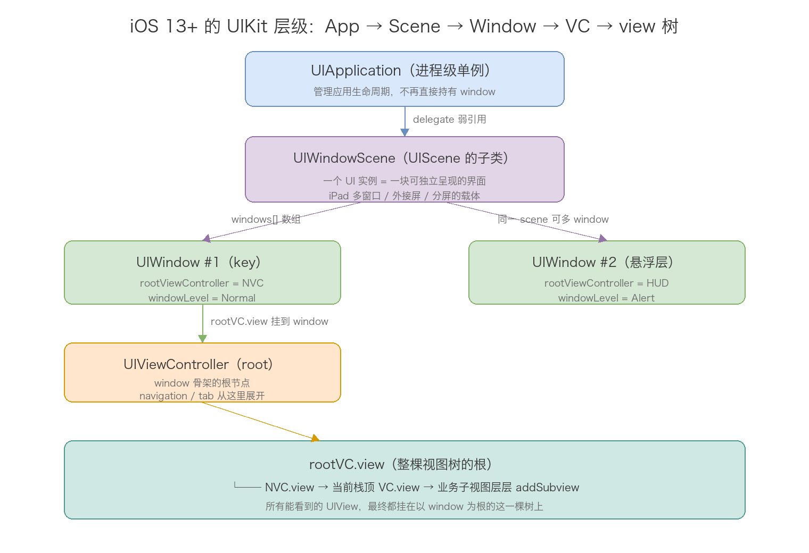
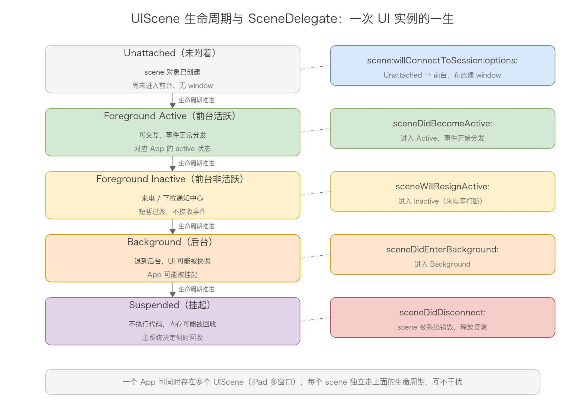
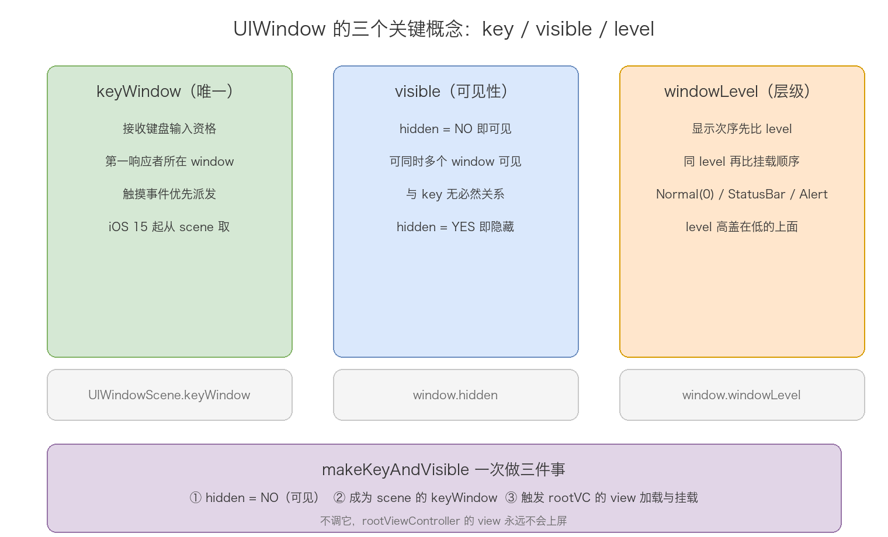
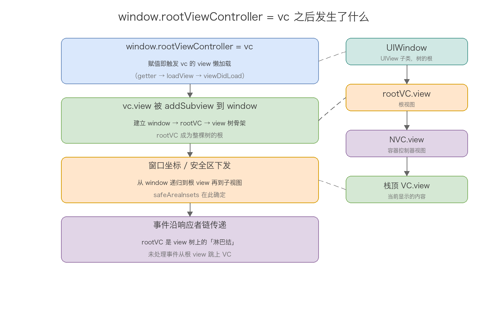
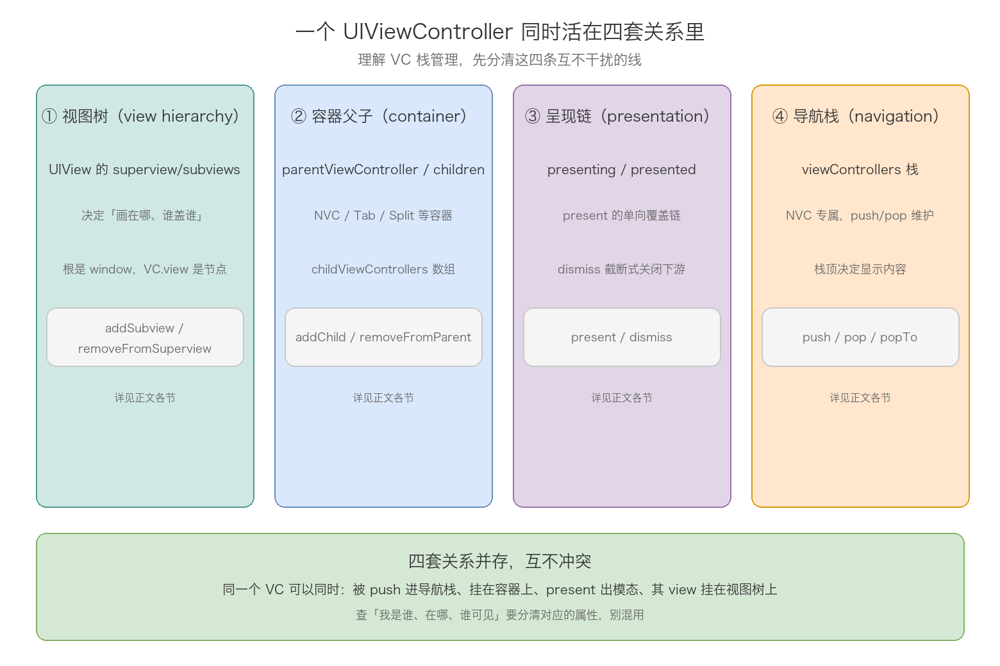
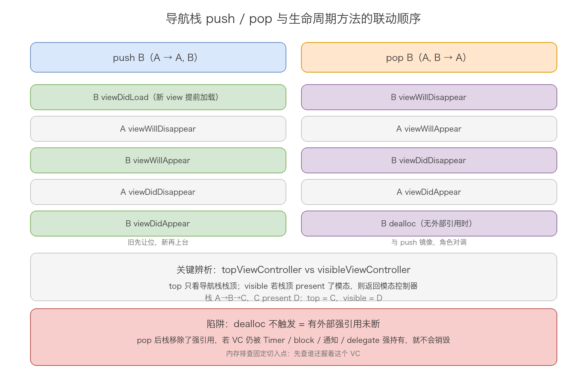
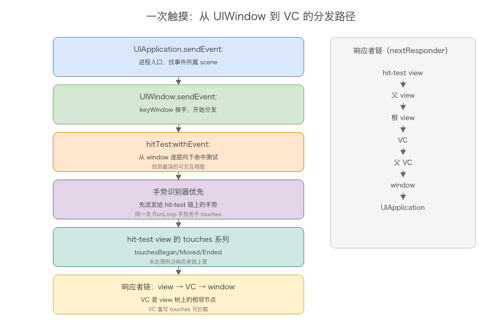

# 17. UIWindow 体系分析

> 屏幕上的一切内容都活在一条固定的层级链上：UIApplication → UIWindowScene → UIWindow → rootViewController → view 树。UIScene 是 iOS 13 之后新增的一层，把「一个 UI 实例」从 App 里抽象出来，iPad 多窗口、外接屏都建在它上面；UIWindow 是 view 树的根，负责上屏与事件入口；UIViewController 是挂在 window 上的内容宿主；UINavigationController 则是 VC 之上最常用的栈管理器。这篇沿这条链从上往下讲，把每一层「是什么、管什么、和相邻层怎么衔接」讲清楚，最后用整个第六章回答一个核心问题：页面之间的栈到底是怎么管理的。

## 目录

- [一、从 App 到屏幕：层级总览](#一从-app-到屏幕层级总览)
- [二、UIScene：iOS 13 之后的 UI 实例抽象](#二uisceneios-13-之后的-ui-实例抽象)
- [三、UIWindow：view 树的根与事件入口](#三uiwindowview-树的根与事件入口)
- [四、rootViewController：window 与 VC 的粘连点](#四rootviewcontrollerwindow-与-vc-的粘连点)
- [五、UIViewController 在层级中的定位](#五uiviewcontroller-在层级中的定位)
- [六、VC 栈管理](#六vc-栈管理)
- [七、UINavigationController 在 window 体系中的位置](#七uinavigationcontroller-在-window-体系中的位置)
- [八、事件分发：window 到 VC 的最后一跳](#八事件分发window-到-vc-的最后一跳)
- [九、常见陷阱](#九常见陷阱)
- [附：高频速记](#附高频速记)

---

## 一、从 App 到屏幕：层级总览

先把整条链画出来，后面每一章拆其中一节。



从上到下四层，各自的职责一句话说清：

UIApplication 是进程级单例，管应用生命周期、响应系统消息。iOS 13 之后它不再直接持有 window——这个变化是本文档的起点。

UIWindowScene 继承自 UIScene，代表「一个 UI 实例」：一块可以独立呈现、独立走生命周期的界面。普通 iPhone App 默认只有一个 scene；iPad 支持多窗口后，同一 App 可以同时有多个 scene，每个 scene 各管各的 window。

UIWindow 是 UIView 的子类，是 view 树的根。一个 scene 可以有多个 window（主内容一个、悬浮 HUD 一个、键盘一个），但同一时刻只有一个 keyWindow 接收键盘与事件。

rootViewController 是 window 与控制器体系的粘连点。window 挂上 rootVC 后，navigation、tab、present 的所有页面都在这个骨架上生长。

四层的关系可以记成一句话：App 拥有 scene，scene 拥有 window，window 拥有 rootVC，rootVC 拥有 view 树。每一层只管下一层，跨层访问都通过属性链逐级取。

iOS 13 之前的结构简单一截：UIApplication 直接持有 windows 数组和 keyWindow，没有 scene 这一层。所以很多老代码里的 `UIApplication.shared.windows`、`UIApplication.shared.keyWindow` 在 iOS 13 之后全部废弃，查询入口统一换成了 UIWindowScene。

## 二、UIScene：iOS 13 之后的 UI 实例抽象

scene 这一层不是可有可无的中间件，它带来了三个实质变化：UI 实例可多个、生命周期从 App 级拆到 scene 级、window 的创建必须绑定 scene。

### 1. scene 与 session

UIScene 本身是抽象基类，日常打交道的都是它的子类 UIWindowScene。每个 scene 由一个 UISceneSession 管理：

```objc
// UIKit/UIScene.h / UISceneSession.h 关键声明
@interface UIScene : UIResponder <UIAppearanceContainer>
@property(nonatomic, readonly) UISceneSession *session;
@property(nullable, nonatomic, weak) id <UISceneDelegate> delegate;
@end

@interface UISceneSession : NSObject
@property(nonatomic, readonly) NSString *role;                 // 场景角色
@property(nonatomic, readonly) UISceneConfiguration *configuration;
@property(nonatomic, readonly) UIScene *scene;                 // 持有 scene 对象
@property(nonatomic, readonly, copy) NSString *persistentIdentifier; // 持久标识
@end
```

session 是「系统侧的记录」，负责告诉 App「现在有哪些 scene、各自什么配置」；scene 是「实际的 UI 对象」。系统可能随时回收 scene（比如后台内存紧张时断开某个 scene），session 会保留，等用户再点开对应窗口时重建 scene。这就是 sceneDidDisconnect 回调的语义——不是 App 退出，是这个 UI 实例暂时被拆掉。

创建 scene 时的配置在 Info.plist 的 UIApplicationSceneManifest 里声明，application:configurationForConnectingSceneSession: 会按 session 的 role 返回对应配置。大多数 App 只需要一套默认配置，模板代码已经写好。

### 2. scene 的生命周期

scene 有自己独立的生命周期状态机，跟 App 的生命周期并行运转：



SceneDelegate 的五个核心回调对应状态机的五次迁移：

```objc
// SceneDelegate.m（模板代码 + 注释）
- (void)scene:(UIScene *)scene willConnectToSession:(UISceneSession *)session
      options:(UISceneConnectionOptions *)connectionOptions {
    // scene 即将上岗：这里建立 window（见第四章）
    UIWindowScene *ws = (UIWindowScene *)scene;
    self.window = [[UIWindow alloc] initWithWindowScene:ws];
    self.window.rootViewController = [[MainViewController alloc] init];
    [self.window makeKeyAndVisible];
}

- (void)sceneDidBecomeActive:(UISceneScene *)scene {
    // 可交互：事件开始分发、定时器正常跑
}

- (void)sceneWillResignActive:(UISceneScene *)scene {
    // 即将失去焦点：来电、下拉通知中心、进入多任务界面
}

- (void)sceneDidEnterBackground:(UISceneScene *)scene {
    // 已进后台：保存数据、停掉无用任务
}

- (void)sceneDidDisconnect:(UISceneScene *)scene {
    // scene 被系统拆掉：释放资源，session 保留以便重建
}
```

注意 scene 的 active 状态是 per-scene 的：iPad 上两个窗口并排，用户正在操作的窗口是 active，另一个是 inactive。这在 App 级生命周期时代不存在——那时整个 App 只有一份 active/inactive。依赖「不 active 就停止刷新」的逻辑，多 scene 环境下要按 scene 粒度重新审视。

### 3. AppDelegate 的角色变化

iOS 13 之后 AppDelegate 只保留两件事：进程级生命周期（application:didFinishLaunchingWithOptions:、applicationDidBecomeActive: 等照常保留，但语义退化为「进程级」）、创建 scene 的配置。原来写在 AppDelegate 里的 UI 相关逻辑（window 建立、rootVC 指定）全部迁到 SceneDelegate。

一个实际的兼容问题：老项目迁移 iOS 13+ 时，如果 Info.plist 里没有 UIApplicationSceneManifest，系统走老路径，AppDelegate 继续管 window，程序也能跑。所以有些项目「半迁移」状态下两套代码并存，排查启动问题时先看这个 manifest 有没有配。

## 三、UIWindow：view 树的根与事件入口

### 1. 本质：UIView 的子类

UIWindow 的特殊性不在继承而在职责。它没有任何特殊渲染能力，就是一棵「规格最大的 view 树」的根，特殊点只有三个：持有 rootViewController、分发事件（sendEvent:）、决定与哪块屏幕（scene）关联。

```objc
// UIKit/UIWindow.h 关键声明
@interface UIWindow : UIView
- (instancetype)initWithWindowScene:(UIWindowScene *)windowScene;  // iOS 13+ 指定初始化器
@property(nonatomic) UIWindowLevel windowLevel;                    // default = 0.0
@property(nullable, nonatomic, strong) UIViewController *rootViewController;
- (void)makeKeyAndVisible;
- (void)becomeKeyWindow;
- (void)sendEvent:(UIEvent *)event;
@end
```

iOS 13 后创建 window 的唯一正路是 `initWithWindowScene:`——window 从出生就绑定到某个 scene，不指定 scene 的初始化路径已不适用。

### 2. key、visible、level 三个概念

window 的行为绕不开三个关键词，混在一起容易糊涂，拆开看各管一件事：



keyWindow 是「接收输入的资格」：键盘弹给 key window 里成为第一响应者的控件，触摸事件由 UIApplication 优先派发给 key window。一个 scene 同一时刻只有一个 keyWindow。iOS 15 起，查询入口从废弃的 `UIApplication.shared.keyWindow` 换成 `UIWindowScene.keyWindow`：

```objc
// iOS 15+ 取「当前 key window」的标准写法
UIWindowScene *scene = nil;
for (UIScene *s in UIApplication.sharedApplication.connectedScenes) {
    if (s.activationState == UISceneActivationStateForegroundActive &&
        [s isKindOfClass:UIWindowScene.class]) {
        scene = (UIWindowScene *)s;
        break;
    }
}
UIWindow *keyWindow = scene.keyWindow;
```

visible 是「显示状态」：hidden = NO 就可见。key 和 visible 是两件事——可以同时多个 window 可见（主 window 和 HUD window 都在显示），但 key 只有一个；被盖住的 window 依然可见，只是不在最上层。

windowLevel 决定显示次序：先比 level（高的盖低的），同 level 再比挂载次序（后挂的在上）。系统预置三档：Normal（0，App 内容）、StatusBar（约 1000）、Alert（约 2000）。键盘、系统弹窗其实都是独立的 UIWindow。App 内的 loading HUD、全局悬浮窗就是利用 level 脱离 VC 层级的典型做法。

### 3. 多 window 的实际用法

一个 scene 挂多个 window 是常规操作，各自承载不同职责：

```objc
// HUD 悬浮窗：独立 window，不依赖任何 VC 层级
UIWindow *hud = [[UIWindow alloc] initWithWindowScene:scene];
hud.windowLevel = UIWindowLevelAlert + 1;
hud.rootViewController = [[HUDViewController alloc] init];
[hud makeKeyAndVisible];   // 只让它可见，不抢 key 的话用 hidden = NO 语义
```

更准确的说法：想让 window 显示但不抢 key，不调 makeKeyAndVisible，直接把它 addSubview 到另一个 window（或设 hidden = NO 且挂上 rootVC 后调 becomeKeyWindow 之外的路）。头文件注释给过原话：「To make the window visible without becoming key, just use UIView's hidden property」。实际操作里，把 HUD window 的 hidden 设为 NO 并挂好 rootVC，它就显示在 level 决定的位置，不碰 keyWindow 的归属。

## 四、rootViewController：window 与 VC 的粘连点

window 挂上 rootViewController，VC 体系才算真正落地。这一步赋值内部做的事值得单独画出来：



四步逐一说：

第一步，赋值触发 view 懒加载。`window.rootViewController = vc` 的 setter 内部会访问 vc.view，getter 里走 loadView → viewDidLoad 那条链（第 09 篇第二章的机制）。所以 App 启动日志里 viewDidLoad 出现的时机，就是 makeKeyAndVisible 前后。

第二步，view 挂到 window。setter 把 vc.view addSubview 到 window 上，window → rootVC → view 树的骨架成型。rootVC 的 view 就是整棵树的根节点。

第三步，窗口坐标与安全区下发。window 的 coordinateSpace 是最顶层的坐标基准，safeAreaInsets 从 window 一路递归下发到根 view 再到每个子视图。刘海、Home Indicator 的避让都从这条链开始。

第四步，事件通道建立。rootVC 作为响应者链上的节点接入：view 未处理的触摸从根 view 冒泡到 rootVC，再由 rootVC 的 nextResponder 交给 window（第八章展开）。

makeKeyAndVisible 是启动的标志性收尾调用，它一次做三件事：hidden = NO、成为 scene 的 keyWindow、触发上面这套 rootVC 挂载流程。漏调它的症状非常明确：App 不崩溃、日志正常，就是白屏——view 树建好了，但 window 没显示。

rootViewController 还有一个行为细节：给 window 换 rootVC（直接再赋值一次），旧 rootVC 的 view 会被移除替换，但旧 VC 不会有完整的 disappear 生命周期，也没有转场动画。想做「有动画的根页面切换」要自己用 UIView transition 或者临时包一层容器控制器实现。

## 五、UIViewController 在层级中的定位

window 体系里，VC 的身份需要放回四套关系里看。同一个 UIViewController 同时活在四条互不干扰的线上：



四套关系各自的数据结构和维护 API：

| 关系 | 数据结构 | 维护 API | 决定什么 |
| --- | --- | --- | --- |
| 视图树 | superview / subviews | addSubview / removeFromSuperview | 画在哪、谁盖住谁 |
| 容器父子 | parentViewController / childViewControllers | addChild / removeFromParent | 生命周期转发、appear 联动 |
| 呈现链 | presenting / presented | present / dismiss | 模态覆盖关系 |
| 导航栈 | viewControllers（NVC 内部） | push / pop / popTo | 页面导航顺序 |

这四套关系同时成立、互不冲突。一个典型的 VC（比如某个详情页）可能同时：被 push 进导航栈（第四套）、view 挂在 window 的视图树上（第一套）、又 present 出一个分享面板（第三套）。查「我是谁、在哪、谁可见」必须分清用的是哪套关系的属性：`navigationController` 查的是导航栈归属，`parentViewController` 查的是容器父子，`presentingViewController` 查的是呈现链，三者各查各的，不能互相替代。

VC 自己不持有 window。VC 的 view 有 window 属性（挂在树上后非 nil），但 VC 层面没有直接的 window 指针——要拿，就 `self.view.window`。这也解释了一个常见判断写法：`self.isViewLoaded && self.view.window != nil` 才算「真正在屏上」。

## 六、VC 栈管理

这是本文档的核心章节。页面导航的本质是「历史记录」：用户一层层深入，再一层层原路返回。栈这个数据结构天然适配这个模型——进入时压栈，返回时弹栈，栈顶永远是当前页面。iOS 把这套机制分散在几处实现：导航栈（NVC 的 viewControllers）、呈现链（present 的单向链）、容器数组（Tab/Split 的 viewControllers）。这一章把「VC 的栈管理」集中讲透：每种结构怎么动、动的时候生命周期怎么联动、栈里页面的内存怎么管理。

### 1. 导航栈：数组即栈

UINavigationController 的栈没有玄机，viewControllers 数组就是栈本体：index 0 是根控制器，最后一个元素是栈顶。所谓 push/pop，就是对这个数组的增删，外加同步导航栏和转场动画。

```objc
// UIKit/UINavigationController.h 核心声明
@property(nonatomic, copy) NSArray<__kindof UIViewController *> *viewControllers;
- (void)pushViewController:(UIViewController *)viewController animated:(BOOL)animated;
- (nullable UIViewController *)popViewControllerAnimated:(BOOL)animated;
- (nullable NSArray<__kindof UIViewController *> *)popToViewController:(UIViewController *)viewController
                                                              animated:(BOOL)animated;
- (nullable NSArray<__kindof UIViewController *> *)popToRootViewControllerAnimated:(BOOL)animated;
```

push 有三条硬规则。第一条：已在栈里的 VC 再 push 一次无效，UIKit 静默忽略——防止重复 push 打乱栈。第二条：栈里至少要剩一个（root 永远不能被 pop），popViewControllerAnimated: 在只剩 root 时返回 nil。第三条：转场动画进行中不允许发起新的 push/pop，连续快速操作轻则动画错乱、重则栈状态损坏崩溃，官方文档明确要求等上一次动画结束。

pop 家族三兄弟覆盖三种回退场景：popViewControllerAnimated: 弹栈顶一层；popToViewController: 一路弹到指定 VC（目标必须在栈里，典型用途是编辑流一键取消回列表页）；popToRootViewControllerAnimated: 弹到只剩根。批量 pop 有个动画细节：中间层直接丢弃不参与动画，视觉上和单层 pop 一样只动栈顶那一个。

### 2. push / pop 与生命周期的联动

栈一变，涉及的两个 VC 的生命周期方法就按固定次序交错执行，这个次序是面试高频题：



push 的序列（A 在栈里，push B）：

```text
B.viewDidLoad           ← B 首次入栈，转场需要新 view，提前加载
A.viewWillDisappear     ← 旧的先让位
B.viewWillAppear        ← 新的再上台
A.viewDidDisappear
B.viewDidAppear
```

pop 的序列（栈 A、B，pop 回 A）：

```text
B.viewWillDisappear
A.viewWillAppear
B.viewDidDisappear
A.viewDidAppear
B.dealloc               ← 栈移除强引用且外部无人持有才触发
```

两个规律。规律一：push 和 pop 的顺序正好镜像——push 是「旧的先让位，新的再上台」，pop 里角色对调。规律二：appear 系列永远先于 disappear 系列（跨 VC 对比时），这在 present 场景同样成立。

判断「这次 appear/disappear 是不是栈变化引起的」，用 VC 上的标志位：

```objc
// viewWillAppear 里为 YES = 正在被 push 进栈
BOOL movingIn  = self.isMovingToParentViewController;
// viewWillDisappear 里为 YES = 正在被 pop 出栈
BOOL movingOut = self.isMovingFromParentViewController;
```

### 3. 呈现链：另一种「栈」

present 维护的不是栈，是 presenting/presented 单向链。但它的使用模式和栈很像——压入（present）、弹出（dismiss）——所以很多人把它当栈用，差异就在这里踩坑。

两种结构的回退能力不同。栈有随机访问能力：popToViewController: 可以一次弹到栈里任意一层。链没有：dismiss 只能逐层退，或者从链上任何一点发起截断式关闭（把自己和下游全部关掉）。A present B、B present C、C present D 之后想直接回 A，链只能从 A dismiss（截断，B/C/D 一起消失），没有「pop 到 B」这种操作。

dismiss 的转发规则跟链结构绑定：调用者如果不是链源头，UIKit 把消息转发给 presentingViewController，由源头执行。所以在 B 上调 dismiss 关掉的是 B 自己，不用先「回到 A」。

iOS 13 的默认样式变化在这里引入了新的栈行为差异：pageSheet（默认值）没有盖满屏幕，背景 VC 的 viewWillDisappear/viewDidDisappear 不触发——「栈顶被覆盖」和「栈顶消失」从此是两回事。依赖 disappear 做暂停播放、停止定位的代码，迁移 iOS 13 后失效的经典原因就在这。

### 4. topViewController 与 visibleViewController 辨析

栈管理绕不开两个「当前页」查询，语义差异是常考点：

```objc
@property(nullable, nonatomic, readonly, strong) UIViewController *topViewController;
// 栈顶，只看导航栈
@property(nullable, nonatomic, readonly, strong) UIViewController *visibleViewController;
// 有 modal 返回 modal，否则返回栈顶
```

栈是 A → B → C，C 又 present 了 D，此时 topViewController 返回 C（只看栈），visibleViewController 返回 D（沿呈现链查到链尾）。「栈顶」不一定「可见」——top 的语义是导航栈的位置，visible 的语义是屏幕上正显示谁。要判断「弹窗存在时不刷新页面」这类逻辑，读 visibleViewController 或者栈顶 VC 的 presentedViewController 是否为 nil，是标准写法。

Tab 并列关系里也有一个类似的「当前页」概念：UITabBarController.selectedViewController。Tab 的 viewControllers 数组是并列关系不是栈——切换 tab 不涉及出入栈，只是「显示哪一个」的变化，被切走的 VC 不走 disappear（view 还在，只是被盖住；iOS 18 起 Tab 侧边栏形态下行为同理）。

### 5. 整栈替换与状态恢复

setViewControllers:animated: 是栈管理的「大杀器」：一次调用把整个栈换成新数组。它的动画判定规则值得背下来：

```text
设新数组为 @[A, B, C]，当前栈为 @[A, B, D, E]：
1. 新栈顶 C 不在旧栈中          → 执行 push 动画（C 从右侧滑入）
2. 新栈顶在旧栈中且已是栈顶     → 无动画
3. 新栈顶在旧栈中但不是栈顶     → 执行 pop 动画（一路弹回）
```

它最典型的用途是状态恢复：App 重启时重建整条导航链，一次调用恢复到用户离开时的层级，比逐个 push 干净。另一个用途是「跳转后清空返回路径」：登录完成后把栈换成 @[首页, 主界面]，用户在主界面按返回不会回到登录页。

### 6. 栈操作 API 速查

把第六章散落的操作集中成一张表，按使用频率排序：

| API | 所属结构 | 行为要点 |
| --- | --- | --- |
| `pushViewController:animated:` | 导航栈 | 入栈；已在栈中静默忽略；立即触发新 VC 的 loadView |
| `popViewControllerAnimated:` | 导航栈 | 弹栈顶；只剩 root 时无效返回 nil |
| `popToViewController:animated:` | 导航栈 | 弹到指定 VC（须在栈中）；动画只作用栈顶 |
| `popToRootViewControllerAnimated:` | 导航栈 | 弹到只剩根 |
| `setViewControllers:animated:` | 导航栈 | 整栈替换；动画按新栈顶是否在旧栈中判定 |
| `presentViewController:` | 呈现链 | 挂到最近容器的呈现链；iOS 13+ 默认 pageSheet |
| `dismissViewControllerAnimated:` | 呈现链 | 非链源头调用自动转发给源头执行 |
| `addChildViewController:` | 容器父子 | 建父子关系；生命周期由容器转发 |
| `showViewController:sender:` | 上下文自适应 | 在导航栈里等价 push；分屏下走 showDetail |

### 7. 栈里 VC 的内存：dealloc 时机

pop 之后栈不再持有 VC，但 dealloc 不一定立刻走。完整的持有链要清干净才销毁：

```objc
// pop 后 dealloc 不触发的排查清单
// 1. Timer：scheduledTimer 的 target 持有 self（改用 block API + weak）
[NSTimer scheduledTimerWithTimeInterval:1.0 repeats:YES block:^(id _) {
    [weakSelf tick];   // block + weak 不持有
}];
// 2. 闭包：网络回调、动画 block 里捕获 self
// 3. delegate：用 weak 声明的没问题，assign/strong 的会持有
// 4. 通知：selector 方式注册未移除（虽然不一定阻止 dealloc，但会崩溃）
// 5. 递归引用：子 VC 与父 VC 互相强持有
```

排查思路固定：pop 后打断点看 dealloc 走没走，没走就用 Memory Graph 看谁还握着这个 VC。导航栈本身不背锅——它的引用在 pop 时已经释放，剩下的都是外部代码自己留下的。

### 8. 多 scene 下栈的归属

iOS 13+ 的页面栈全部挂在 scene 的 window 树上。iPad 上同一 App 两个窗口，各自有独立的 window、rootVC、导航栈——两个窗口里 push 到第几层互不影响。这意味着「当前栈」的查询要基于正确的 scene：全屏 Modal、toast 这类「在最上面显示」的需求，从 keyWindow/scene 入手才能落到正确的窗口上。iPhone App 通常只有一个 scene，感知不强，但写通用代码时不要写死「唯一 window」的假设。

## 七、UINavigationController 在 window 体系中的位置

NVC 的内部结构在第 10 篇已经完整拆过（导航栈、navigationBar、item 栈、手势），这里只摆清它在 window 体系中的位置：它是挂在 rootVC 位置上（或更深处）的「栈管理容器」。

典型 App 的完整层级长这样：

```text
UIWindow
└── UITabBarController（rootVC）
    ├── UINavigationController（tab 1）
    │   ├── 首页 VC            ← viewControllers[0]
    │   └── 详情 VC            ← viewControllers[1]（栈顶）
    ├── UINavigationController（tab 2）
    │   └── 列表 VC            ← 单栈底
    └── 我的 VC
```

从这个结构能直接读出几条实用结论。第一，NVC 的 view 就是 window 视图树上的一个中间节点，它自己的 view 上挂着 navigationBar 和当前栈顶 VC 的 view。第二，每个 tab 一条独立导航栈，切 tab 时各自的栈深度保持不变（tab 1 推到第三层，切去 tab 2 再回来，还在第三层）。第三，present 是跳出现整棵栈的操作：从栈顶 VC present 一个新页面，呈现链接在 NVC 的最近容器上（UIKit 会把 presented 挂到「找到的最近容器」，不一定是发起调用的那个 VC）。

给 window 指定 rootVC 时的选择也值得说明：直接给一个内容 VC，页面不能 push（没有栈）；包一层 NVC，内容 VC 成为栈底，后续页面通过 push 生长。模板代码给 main window 配的 rootVC 通常就是 Tab 或 NVC，就是这个原因。

## 八、事件分发：window 到 VC 的最后一跳

window 体系讲完结构，用一次触摸的完整路径把四层串起来——事件是检验「层级关系是否理解」的最好考题。



```text
物理触摸 → 系统收集 → UIApplication.sendEvent:（找到所属 scene）
        → UIWindow.sendEvent:（keyWindow 接手）
        → hitTest:withEvent:（从 window 逐层向下命中测试，找到最深的可交互视图）
        → 先派发给 hit-test 链上的手势识别器（同一次 RunLoop 手势先于 touches）
        → hit-test view 的 touchesBegan: 系列
        → 未处理则沿响应者链上冒：view → 父 view → … → VC → window → UIApplication
```

VC 在这条链里的位置是「view 树上的相邻节点」：hit-test 命中的是 view，view 不处理后事件跳上它的 VC，VC 再不处理交给 window。这就是为什么在 VC 里重写 touchesBegan:withEvent: 能「兜底」子 view 都没处理的触摸。

响应者链的完整顺序（nextResponder 一路向上）：

```text
hit-test view → 父 view → 根 view → VC → 父 VC（如有）→ window → UIApplication → delegate
```

两个与 window 体系强相关的细节。细节一：hit-test 的起点是 window，不是 UIApplication——UIApplication 不做命中判断，scene 体系下它只负责把事件路由到所属 scene 的 window。细节二：keyWindow 收到的事件不一定是「key window 自己树上的」——事件路由先按触摸位置找 scene 和 window，多 window 场景下 HUD window 的触摸走 HUD 的响应链，不会串到主 window。

## 九、常见陷阱

按踩坑频率列五个。

第一个，漏调 makeKeyAndVisible。症状是白屏：window 建了、rootVC 挂了、viewDidLoad 也走了，就是不显示。根因是 window 的 hidden 还是 YES、key 资格也没建立。自查清单里第一项永远是 scene:willConnectToSession: 里有没有这行调用。

第二个，用废弃 API 找 keyWindow。`UIApplication.shared.keyWindow` 在 iOS 13 起废弃且在 scene 环境下返回不准（可能返回 nil 或错误的 window）。正确入口是 UIWindowScene.keyWindow（iOS 15+）或遍历 connectedScenes 过滤前台 active 的 UIWindowScene。全局 toast、顶层 VC 查找都受这条影响。

第三个，把 pageSheet 当 fullScreen 用。iOS 13 后 present 不显式指定样式就是 pageSheet，背景 VC 的 will/didDisappear 不触发。依赖 disappear 暂停播放、停止定位、断开长连接的逻辑静默失效。解法是显式设 modalPresentationStyle = UIModalPresentationFullScreen（样式设在被 present 的 VC 上；present 的是 NVC 时设在 NVC 上）。

第四个，转场中操作栈。push 动画没结束时又 push/pop，或在 viewWillAppear 里立刻 push，栈状态可能损坏崩溃。判断手段：self.navigationController.transitionCoordinator 为 nil 说明当前没有进行中的转场；根治手段是按钮点击做节流，转场回调 completion 里再做下一次操作。

第五个，pop 后 dealloc 不走。导航栈的引用已释放，问题出在外部强引用：Timer 的 target、block 捕获 self、strong delegate。排查用 Memory Graph，修复方向是 block API + weak、weak delegate、invalidate 时机提前到 viewWillDisappear。

## 附：高频速记

```text
层级链：UIApplication（进程单例）→ UIWindowScene（UI 实例）→ UIWindow（view 树根）
       → rootViewController → view 树
每层只管下一层：App 拥有 scene，scene 拥有 window，window 拥有 rootVC

UIScene：
├── UIWindowScene = UIScene 子类，实际 UI 对象；UISceneSession = 系统侧记录
├── 生命周期五回调：willConnect（建 window）→ didBecomeActive → willResignActive
│   → didEnterBackground → didDisconnect（scene 拆掉、session 保留）
└── active 是 per-scene 的：iPad 多窗口各自独立

UIWindow 三概念：
├── key：接收键盘/事件资格，一个 scene 唯一；iOS 15+ 从 scene.keyWindow 取
├── visible：hidden = NO 即可见，可与 key 无关（HUD 可见但不 key）
└── level：先比 level 再比挂载次序；Normal 0 / StatusBar ~1000 / Alert ~2000
makeKeyAndVisible 三件事：hidden=NO + 成为 key + 触发 rootVC 挂载（漏调 = 白屏）

rootViewController 赋值四步：触发懒加载 → addSubview 到 window → 坐标/安全区下发
→ 事件通道建立；换 rootVC 无转场、无完整 disappear

VC 四套关系（互不冲突）：
├── 视图树：superview/subviews，addSubview / removeFromSuperview
├── 容器父子：parent/childViewControllers，addChild / removeFromParent
├── 呈现链：presenting/presented，present / dismiss
└── 导航栈：NVC.viewControllers，push / pop / popTo
查归属用对属性：navigationController 查栈、parentViewController 查容器、
presentingViewController 查呈现链

VC 栈管理：
├── push 规则：已在栈中无效；root 不可 pop；转场中不可操作栈
├── push 生命周期：B.viewDidLoad → A.willDisappear → B.willAppear
│   → A.didDisappear → B.didAppear（pop 镜像，角色对调）
├── topViewController 只看栈；visibleViewController 有 modal 返回 modal
├── present 是单向链不是栈：只能逐层 dismiss 或截断式关闭，无 popTo
├── setViewControllers 动画判定：新栈顶不在旧栈=push；已是栈顶=无动画；
│   在旧栈非栈顶=pop
├── pop 后 dealloc 不走：查 Timer target / block 捕获 / strong delegate
└── 多 scene 下每窗口独立导航栈；「当前栈」查询基于正确的 scene

事件最后一跳：sendEvent → hitTest（window 为起点）→ 手势先于 touches
→ touches → 响应链上冒：view → … → VC → window → UIApplication
```
