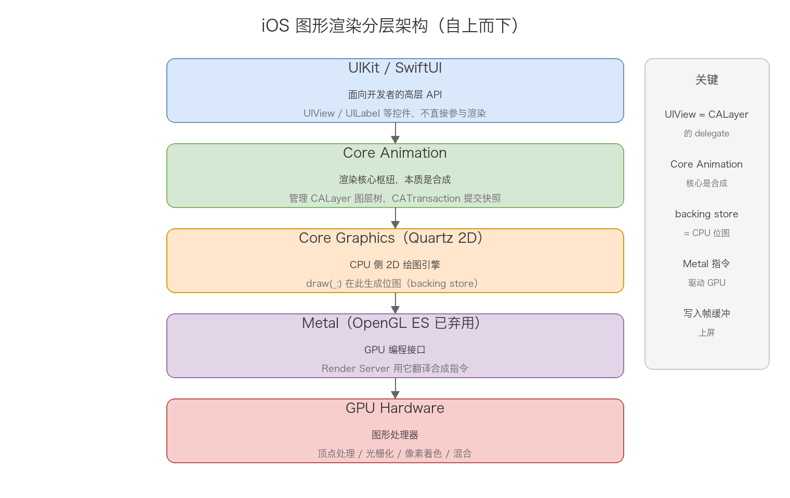
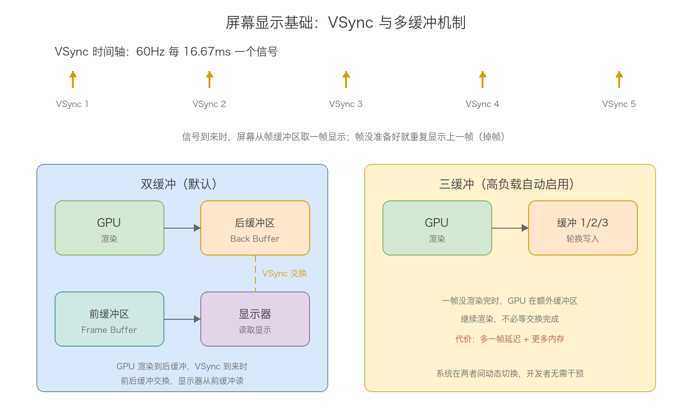
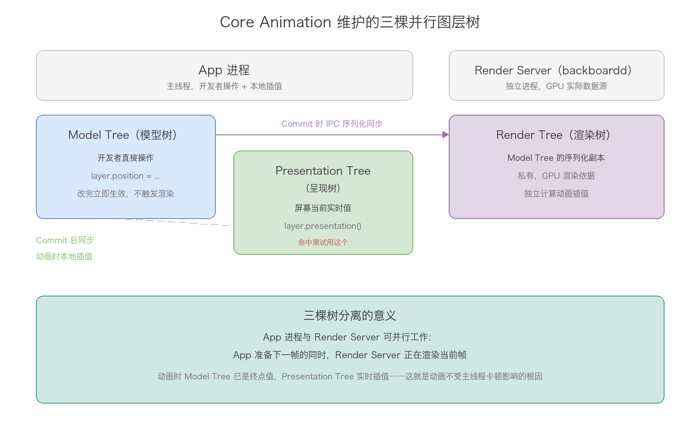
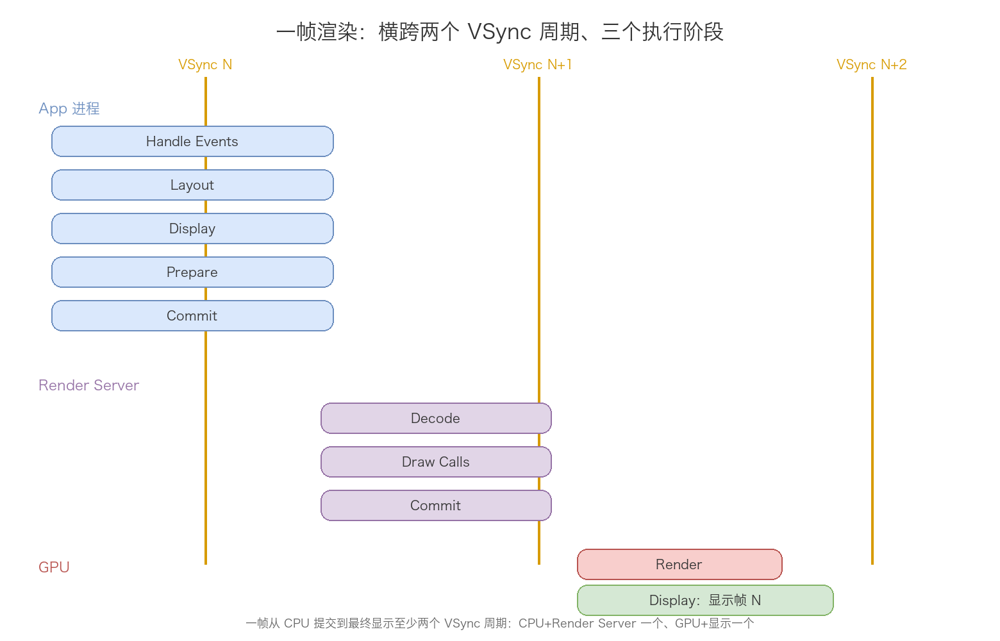
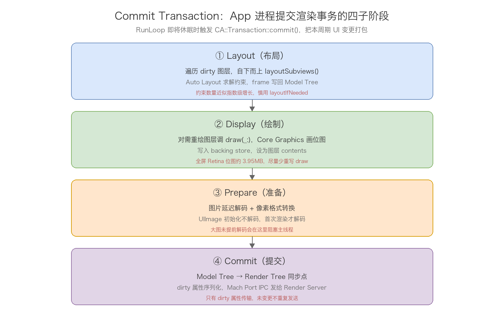
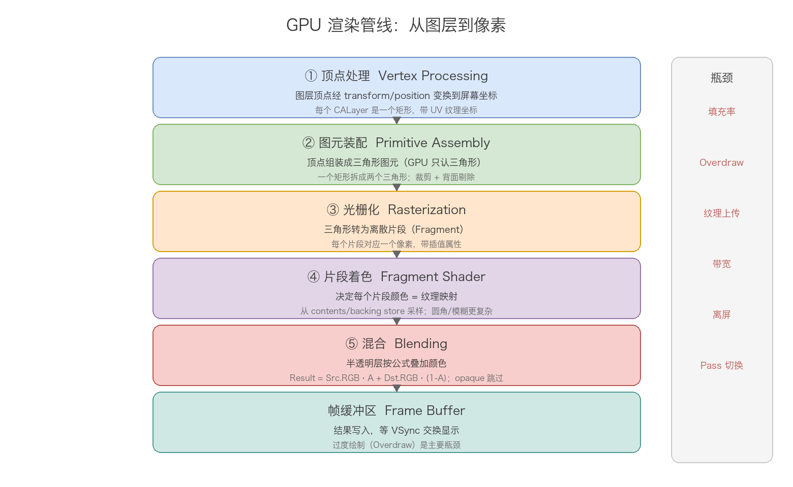
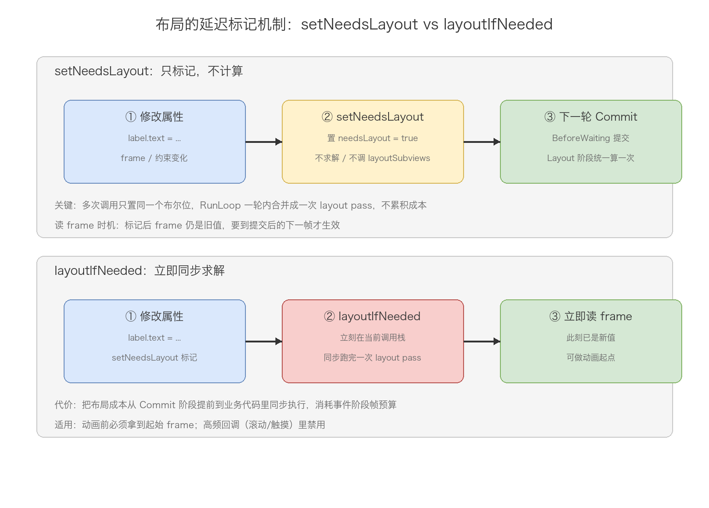
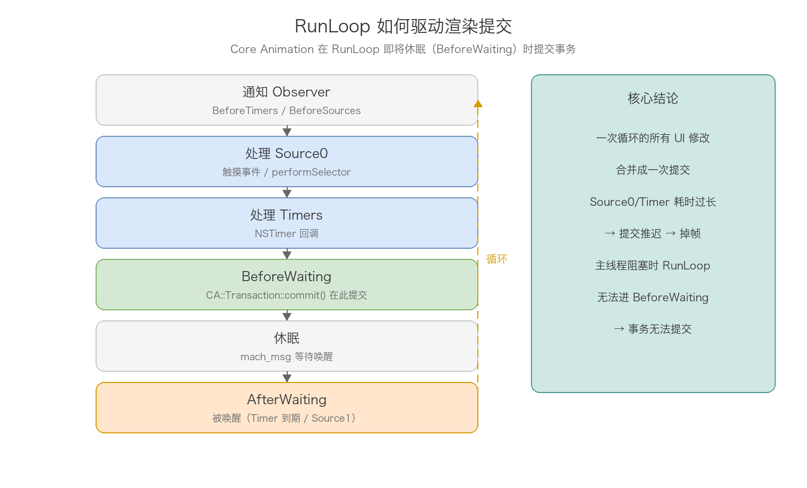
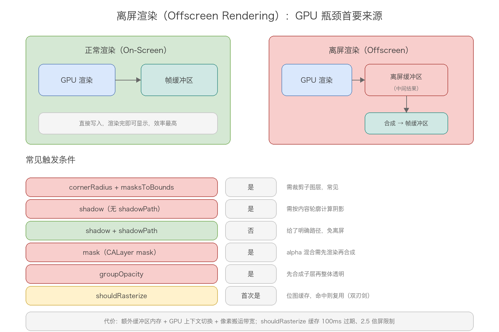
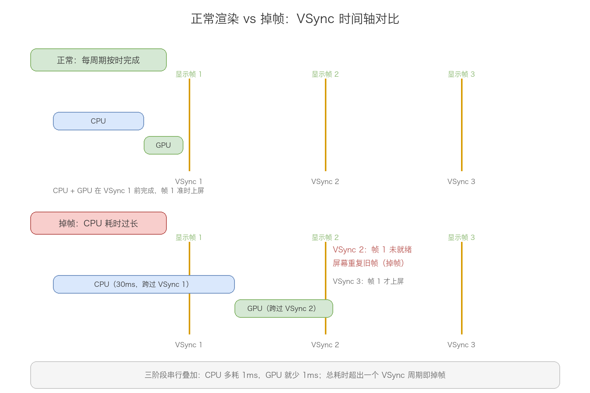

# 18. UI 渲染机制原理分析

> 屏幕上的每一帧画面，都要走完一条固定流水线：App 进程处理事件并提交图层树 → Render Server 独立进程翻译成 GPU 指令 → GPU 光栅化混合写入帧缓冲区 → VSync 信号到来时显示。这条链横跨两个进程、三个执行阶段、两个 VSync 周期，任何一环超时都会掉帧。这篇沿「VSync 驱动 → 图层树 → 渲染管线 → 布局标记 → RunLoop 调度 → 离屏渲染 → 掉帧本质」这条线，把 iOS UI 渲染机制从底层讲透。理解它的钥匙只有一把：CPU 准备内容，GPU 合成像素，两者以 VSync 为节拍器接力工作，谁掉链子谁背锅。

## 目录

- [一、从图层到像素：渲染全链路总览](#一从图层到像素渲染全链路总览)
- [二、屏幕显示基础：VSync 与缓冲机制](#二屏幕显示基础vsync-与缓冲机制)
- [三、Core Animation 与三棵图层树](#三core-animation-与三棵图层树)
- [四、一帧渲染的完整管线](#四一帧渲染的完整管线)
- [五、布局的延迟标记机制：setNeedsLayout 与 layoutIfNeeded](#五布局的延迟标记机制setneedslayout-与-layoutifneeded)
- [六、RunLoop 如何驱动渲染提交](#六runloop-如何驱动渲染提交)
- [七、离屏渲染：GPU 瓶颈的首要来源](#七离屏渲染gpu-瓶颈的首要来源)
- [八、掉帧的本质与瓶颈分类](#八掉帧的本质与瓶颈分类)
- [九、常见陷阱](#九常见陷阱)
- [附：高频速记](#附高频速记)

---

## 一、从图层到像素：渲染全链路总览

先把整条渲染链路的分层画出来，后面每一章拆其中一段。



从上到下五层，各层职责一句话：

UIKit / SwiftUI 是面向开发者的高层 API，提供 UIView、UILabel 这些控件。UIView 本质上是 CALayer 的 delegate——负责事件响应和提供绘制内容，自己不参与渲染。这个定位呼应第 11 篇的三重身份：UIView 管画、管布局、管响应，真正的像素生产在它下面几层。

Core Animation 是渲染架构的核心枢纽。名字虽然带 Animation，但它的核心职责是合成（Compositing）而非动画：管理 CALayer 图层树、协调隐式/显式动画、在合适的时机通过 CATransaction 把图层树快照提交给 Render Server。第三、四章展开。

Core Graphics（Quartz 2D）是 CPU 侧的 2D 绘图引擎。当图层需要自定义绘制内容时（drawRect / draw(_:)），Core Graphics 在 CPU 上生成位图（backing store），这块位图随后作为纹理上传给 GPU。第四章的 Display 阶段就是它在干活。

Metal 是 GPU 编程接口（OpenGL ES 从 iOS 12 起标记弃用）。Render Server 内部用 Metal 把图层合成指令翻译成 GPU 可执行的渲染命令；开发者也可以直接用 Metal 做自定义渲染，但绝大多数 UI 场景到不了这一层。

GPU Hardware 执行顶点处理、光栅化、像素着色、混合，最终把结果写进帧缓冲区。

一条记忆线索：UIKit 造图层、Core Animation 管提交、Core Graphics 画位图、Metal 发指令、GPU 出像素。每一层只跟相邻层打交道，职责边界清晰。

## 二、屏幕显示基础：VSync 与缓冲机制

渲染为什么有「时间预算」的说法？根源在屏幕的物理显示机制上。

### 1. VSync 信号



VSync（Vertical Synchronization，垂直同步）是显示器发出的节拍信号，协调 GPU 渲染和屏幕显示的时机。60Hz 屏幕每 16.67ms 发一次 VSync，信号到来时屏幕从帧缓冲区读取一帧数据显示。这一帧的渲染工作没按时完成，屏幕只能重复显示上一帧——这就是掉帧的物理根源。

16.67ms 不是渲染预算的全部。一帧从 CPU 开始准备到最终显示，中间隔着 CPU 提交、Render Server 处理、GPU 渲染三段串行工作，任何一段超时都会挤占整个链条。

### 2. 双缓冲与三缓冲

如果没有缓冲机制，GPU 一边写帧缓冲区、屏幕一边读，会读到「半成品」——上半部分是新帧、下半部分是旧帧，这就是画面撕裂（Tearing）。iOS 用多缓冲解决：

双缓冲是默认机制：GPU 渲染到后缓冲区（Back Buffer），VSync 到来时交换前后缓冲区，显示器永远从前缓冲区读完整帧。交换发生在 VSync 时刻，屏幕不会读到写了一半的数据。

三缓冲在高负载时自动启用：当渲染无法在一个 VSync 周期内完成时，GPU 可以在第三个缓冲区继续渲染，不必等交换完成空出来。代价是多一帧的显示延迟和更多内存占用。系统在两者间动态切换，开发者无需干预。

多缓冲解决的是「撕裂」，解决不了「没画完」。缓冲区再多，VSync 到来时新帧没准备好，屏幕照样重复旧帧——掉帧的锅不在缓冲，在上游渲染超时。

### 3. ProMotion 自适应刷新率

iPhone 13 Pro 起支持 10Hz–120Hz 自适应刷新率，帧时间预算不再固定 16.67ms：

| 刷新率 | 帧时间 | 掉帧阈值 |
| --- | --- | --- |
| 120Hz | 8.33ms | 大于 16ms 视为掉帧 |
| 60Hz | 16.67ms | 大于 33ms 视为掉帧 |
| 30Hz | 33.33ms | 大于 66ms 视为掉帧 |

高刷屏上渲染预算直接砍半，这就是 ProMotion 设备更容易暴露性能问题的原因。开发侧的适配点是 CADisplayLink 的帧率偏好：

```objc
// CADisplayLink 适配 ProMotion（iOS 15+）
CADisplayLink *link = [CADisplayLink displayLinkWithTarget:self selector:@selector(tick:)];
if (@available(iOS 15.0, *)) {
    link.preferredFrameRateRange = CAFrameRateRangeMake(60, 120, 120);
}
[link addToRunLoop:[NSRunLoop mainRunLoop] forMode:NSRunLoopCommonModes];

// 查询设备最大刷新率
CGFloat maxRate = UIScreen.mainScreen.maximumFramesPerSecond;
```

## 三、Core Animation 与三棵图层树

渲染管线的数据在 Core Animation 维护的三棵并行图层树之间流转。这三棵树是理解整条管线的地基，先把它讲透。



Model Tree（模型树）在 App 进程内，是开发者直接操作的那棵树。`layer.position = ...` 这类修改立即写入 Model Tree，但不会立刻触发渲染——改的只是「目标值」，渲染要等 Commit Transaction 打包提交（第四章）。

Presentation Tree（呈现树）也在 App 进程内，反映当前屏幕上实际显示的属性值。非动画场景下，Commit Transaction 完成后它与 Model Tree 同步为相同值；动画场景下，Model Tree 在动画开始时就已跳到终点值，而 Presentation Tree 在 `layer.presentation()` 被调用时根据本地持有的动画描述信息（起点、终点、timing function、duration）实时计算插值——注意这些数据不是 Render Server 回传的，是 App 进程本地算的。动画过程中做命中测试必须用 `layer.presentation()` 而非 layer 本身，因为 Model Tree 早已是终点值。

Render Tree（渲染树）在 Render Server 进程内，是 Model Tree 的序列化副本，GPU 实际渲染依据的数据源。每次 Commit Transaction 时，变更的属性通过 Mach Port（IPC）同步过来。Render Server 在 Render Tree 上独立计算动画插值——与 App 进程内 Presentation Tree 的计算使用相同的公式和时间基准，两者各自独立但结果一致。

三棵树分离的设计意义在于并行：App 准备下一帧的同时，Render Server 正在渲染当前帧，两个进程互不等待。这也是 Core Animation 动画不受主线程卡顿影响的根因——动画插值从计算到渲染指令生成再到 GPU 提交，整条链路都由 Render Server 独立驱动，根本不走 App 主线程。

## 四、一帧渲染的完整管线

有了三棵树的概念，一帧的完整旅程可以铺开了。它横跨两个 VSync 周期、三个执行阶段：



App 进程在第一个周期内完成事件处理与事务提交；Render Server 在第二个周期初解码并生成渲染指令；GPU 在第二周期内渲染，VSync N+2 到来时帧 N 上屏。注意这个至少两周期的延迟——即使 CPU 工作在 16ms 内完成，用户看到画面更新也有一帧延迟，这是流水线本身的代价。

### 1. 阶段一：App 进程（CPU 侧，主线程）

#### Handle Events

RunLoop 唤醒后先处理待分发的事件：触摸事件（Source0）、手势识别器回调、Timer 回调、performSelector:afterDelay: 等。这些回调里的代码通常修改 UI 属性（`layer.position = ...`），修改立即写入 Model Tree 并把图层标记为 dirty，Presentation Tree 和 Render Tree 此时尚未感知变化。

#### Commit Transaction

RunLoop 即将休眠（BeforeWaiting 时刻）时，Core Animation 触发 CA::Transaction::commit()，把本次 RunLoop 周期内积累的所有 UI 变更打包提交。一个 RunLoop 循环的所有修改合并成一次提交，这个设计在第六章展开。Commit Transaction 内部依次经过四个子阶段：



第一步 Layout：递归遍历 Model Tree 中标记为 dirty 的图层，从 window 根开始自上而下调用 layoutSubviews。Auto Layout 引擎在这一步求解约束方程组，算出每个视图的 frame，结果写回 Model Tree 的几何属性。两个性能陷阱：约束求解复杂度与约束数量近似呈指数关系，视图层级超过一定规模后 Layout 耗时急剧上升；在 layoutSubviews 里修改约束会触发新一轮 layout pass，形成递归循环。

```objc
view setNeedsLayout      // 标记 dirty，延迟到 Commit Transaction 执行
[view layoutIfNeeded]    // 立即强制求解布局（慎用，触发额外 layout pass）
```

setNeedsLayout 与 layoutIfNeeded 这对开关控制着 Layout 阶段「何时兑现」——一个延迟到提交时统一算，一个当场立即算。这套「延迟标记」机制的完整原理在第五章展开。

第二步 Display：遍历需要重绘的图层，调用 drawRect:（底层是 CALayer.display() → CALayerDelegate 的 drawInContext:），Core Graphics 在 CPU 上生成位图写入 backing store，这块位图随后被设置为图层的 contents。

```objc
// 重写 drawRect: 的代价
- (void)drawRect:(CGRect)rect {
    CGContextRef ctx = UIGraphicsGetCurrentContext();
    // 所有绘制都发生在 CPU 上，写入 backing store
    CGContextSetFillColorWithColor(ctx, [UIColor redColor].CGColor);
    CGContextFillRect(ctx, rect);
}
```

关键细节是：大多数视图根本不需要自定义绘制。UILabel、UIImageView 的内容由系统直接设置到 CALayer 的 contents（一张 CGImage），不走 drawRect:，也就不产生 backing store。一旦重写 drawRect:，系统必须为该图层分配一块与图层等大的内存（宽 × 高 × 每像素 4 字节）——一个全屏 Retina 视图的 backing store 约 390×844×3×4 ≈ 3.95MB。这就是「能不重写 drawRect: 就别重写」的量化依据。超大内容（地图、PDF）用 CATiledLayer 分块绘制，避免一次性分配巨大 backing store。

第三步 Prepare：处理图片解码和格式转换。UIImage 初始化时并不解码像素数据（延迟解码），真正的解码发生在图片首次被渲染的 Prepare 阶段。一张未提前解码的大图，会在这里把主线程卡住几十甚至上百毫秒：

```objc
// 问题代码：解码延迟到渲染时（Prepare 阶段），阻塞主线程
imageView.image = [UIImage imageNamed:@"large_photo"];

// 优化：后台线程强制解码（画进位图上下文再取出来）
dispatch_async(dispatch_get_global_queue(QOS_CLASS_USER_INITIATED, 0), ^{
    UIImage *img = [UIImage imageNamed:@"large_photo"];
    CGImageRef cg = img.CGImage;
    CGContextRef ctx = CGBitmapContextCreate(NULL, CGImageGetWidth(cg), CGImageGetHeight(cg),
        8, 0, CGColorSpaceCreateDeviceRGB(), kCGImageAlphaPremultipliedFirst);
    CGContextDrawImage(ctx, CGRectMake(0, 0, CGImageGetWidth(cg), CGImageGetHeight(cg)), cg);
    CGImageRef decoded = CGBitmapContextCreateImage(ctx);
    dispatch_async(dispatch_get_main_queue(), ^{
        imageView.image = [UIImage imageWithCGImage:decoded];  // Prepare 阶段零开销
    });
});
```

SDWebImage、Kingfisher 的「解码」选项做的就是这件事。此外，图片像素格式若不是 GPU 直接支持的（非标准色彩空间），也要在此阶段转换。

第四步 Commit：这是 Model Tree → Render Tree 的同步点。把 dirty 属性序列化，通过 Mach Port 发给 Render Server，Render Server 用这些数据更新自己持有的 Render Tree。序列化内容包括几何属性（bounds、position、transform）、内容（contents / backing store）、视觉属性（opacity、cornerRadius、shadow）和子图层结构。只有 dirty 属性会传输，未变更的属性不重复发送。图层数量超过几百个时，仅序列化本身就可能消耗数毫秒——Instruments 的 Core Animation Commits 可以直接测这个阶段的耗时。

隐式动画的开关也挂在事务上：

```objc
[CATransaction begin];
[CATransaction setDisableActions:YES];  // 禁用隐式动画
layer.position = newPosition;
[CATransaction commit];
```

### 2. 阶段二：Render Server（独立进程）

Render Server（backboardd）是系统级守护进程，独立于 App 进程运行。它拿到图层树快照后做三件事：

第一件，图层树解析与动画插值。把 Commit 来的变更合并进 Render Tree；对进行中的动画，按当前时间和动画曲线直接在 Render Tree 上算出每一帧的插值。这一步完全独立于 App 主线程——主线程就算卡死，动画照样流畅，因为整个插值到渲染的链路都在 Render Server 里。

第二件，渲染指令生成（Draw Calls）。遍历 Render Tree，把图层合成操作翻译成 Metal 渲染指令。这一步处理图层排序（按 zPosition 和子图层顺序，painter's algorithm 从后往前画）、可见性剔除（完全被遮挡的图层不生成指令）、离屏渲染判定（需要离屏的图层安排额外的渲染 Pass，见第七章）。

第三件，提交 GPU。把生成的渲染指令打包成 Command Buffer，提交给 GPU 的命令队列。

### 3. 阶段三：GPU 渲染管线

GPU 拿到指令后按图形管线依次执行：



顶点处理：每个 CALayer 在 GPU 里是一个由顶点定义的矩形，顶点带位置和 UV 纹理坐标。顶点着色器把顶点从模型坐标系经 transform、position、anchorPoint 变换到屏幕坐标系。普通 2D UI 里这步开销很小。

图元装配：把顶点组装成图元。GPU 原生只处理三角形，一个矩形的 CALayer 被拆成两个三角形。这个阶段还做裁剪（超出屏幕的部分裁掉）和背面剔除（2D UI 通常不涉及）。

```text
一个 CALayer 的矩形 → 两个三角形图元：

V0 ────── V1        V0 ────── V1
│ ╲        │        │╲        │
│   ╲      │   →    │  ╲      │
│     ╲    │        │    ╲    │
│       ╲  │        │ 三角形2 ╲│
V3 ────── V2        V3 ────── V2
     三角形1
```

光栅化：把三角形转换成离散的片段（Fragment），每个片段对应屏幕上一个像素位置，携带插值出来的纹理坐标和颜色。一个覆盖 100×100 像素的三角形约生成 5000 个片段。

片段着色：决定每个片段的最终颜色。普通图层就是按纹理坐标从纹理（contents / backing store）采样颜色，即纹理映射；圆角裁剪、高斯模糊要复杂得多。

混合：多个半透明图层重叠时按公式叠加：

```text
Result = Source.RGB × Source.A + Dest.RGB × (1 − Source.A)
```

不透明图层（opaque = true）可以跳过混合直接覆写目标像素——这就是把视图标为不透明能优化性能的原因，也是「避免多层半透明视图叠加」这条优化建议的理论根源。

GPU 瓶颈通常出在三处：像素填充率（屏幕上每个像素被多个半透明图层覆盖时逐一着色混合，即过度绘制 Overdraw）、纹理上传带宽（新图片首次使用时从 CPU 内存上传 GPU 显存）、离屏 Pass 切换（每次离屏渲染都意味着切换渲染目标，涉及管线状态保存恢复）。

## 五、布局的延迟标记机制：setNeedsLayout 与 layoutIfNeeded

第四章 Commit Transaction 的 Layout 子阶段留了一个尾巴：布局计算不是改完约束立即发生的，它由一套「延迟标记」机制统一调度。setNeedsLayout 和 layoutIfNeeded 是这套机制暴露给开发者的两个开关，一个「登记过期、批量兑现」，一个「跳过等待、当场兑现」。理解了这一章，Auto Layout 的性能问题就都有了机制层面的解释。



### 1. 核心：一个 dirty 标记位

UIView 内部维护一个布局标记位（落到 CALayer 层就是 needsLayout 标志），setNeedsLayout 做的全部事情就是把它置为真。它本身不计算任何东西——不求解约束、不调用 layoutSubviews、不碰 frame，只是登记「这个视图的布局过期了，下次有机会要重算」。

这个登记有三条性质，决定了它的正确用法：

幂等：标记位是布尔量，一轮 RunLoop 里重复置真不产生累积成本，改一百次约束调一百次 setNeedsLayout 和调一次没有区别。

批量：真正的布局计算推迟到下一轮 RunLoop 的 Commit Transaction 进入 Layout 子阶段时统一执行，Core Animation 从 window 根开始递归遍历，对所有标记过期的分支调 layoutSubviews。一轮循环内所有标记合并成一次 layout pass，与提交事务的合并设计同源。

不改变读取结果：标记之后、兑现之前，frame 读到的还是旧值。「改了约束马上读 frame 读到旧值」不是 bug，是这套机制的固有行为。

### 2. layoutIfNeeded：跳过等待，当场兑现

layoutIfNeeded 的语义是立即把挂起的布局标记兑现：从接收者开始，向下同步求解它这棵子树的约束，把新 frame 写回 Model Tree。它和默认路径调用的是同一套布局引擎，差别只有「何时算」——默认路径等 BeforeWaiting，它在当前调用栈里当场算完。

两个细节值得抠：

它布局的是「以调用者为根的子树」，不是整个窗口。在某个容器 view 上调用只影响它下面的分支；要让整个界面兑现就用 self.view.layoutIfNeeded。

兑现的前提是视图已经在窗口层级里。Auto Layout 求解依赖视图树的完整性，view 还没加到 window 上时，layoutIfNeeded 也算不出真实结果——这就是 viewDidLoad 布局时机问题的根源，下一小节展开。

### 3. viewDidLoad 里读 frame 为什么是旧值

```objc
- (void)viewDidLoad {
    [super viewDidLoad];
    // 约束已挂好，但 frame 还没求解
    NSLog(@"%@", NSStringFromCGRect(self.label.frame));  // 旧值甚至零值
}
```

三个原因叠加：viewDidLoad 时视图刚被创建，还没有进入 window 层级；约束求解要等第一次布局 pass；布局 pass 由 rootViewController 赋值触发，发生在 view 挂到 window 之后的下一轮 RunLoop。所以 viewDidLoad 里读 frame 拿旧值是这套机制的正常输出，不是 bug。

拿到真实尺寸的正确时机按优先级排：viewDidLayoutSubviews，每次布局 pass 结束后回调，最安全；需要提前拿，就在视图进入 window 层级后调 layoutIfNeeded 强制兑现。

### 4. layoutIfNeeded 的正当用途与高频误用

正当用途只有一类：必须在当前这一刻让布局生效。两个经典场景，一是约束修改想在动画里平滑过渡——在动画 block 内兑现，布局变化被动画捕获；二是动画起点需要读取最新 frame——先兑现再读：

```objc
// 场景一：约束修改的动画过渡（最经典用法）
self.bottomConstraint.constant = 200;    // 改的是目标值，布局默认下轮才跑

[UIView animateWithDuration:0.3 animations:^{
    [self.view layoutIfNeeded];          // 在动画 block 内强制兑现，变化以动画呈现
}];

// 场景二：动画起点，先强制兑现再读 frame
[self.containerView setNeedsLayout];
[self.containerView layoutIfNeeded];     // 此刻 frame 已按新约束求解
CGRect startFrame = self.containerView.frame;  // 安全读取
```

高频误用是把 layoutIfNeeded 当通用刷新手段，在事件回调里到处同步求解。它的代价是把布局成本从提交阶段搬到事件阶段：本该在 Commit Transaction 里与 Display、Prepare、Commit 串行执行的布局计算，被提前到业务代码里同步执行，事件回调变长，RunLoop 迟迟进不了 BeforeWaiting，提交被推迟，帧预算被挤占。滚动、触摸这类高频回调里尤其致命——cell 复用路径上每次 layoutIfNeeded 都是一次同步布局求解。

判断规则一句话：只想让布局在下一帧生效，用 setNeedsLayout；必须立刻读到新 frame（动画起点、布局依赖计算）才用 layoutIfNeeded，且只在低频路径上用。

### 5. 对照组：setNeedsDisplay 与 displayIfNeeded

布局之外还有一条平行的重绘通道，API 形状完全对称：CALayer 的 setNeedsDisplay 对应布局的 setNeedsLayout，displayIfNeeded 对应 layoutIfNeeded。它标记的是图层内容需要重画（Display 子阶段调 drawRect:），同样只打标记不立即画。

两条通道相互独立：改 frame / 约束走 layout 通道，改内容走 display 通道，两者在 Commit Transaction 里按 Layout → Display 的顺序先后兑现。日常改 UILabel 的 text 不需要手动调 setNeedsDisplay——text 的 setter 内部已经把标记打好，内容变化自动进重绘流程。

## 六、RunLoop 如何驱动渲染提交

Core Animation 的渲染提交不是随时发生的，它严格挂靠在主线程 RunLoop 的调度点上。这个关系是理解卡顿产生机制的最后一环。



主线程 RunLoop 一次循环的渲染相关路径：通知 Observer（BeforeTimers / BeforeSources）→ 处理 Source0（触摸事件、performSelector）→ 处理 Timers → 通知 Observer（BeforeWaiting，Core Animation 在此提交事务）→ 休眠等待唤醒（mach_msg）→ 通知 Observer（AfterWaiting）→ 处理唤醒源 → 回到循环开头。

核心机制一句话：CA::Transaction::commit() 挂在 BeforeWaiting 这个 Observer 上，RunLoop 每轮即将休眠时提交一次渲染事务。三个直接推论：

推论一，一次 RunLoop 循环里所有的 UI 修改合并成一次提交。循环内改一百次 frame 和改一次 frame，提交成本相同——频繁改属性本身不贵，贵的是迫使布局重算。

推论二，事件处理阶段耗时过长，渲染提交就被推迟。Source0、Timer 回调里跑了大计算，RunLoop 迟迟进不了 BeforeWaiting，本该这一帧显示的内容就晚了——这就是「主线程卡了 UI 就卡」的机制解释。

推论三，主线程被完全阻塞时，事务无法提交，Render Server 拿不到新数据，屏幕定格在旧帧。子线程改 UI 之所以不推荐，根因之一就是绕开了这套主线程 RunLoop 的提交节拍（线程安全是另一根因）。

CADisplayLink 是这套机制的一个窗口：它基于 VSync 触发回调，主线程阻塞时回调会被推迟或跳过——这正是它能当帧率监测器的原因，也是它的局限（只能发现卡了，说不出为什么卡）。RunLoop 机制本身的完整拆解在第 04 篇，这里不重复。

## 七、离屏渲染：GPU 瓶颈的首要来源

正常渲染直接把结果写进帧缓冲区，一遍完成。离屏渲染则要多绕一个弯：先渲染到一块独立的离屏缓冲区，再合成到帧缓冲区。



绕这个弯的代价有四笔：离屏缓冲区的创建销毁（内存开销）、GPU 上下文切换（渲染目标从帧缓冲切到离屏缓冲再切回来）、额外的合成搬运（像素数据从离屏缓冲搬到帧缓冲）、打断 GPU 渲染流水线。单次开销不大，列表滚动时每帧都触发就是灾难。

### 1. 为什么会触发：合成的时序问题

离屏渲染的本质是：GPU 无法一遍画完，必须先把中间结果存起来，等内容齐了再合成。逐个拆解触发场景：

cornerRadius + masksToBounds 是最经典的触发组合。GPU 逐像素按画家算法从后往前画，设置了圆角裁剪后，它必须知道所有子图层的最终合成结果，才能判断哪些像素在圆角外要裁掉——「边画边扔」做不到，只能先画到离屏缓冲区再统一裁剪。补充一个常被误传的细节：单独设 cornerRadius（不配合 masksToBounds）不触发离屏渲染，因为它只对背景色生效、无需裁剪子内容。

shadow 不给 shadowPath 时触发。阴影根据图层内容轮廓生成，GPU 必须先画完整个图层内容才知道阴影形状。给出 shadowPath 就是明确告诉系统「阴影就这个形状」，免掉轮廓计算，不触发：

```objc
// 触发离屏渲染：系统不知道阴影形状
view.layer.shadowOpacity = 0.5;

// 不触发：明确给出阴影路径
view.layer.shadowPath = [UIBezierPath bezierPathWithRect:view.bounds].CGPath;
```

mask 触发。遮罩需要内容层和遮罩层做像素级运算（遮罩的 alpha 决定内容的可见性），必须先分别渲染再合成，天然是「两步走」。

groupOpacity（组透明度）触发。父视图设 alpha 且有子视图时，如果直接逐层渲染，父子重叠区域会叠加透明度（0.5 × 0.5 = 0.25），显示错误。正确做法是先把整棵子树画成一张图，再整体应用 alpha——中间结果必须存离屏。

UIBlurEffect（毛玻璃）触发。模糊需要读取背后的内容，必须等背景先渲染完，再对它做高斯模糊，是典型的「读已渲染内容」场景。

### 2. 触发条件速查

| 属性组合 | 是否离屏 | 原因 |
| --- | --- | --- |
| cornerRadius + masksToBounds | 是 | 需裁剪子图层内容 |
| cornerRadius 单独 | 否 | 只裁背景色，不涉子内容 |
| shadow 无 shadowPath | 是 | 需按内容轮廓计算阴影 |
| shadow + shadowPath | 否 | 路径明确，免轮廓计算 |
| mask | 是 | 先渲染再合成，两步走 |
| groupOpacity | 是 | 先合成子层再整体透明 |
| shouldRasterize | 首次是 | 主动光栅化缓存 |

### 3. shouldRasterize：双刃剑

shouldRasterize 是主动触发的离屏渲染：把图层及其子图层渲染成一张位图缓存，后续帧直接复用缓存，不再重复光栅化。内容不变的复杂视图（多层级嵌套的固定 UI）用它可以一劳永逸。

但缓存有两个硬限制：时间上约 100ms 过期（超过就重新光栅化），空间上不超过屏幕尺寸的 2.5 倍。内容频繁变化的图层用它是负优化——每帧都过期、每帧都重新离屏渲染，比不用还慢。判断标准就一条：这棵子树的内容在一帧之后还会不会原样出现。

## 八、掉帧的本质与瓶颈分类

前面所有机制收拢成一句话：卡顿的本质就是掉帧。VSync 到来时新帧没准备好，屏幕重复上一帧，用户感知到不流畅。



正常情况下每个 VSync 周期内 CPU 提交、GPU 渲染按时完成，屏幕帧 1、帧 2、帧 3 依次显示。掉帧时 CPU 耗时过长（比如 Layout 求解了 30ms），VSync 2 到来时帧 1 还没走完流水线，屏幕继续显示旧帧，帧 1 顺延到 VSync 3 才上屏——用户看到一次明显的停顿。

三个阶段的时间预算是串行叠加的：CPU 多消耗 1ms，留给 GPU 的时间就少 1ms。60Hz 设备上 CPU + Render Server + GPU 的总耗时必须在一个 VSync 周期内完成，任何环节超时都是掉帧。

瓶颈按资源分三类，各有对应的检测工具：

| 瓶颈类型 | 特征 | 常见原因 | 检测工具 |
| --- | --- | --- | --- |
| CPU 瓶颈 | CPU 占用高，GPU 空闲 | 复杂计算、主线程阻塞、大量布局计算 | Time Profiler |
| GPU 瓶颈 | GPU 占用高，CPU 等待 | 离屏渲染、大量图层混合、过大纹理 | Core Animation / GPU Report |
| 带宽瓶颈 | 数据传输慢 | 超大纹理、频繁纹理上传 | Metal System Trace |

优化思路对号入座：CPU 瓶颈减计算（简化层级、异步解码、缓存布局结果）；GPU 瓶颈减像素（避免离屏、减少透明叠加、opaque = YES）；带宽瓶颈减传输（压缩图片尺寸到实际显示大小）。

顺带分清两个概念：卡顿（Jank）是掉帧，大于 16.67ms 的体验问题；ANR/无响应是更严重的失联，iOS 没有Android 式的 ANR 弹窗，但有 watchdog——启动超时约 20 秒、后台任务超时会被系统直接终止进程。卡顿优化解决体验，watchdog 规避解决存活。

## 九、常见陷阱

按踩坑频率列五个。

第一个，在 drawRect: 里做重活。drawRect: 在主线程 Commit Transaction 的 Display 阶段执行，里面的每次 Core Graphics 调用都在挤占帧预算；而且只要重写了它，系统就分配 backing store（全屏约 3.95MB）。解法：能用 CALayer 属性表达的（背景、边框、圆角）绝不动 drawRect:；静态内容考虑预生成 UIImage 直接设 contents。

第二个，大图不预解码直接上屏。UIImage(named:) 不解码像素，首次渲染时在 Prepare 阶段同步解码，一张大图卡主线程几十毫秒。列表场景连续滚过多张大图就是连续掉帧。解法：后台线程强制解码（画进位图上下文再取出），或用图片库的解码选项；同时把图片缩到实际显示尺寸，别拿 3000px 原图渲染 100pt 的位置。

第三个，圆角 + 裁剪用在列表 cell 上。cornerRadius + masksToBounds 触发离屏渲染，滚动列表每帧都触发，GPU 被上下文切换拖垮。解法按优先级：内容简单的用 CALayer 属性画圆角背景（不触发离屏）；头像这类固定内容的给图层加 shadowPath 思路的替代——预切圆角图或用 CAShapeLayer 做遮罩；确实要裁剪子内容的接受离屏，或用 shouldRasterize 缓存（内容不变时）。

第四个，阴影不设 shadowPath。系统为算阴影轮廓要离屏渲染整层内容。一行 `layer.shadowPath = UIBezierPath...` 就能免掉，是性能收益最大的单行优化之一。

第五个，用 layer 而非 layer.presentation() 做动画中的命中测试。动画进行时 Model Tree 已经是终点值，按 layer 的属性算命中位置会拿到动画结束后的坐标。解法：hitTest 前取 presentationLayer 的位置判断。

## 附：高频速记

```text
渲染五层：UIKit（造图层）→ Core Animation（管提交/合成）
        → Core Graphics（CPU 画位图）→ Metal（发 GPU 指令）→ GPU（出像素）
UIView 是 CALayer 的 delegate，自身不参与渲染

VSync：60Hz 每 16.67ms 一次节拍；信号到来从帧缓冲取帧，没准备好 = 掉帧
双缓冲默认（前后交换防撕裂）；三缓冲高负载自动启用（多一帧延迟换流畅）
ProMotion 120Hz 帧预算 8.33ms；CADisplayLink 用 preferredFrameRateRange 适配

三棵树：
├── Model Tree    开发者操作的目标值，改完不触发渲染
├── Presentation  屏幕实时值；动画时按本地动画描述插值（非 Render Server 回传）
│                 命中测试用 layer.presentation()
└── Render Tree   Render Server 进程内的序列化副本，GPU 实际依据
分离 = 并行：App 备下一帧的同时 Render Server 渲染当前帧
动画不受主线程卡顿影响：插值→指令→GPU 整条链在 Render Server 独立驱动

一帧管线（两 VSync 周期、三阶段）：
├── App 主线程：Handle Events（UI 修改写入 Model Tree 标 dirty）
│   → Commit Transaction 四子阶段：
│     ① Layout：layoutSubviews + Auto Layout 求解（约束数近似指数复杂度）
│        setNeedsLayout 标记过期不立即算，RunLoop 内多次合并一次 layout pass
│        layoutIfNeeded 强制同步求解；仅动画起点等「必须立刻读到 frame」才用
│        setNeedsDisplay/displayIfNeeded 是重绘通道，与布局通道相互独立
│     ② Display：drawRect: → Core Graphics 位图 → backing store
│     ③ Prepare：图片延迟解码 + 格式转换（大图不预解码卡这里）
│     ④ Commit：Model → Render Tree 同步点，dirty 属性 Mach Port IPC
├── Render Server：解析合并 → 动画插值 → Draw Calls（排序/剔除/离屏判定）
│   → Command Buffer 提交 GPU
└── GPU：顶点处理 → 图元装配（矩形拆两三角形）→ 光栅化 → 片段着色
    → 混合（Result = Src·A + Dst·(1−A)，opaque 跳过）→ 帧缓冲

RunLoop 驱动：CA::Transaction::commit() 挂 BeforeWaiting
一次循环所有 UI 修改合并一次提交；事件阶段耗时长 → 提交推迟 → 掉帧

离屏渲染：GPU 无法一遍画完，中间结果存独立缓冲再合成
├── 代价：缓冲区内存 + 上下文切换 + 搬运带宽 + 打断流水线
├── 触发：cornerRadius+masksToBounds / shadow 无 path / mask
│        / groupOpacity / UIBlurEffect / shouldRasterize（主动）
├── 不触发：cornerRadius 单独、shadow + shadowPath
└── shouldRasterize 双刃剑：缓存 100ms 过期、2.5 倍屏上限；
    内容不变才赚，频繁变化每帧重新光栅化反而更慢

掉帧本质：三阶段串行叠加，任何环节超时挤占整条链
瓶颈三类：CPU（Time Profiler）/ GPU（离屏、混合）/ 带宽（纹理上传）
优化对号：减计算（异步解码、简化层级）、减像素（免离屏、opaque），
减传输（图片缩到显示尺寸）
```
