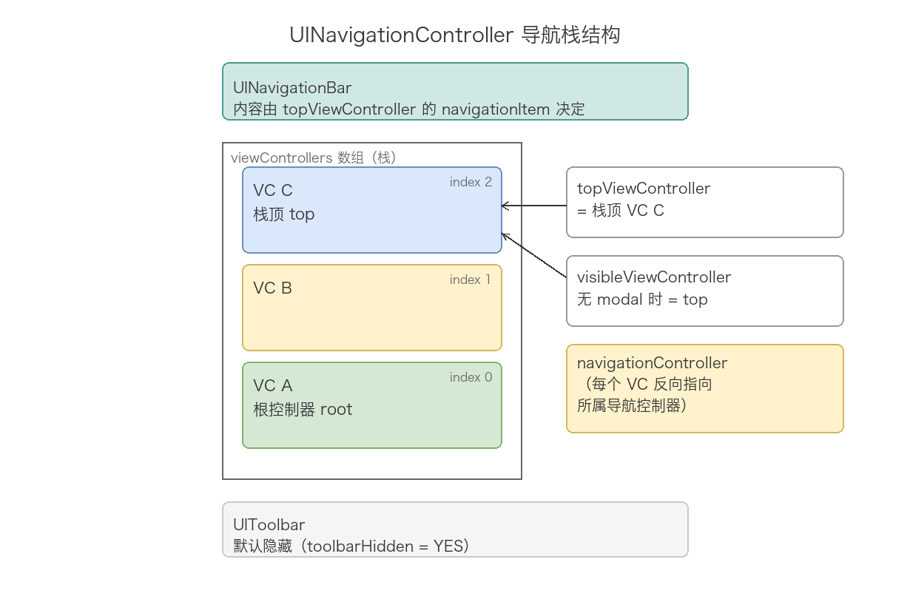
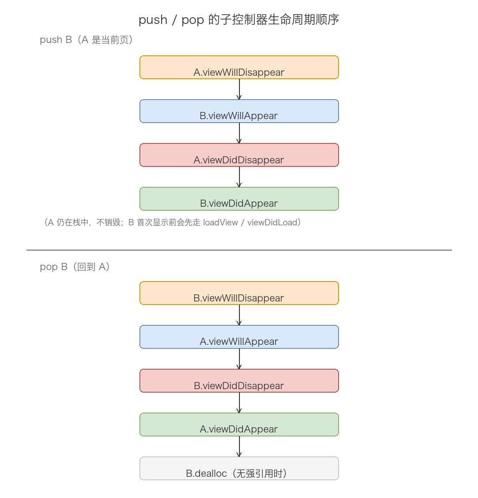
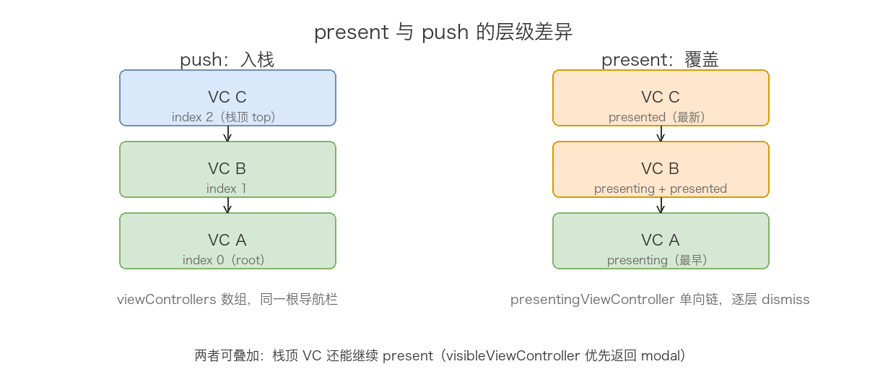
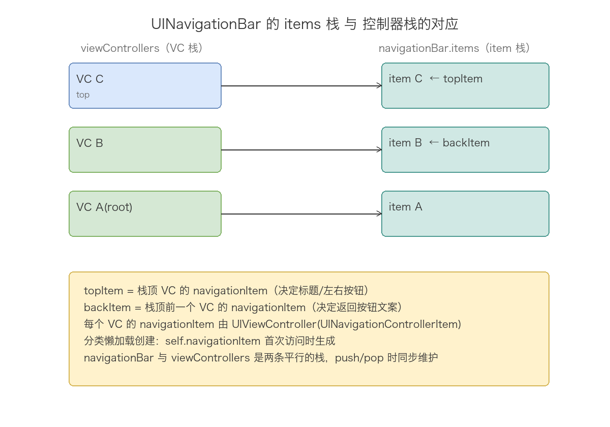
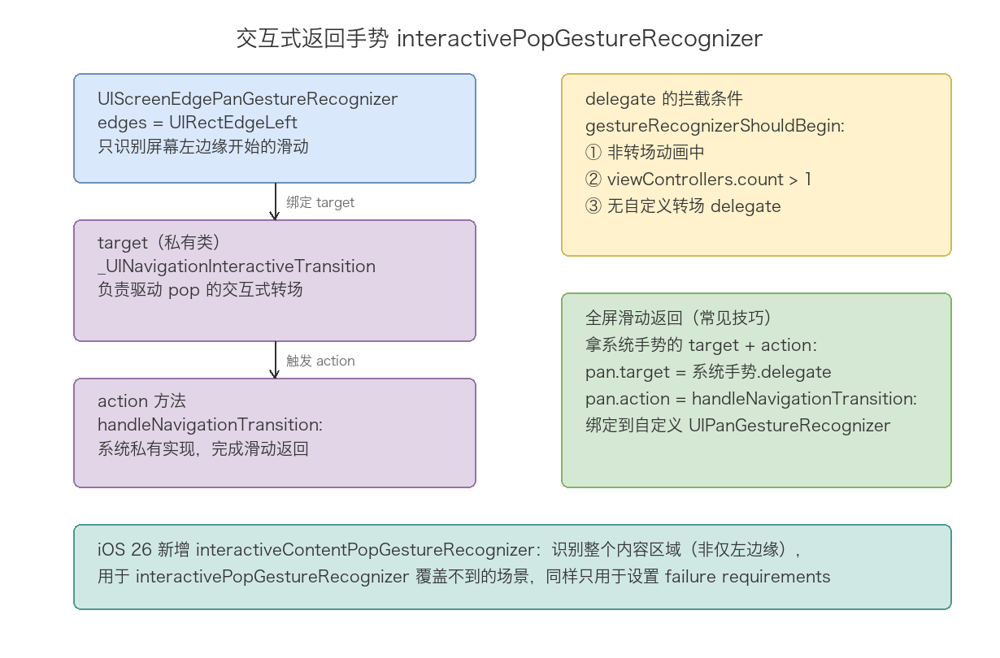

# 10. UINavigationController 机制分析

> UINavigationController 的全部机制都围绕一个「栈」展开：`viewControllers` 数组就是栈，栈顶决定屏幕上显示什么，navigationBar 只是栈的投影。push 就是入栈，pop 就是出栈，返回按钮、标题、侧滑返回手势，全是栈变化的衍生物。理解这篇的钥匙只有一把：把 UINavigationController 当成一个「自带导航栏的栈管理器」，先看懂栈怎么动，再看导航栏怎么跟着动，最后看手势和转场这两个围绕栈运转的外围机制。

## 目录

- [一、UINavigationController 是什么](#一uinavigationcontroller-是什么)
- [二、导航栈：viewControllers 与两个 top](#二导航栈viewcontrollers-与两个-top)
- [三、push：入栈的完整流程](#三push入栈的完整流程)
- [四、pop：出栈的完整流程](#四pop出栈的完整流程)
- [五、present：与 push 的区别及层级管理](#五present与-push-的区别及层级管理)
- [六、UINavigationBar 与 UINavigationItem](#六uinavigationbar-与-uinavigationitem)
- [七、返回按钮的确定规则](#七返回按钮的确定规则)
- [八、交互式返回手势的底层实现](#八交互式返回手势的底层实现)
- [九、转场动画与自定义转场](#九转场动画与自定义转场)
- [十、导航栏与工具栏的显示控制](#十导航栏与工具栏的显示控制)
- [十一、常见 API 速查](#十一常见-api-速查)
- [十二、常见陷阱](#十二常见陷阱)
- [附：高频速记](#附高频速记)

---

## 一、UINavigationController 是什么

先把它的身份定清楚。UINavigationController 继承自 UIViewController，是上一章说的「容器控制器」的一种，头文件注释一句话交代了它的职责：

```objc
// UIKit/UINavigationController.h
/*
 UINavigationController manages a stack of view controllers and a navigation bar.
 It performs horizontal view transitions for pushed and popped views
 while keeping the navigation bar in sync.

 Most clients will not need to subclass UINavigationController.
*/
@interface UINavigationController : UIViewController
```

拆开就是三个信息：管理一个 view controller 栈、管理一根 navigation bar、在 push/pop 时做水平滑动转场并保持导航栏同步。还有一句容易被忽略——「绝大多数情况下你不需要子类化 UINavigationController」，它的所有定制点都通过 delegate、navigationItem、appearance 这些外部配置完成，自定义子类反而是下策。

一个导航控制器内部有三大件：内容栈（`viewControllers`）、顶部导航栏（`navigationBar`）、底部工具栏（`toolbar`，默认隐藏）。它的 view 层级可以理解成：

```
UINavigationController.view
├── UINavigationBar                  ← 顶部，内容由栈顶 VC 的 navigationItem 决定
├── (子控制器的 view)                 ← 中间，同时只显示栈顶那个
└── UIToolbar                        ← 底部，默认隐藏（toolbarHidden = YES）
```

初始化有四个设计初始化器，最常用的是 `initWithRootViewController:`，头文件注释说得很直白——「Initializer that also pushes the root view controller without animation」，它其实就是先建一个空栈，然后无动画地把 root push 进去：

```objc
- (instancetype)initWithNavigationBarClass:(nullable Class)navigationBarClass
                              toolbarClass:(nullable Class)toolbarClass; // iOS 5+，指定自定义 bar 类
- (instancetype)initWithRootViewController:(UIViewController *)rootViewController; // push root，无动画
- (instancetype)initWithNibName:(nullable NSString *)nibNameOrNil
                         bundle:(nullable NSBundle *)nibBundleOrNil; // 空栈初始化
- (nullable instancetype)initWithCoder:(NSCoder *)aDecoder;            // storyboard 解档
```

`initWithRootViewController:` 存在的意义在于：导航栈必须有根控制器。空栈状态的导航控制器没有内容可显示，所以正常业务路径都是 init 时就给 root。这也决定了后面 pop 的一个硬规则——root 永远不能被 pop 掉，栈里至少要剩一个。

## 二、导航栈：viewControllers 与两个 top

导航栈的数据结构本身不复杂，`viewControllers` 是一个 copy 修饰的数组，index 0 是根控制器，最后一个元素是栈顶。真正需要分辨清楚的是「两个 top」：`topViewController` 和 `visibleViewController`。



```objc
@property(nullable, nonatomic, readonly, strong) UIViewController *topViewController;
// The top view controller on the stack.

@property(nullable, nonatomic, readonly, strong) UIViewController *visibleViewController;
// Return modal view controller if it exists. Otherwise the top view controller.
```

头文件注释把区别说得非常清楚：`topViewController` 只看栈，返回栈顶；`visibleViewController` 先看有没有 modal 出来的控制器，有就返回 modal，没有才返回栈顶。换句话说，「栈顶」不一定「可见」——如果栈顶控制器又 present 了一个页面，屏幕上可见的是那个 modal 出来的控制器。

举个具体的例子：栈是 A → B → C，此时 C 又 present 了 D，那么：

- `topViewController` 返回 C（C 是栈顶）
- `visibleViewController` 返回 D（D 是当前屏幕上可见的）

另外还有一组方向相反的属性，挂在 UIViewController 的分类上，任何一个控制器都能反查自己「在谁家」：

```objc
// UIKit/UINavigationController.h 里的 UIViewController (UINavigationControllerItem) 分类
@interface UIViewController (UINavigationControllerItem)
@property(nonatomic, readonly, strong) UINavigationItem *navigationItem; // 懒加载创建
@property(nonatomic) BOOL hidesBottomBarWhenPushed;
@property(nullable, nonatomic, readonly, strong) UINavigationController *navigationController;
@end
```

`navigationController` 的查找逻辑可以理解成：沿 `parentViewController` 链向上找，返回链上最近的一个 UINavigationController，找到 nil 为止。所以一个被 push 进栈的控制器返回它所属的导航控制器；一个只是被 present 出来的控制器，这个属性就是 nil——它不在任何导航栈里。

`navigationItem` 注释里也点明了是懒加载：「Created on-demand so that a view controller may customize its navigation appearance」。每个控制器天生自带一个 navigationItem，第一次访问时才真正创建。这就是为什么你可以在 `viewDidLoad` 里直接配 `self.navigationItem.rightBarButtonItem`，不用关心它从哪来——它是控制器的固有属性，不是导航栏塞给你的。

## 三、push：入栈的完整流程

push 是导航栈最重要的操作，把一个新控制器压入栈顶并展示。先看 API 语义：

```objc
- (void)pushViewController:(UIViewController *)viewController animated:(BOOL)animated;
// Uses a horizontal slide transition.
// Has no effect if the view controller is already in the stack.
```

注意注释里的后半句：如果目标控制器已经在栈里，push 无效果。UIKit 不会帮你把它挪到栈顶，也不会报错，就是静默忽略。这个设计防止了重复 push 造成的栈混乱，但也意味着「把栈里已有的控制器再 push 一次」这种需求必须先 pop 再 push 自己实现。

### 1. 内部流程还原

UIKit 闭源，但根据官方文档描述和运行时行为，`pushViewController:animated:` 的内部逻辑可以还原成这样：

```objc
// 依据官方文档语义还原的伪代码
- (void)pushViewController:(UIViewController *)vc animated:(BOOL)animated {
    if ([self.viewControllers containsObject:vc]) {
        return;                                     // ① 已在栈中，静默忽略
    }
    [self.delegate navigationController:self
                  willShowViewController:vc animated:animated];  // ② 先问 delegate

    NSMutableArray *newStack = [self.viewControllers mutableCopy];
    [newStack addObject:vc];
    self.viewControllers = newStack;                // ③ 入栈，vc.navigationController 生效

    [vc loadViewIfNeeded];                          // ④ 提前加载新控制器的 view，转场需要它

    // ⑤ 执行转场：新旧 view 同时参与水平滑动动画
    //    转场过程中回调两个控制器的生命周期方法（见下）
    [self _transitionFromViewController:self.topViewController toViewController:vc];

    // ⑥ 同步导航栏：把 vc.navigationItem push 到 navigationBar 的 item 栈
    [self.navigationBar pushNavigationItem:vc.navigationItem animated:animated];
}
```

这个流程里有几个值得注意的点。第一步的查重解释了上面说的「已入栈则无效果」。第四步很关键——转场动画需要新旧两个 view 同时在屏，所以 push 会立刻触发新控制器的 `loadView` / `viewDidLoad`，这就是为什么 push 之后马上访问 `bViewController.view` 不会触发延迟加载，view 早就加载好了。第六步说明导航栏的更新是 push 流程的一部分，导航控制器替你维护，所以头文件才会警告：不要自己去 push/pop 一个被导航控制器管理的 navigationBar 的 items。

### 2. 生命周期顺序

push 时新旧控制器的生命周期交错执行，实测顺序是：



```text
A 是当前页，push B：
B.viewDidLoad           ← B 首次入栈，view 被提前加载（对应伪代码第④步）
A.viewWillDisappear
B.viewWillAppear
A.viewDidDisappear
B.viewDidAppear
```

注意两个细节。第一，B 的 `viewDidLoad` 排在整条链的最前面——转场动画开始前新 view 必须就位，所以入栈动作会立刻触发加载，不需要等动画。第二，A 的 `viewWillDisappear` 先于 B 的 `viewWillAppear`，这和 present 的顺序正好相反（第五章完整对比）：push 是「旧的先让位，新的再上台」，present 是「新的先报名，旧的再让位」。这个对比是高频考点，两种容器行为的差异根源在于转场结构不同：push 的转场由导航控制器统一编排，present 的转场由 UIKit 的 presentation 机制独立完成。

动画结束的判定可以用 `transitionCoordinator` 拿到转场协调器，也可以用控制器的两个标志位判断这次 appear/disappear 是不是 push/pop 引起的：

```objc
// 判断本次生命周期变化是否由 push/pop 引起
BOOL movingIn  = self.isMovingToParentViewController;   // viewWillAppear 中为 YES = 被 push
BOOL movingOut = self.isMovingFromParentViewController; // viewWillDisappear 中为 YES = 被 pop
```

这个标志位只对「直接隶属于导航栈的控制器」生效，中间层级的子控制器不会置位。它最常见的用途是在 `viewWillAppear` 里区分「push 进来的首次显示」和「从子页面 pop 回来的再次显示」。

## 四、pop：出栈的完整流程

pop 家族有四个方法，覆盖了出栈的全部场景：

```objc
- (nullable UIViewController *)popViewControllerAnimated:(BOOL)animated;
// 弹出栈顶，返回被弹出的控制器
- (nullable NSArray<__kindof UIViewController *> *)popToViewController:(UIViewController *)viewController
                                                              animated:(BOOL)animated;
// 一路弹到指定控制器（必须在当前栈中），返回被弹出的控制器数组
- (nullable NSArray<__kindof UIViewController *> *)popToRootViewControllerAnimated:(BOOL)animated;
// 一路弹到只剩根控制器，返回被弹出的控制器数组
- (void)setViewControllers:(NSArray<UIViewController *> *)viewControllers animated:(BOOL)animated;
// 整栈替换，见本章末尾
```

三个 pop 方法各有一条硬规则。`popViewControllerAnimated:` 在栈里只剩根控制器时无效，返回 nil——因为 root 永远不能出栈，这与「导航栈至少有一个控制器」呼应。`popToViewController:` 要求目标控制器必须在当前栈里，传一个不在栈里的对象是未定义行为，通常直接崩溃；它的典型用途是「跳回流程中的某一页」，比如编辑流里一键取消回列表页。`popToRootViewControllerAnimated:` 则等价于 pop 到 `viewControllers[0]`。

pop 的生命周期顺序同样实测可得：

```text
栈是 A → B，pop B 回到 A：
B.viewWillDisappear
A.viewWillAppear
B.viewDidDisappear
A.viewDidAppear
B.dealloc              ← 栈移除了强引用，外部也没人持有 B 时才触发
```

与 push 对称：旧的先让位、新的再上台，只是「新旧」的角色反过来了。最后一行的 `dealloc` 是 pop 区别于 push 的关键——出栈的控制器失去导航栈的强引用，如果没有别的对象持有它（定时器、block、通知等），就会销毁。反过来说，pop 之后发现 `dealloc` 不走，基本都是外部有强引用没断开，这是内存排查的固定切入点。

还有一个批量 pop 的动画细节，官方文档明确说了：用 `popToViewController:` 一次弹掉多层时，动画只作用于栈顶那一个控制器，中间的控制器是直接丢弃、不参与动画的。所以连续的「跳页」操作视觉上和单层 pop 一样流畅。

另外，导航栏左上角的返回按钮，点击时内部走的就是 `popViewControllerAnimated:`；从屏幕左边缘右滑触发的是交互式 pop（第八章），它的底层同样落在这个家族的方法上。push 和 pop 的入口虽然多，最终都收敛到对 `viewControllers` 数组的维护上。

## 五、present：与 push 的区别及层级管理

push/pop 是导航栈内部的增删，但页面切换还有另一条完全独立的通路——present。它不属于导航控制器，而是所有 UIViewController 的通用能力：`presentViewController:animated:completion:` 把一个控制器的 view 覆盖到当前层级之上，全程不碰 `viewControllers`。理解 present 的关键同样是抓住数据结构：push 维护的是栈，present 维护的是一条 presenting/presented 单向链，两者的差异衍生出导航栏、返回方式、生命周期顺序等所有行为区别。



### 1. 两套 API，两种结构

```objc
// present / dismiss 定义在 UIViewController 上，任何控制器都能调
- (void)presentViewController:(UIViewController *)viewControllerToPresent
                     animated:(BOOL)flag
                  completion:(void (nullable ^)(void))completion;

- (void)dismissViewControllerAnimated:(BOOL)flag
                           completion:(void (nullable ^)(void))completion;
```

对比 push 家族：`pushViewController:` 只有 UINavigationController 才有，操作对象是数组；`presentViewController:` 挂在 UIViewController 上，操作对象是「谁覆盖谁」的关系。区分两者最直接的方式是看一个属性——被 push 进栈的控制器 `navigationController` 非 nil，被 present 出来的控制器它是 nil，因为后者根本不在导航栈里（呼应第二章）。

### 2. 层级管理：presenting 与 presented

present 的层级关系由两个属性描述：

```objc
// UIKit/UIViewController.h
@property(nullable, nonatomic, readonly) UIViewController *presentingViewController;
// 谁把我 present 出来（覆盖链的上游）
@property(nullable, nonatomic, readonly) UIViewController *presentedViewController;
// 我 present 出来的控制器（下游）
```

A present B 之后：B 的 `presentingViewController` 指向 A，A 的 `presentedViewController` 指向 B。这条链可以继续延长——B 再 present C，链变成 A → B → C。此时注意一个行为细节：A 的 `presentedViewController` 返回的不是 B，而是链条最末端的 C。这是「单向链」和「栈」的第一个行为差异：栈可以 `popToViewController:` 一路弹到任意层，链没有随机访问能力，回退只能逐层 dismiss。

dismiss 的归属规则也和链结构绑定。官方文档明确说明：`dismissViewControllerAnimated:completion:` 的调用者如果不是覆盖链的源头，UIKit 会把消息转发给 `presentingViewController`，由源头执行真正的 dismiss。所以在 B 上调 dismiss 关掉的是 B 自己，在 C 上调也一样有效，不需要先「回到 A 再 dismiss」。

但连续 present 多层时的 dismiss 有个关键行为：在链的任何一个节点上 dismiss，会把「它自己和它下游的所有控制器」一起关掉。A present B、B present C 之后在 A 上调 dismiss，B 和 C 一起消失。这和 pop 一次只弹栈顶一个完全不同——栈的回退是逐层的，链的 dismiss 是截断式的。

### 3. 生命周期顺序：与 push 镜像对比

present 的生命周期顺序和 push 正好相反（第三章埋的伏笔在这里展开）。实测对比：

```text
A push B：                    A present B（fullScreen）：
A.viewWillDisappear           B.viewWillAppear
B.viewWillAppear              A.viewWillDisappear
A.viewDidDisappear            B.viewDidAppear
B.viewDidAppear               A.viewDidDisappear
```

规律一句话：push 是「旧的先动，新的后动」，present 是「新的先动，旧的后动」，will 阶段和 did 阶段都遵守。根源在转场结构：push 的转场是导航栈内的水平滑动，旧页面主动让位，新页面随后上台；present 的转场是 presentation 机制把新 view 盖上来，新页面先报名，旧页面再让位。

dismiss 的顺序同样镜像：A.viewWillAppear → B.viewWillDisappear → A.viewDidAppear → B.viewDidDisappear。

还有一条 iOS 13 以来的重要变化：`modalPresentationStyle` 默认值从 fullScreen 变成了 pageSheet，present 出来的页面不再盖满屏幕，背景控制器可见（缩小变暗）。系统据此不再调用背景控制器的 `viewWillDisappear:` / `viewDidDisappear:`——因为它并没有真正「消失」，只是被盖住了一部分。这个变化让大量依赖 disappear 时机做「暂停播放、停止定位」的代码失效，是迁移 iOS 13 之后的经典坑。反过来它也带来一个判断依据：如果你的「离开页面」逻辑在 iOS 13 之后不触发了，先检查页面是被 push 走的还是被 pageSheet 盖住的。

### 4. 该用 push 还是 present

选择本质是「页面之间的关系」问题：

| 维度 | push | present |
| --- | --- | --- |
| 归属 | UINavigationController 专属 | UIViewController 通用 |
| 数据结构 | viewControllers 栈 | presenting/presented 单向链 |
| 回退方式 | pop / 侧滑，可 popTo 任意层 | dismiss / 下滑，只能逐层或截断 |
| 导航栏 | 自动携带，返回按钮自动生成 | 默认没有，需要自己包导航控制器 |
| 生命周期 | 旧的先让位 | 新的先报名 |
| 典型语义 | 同一流程内层级深入（列表 → 详情 → 编辑） | 流程外的模态任务（登录、设置、分享面板） |

一条经验法则：页面之间有「上下级关系、用户想一层层返回」的用 push；页面是「模态任务、完成或取消后一次性离开」的用 present。典型的错误用法是把详情页 present 出来——没有返回按钮、没有侧滑手势，用户被「困」在一个只能主动关闭的页面里。

present 一个「需要导航栏的页面」时，标准做法是包一层导航控制器：

```objc
// present 一个导航控制器，内部页面可以继续 push
SettingsViewController *settings = [[SettingsViewController alloc] init];
UINavigationController *nav = [[UINavigationController alloc]
    initWithRootViewController:settings];
settings.navigationItem.rightBarButtonItem = [[UIBarButtonItem alloc]
    initWithTitle:@"完成" style:UIBarButtonItemStyleDone
    target:self action:@selector(dismissSettings)];
[self presentViewController:nav animated:YES completion:nil];
```

这里有个细节呼应第七章：present 出来的导航控制器里，栈里只有 root，`backItem` 为 nil，所以左上角没有返回按钮——通常在 `rightBarButtonItem` 配一个「完成/关闭」按钮承担退出职责。导航栏内容、返回按钮规则在 present 场景下照常生效，导航控制器并不关心自己是怎么被摆上台的。

### 5. 层级叠放时的两个 top

第二章讲的「visibleViewController 优先返回 modal」在层级叠放时最能体现价值。栈是 A → B → C，C present D、D present E，此时：

- `topViewController` 返回 C（只看栈）
- `visibleViewController` 返回 E（沿 presentedViewController 一路到链尾）

反过来，想从栈顶控制器拿到「最上面盖着的那个」，读它的 `presentedViewController`；想判断「我自己是不是被盖住了」，判断 `presentedViewController` 是否为 nil 就够了。这也是实现「弹窗存在时不刷新页面」这类逻辑的标准写法。

## 六、UINavigationBar 与 UINavigationItem

导航控制器有两棵平行的栈：控制器的 `viewControllers` 栈，和导航栏内部的 `items` 栈。push/pop 一个控制器时，导航控制器同步维护这两棵栈，让导航栏内容始终「投影」栈顶控制器。



UINavigationBar 本身继承 UIView，但它不是被动显示的控件，它内部也维护一个 item 栈：

```objc
// UIKit/UINavigationBar.h
@interface UINavigationBar : UIView <NSCoding, UIBarPositioning>
- (void)pushNavigationItem:(UINavigationItem *)item animated:(BOOL)animated;
- (nullable UINavigationItem *)popNavigationItemAnimated:(BOOL)animated;

@property(nullable, nonatomic, readonly, strong) UINavigationItem *topItem;  // item 栈顶
@property(nullable, nonatomic, readonly, strong) UINavigationItem *backItem; // item 栈顶的下一个

@property(nullable, nonatomic, copy) NSArray<UINavigationItem *> *items;
@end
```

头文件注释解释了显示规则：「Pushing a navigation item displays the item's title in the center of the navigation bar. The previous top navigation item (if it exists) is displayed as a "back" button on the left.」——item 栈顶决定中间标题，栈顶的前一个 item 被渲染成左上角的返回按钮。`topItem` 和 `backItem` 这两个属性把这条规则暴露了出来：`backItem` 就是「返回按钮文案的来源」。

每个控制器的 navigationItem 从哪来？就是第二章那个分类属性，懒加载创建。控制器入栈时，导航控制器把它的 navigationItem push 进导航栏的 item 栈；出栈时 pop 出来。两条栈的长度永远一致。

导航控制器自己就是这根导航栏的 delegate，实现了 `UINavigationBarDelegate` 的 `didPushItem:` / `didPopItem:` 回调来驱动自身状态更新。同时头文件也明确了操作边界：

```objc
@property(nonatomic, readonly) UINavigationBar *navigationBar;
// The navigation bar managed by the controller.
// Pushing, popping or setting navigation items on a managed navigation bar
// is not supported.
```

可以改导航栏的外观（背景色、字体、appearance），但不要对被导航控制器管理的导航栏直接 push/pop/setItems——那是导航控制器的职权，抢着做会导致两棵栈失步。

再看 UINavigationItem 能装什么。它是「一页导航栏内容的完整描述」，常用属性按位置分三块：

```objc
// UIKit/UINavigationItem.h 关键声明
@property (nonatomic, copy, nullable) NSString *title;          // 中间标题
@property (nonatomic, strong, nullable) UIView *titleView;      // 自定义标题视图，非 nil 时覆盖 title
@property (nonatomic, copy, nullable) NSString *prompt;         // 顶部说明文字，会撑高导航栏

@property (nonatomic, strong, nullable) UIBarButtonItem *leftBarButtonItem;   // 左侧按钮
@property (nonatomic, strong, nullable) UIBarButtonItem *rightBarButtonItem;  // 右侧按钮
@property (nonatomic, copy, nullable) NSArray<UIBarButtonItem *> *leftBarButtonItems;  // iOS 5+ 多按钮
@property (nonatomic, copy, nullable) NSArray<UIBarButtonItem *> *rightBarButtonItems;
@property (nonatomic, assign) BOOL leftItemsSupplementBackButton; // YES 时左侧按钮与返回按钮共存

@property (nonatomic, strong, nullable) UIBarButtonItem *backBarButtonItem; // 返回按钮（第七章细讲）
@property (nonatomic, assign) BOOL hidesBackButton;                         // 隐藏返回按钮

@property (nonatomic, assign) UINavigationItemLargeTitleDisplayMode largeTitleDisplayMode; // iOS 11+ 大标题
@property (nonatomic, strong, nullable) UISearchController *searchController;               // iOS 11+ 搜索栏
```

使用上有一条实践经验：单个按钮用 `leftBarButtonItem` / `rightBarButtonItem`，多个按钮用 `leftBarButtonItems` / `rightBarButtonItems`，两套属性不要混用。多按钮的排布规则是——左侧从外向内依序排（第一个在最左边缘），右侧从外向内依序排（第一个在最右边缘）。另外 `titleView` 一旦设置就完全接管标题区，`title` 被忽略；`prompt` 会把导航栏撑高一行显示提示文字，登录、隐私类页面偶尔用到。

## 七、返回按钮的确定规则

返回按钮是导航控制器最容易被问到的细节，因为它「显示的文案不是自己的」。规则一句话：返回按钮由 `backItem`（栈顶的前一个控制器）的 navigationItem 决定，不由当前栈顶决定。

具体优先级是三选一：

```text
backBarButtonItem  >  backButtonTitle  >  title
（前一个 VC 上配置）  （前一个 VC 上配置）  （前一个 VC 的标题）
```

官方文档对 `backBarButtonItem` 的描述是：「When this navigation item is immediately below the top item in the stack, the navigation controller derives the back button for the navigation bar from this navigation item. When this property is nil, the navigation item uses the value in its title property to create an appropriate back button.」翻译成操作语言：想让「从 A push 到 B」之后 B 页面的返回按钮显示什么，要配置的对象是 A（backItem），不是 B。

```objc
// 场景：A push B，希望 B 页面返回按钮显示「返回列表」
// 正确：配在 A 上
A.navigationItem.backBarButtonItem = [[UIBarButtonItem alloc]
    initWithTitle:@"返回列表" style:UIBarButtonItemStylePlain target:nil action:nil];

// 错误：配在 B 上，不生效
B.navigationItem.backBarButtonItem = ...;   // B 是栈顶，此时没有 backItem 意义上的「下一个」
```

控制返回按钮显示还有两个辅助开关。`backButtonDisplayMode`（iOS 14+）控制文案来源：`Default` 依次尝试上一个控制器的 title、通用文案（Back/返回）、无文案；`Generic` 只用通用文案；`Minimal` 只显示箭头不带文字——列表页层级很深、返回文案太长时设成 Minimal 很实用。`hidesBackButton` 则直接隐藏返回按钮（隐藏后侧滑手势默认还在，要一起禁用得处理手势，见第八章）。

系统返回按钮的 target/action 是系统私有的，点击后内部走 `popViewControllerAnimated:`。如果你通过 `leftBarButtonItem` 自定义了返回按钮，记得自己补上 pop 调用——设置左侧按钮后返回按钮默认不再显示（除非 `leftItemsSupplementBackButton = YES`），同时系统侧滑手势也会失效，这是下一章的重点。

## 八、交互式返回手势的底层实现

从屏幕左边缘右滑返回上一页，是 iOS 7 引入的行为，对应 `interactivePopGestureRecognizer`：

```objc
@property(nullable, nonatomic, readonly) UIGestureRecognizer *interactivePopGestureRecognizer;
// The interactive pop gesture recognizes on the leading screen edge
// and initiates an interactive pop.
// This property should only be used to set up failure requirements with it.
```

注意注释里的限定：「这个属性只应该用来设置手势依赖（failure requirements）」——Apple 只承诺暴露给你做手势共存，没承诺让你改它的 delegate 或 target。



### 1. 打印它的真身

在导航控制器的子类里打印这个手势，能看到它的内部结构：

```objc
NSLog(@"%@", self.interactivePopGestureRecognizer);
// 输出（截取关键信息）：
// <UIScreenEdgePanGestureRecognizer: 0x...>
//   edges = UIRectEdgeLeft
//   target = <_UINavigationInteractiveTransition 0x...>
//   action = handleNavigationTransition:
```

三个关键信息直接暴露：手势类型是 `UIScreenEdgePanGestureRecognizer`（所以只识别左边缘）；私有 target 是 `_UINavigationInteractiveTransition` 类的实例，它是导航控制器内部持有的「交互式转场驱动器」，负责把手指位移换算成转场进度；action 方法名是 `handleNavigationTransition:`。

它的 delegate 也是同一个 `_UNavigationInteractiveTransition` 对象，`gestureRecognizerShouldBegin:` 里做了条件拦截，还原出来大致是：

```objc
// 依据运行时行为还原的拦截逻辑
- (BOOL)gestureRecognizerShouldBegin:(UIGestureRecognizer *)gr {
    return !self.isAnimating                       // ① 转场动画进行中不允许
        && self.viewControllers.count > 1          // ② 栈里只有 root 时不允许
        && ![self _doesTheNavigationControllerDelegateHaveCustomTransitions]
        && ...;                                    // ③ 实现了自定义转场动画后默认关闭
}
```

第二条解释了「根控制器上侧滑无反应」；第三条是个大坑——一旦实现了 `UINavigationControllerDelegate` 的自定义转场动画方法，系统默认的侧滑返回就失效了，必须自己补交互式转场（第九章）。

### 2. 全屏滑动返回

既然知道 target 和 action，就能复用系统的转场驱动器，把手势范围从左边缘扩到全屏：

```objc
// 在导航控制器子类里实现全屏滑动返回
- (void)viewDidLoad {
    [super viewDidLoad];
    id target = self.interactivePopGestureRecognizer.delegate;      // 即 _UNavigationInteractiveTransition
    self.interactivePopGestureRecognizer.enabled = NO;              // 禁掉系统边缘手势
    UIPanGestureRecognizer *pan = [[UIPanGestureRecognizer alloc]
        initWithTarget:target action:@selector(handleNavigationTransition:)];
    pan.delegate = self;
    [self.view addGestureRecognizer:pan];
}

- (BOOL)gestureRecognizerShouldBegin:(UIGestureRecognizer *)gr {
    return self.viewControllers.count > 1;    // root 页禁用
}
```

这段代码是私有 API 的使用（`handleNavigationTransition:` 和 delegate 类型都是私有的），上架存在审核风险，生产环境更稳妥的方案是自己实现一套基于 `UIPercentDrivenInteractiveTransition` 的交互式转场。但作为原理验证，它最能说明侧滑返回的本质：一个边缘手势 + 一个把位移换算成 pop 进度的转场驱动器，没有魔法。

### 3. iOS 26 的新变化

iOS 26 的头文件新增了一个平行手势：

```objc
@property(nullable, nonatomic, readonly) UIGestureRecognizer *interactiveContentPopGestureRecognizer
    API_AVAILABLE(ios(26.0));
// The interactive content pop gesture recognizes on the entire content area
// of the navigation controller ... This property should only be used to
// set up failure requirements with it.
```

它把识别范围从「左边缘」扩到了「整个内容区域」，补上了过去全屏返回需要私有 API 才能实现的场景。注释同样限定只用于设置 failure requirements。老项目里那套「拿私有 target/action 实现全屏返回」的代码，在新系统上可以逐步退役了。

## 九、转场动画与自定义转场

push/pop 的默认转场是水平滑动，转场过程由导航控制器统一编排。想换动画，入口是 delegate 的这个方法：

```objc
typedef NS_ENUM(NSInteger, UINavigationControllerOperation) {
    UINavigationControllerOperationNone,
    UINavigationControllerOperationPush,
    UINavigationControllerOperationPop,
};

@protocol UINavigationControllerDelegate <NSObject>
@optional
// 栈变化前后必调，适合做页面联动统计
- (void)navigationController:(UINavigationController *)navigationController
      willShowViewController:(UIViewController *)viewController animated:(BOOL)animated;
- (void)navigationController:(UINavigationController *)navigationController
       didShowViewController:(UIViewController *)viewController animated:(BOOL)animated;

// 返回 nil 用系统默认动画，返回自定义对象则接管转场
- (nullable id <UIViewControllerAnimatedTransitioning>)navigationController:(UINavigationController *)navigationController
                               animationControllerForOperation:(UINavigationControllerOperation)operation
                                            fromViewController:(UIViewController *)fromVC
                                              toViewController:(UIViewController *)toVC;

// 在上面方法返回非 nil 的前提下，再返回一个交互式转场对象即可支持手势驱动
- (nullable id <UIViewControllerInteractiveTransitioning>)navigationController:(UINavigationController *)navigationController
          interactionControllerForAnimationController:(id <UIViewControllerAnimatedTransitioning>)animationController;
@end
```

`operation` 参数枚举值只有 Push / Pop / None 三种，配合 from/to 就能区分四种组合（push in、push out、pop out、pop in），分别返回不同的动画器。

一个自定义转场的最小实现长这样：

```objc
// 自定义转场器：push 时新页面从底部上滑
@interface SlideUpAnimator : NSObject <UIViewControllerAnimatedTransitioning>
@end

@implementation SlideUpAnimator
- (NSTimeInterval)transitionDuration:(id <UIViewControllerContextTransitioning>)ctx {
    return 0.35;
}

- (void)animateTransition:(id <UIViewControllerContextTransitioning>)ctx {
    UIView *container = [ctx containerView];
    UIViewController *toVC = [ctx viewControllerForKey:UITransitionContextToViewControllerKey];
    toVC.view.frame = [ctx finalFrameForViewController:toVC];
    toVC.view.frame = CGRectOffset(toVC.view.frame, 0, container.bounds.size.height);
    [container addSubview:toVC.view];

    [UIView animateWithDuration:[self transitionDuration:ctx]
                          delay:0
         usingSpringWithDamping:0.9
          initialSpringVelocity:0
                        options:0
                     animations:^{
        toVC.view.frame = [ctx finalFrameForViewController:toVC];
    } completion:^(BOOL finished) {
        [ctx completeTransition:!ctx.transitionWasCancelled];
    }];
}
@end

// 挂到 delegate 上
- (nullable id <UIViewControllerAnimatedTransitioning>)navigationController:(UINavigationController *)nav
                              animationControllerForOperation:(UINavigationControllerOperation)op
                                           fromViewController:(UIViewController *)from
                                             toViewController:(UIViewController *)to {
    return op == UINavigationControllerOperationPush
        ? [[SlideUpAnimator alloc] init]
        : nil;   // pop 返回 nil，走系统默认
}
```

三个必须记住的行为约定。第一，delegate 只要在 `animationControllerForOperation:` 返回过非 nil，系统侧滑手势就不再可用——`gestureRecognizerShouldBegin:` 的内部检查会认为你接管了转场。要恢复手势驱动，就得同时实现 `interactionControllerForAnimationController:`，通常配合 `UIPercentDrivenInteractiveTransition` 的子类，在手势回调里调 `updateInteractiveTransition:` / `finishInteractiveTransition` / `cancelInteractiveTransition`。第二，动画结束时必须调用 `completeTransition:`，转场上下文靠它回收旧 view、触发 didAppear 链，漏掉会让整个导航栈的状态卡死。第三，转场进行中不允许发起新的 push/pop，这是第十二章第一个陷阱的根源。

## 十、导航栏与工具栏的显示控制

导航栏的显隐是「每个控制器各自声明」的，不是导航控制器全局统一——因为导航栏内容跟着栈顶走，显隐状态也一样。

```objc
@property(nonatomic, getter=isNavigationBarHidden) BOOL navigationBarHidden;
- (void)setNavigationBarHidden:(BOOL)hidden animated:(BOOL)animated;
// If animated, it will transition vertically
// using UINavigationControllerHideShowBarDuration.
```

`animated = YES` 时导航栏做垂直滑出/滑入动画，时长由常量 `UINavigationControllerHideShowBarDuration`（0.35 秒）控制。实践中的标准写法是在每个控制器的 `viewWillAppear` 里声明自己的需求：

```objc
// 详情页要全屏沉浸
- (void)viewWillAppear:(BOOL)animated {
    [super viewWillAppear:animated];
    [self.navigationController setNavigationBarHidden:YES animated:animated];
}

- (void)viewDidDisappear:(BOOL)animated {
    [super viewDidDisappear:animated];
    // 不在 disappear 里恢复也可以，靠下一个页面的 viewWillAppear 声明
}
```

为什么放在 `viewWillAppear` 而不是 `viewDidLoad`？因为导航栏显隐是「随栈顶切换」的状态，push/pop 的转场过程中就要开始变化，`viewDidLoad` 只在首次加载走一次，从别的页面 pop 回来时不会再走，状态就会错乱。

iOS 8 之后导航控制器还提供了一组自动显隐开关，把「滚动时收起导航栏」这类行为做成了属性：

```objc
@property (nonatomic, assign) BOOL hidesBarsWhenKeyboardAppears; // 键盘弹出时隐藏
@property (nonatomic, assign) BOOL hidesBarsOnSwipe;             // 上滑隐藏 / 下滑显示
@property (nonatomic, readonly, strong) UIPanGestureRecognizer *barHideOnSwipeGestureRecognizer;
@property (nonatomic, assign) BOOL hidesBarsWhenVerticallyCompact; // 竖屏紧凑高度时隐藏
@property (nonatomic, assign) BOOL hidesBarsOnTap;                 // 点击内容区切换显隐
@property (nonatomic, readonly, assign) UITapGestureRecognizer *barHideOnTapGestureRecognizer;
```

这组属性是导航控制器层面的开关，作用于整个导航控制器，不能按页面独立设置。两个配套的 recognizer 属性同样注明「不要改 delegate、不要试图替换」。

工具栏的对应 API 是 `toolbarHidden` / `setToolbarHidden:animated:`，`toolbar` 属性声明为 `null_resettable`——首次访问时才创建，且默认隐藏。工具栏的内容同样按页管理：每个控制器通过 `toolbarItems` 属性（挂在 `UINavigationControllerContextualToolbarItems` 分类上）声明自己的按钮组，栈顶切换时工具栏内容跟着换。

另外有一个容易混淆的兄弟属性 `hidesBottomBarWhenPushed`，它不是隐藏工具栏，而是：这个控制器被 push 进「带 tab bar 的层级」时，把底部的 tab bar 一起滑出屏幕。它要设置在被 push 的控制器上，而且是 push 前设置才生效——典型写法是在创建下一级控制器时指定：

```objc
DetailViewController *detail = [[DetailViewController alloc] init];
detail.hidesBottomBarWhenPushed = YES;   // push 后 tab bar 滑出
[self.navigationController pushViewController:detail animated:YES];
```

## 十一、常见 API 速查

把散在各章的 API 集中列一遍，按使用频率排序。

栈操作：

| API | 行为要点 |
| --- | --- |
| `pushViewController:animated:` | 入栈；已在栈中则无效；立即触发新 VC 的 loadView |
| `popViewControllerAnimated:` | 出栈栈顶；只剩 root 时无效返回 nil |
| `popToViewController:animated:` | 弹到指定 VC（须在栈中）；动画只作用于栈顶 |
| `popToRootViewControllerAnimated:` | 弹到只剩 root；返回被弹出的数组 |
| `setViewControllers:animated:` | 整栈替换；动画方向按新栈顶是否在旧栈中判定 |
| `showViewController:sender:` | iOS 8+，被导航控制器包含时等价于 push |

栈状态查询：

| API | 行为要点 |
| --- | --- |
| `topViewController` | 只看栈，返回栈顶 |
| `visibleViewController` | 有 modal 返回 modal，否则返回栈顶 |
| `viewControllers` | 整个栈，index 0 为 root |
| `navigationController`（VC 分类） | 沿 parent 链向上找最近的导航控制器 |

导航栏控制：

| API | 行为要点 |
| --- | --- |
| `setNavigationBarHidden:animated:` | 垂直动画显隐，时长 0.35s |
| `navigationBar` | 只读，可改外观、不可操作 items |
| `setToolbarHidden:animated:` | 工具栏显隐，默认隐藏 |
| `hidesBarsOnSwipe` 等四开关 | iOS 8+ 自动显隐，导航控制器级生效 |

`setViewControllers:` 的动画判定值得单独展开，头文件注释只说了一句「simulate a push or pop depending on whether the new top view controller was previously in the stack」，展开成三种情况：

```text
设新数组为 @[A, B, C]，当前栈为 @[A, B, D, E]：
1. 新栈顶 C 不在旧栈中          → 执行 push 动画（C 从右侧滑入）
2. 新栈顶在旧栈中且已是栈顶     → 无动画（相当于什么都不做）
3. 新栈顶在旧栈中但不是栈顶     → 执行 pop 动画（一路弹回）
```

这个方法最常见的用途是状态恢复：App 重启时重建整条导航链，一次调用恢复到用户离开时的层级，比逐个 push 高效且无动画噪音。

## 十二、常见陷阱

按踩坑频率排序列五个。

第一个，转场中连续 push/pop。官方文档明确要求「If you push or pop an item using an animation, you must wait until the animation is complete before you attempt to push or pop another view controller」。连续快速 push 两次、或在 `viewWillAppear` 里立刻 push、或在 pop 动画中又 push，轻则动画错乱，重则导航栈状态损坏直接崩溃。解决思路是检查 `self.navigationController.transitionCoordinator` 是否为 nil（nil 说明当前没有进行中的转场），或者干脆在按钮点击时做节流。

第二个，自定义返回按钮后侧滑失效。设置了 `leftBarButtonItem`，返回按钮消失，系统的边缘右滑手势也跟着失效——因为 delegate 检查里「有自定义转场/自定义返回」的路径需要开发者自己接管。恢复办法有两种：设置 `leftItemsSupplementBackButton = YES` 保留系统返回按钮和手势，或者重载导航控制器子类的 `viewDidLoad`，把系统手势的 delegate 换成一个自己实现的、始终返回 YES 的代理对象（保留手势）。无论如何都别用 `interactivePopGestureRecognizer.enabled = NO` 一关了之，那是全局开关，会影响整个导航栈。

第三个，`viewDidLoad` 里改导航栏显隐。从其他页面 pop 回来时 `viewDidLoad` 不会执行，之前设置的 `setNavigationBarHidden:` 状态还在，页面就「回归不到正确状态」。导航栏显隐、返回按钮样式这类「随页面切换」的配置，一律放 `viewWillAppear`。

第四个，把 `topViewController` 当「当前正在显示的控制器」用。栈顶可能 present 了别的控制器，也可能转场进行中栈已经变了但动画没结束。要拿「屏幕上现在是谁」，用 `visibleViewController`；要在转场回调里拿「即将显示的是谁」，用 delegate 的 `willShowViewController:` 参数，别自己查栈。

第五个，backBarButtonItem 配错对象。返回按钮文案永远由 backItem 决定，在当前栈顶控制器上配 `backBarButtonItem` 不生效；在 A push B 的场景里想改 B 的返回按钮，改的是 A。同理，`title` 既影响自己页面的标题，也影响「下一个页面的返回按钮文案」——很多人发现返回按钮突然变成「首页」之类的字符串，根源就是上个页面顺手设了 title。

## 附：高频速记

```text
UINavigationController = 栈 + 导航栏 + 工具栏
├── viewControllers    栈本体，index 0 是 root，最后一个元素是栈顶
├── topViewController  栈顶；visibleViewController 有 modal 返回 modal
├── navigationBar      内容 = 栈顶 VC 的 navigationItem（内部平行维护 item 栈）
│   ├── topItem        决定标题 / 左右按钮
│   └── backItem       决定返回按钮（上一个 VC 的 backBarButtonItem > backButtonTitle > title）
└── toolbar            默认隐藏，内容 = 栈顶 VC 的 toolbarItems

push 内部五步：查重 → 通知 delegate → 入栈 → 提前加载新 view → 转场 + 同步导航栏
push 生命周期：B.viewDidLoad → A.willDisappear → B.willAppear → A.didDisappear → B.didAppear
pop  生命周期：B.willDisappear → A.willAppear → B.didDisappear → A.didAppear → B.dealloc
（push 旧的先让位；present 新的先报名——方向相反，高频考点）

present：不走导航栈，presenting/presented 单向链
├── dismiss 转发给链源头执行；中途 dismiss 截断式关掉自己和下游
├── 生命周期：B.willAppear → A.willDisappear → B.didAppear → A.didDisappear（与 push 镜像）
└── iOS 13+ 默认 pageSheet：背景 VC 不触发 will/didDisappear（迁移期经典坑）
选择：流程内层级深入用 push；流程外模态任务用 present；present 带导航栏需包一层 nav

侧滑返回三件套：UIScreenEdgePanGestureRecognizer（左边缘）
              + target _UINavigationInteractiveTransition
              + action handleNavigationTransition:
拦截条件：非动画中 && count > 1 && 无自定义转场 delegate
iOS 26 新增 interactiveContentPopGestureRecognizer 识别整个内容区

根控制器不可 pop；转场中不可 push/pop；
显隐/backButton 配置放 viewWillAppear（不放 viewDidLoad）；
实现自定义转场后系统侧滑失效，需补 interactionControllerForAnimationController。
```
