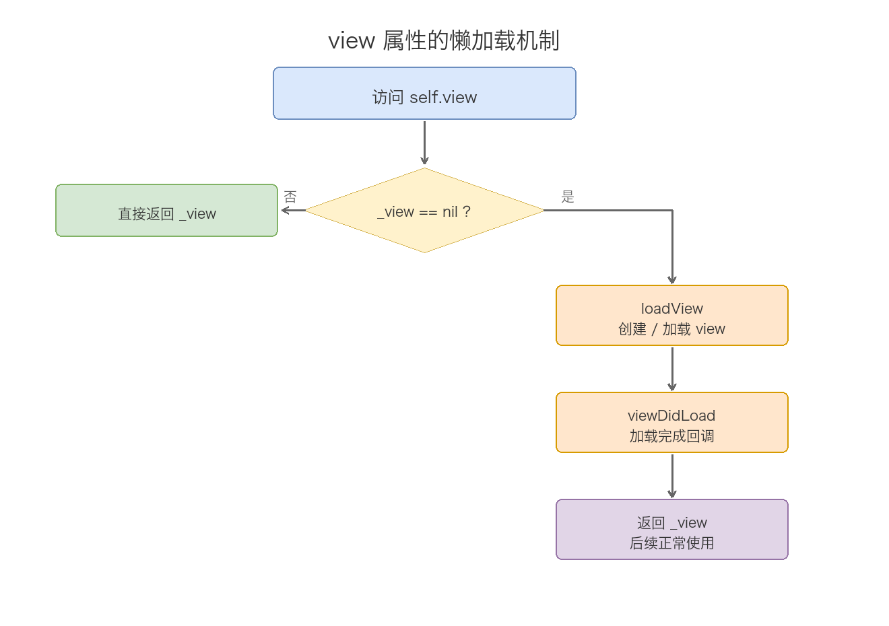
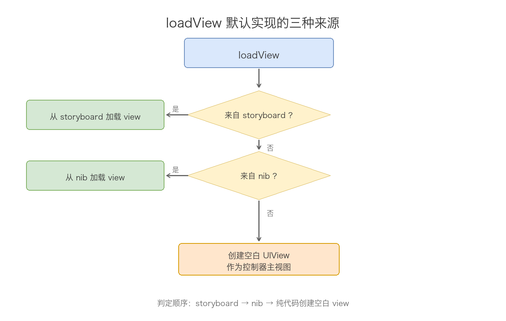
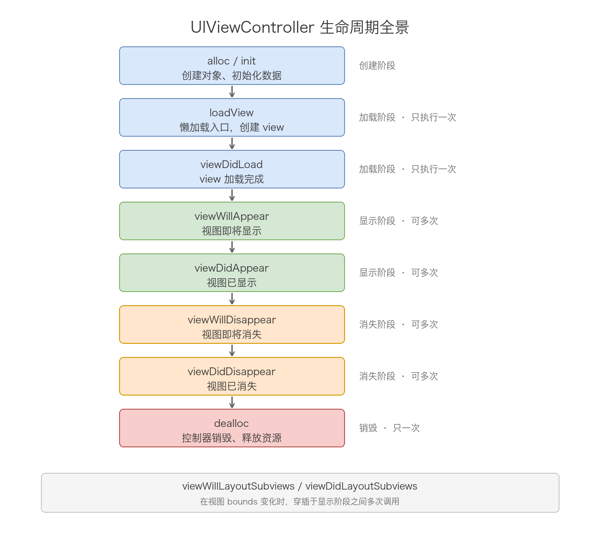
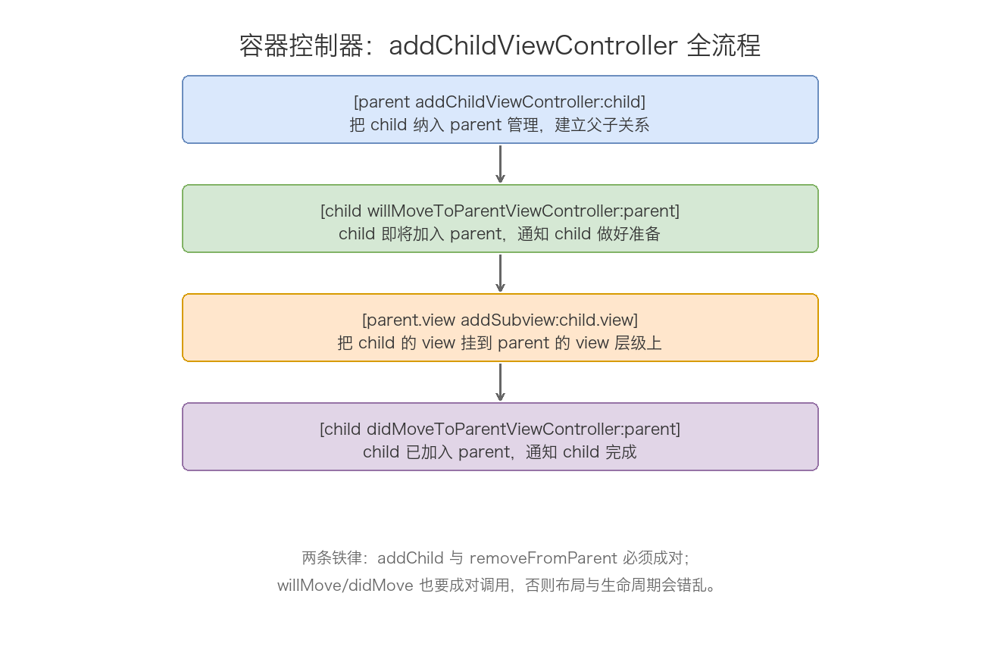

# 09. UIViewController 机制分析

> 一个控制器从 `init` 走到 `dealloc`，它手里那棵 view 树其实只经历一件事：从无到有、从加载到显示、从隐藏到销毁。这篇就围绕这一条时间线展开，把 view 的懒加载、`loadView` 的三条来源、生命周期方法、布局回调、内存警告、容器父子关系、present/dismiss 这些看似零散的知识点，全部挂到「view 的一生」这条主线上。理解它的钥匙只有一把：`view` 是懒加载的，生命周期方法全是 UIKit 在固定时机替你回调的，你只负责在对应节点上挂逻辑。

## 目录

- [一、UIViewController 是什么](#一uiviewcontroller-是什么)
- [二、view 的懒加载机制](#二view-的懒加载机制)
- [三、loadView：view 的三条来源](#三loadviewview-的三条来源)
- [四、生命周期全流程](#四生命周期全流程)
- [五、布局回调与尺寸变化](#五布局回调与尺寸变化)
- [六、内存警告与 view 卸载](#六内存警告与-view-卸载)
- [七、容器控制器：childViewController](#七容器控制器childviewcontroller)
- [八、present 与 dismiss](#八present-与-dismiss)
- [九、常用 API 速查](#九常用-api-速查)
- [十、常见陷阱](#十常见陷阱)
- [附：高频速记](#附高频速记)

---

## 一、UIViewController 是什么

先把它在 UIKit 里的位置定清楚，后面所有机制都建立在这个定位上。

UIViewController 继承自 UIResponder，是 MVC 里那个 C。它的职责可以收敛成三句话：管理一棵 view 树、作为生命周期的宿主接收 UIKit 的回调、充当容器协调一组子控制器。头文件里的关键声明能直接看出这三重身份：

```objc
// UIKit/UIViewController.h 关键声明
@interface UIViewController : UIResponder <NSCoding, UIAppearanceContainer,
    UITraitEnvironment, UIContentContainer, UIFocusEnvironment>

// 根视图，懒加载。注意 null_resettable：初始可为 nil，但 getter 保证返回非 nil
@property(null_resettable, nonatomic, strong) UIView *view;
// nib 相关：控制器来自哪个 nib / storyboard
@property(nullable, nonatomic, readonly, copy) NSString *nibName;
@property(nullable, nonatomic, readonly, strong) NSBundle *nibBundle;
@property(nullable, nonatomic, readonly, strong) UIStoryboard *storyboard;
// view 加载状态
@property(nonatomic, readonly) BOOL isViewLoaded;
@property(nullable, nonatomic, readonly, strong) UIView *viewIfLoaded API_AVAILABLE(ios(9.0));
- (void)loadViewIfNeeded API_AVAILABLE(ios(9.0));
// 父子关系
@property(nullable, nonatomic, readonly, strong) UIViewController *parentViewController;
@property(nonatomic, readonly, copy) NSArray<__kindof UIViewController *> *childViewControllers;
// 呈现关系
@property(nullable, nonatomic, readonly, strong) UIViewController *presentedViewController;
@property(nullable, nonatomic, readonly, strong) UIViewController *presentingViewController;
@end
```

两个容易忽略的点，恰恰是理解后续机制的前提：

第一个，`view` 属性声明成 `null_resettable`。Swift 里它对应 `UIView!`（隐式解包可选）。这跟「懒加载」是同一件事的两面：初始时它是 nil（控制器刚建出来还没 view），但任何代码只要访问 `self.view`，拿到的就一定非 nil——UIKit 会在 getter 里现场把它造出来。这个语义是整个第二章的基础。

第二个，UIViewController 本身是 UIResponder。这意味着它能参与响应链：view 上没被拦截的触摸事件会沿着视图层级往上冒，最后能传到控制器。所以你可以在控制器里重写 `touchesBegan:withEvent:`、`motionEnded:withEvent:`（摇一摇）这类 UIResponder 的方法。这是它跟普通 UIView 之外另一个常被忽略的身份。

再补一个贯穿全文的认知：一个屏幕背后就是一个控制器。UINavigationController、UITabBarController、UISplitViewController 这些「壳」本身也是 UIViewController 的子类，它们跟普通控制器唯一的区别是「里面还装着别的控制器」——这正是第七章要讲的容器能力。把这一点记住，就不会觉得容器控制器是什么特殊的存在。

## 二、view 的懒加载机制

懒加载是整个 UIViewController 最核心的实现细节，它决定了 `viewDidLoad` 的调用时机，也埋下了后面无数坑的根子。理解它，等于拿到了打开全篇的钥匙。

### 1. getter 的内部逻辑

UIKit 闭源，但根据官方文档和运行时行为，`view` 的 getter 逻辑可以还原成这样：

```objc
// 依据官方文档语义还原的伪代码
- (UIView *)view {
    if (_view == nil) {
        [self loadView];        // 第一步：创建 / 加载 view
        [self viewDidLoad];     // 第二步：加载完成回调
    }
    return _view;
}
```

这段伪代码能直接推出三个结论，每一个都是考点：

- 访问 `self.view` 一定得到一个非 nil 的 view——没有就现场加载，不存在「访问到了 nil」的情况。
- `viewDidLoad` 永远发生在「第一次访问 view」的那条调用链上，而不是控制器创建时。也就是说，你 `alloc/init` 一个控制器，`viewDidLoad` 并不会立刻执行。
- 如果 `loadView` 执行完 `_view` 仍然是 nil，getter 会再次走 `loadView` + `viewDidLoad`，无限递归直到爆栈。这就是后文「loadView 死循环」的机制来源。

### 2. 全景图



### 3. 判断 / 触发加载的三个 API

正因为 view 是懒加载的，控制器创建后很长一段时间里 view 可能压根不存在。围绕「view 到底加载了没有」这个需求，UIKit 提供了三个 API，职责边界要分清：

```objc
// 1. 只判断，不触发加载（iOS 3+）
if (self.isViewLoaded) {
    // view 已加载到内存
}

// 2. 只读，不触发加载（iOS 9+，未加载返回 nil）
UIView *v = self.viewIfLoaded;   // 可能是 nil

// 3. 主动触发加载（iOS 9+，未加载就现场加载）
[self loadViewIfNeeded];          // 等价于访问一次 self.view
```

三者的对比用一个表格说清：

| API | 触发加载 | 返回值 | 引入版本 |
| --- | --- | --- | --- |
| `isViewLoaded` | 否 | BOOL，view 是否已加载 | iOS 3 |
| `viewIfLoaded` | 否 | UIView?，未加载返回 nil | iOS 9 |
| `loadViewIfNeeded` | 是 | 无 | iOS 9 |

什么时候用哪个，看需求：

- 想在「不惊动懒加载」的前提下探测状态，用 `isViewLoaded`。比如判断 view 是否已加载且已上屏，再决定要不要做某些依赖 view 的操作：

```objc
if (self.isViewLoaded && self.view.window != nil) {
    // view 已加载且已挂到窗口层级上
}
```

- 想「读一下 view 但绝不触发加载」，用 `viewIfLoaded`。典型场景是传值：如果子控制器还没加载，就先把数据存到属性里，等 `viewDidLoad` 再消费：

```objc
- (void)passDataToChild:(UIViewController *)child {
    if (child.viewIfLoaded) {
        // view 已加载，可以直接操作子视图
        child.customLabel.text = self.text;
    } else {
        // 还没加载，先存值，让 child 在 viewDidLoad 里自己取
        child.pendingText = self.text;
    }
}
```

- 想「提前把 view 加载好」，用 `loadViewIfNeeded`。比如某些情况下你希望 child 的 `viewDidLoad` 立即执行，而不是拖到它真正显示时。

### 4. 为什么要设计成懒加载

懒加载不是随便拍脑袋的设计，它带来两个实打实的收益：

一是省资源、推迟开销。控制器可以提前批量创建（比如一口气构建好一串页面塞进导航栈），但 view 只在实际需要显示时才加载，把内存占用和加载耗时都往后挪。UITabBarController 就是这个机制的受益者：它 `init` 完会立即加载自己的 view，但对未选中的 tab 对应的子控制器，view 会等到用户第一次切过去才加载。

二是时序集中。`loadView` 保证了「执行完后 view 一定存在」，于是 `viewDidLoad` 成为一个稳定的一次性初始化点。开发者不需要关心 view 具体是什么时候被造出来的，只要在 `viewDidLoad` 里放心装配 UI 就行。

## 三、loadView：view 的三条来源

`loadView` 是懒加载机制的「生产端」，职责只有一个：把 `_view` 从 nil 变成实例。控制器的 view 有 storyboard、nib、纯代码三条来源，`loadView` 的默认实现就是按顺序判定这三条路。

### 1. 默认实现的三步判定



按优先级从高到低：

1. 从 storyboard 加载。控制器若是 `UIStoryboard` 的 `instantiateViewControllerWithIdentifier:` 实例化出来的，segue 信息里就带着 view 的定义，直接按归档数据反序列化。这条路在反序列化阶段走的是 `initWithCoder:`，而不是 `initWithNibName:bundle:`。

2. 从 nib 加载。先看 `nibName` 属性是否非 nil；为空再去找「与类名同名的 nib 文件」。找到了就加载，把 File's Owner（即控制器自己）的 `view` 出口接上。

3. 都没有。创建一个空白的 UIView，尺寸取屏幕大小，赋给 `self.view`。这就是为什么纯代码控制器不重写 `loadView` 也有 view 可用。

其中 nib 名称的匹配规则值得单独展开，因为它决定了第 2 步到底能不能命中：

- 用 `initWithNibName:bundle:` 显式传了名字，就按这个名字去指定 bundle 里找。
- 用 `init`（或 `initWithNibName:nil`）创建，`nibName` 为 nil，默认实现会拿类名去主 bundle 里找同名 nib——比如 `MyViewController` 找 `MyViewController.nib`。
- 同名 nib 也找不到，退回第 3 步的空白 view。

所以「控制器有没有关联 nib」的完整判定是：`nibName` 非 nil，或者显式用 `initWithNibName:bundle:` 指定过，或者 bundle 里恰好存在同名 nib 文件，三者满足其一就算有。这也是 `loadView` 判断走哪条路的依据。

### 2. storyboard 的反序列化路径

storyboard 实例化的控制器走的是归档反序列化，跟普通 `init` 是两套初始化入口。理解这条路径有助于厘清「初始化方法到底哪个先执行」：

```objc
// storyboard 里拖出来的控制器，走的是这个入口
- (instancetype)initWithCoder:(NSCoder *)coder {
    self = [super initWithCoder:coder];
    if (self) {
        // 此时 coder 里带着 storyboard 序列化的属性（outlet 还没连接）
    }
    return self;
}

// outlet 全部连接完成后，回调这个方法
- (void)awakeFromNib {
    [super awakeFromNib];
    // 到这里 IBOutlet 才全部可用，可以安全访问 self.someLabel
}
```

要点在 `awakeFromNib`：从 storyboard/nib 反序列化出来的对象，它的 IBOutlet 要等反序列化全部完成、出口都连好之后才可用，这个时机就是 `awakeFromNib`。所以在 `initWithCoder:` 里访问 outlet 是空的，在 `awakeFromNib` 里才安全。

### 3. 重写 loadView 的两条规则

纯代码想自定义根视图（比如根视图直接换成 UITableView），就重写 `loadView`。官方只给了两条硬规则，记住这两条就绝不会写错：

```objc
// 纯代码自定义根视图
- (void)loadView {
    // 规则一：不调 [super loadView]，避免白造一个空白 view
    // 规则二：必须给 self.view 赋值
    self.view = [[UITableView alloc] initWithFrame:[UIScreen mainScreen].bounds
                                              style:UITableViewStylePlain];
}
```

- 不要调用 `[super loadView]`。父类默认实现会先造一个空白 view，纯属浪费，你马上又要用自己的 view 覆盖它。
- 必须把结果赋给 `self.view`。否则 `loadView` 结束后 `_view` 还是 nil，getter 检测到 nil 会再次调 `loadView`，陷入无限循环。

反过来，如果控制器来自 nib/storyboard，就绝对不要碰 `loadView`——此时 view 的创建权在 nib 加载流程手里，你手动赋值会跟它打架，nib 里定义好的 view 就全失效了。

### 4. 无限循环是怎么发生的

这是面试高频题，机制在第二章已经埋了伏笔，这里把两种触发形态讲透。

第一种，重写了 `loadView` 却忘了给 `self.view` 赋值：

```objc
// 错误示范：只建了局部变量，没赋给 self.view
- (void)loadView {
    UIView *v = [[UIView alloc] init];   // v 只是局部变量，loadView 结束就丢
    v.backgroundColor = [UIColor redColor];
    // loadView 返回后 _view 仍是 nil → getter 再次调 loadView → 死循环
}
```

第二种更隐蔽，在 `loadView` 内部读 `self.view` 的 getter：

```objc
- (void)loadView {
    [self.view addSubview:someView];   // 访问 self.view → getter 发现 nil → 又调 loadView → 递归
}
```

规则记成一句话：`loadView` 内部只能「赋值」，绝不能「读值」；不重写 `loadView` 就完全不用管它。

### 5. loadViewIfNeeded 与 loadView 的关系

`loadViewIfNeeded`（iOS 9+）是对懒加载的「手动补刀」：它内部就是检查 `_view` 是否为 nil，是则走一遍 `loadView` + `viewDidLoad`。跟直接访问 `self.view` 的副作用等价，区别只在语义——代码读起来意图更明确。它常见于容器控制器场景：你想在某个时刻确定 child 的 view 一定已经加载，就主动调它。

## 四、生命周期全流程

有了「view 懒加载」和「loadView」打底，这一章把完整的生命周期串起来。核心是一条时间线：创建 → 加载 → 显示 → 隐藏 → 销毁，每个阶段都有对应的回调方法。

### 1. 全景图与出场序列



首次显示的标准出场序列：

```text
init → loadView → viewDidLoad → viewWillAppear → viewWillLayoutSubviews → viewDidLayoutSubviews → viewDidAppear
```

退场序列：

```text
viewWillDisappear → viewDidDisappear → （不再被引用时）dealloc
```

注意布局回调夹在 `viewWillAppear` 和 `viewDidAppear` 之间，而且可能被触发多次，这一点放到第五章细讲。

### 2. 每个方法在做什么

下面按时间线逐个拆解，每个方法都讲清楚「什么时机被调」「内部发生了什么」「适合放什么逻辑」。

`initWithNibName:bundle:` 是指定初始化器（designated initializer）。不管你调 `init` 还是 `initWithNibName:`，最终都汇聚到这里。这一步只有控制器自己的状态，view 还没影。

```objc
- (instancetype)initWithNibName:(NSString *)nibNameOrNil bundle:(NSBundle *)nibBundleOrNil {
    if (self = [super initWithNibName:nibNameOrNil bundle:nibBundleOrNil]) {
        self.viewModel = [[ViewModel alloc] init];   // OK，只碰自己的属性
        // self.view.backgroundColor = ...;          // 禁止，会提前触发懒加载
    }
    return self;
}
```

`loadView` 在第三章讲过，负责把 view 造出来，这里不再重复。

`viewDidLoad` 在 view 加载完成后调用。每个「加载轮次」里只执行一次——除非 view 被卸载后又重新加载（见第六章）。它是做「一次性 UI 装配」的标准位置：add 子视图、设约束、配数据源。

```objc
- (void)viewDidLoad {
    [super viewDidLoad];
    [self.view addSubview:self.tableView];   // 搭视图层级
    self.tableView.dataSource = self;         // 配数据源
    // 注意：这里 view 刚加载完、还没上屏，frame 不是最终值
}
```

`viewWillAppear:` 在 view 即将加入窗口层级时调用。它跟 `viewDidLoad` 的关键区别是：每次显示都会走一遍——push 回来、tab 切回来、present 的页面 dismiss 掉，都会再次触发。适合放「每次露面都要刷新」的逻辑。

```objc
- (void)viewWillAppear:(BOOL)animated {
    [super viewWillAppear:animated];
    [self refreshUnreadCount];   // 每次回到这个页面都刷新红点
}
```

`viewDidAppear:` 在 view 完全上屏、转场动画结束后调用。启动定时器、开始动画、请求焦点这类「画面上稳了才该做的事」放这里。

```objc
- (void)viewDidAppear:(BOOL)animated {
    [super viewDidAppear:animated];
    [self.timer fire];            // 此时才启动周期性任务
}
```

`viewWillDisappear:` / `viewDidDisappear:` 是一对镜像：前者在 view 即将移出层级时调，适合停动画、停定时器、保存状态；后者在移出完成后调，做收尾清理。

```objc
- (void)viewWillDisappear:(BOOL)animated {
    [super viewWillDisappear:animated];
    [self.timer invalidate];       // 停掉周期任务，避免离开后还在跑
}
```

`dealloc` 是控制器销毁。移除通知、KVO、Timer 的 target 这类「释放自己」的动作在这里做。现代写法大量使用 block API + weak 引用后，`dealloc` 里要做的事少了很多，但通知中心如果还用 selector 方式注册，务必在这里 `removeObserver`。

```objc
- (void)dealloc {
    [[NSNotificationCenter defaultCenter] removeObserver:self];
}
```

### 3. viewIsAppearing（iOS 13+）

iOS 13 在 `viewWillAppear:` 和 `viewDidAppear:` 之间插入了 `viewIsAppearing:`。它的时机很微妙：此时 view 已经被加入视图层级（window 里能看到它了），但转场动画还没结束。这个节点是「view 的 frame、布局信息已经确定」的最早时机，比 `viewDidAppear:` 更早。

```objc
// iOS 13+
- (void)viewIsAppearing:(BOOL)animated {
    [super viewIsAppearing:animated];
    // view 已入层级、布局已定，但转场动画尚未完成
    // 适合：根据最终 frame 做一次调整，且不想拖到动画结束
}
```

对大多数业务，`viewDidAppear:` 就够用；`viewIsAppearing:` 是给那些「既要布局准确、又要在动画完成前就动手」的精细场景留的口子。

### 4. 谁在调这些方法：转场顺序

这些回调不是控制器自己调的，而是 UIKit 在转场过程中按固定次序调用的。以 UINavigationController 从 A push B 为例，iOS 8 之后实测的稳定顺序：

```text
B viewDidLoad → B viewWillAppear → A viewWillDisappear
→ B viewDidAppear → A viewDidDisappear
```

pop 回 A 时：

```text
A viewWillAppear → B viewWillDisappear
→ A viewDidAppear → B viewDidDisappear
```

两个规律要记住：

- 新控制器的 appear 先于旧控制器的 disappear。语义上就是「新页面盖上来，旧的退出去」，跟视觉动画一致。
- will / did 成对出现，且新旧两个控制器的回调彼此穿插，不是「A 全部走完再走 B」。

不同容器行为有差异：present 的顺序与 push 类似（第八章详述），而 UITabBarController 切 tab 只对「新选中的子控制器」转发 appear 系列，被切走的那个收到 disappear。

### 5. appearance 状态与手动转发

生命周期回调背后，UIKit 维护了一套 appearance 状态机。自动容器（UINavigationController 等）会在转场时自动把 appear 事件转发给子控制器；但自定义容器不会自动转发，需要你手动调用两个 API：

```objc
// 自定义容器控制器，手动触发 child 的 appear 生命周期
[child beginAppearanceTransition:YES animated:animated];   // 相当于 viewWillAppear
// ... 在这里挂载 child.view、执行转场 ...
[child endAppearanceTransition];                            // 相当于 viewDidAppear

// 移除时对称：
[child beginAppearanceTransition:NO animated:animated];    // 相当于 viewWillDisappear
[child endAppearanceTransition];                            // 相当于 viewDidDisappear
```

`beginAppearanceTransition:animated:` 会触发 `viewWillAppear:`/`viewWillDisappear:`，`endAppearanceTransition` 触发 `viewDidAppear:`/`viewDidDisappear:`。这套 API 是给「自己写容器控制器」的人用的，配合第七章的 `addChildViewController` 一起构成自定义容器的完整拼图。

### 6. viewDidLoad 与 viewWillAppear 的区别

| 维度 | viewDidLoad | viewWillAppear |
| --- | --- | --- |
| 调用次数 | 每次加载只一次 | 每次显示都调 |
| view 状态 | 刚加载完成，未上屏 | 即将上屏 |
| 典型用途 | UI 装配、一次性初始化 | 状态刷新、数据同步 |
| 能否拿到最终 frame | 不能（还没布局） | 不能（布局在 appear 之后） |

一句话区分：跟「构建」有关的放 `viewDidLoad`，跟「状态」有关的放 `viewWillAppear`。

## 五、布局回调与尺寸变化

生命周期方法之外还有一对布局回调，和 Auto Layout、safe area 关系紧密，单独成章。

### 1. viewWillLayoutSubviews / viewDidLayoutSubviews

`viewWillLayoutSubviews` 在控制器 view 的 `layoutSubviews` 被调用之前触发，`viewDidLayoutSubviews` 在其之后触发。触发源包括：view 首次布局（首次显示时一定会走一遍）、旋转屏幕、split 屏尺寸变化、子视图约束变化导致重新布局、scrollview 的 frame 改变等。

正因为显示期间可能触发很多次，它不能当一次性初始化点用。它的价值在于「拿真实 frame」：

```objc
- (void)viewDidLayoutSubviews {
    [super viewDidLayoutSubviews];
    // 到这一步，子视图已经按最终尺寸布局完毕，safeAreaInsets 也准确了
    CGFloat top = self.view.safeAreaInsets.top;
    self.tableView.contentInset = UIEdgeInsetsMake(top, 0, 0, 0);
}
```

`viewDidLoad` 里 view 的 frame 还是占位值，而 `viewDidLayoutSubviews` 里子视图已经布局完成，适合做依赖尺寸的操作（调整 scrollview contentInset、按宽度计算 cell 高度、根据 safe area 摆放内容等）。

### 2. 与 setNeedsLayout / layoutIfNeeded 的关系

布局是「惰性」的：改动约束或 frame 不会立刻触发布局，而是标记「需要重新布局」，等下一个 runloop 周期统一处理。`setNeedsLayout` 就是打这个标记，`layoutIfNeeded` 则是强制立刻布局：

```objc
[self.view setNeedsLayout];      // 标记：下一轮布局时重新 layoutSubviews
[self.view layoutIfNeeded];      // 立刻布局，常用于「马上要拿到新 frame」的场景
```

`viewWillLayoutSubviews` / `viewDidLayoutSubviews` 本质上就是 `layoutSubviews` 前后的一对钩子。想「改完约束立刻读新 frame」就用 `layoutIfNeeded`；想「在系统布局节点做依赖尺寸的事」就用 `viewDidLayoutSubviews`。

### 3. safe area 相关 API

safe area（安全区）是 iOS 11 引入的，替代老的 `topLayoutGuide` / `bottomLayoutGuide`。控制器侧相关的 API 有这些：

```objc
// 1. 根视图 safe area 变化时回调
- (void)viewSafeAreaInsetsDidChange {
    [super viewSafeAreaInsetsDidChange];
    // 刘海屏、横竖屏切换、状态栏隐藏等导致 safe area 变化时触发
}

// 2. 额外自定义 safe area insets（在系统基础上追加）
self.additionalSafeAreaInsets = UIEdgeInsetsMake(0, 0, 50, 0);  // 底部再留 50pt
```

`additionalSafeAreaInsets` 常用于自定义容器：容器在父视图里给自己预留了导航栏/工具栏的高度，通过它把这块区域追加到 child 的 safe area 里，child 布局时就能自动避开。注意它生效的前提是 `viewSafeAreaInsetsDidChange` 被触发后系统会重新计算。

### 4. 旋转与尺寸变化回调

屏幕旋转、多任务分屏改变尺寸时，走的是 `viewWillTransitionToSize:withTransitionCoordinator:`：

```objc
- (void)viewWillTransitionToSize:(CGSize)size
       withTransitionCoordinator:(id<UIViewControllerTransitionCoordinator>)coordinator {
    [super viewWillTransitionToSize:size withTransitionCoordinator:coordinator];
    // size 是旋转后的目标尺寸
    [coordinator animateAlongsideTransition:^(id<UIViewControllerTransitionCoordinatorContext> ctx) {
        // 旋转动画进行中，同步调整布局
    } completion:^(id<UIViewControllerTransitionCoordinatorContext> ctx) {
        // 旋转动画结束
    }];
}
```

`coordinator` 允许你在旋转动画的「过程中」和「结束后」分别挂逻辑，做到跟系统动画同步，而不是等旋转完再突兀地跳一下。这个方法替代了老旧的 `didRotateFromInterfaceOrientation:` 系列。

## 六、内存警告与 view 卸载

内存警告这块是历史遗留知识的重灾区，iOS 6 前后行为完全不同，得分版本讲。

### 1. iOS 6 之前的卸载循环

内存吃紧时系统向 app 发内存警告，每个控制器收到 `didReceiveMemoryWarning`。iOS 6 之前的默认实现：如果 view 不在窗口层级上（superview 为 nil），就把 view 释放掉，随后回调 `viewWillUnload` / `viewDidUnload`。下次显示时重新走 `loadView` + `viewDidLoad`。

这就是「加载循环 / 卸载循环」双循环的由来，也是「viewDidLoad 可能执行多次」这个说法的历史出处——在旧系统里，view 被卸载再加载，`viewDidLoad` 确实会再跑一次。

### 2. iOS 6 之后：不再自动卸载

iOS 6 起，系统不再主动释放控制器的 view，`viewWillUnload` / `viewDidUnload` 直接废弃。原因也直白：屏幕越换越大，重新加载 view 的成本（磁盘 IO、重新解码、重建约束）往往高于多占的那点内存，来回卸载反而引发性能问题。

所以现代写法里，`didReceiveMemoryWarning` 只干一件事：释放能重建的缓存。

```objc
- (void)didReceiveMemoryWarning {
    [super didReceiveMemoryWarning];
    // 释放可重建的缓存（图片缓存、临时数据），不要动 view
    self.imageCache = nil;
}
```

### 3. 手动触发 view 重载

虽然系统不再自动卸载，但你可以手动把 `self.view` 置 nil 来主动释放，下次访问时重新走一遍加载流程：

```objc
// 主动释放 view，下次访问 self.view 会重新 loadView + viewDidLoad
self.view = nil;
```

这带来的副作用就是「viewDidLoad 会不会多次调用」的完整答案：正常不会，除非你自己把 view 置 nil 强制重载。置 nil 前要确认 view 不在窗口层级上（否则释放正在显示的内容会出问题），而且所有依赖 view 的引用都要能重建。

## 七、容器控制器：childViewController

UINavigationController、UITabBarController、UIPageViewController 的本质都是容器控制器：自己管理一组子控制器，按规则切换展示。iOS 5 把这套能力开放出来，任何 UIViewController 都能当容器。这一章讲清楚容器 API 怎么用，以及生命周期转发背后的机制。

### 1. 为什么需要容器

先把动机讲清楚，否则后面四步就像死记硬背。一个控制器的 view 要能显示，必须挂到某个窗口的视图层级上；同时它的生命周期回调（appear/disappear、旋转、内存警告）要靠 UIKit 按父子关系传递。如果你不建立父子关系、直接把另一个控制器的 view `addSubview` 硬拼上去，视图能显示，但那个控制器收不到任何生命周期回调——`viewWillAppear` 永远不触发，旋转、内存警告也收不到。

容器 API 的价值就在这：视图归视图层级管，生命周期由父子关系管，两条线都接上了。`addChildViewController` 是接「生命周期」那条线，`addSubview` 是接「视图」那条线，两条都得做。

### 2. addChildViewController 四步



标准装配四步：

```objc
// 添加子控制器
- (void)displayContentController:(UIViewController *)child {
    [self addChildViewController:child];              // 1. 建立父子关系
    child.view.frame = self.view.bounds;              // （布局由容器决定）
    [self.view addSubview:child.view];                // 2. 挂视图
    [child didMoveToParentViewController:self];       // 3. 完成通知
}

// 移除子控制器（顺序对称相反）
- (void)hideContentController:(UIViewController *)child {
    [child willMoveToParentViewController:nil];       // 1. 预告脱离
    [child.view removeFromSuperview];                 // 2. 摘视图
    [child removeFromParentViewController];           // 3. 断关系
}
```

每一步的含义：

1. `addChildViewController:`：建立父子关系。child 的 `parentViewController` 指向 parent，被 parent 强引用，生命周期事件开始由 parent 转发。
2. `willMoveToParentViewController:`：通知 child「你要有爹了」。add 场景下第一步已经内部调过，无需手动调；remove 场景必须手动传 nil。
3. `addSubview:`：把 child.view 挂进视图层级。容器可以给 child.view 定 frame 或加约束。
4. `didMoveToParentViewController:`：通知 child「安顿好了」。child 的 `viewWillAppear`/`viewDidAppear` 从这里开始被转发。

记忆口诀：add 内部自带 willMove，只需补 didMove；remove 内部自带 didMove，必须先手动 willMove:nil。

### 3. moveToParentViewController：一步到位

iOS 5 引入的 `moveToParentViewController:` 把上面的多步封装成一步，逻辑更不容易漏：

```objc
// 添加（等价于 addChild + willMove + didMove，但视图仍需手动 addSubview）
[child moveToParentViewController:self];
[self.view addSubview:child.view];

// 移除（等价于 willMove:nil + removeFromParent + didMove:nil）
[child.view removeFromSuperview];
[child moveToParentViewController:nil];
```

传父控制器就是「加入」，传 nil 就是「脱离」。注意它只处理父子关系这一条线，视图的 add/remove 还是要自己挂。用这个 API 能避免忘调 willMove/didMove 的经典错误，现代代码里更推荐用它。

### 4. 生命周期转发机制

`addChildViewController` 之后，parent 会自动把 appear 系列事件转发给「当前可见」的 child：parent 的 `viewWillAppear` 触发时，可见 child 的 `viewWillAppear` 也跟着触发。这就是为什么嵌入的子控制器不用手动同步生命周期。

转发的本质是 UIKit 维护的 appearance 状态机（第四章第 5 节提到过）。自动容器在 push/pop、切 tab 时，会按正确的次序对涉及的子控制器调用 `beginAppearanceTransition:animated:` / `endAppearanceTransition`，从而触发它们的 appear/disappear 回调。注意转发的是「事件」，不是「方法调用链」——parent 自己的方法先走，child 的随后。

对于完全自定义的容器，UIKit 无法知道你的切换逻辑，所以需要你自己在合适的时机调用 `beginAppearanceTransition:animated:` / `endAppearanceTransition`（示例见第四章第 5 节），否则 child 的 appear 回调不会触发。

### 5. 容器关系属性

控制器之间通过一组只读属性互相引用，搞清它们能避免很多「怎么拿到某某控制器」的困惑：

```objc
UIViewController *child = self.childViewControllers.firstObject;   // 我的直接子控制器
UIViewController *parent = self.parentViewController;              // 我的直接父控制器
UINavigationController *nav = self.navigationController;          // 所在的导航栈（可能在祖先）
UITabBarController *tab = self.tabBarController;                  // 所在的标签栏（可能在祖先）
UISplitViewController *split = self.splitViewController;           // 所在的分栏（可能在祖先）
```

注意 `childViewControllers` / `parentViewController` 是「直接」父子，而 `navigationController` / `tabBarController` / `splitViewController` 是「最近祖先」——它们会沿着父链往上找，即使中间隔了几层自定义容器也能找到。

### 6. 常见容器一览

系统自带的容器控制器都遵循同一套规则，只是切换策略不同：

- UINavigationController：栈式，push 压入、pop 弹出，`viewControllers` 是栈。
- UITabBarController：平级切换，`viewControllers` 是一组并列的 tab。
- UISplitViewController：主从分栏，`viewControllers` 是主/从两个控制器。
- UIPageViewController：翻页，用 `setViewControllers:direction:animated:` 切换。

它们都维护自己的 `childViewControllers`，并在切换时自动转发生命周期。理解了第七章的机制，再看这些容器就不会觉得神秘。

## 八、present 与 dismiss

模态呈现是控制器的另一组核心关系，独立于容器父子关系。这一章把 present 的关系、样式、生命周期讲透。

### 1. presentedViewController / presentingViewController

present 后，被呈现的控制器挂到发起方的 `presentedViewController`，被呈现方通过 `presentingViewController` 反查发起方：

```objc
// A present B
[self presentViewController:vcB animated:YES completion:nil];

// B 里：
self.presentingViewController;                          // → A（或 A 的最近容器）
self.presentingViewController.presentedViewController;  // → B
```

注意持有链并不一定在 present 调用者身上——UIKit 会把 presented 控制器挂到「找到的最近容器」上，所以不要假设 `self.presentedViewController` 一定握在自己手里，要用 `presentingViewController` 的语义去理解。通常的认知是：B 的 `presentingViewController` 指向 A，A 的 `presentedViewController` 指向 B。

### 2. modalPresentationStyle：呈现样式

`modalPresentationStyle` 决定被呈现控制器以什么形态展示，是最容易踩坑的地方，尤其 iOS 13 的默认值变化。完整枚举：

| 枚举值 | 含义 | 背景控制器 disappear 回调 |
| --- | --- | --- |
| `UIModalPresentationFullScreen` | 全屏覆盖 | 会触发 |
| `UIModalPresentationPageSheet` | 页面卡片，露出部分背景 | 不触发 |
| `UIModalPresentationFormSheet` | 居中表单，四周露背景 | 不触发 |
| `UIModalPresentationOverFullScreen` | 全屏覆盖，但背景不消失 | 不触发 |
| `UIModalPresentationOverCurrentContext` | 覆盖当前上下文 | 不触发 |
| `UIModalPresentationCurrentContext` | 在当前上下文内呈现 | 不触发 |
| `UIModalPresentationPopover` | 气泡弹窗（iPad） | 不触发 |
| `UIModalPresentationCustom` | 自定义转场 | 视实现而定 |
| `UIModalPresentationAutomatic` | 系统自动选择（默认） | 视解析结果而定 |

表格里「disappear 回调」这列是关键：只要被呈现的控制器没有完全盖住背景（pageSheet、formSheet、popover 等），系统就不会调用 presenting 控制器的 `viewWillDisappear:` / `viewDidDisappear:`，因为背景内容还可见，它并没有真正「消失」。

### 3. iOS 13 的默认值变化

这是近几年最大的坑之一。iOS 12 及以前，`modalPresentationStyle` 默认是 `UIModalPresentationFullScreen`；iOS 13 起默认改成 `UIModalPresentationAutomatic`，在 iPhone 上会自动解析为 `UIModalPresentationPageSheet`（卡片式，顶部露出一点背景）。

它带来的连锁反应：iOS 13 上没显式设置样式就 present 一个控制器，presenting 控制器的 `viewWillDisappear:` / `viewDidDisappear:` 不再被调用（因为 pageSheet 没盖满屏幕，背景还可见）。如果你的老代码依赖「present 后自己会 disappear」这个假设去做清理、停定时器，升级 iOS 13 后会静默失效。

解法是显式指定全屏：

```objc
// 找回 iOS 12 及以前的全屏行为
vcB.modalPresentationStyle = UIModalPresentationFullScreen;
[self presentViewController:vcB animated:YES completion:nil];
```

如果 present 的是一个 UINavigationController，样式要设在 UINavigationController 上，而不是它的 root 控制器上。

### 4. modalTransitionStyle：转场动画

`modalTransitionStyle` 控制呈现动画，枚举如下：

```objc
typedef NS_ENUM(NSInteger, UIModalTransitionStyle) {
    UIModalTransitionStyleCoverVertical = 0,   // 默认，从底部向上
    UIModalTransitionStyleFlipHorizontal,       // 水平翻转
    UIModalTransitionStyleCrossDissolve,        // 淡入淡出
    UIModalTransitionStylePartialCurl,          // 卷页（只支持 fullScreen）
};
```

用法：

```objc
vcB.modalTransitionStyle = UIModalTransitionStyleCrossDissolve;
[self presentViewController:vcB animated:YES completion:nil];
```

注意 `PartialCurl` 只支持全屏样式，配合 pageSheet 会无效甚至崩溃。

### 5. dismiss 到底 dismiss 谁

`dismissViewControllerAnimated:completion:` 的语义容易搞混。谁调用它、它 dismiss 谁，规则是：

- 标准做法是「谁 present 的，谁 dismiss」——A present B，A 调 dismiss 把 B 收掉。
- 但 B 自己也能调 dismiss，此时 UIKit 会把 dismiss 请求转发给 B 的 `presentingViewController` 去执行，所以 `[self dismissViewControllerAnimated:...]` 在 B 里写也能把自己关掉。
- 如果 B 又 present 了 C，dismiss B 会连带把 C 一起 dismiss（整个 present 链一起收）。

```objc
// B 里关闭自己（等价于 A 调用 dismiss）
[self dismissViewControllerAnimated:YES completion:nil];
```

一句话：dismiss 作用于「最近一次 present 的呈现链」，从发起方执行。

### 6. present 的生命周期顺序

present B 时（与 push 规律一致，新的先 appear）：

```text
B viewDidLoad → B viewWillAppear → (A viewWillDisappear)
→ B viewDidAppear → (A viewDidDisappear)
```

注意括号里的 A 的 disappear 回调是否触发，取决于样式（见第 2、3 节）：fullScreen 会触发，pageSheet 不会。dismiss 回 A 时：

```text
A viewWillAppear → B viewWillDisappear
→ A viewDidAppear → B viewDidDisappear
```

记忆口诀统一：appear 永远先于 disappear，不管 push 还是 present。

## 九、常用 API 速查

前面按机制讲完了主线，这一章把散落在控制器里的高频 API 集中过一遍，每个都给出典型用法。

### 1. title 与导航栏 / 标签栏

`title` 是控制器的标题，设置后会自动同步到导航栏标题和标签栏标题：

```objc
self.title = @"详情页";
// 等价于同时影响 navigationItem.title 和 tabBarItem.title
```

想单独定制导航栏或标签栏，用 `navigationItem` / `tabBarItem`：

```objc
self.navigationItem.title = @"自定义导航标题";
self.navigationItem.rightBarButtonItem = [[UIBarButtonItem alloc]
    initWithTitle:@"保存" style:UIBarButtonItemStylePlain
    target:self action:@selector(save)];
self.tabBarItem.title = @"首页";
```

### 2. 状态栏相关

iOS 7 之后，状态栏由「顶层控制器」决定，通过重写这几个方法控制：

```objc
// 状态栏样式：默认 / 浅色
- (UIStatusBarStyle)preferredStatusBarStyle {
    return UIStatusBarStyleLightContent;   // 浅色内容（配深色背景）
}

// 是否隐藏状态栏
- (BOOL)prefersStatusBarHidden {
    return NO;
}

// 状态栏变化动画
- (UIStatusBarAnimation)preferredStatusBarUpdateAnimation {
    return UIStatusBarAnimationFade;
}

// 改完偏好后，主动触发系统重新询问
[self setNeedsStatusBarAppearanceUpdate];
```

关键在最后一行：改了这些偏好值之后，系统不会自动感知，必须调 `setNeedsStatusBarAppearanceUpdate` 让系统重新询问。如果状态栏由容器里的某个 child 决定，用 `childViewControllerForStatusBarStyle` / `childViewControllerForStatusBarHidden` 指定：

```objc
- (UIViewController *)childViewControllerForStatusBarStyle {
    return self.visibleChildViewController;   // 状态栏样式由当前可见 child 决定
}
```

### 3. 编辑态

控制器配合 UITableView 编辑用这套：

```objc
// 进入/退出编辑态，tableView 会联动
[self setEditing:YES animated:YES];
// 判断当前是否处于编辑态
BOOL editing = self.isEditing;
```

`setEditing:animated:` 会转发给 view 和子控制器，常见于「导航栏右上角编辑按钮切换 tableView 编辑模式」的场景。

### 4. 约束更新钩子

`updateViewConstraints` 是控制器在「需要更新约束」时的钩子，是集中维护约束的推荐位置：

```objc
- (void)updateViewConstraints {
    // 在这里更新 / 重建约束，比散落在各处 setNeedsUpdateConstraints 更集中
    [super updateViewConstraints];
}
```

它对应「约束需要更新」这个时机，适合把依赖状态的约束集中在这里改。

### 5. show / showDetail：适配分屏

iOS 8 引入 `showViewController:sender:` / `showDetailViewController:sender:`，是替代「手动判断设备再 push 或 present」的推荐 API。它会根据当前上下文自动选择呈现方式——在导航栈里就是 push，在 split 分屏里 `showDetail` 会替换 detail 区：

```objc
// 推荐：让 UIKit 根据上下文决定 push / present / 分栏
[self showViewController:detailVC sender:self];
[self showDetailViewController:detailVC sender:self];
```

好处是同一套代码在 iPhone 和 iPad 分屏下都能正确工作，不用写 `if (UIDevice...)` 分支。

### 6. 呈现/移动状态标志

iOS 5 之后有一组只读 BOOL，用来判断控制器当前正处在哪个过渡中：

```objc
self.isBeingPresented;      // 正在被 present 上来
self.isBeingDismissed;      // 正在被 dismiss 下去
self.isMovingToParentViewController;    // 正在被加入某个父容器
self.isMovingFromParentViewController;  // 正在脱离某个父容器
```

典型用途：在生命周期回调里区分「这是第一次出现还是被 dismiss 回来」，避免重复做初始化：

```objc
- (void)viewWillAppear:(BOOL)animated {
    [super viewWillAppear:animated];
    if (self.isMovingToParentViewController || self.isBeingPresented) {
        // 第一次加入 / 呈现，做一次性准备
    }
}
```

## 十、常见陷阱

最后把最容易踩的坑收拢一遍，每个都按「现象 → 原因 → 解法」讲。

### 1. loadView 死循环

现象：程序崩溃，栈溢出。原因：loadView 里访问了 `self.view`，或 loadView 结束时没给 `self.view` 赋值。解法：loadView 里只赋值、不读值；不重写 loadView 就完全不用管它。

### 2. init 里碰 self.view

现象：控制器一创建就触发了整套加载流程。原因：init 阶段 view 还没加载，访问 `self.view` 会提前触发懒加载（loadView + viewDidLoad），把加载时机从「即将显示」提前到「创建时」。解法：init 里只碰自己的属性。

### 3. viewDidLoad 里拿 frame

现象：拿到的是 0×0 或占位值。原因：viewDidLoad 时 view 还没进窗口、没走布局。解法：依赖最终尺寸的逻辑放 `viewDidLayoutSubviews`。

### 4. 子控制器漏调 willMove / didMove

现象：child 的 appear 转发错乱。原因：add 后忘调 `didMoveToParentViewController:`，remove 前忘调 `willMoveToParentViewController:nil:`。解法：用 `moveToParentViewController:` 一步到位，或严格按四步对称来。

### 5. 把 viewWillAppear 当一次性初始化

现象：通知重复注册、定时器重复创建。原因：viewWillAppear 每次显示都触发。解法：一次性逻辑归 `viewDidLoad`，viewWillAppear 只放「每次都要刷新」的。

### 6. iOS 13 升级后 present 不触发 disappear

现象：present 后，presenting 控制器的 `viewWillDisappear:` 不调了。原因：iOS 13 默认样式从 fullScreen 变 pageSheet，背景没被完全盖住。解法：显式设 `modalPresentationStyle = UIModalPresentationFullScreen`。

## 附：高频速记

- MVC 中 C 的角色：持有 view、协调 model、响应交互；UIViewController 继承自 UIResponder，能参与响应链。
- `view` 属性是 `null_resettable`：初始 nil，getter 里 `_view == nil` 就 `loadView` + `viewDidLoad`，保证访问即非 nil。
- 判断/加载三 API：`isViewLoaded` 不触发加载；`viewIfLoaded`（iOS 9）读而不加载；`loadViewIfNeeded`（iOS 9）主动加载。
- `loadView` 默认三步：storyboard（走 `initWithCoder:`）→ nib（`nibName` 或类名同名）→ 空白 UIView。
- 重写 `loadView` 两条：不调 super、必须给 `self.view` 赋值，否则无限循环；loadView 里只赋值不读值。
- 指定初始化器是 `initWithNibName:bundle:`；`init` 里别碰 `self.view`。
- `viewDidLoad` 每次加载只一次，放一次性 UI 装配；`viewWillAppear` 每次显示都调，放状态刷新。
- iOS 13 新增 `viewIsAppearing:`，在 view 已入层级、转场动画未结束时调。
- 显示序列：init → loadView → viewDidLoad → viewWillAppear → viewWillLayoutSubviews → viewDidLayoutSubviews → viewDidAppear。
- 转场口诀：新控制器的 appear 先于旧控制器的 disappear（push/present 通用）。
- `beginAppearanceTransition:animated:` / `endAppearanceTransition`：自定义容器手动触发 child 的 appear/disappear。
- `viewWillLayoutSubviews` / `viewDidLayoutSubviews`：首次布局与每次尺寸/约束变化都触发，拿最终 frame 和 safe area 在 did 里。
- `setNeedsLayout` 打标记，`layoutIfNeeded` 立刻布局；`viewSafeAreaInsetsDidChange` / `additionalSafeAreaInsets` 管 safe area。
- 旋转走 `viewWillTransitionToSize:withTransitionCoordinator:`，coordinator 可同步动画。
- 内存警告：iOS 6 前自动卸载 view + `viewDidUnload`；iOS 6 后不卸载、该 API 废弃，`didReceiveMemoryWarning` 只清缓存；`self.view = nil` 可手动重载。
- 容器四步：addChildViewController → addSubview → didMoveToParentViewController（add 不用手动 willMove）；remove 对称：willMove:nil → removeFromSuperview → removeFromParentViewController；`moveToParentViewController:` 一步到位。
- addChild 后生命周期自动转发给可见 child；裸 addSubview 拼控制器收不到生命周期回调。
- 容器关系：`parentViewController`/`childViewControllers` 是直接父子，`navigationController`/`tabBarController`/`splitViewController` 是最近祖先。
- present 关系：`presentedViewController` / `presentingViewController` 互指；dismiss 作用于整个 present 链。
- `modalPresentationStyle` 默认值 iOS 13 起由 fullScreen 改为 automatic（iPhone 解析为 pageSheet），背景未盖满时 presenting 的 disappear 不触发。
- 判断过渡状态：`isBeingPresented` / `isBeingDismissed` / `isMovingToParentViewController` / `isMovingFromParentViewController`。
