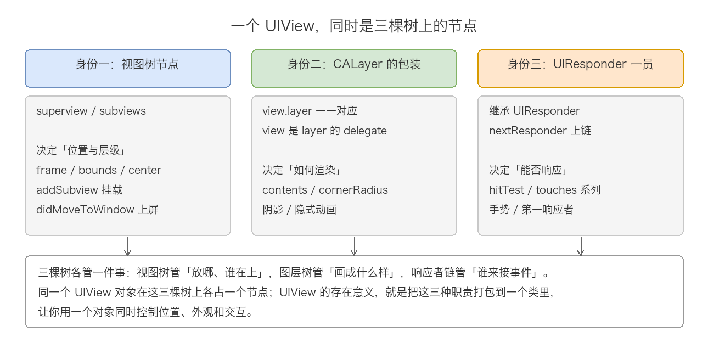
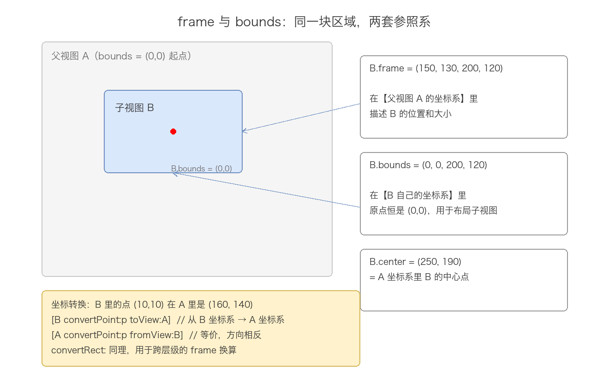
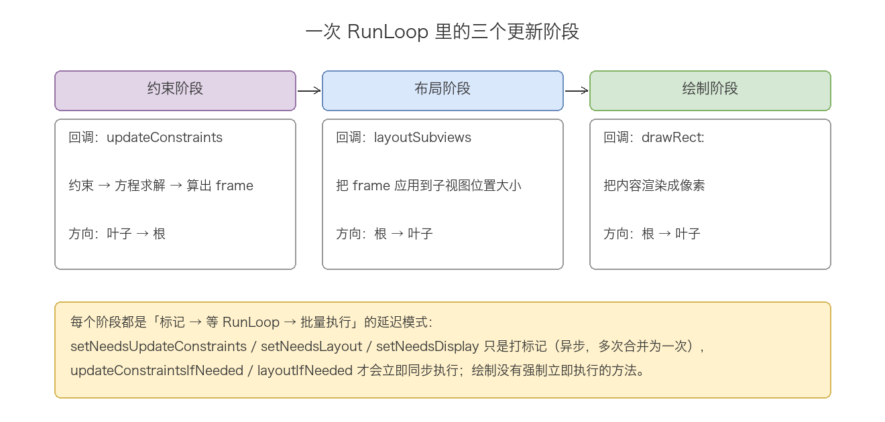
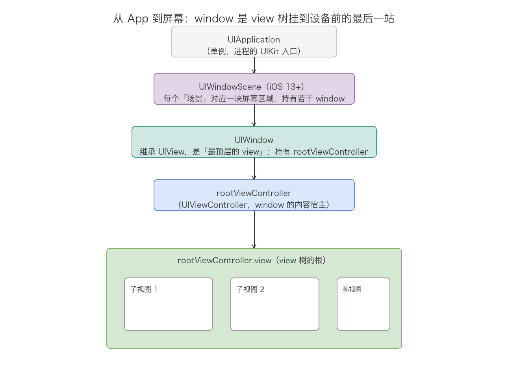
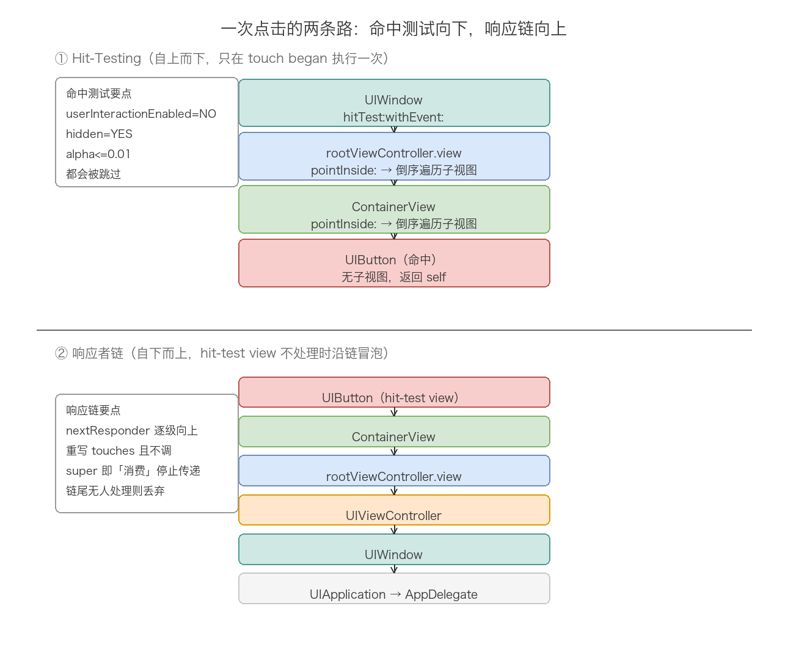

# 11. UIView 体系分析

> 屏幕上能看到、能摸到的一切，最终都是 UIView。但 UIView 从来不是一个孤立的对象——它同时活在三棵树上：视图树（决定位置与层级）、图层树（决定渲染成什么样子）、响应者链（决定事件由谁处理）。而这三棵树要真正落到一块屏幕上，还得经过 UIWindow 这道门；要被管理，就离不开 UIViewController 这个宿主。这篇顺着「一个 view 从诞生、布局、渲染、上屏到响应一次点击」这条线，把 UIView 自身体系、UIWindow、UIViewController 的衔接、事件响应串成一个整体。理解它的钥匙只有一把：UIView 把「在哪、长什么样、谁来响应」三种职责打包在一个类里，每种职责背后各有一棵树、一套机制。

## 目录

- [一、UIView 是什么：一个对象，三重身份](#一uiview-是什么一个对象三重身份)
- [二、几何与坐标系：frame、bounds、center](#二几何与坐标系frameboundscenter)
- [三、视图树：层级管理与挂载回调](#三视图树层级管理与挂载回调)
- [四、布局体系：从 frame 到 Auto Layout](#四布局体系从-frame-到-auto-layout)
- [五、绘制与渲染：UIView 与 CALayer 的分工](#五绘制与渲染uiview-与-calayer-的分工)
- [六、UIWindow：view 树上屏的最后一站](#六uiwindowview-树上屏的最后一站)
- [七、UIViewController：view 树的管理者](#七uiviewcontrollerview-树的管理者)
- [八、事件响应：hit-test 与响应者链](#八事件响应hit-test-与响应者链)
- [九、常用 API 速查](#九常用-api-速查)
- [十、常见陷阱](#十常见陷阱)
- [附：高频速记](#附高频速记)

---

## 一、UIView 是什么：一个对象，三重身份

先把 UIView 在 UIKit 里的位置定准，后面所有机制都建立在这个定位上。头文件的类声明信息量很大：

```objc
// UIKit/UIView.h
@interface UIView : UIResponder <NSCoding, UIAppearance, UIAppearanceContainer,
    UIDynamicItem, UITraitEnvironment, UICoordinateSpace, UIFocusItem,
    UIFocusItemContainer, CALayerDelegate>

@property(class, nonatomic, readonly) Class layerClass;  // default is [CALayer class]
@property(nonatomic, getter=isUserInteractionEnabled) BOOL userInteractionEnabled;
@property(nonatomic) NSInteger tag;                       // default is 0
@property(nonatomic, readonly, strong) CALayer *layer;    // view is layer's delegate
@end
```

从这个声明里能读出三重身份：

第一重，视图树节点。UIView 暴露了 `superview`、`subviews`、`window` 三个属性（UIViewHierarchy 分类），任何 view 都通过它们挂在一棵以 UIWindow 为根的树上。这棵树决定「画在哪、谁盖住谁」，对应第二章到第四章的几何与布局。

第二重，CALayer 的包装。每个 UIView 内部持有一个 CALayer（`layer` 属性，恒非 nil），并且 UIView 实现了 `CALayerDelegate` 协议——view 是自己 layer 的 delegate。真正被渲染系统处理的是 layer，UIView 只是对它的一层封装，负责把高层语义翻译给图层树。这对应第五章。

第三重，UIResponder 的一员。UIView 继承自 UIResponder，意味着它能参与响应者链、接收触摸事件、成为第一响应者（弹出键盘的前提）。这对应第八章。



为什么一个类要同时背三种职责？因为三者总是同时变化：你把一个按钮从 A 位置挪到 B 位置，改的是视图树几何；给它加圆角，动的是图层属性；点击它弹回调，走的是响应链。苹果的答案是把它们统一到一个对象上，让开发者面对一个类就能完成全部工作——代价是 UIView 的头文件被拆成了十几个 category（Geometry、Hierarchy、Rendering、Animation、GestureRecognizers、ConstraintBasedLayout……），本文的章节划分基本就沿着这些 category 走。

两个初始化细节值得留意。`initWithFrame:` 是指定初始化器，创建 view 的同时会创建 backing layer——layer 的类由 `layerClass` 决定，所以自定义 view 想换底层图层类型（比如用 CAGradientLayer 做渐变背景）只要重写这一个类方法：

```objc
// 自定义 view 使用渐变图层作为 backing layer
+ (Class)layerClass {
    return [CAGradientLayer class];
}
```

`initWithCoder:` 是另一个指定初始化器，服务于 XIB/Storyboard 从归档反序列化的路径。两条路径最终都收敛到同一件事：创建 layer、建立 delegate 关系、初始化几何为零。

## 二、几何与坐标系：frame、bounds、center

理解了「view 是视图树节点」，下一个问题是节点在树上的位置怎么描述。UIKit 的答案是一组三角关系：`frame`、`bounds`、`center`，外加 `transform`。

```objc
// UIKit/UIView.h (UIViewGeometry 分类)
@property(nonatomic) CGRect            frame;     // animatable
@property(nonatomic) CGRect            bounds;    // default bounds is zero origin, frame size. animatable
@property(nonatomic) CGPoint           center;    // center is center of frame. animatable
@property(nonatomic) CGAffineTransform transform; // default is CGAffineTransformIdentity. animatable
```

三者的分工：`frame` 在父视图坐标系里描述自己的位置和大小；`bounds` 在自己的坐标系里描述自己，原点默认是 (0, 0)；`center` 是自己中心点在父视图坐标系里的坐标。frame 并不是独立存储的——它是 getter 里由 bounds 和 center（加上 transform）实时算出来的：

```
frame.size    = bounds.size（无 transform 时）
frame.origin  = center - bounds.size / 2（无 transform 时）
```



frame 和 bounds 的区别是最经典的问题，答案可以压缩成一句话：frame 是「别人眼中的我」，bounds 是「我自己眼中的世界」。由此推出几个实用结论：

结论一，修改 `bounds.origin` 不会移动自己，只会平移自己的坐标系，让子视图「看起来反向移动」。UIScrollView 的滚动就是这个机制：滚动时 view 本身纹丝不动，改的是 `bounds.origin`（contentOffset 就是 bounds.origin 的别名），于是内容相对上移。理解了这一点，「滚动到底部时子视图的 frame 没变但看不见了」这类现象就不再神秘。

结论二，修改 `bounds.size` 时，子视图会围绕 center 向四周扩散或收缩，因为 bounds 的原点不动、center 不动，尺寸变了之后 frame.origin 由公式重算。

结论三，也是头文件注释里白纸黑字的警告：设置了非 identity 的 transform 之后不要再读写 frame。

```objc
// animatable. do not use frame if view is transformed since it will not
// correctly reflect the actual location of the view. use bounds + center instead.
@property(nonatomic) CGRect frame;
```

因为 frame 的计算公式里有 transform 参与，对一个旋转了 45 度的 view 设置 frame，得到的结果是「把旋转后的包围盒凑成你给的值」，实际视觉位置和大小都会出乎意料。transform 状态下定位一律用 `bounds + center`。

CALayer 层面还有一对 UIView 没有直接暴露（iOS 16 后 UIView 也加了 `anchorPoint`）的属性：`position` 和 `anchorPoint`。关系是一条公式：

```
position = frame.origin + frame.size × anchorPoint
```

anchorPoint 是归一化坐标（0~1），默认 (0.5, 0.5)，此时 position 恰好等于 UIView 的 center。锚点的意义在动画：旋转、缩放都是围绕锚点进行的，把锚点改到 (0.5, 1)（底部中点），就能让 view 像钟摆一样绕底边摆动。

跨层级的坐标换算走 `convertPoint:`/`convertRect:` 家族，这组 API 在事件处理、手势计算里出场率极高：

```objc
// 把 B 坐标系里的点换算到 A 坐标系（两参数方向互补，结果等价）
CGPoint pInA = [b convertPoint:p toView:a];
CGPoint p2   = [a convertPoint:p fromView:b];
// 传 nil 表示窗口/屏幕坐标系
CGRect rOnScreen = [b convertRect:b.bounds toView:nil];
```

记忆方法：方法名里的 to/from 描述的是「参数里的点来自谁」。toView: 是把我的点给你，fromView: 是把你的点拿给我。另外 UIView 遵循了 `UICoordinateSpace` 协议，屏幕坐标系（考虑设备方向）和 window 坐标系的换算可以用 `convertPoint:toCoordinateSpace:` 系列处理。

最后一个几何相关的常用方法对是 `sizeThatFits:` 和 `sizeToFit`：

```objc
- (CGSize)sizeThatFits:(CGSize)size;  // 返回「最适合」的尺寸，不改变自身
- (void)sizeToFit;                    // 调用 sizeThatFits: 并把结果写回 bounds.size
```

区别在于是否落地：`sizeThatFits:` 是纯查询（UILabel、UIButton 计算文本自适应尺寸都走它），`sizeToFit` 是查询加应用。自定义 view 重写 `sizeThatFits:` 时不要自己调 `sizeToFit`，否则会循环。

## 三、视图树：层级管理与挂载回调

几何描述了单个节点，现在把节点挂到树上。视图树的管理 API 集中在 UIViewHierarchy 分类里，一共就三层操作：增、删、序。

```objc
// UIKit/UIView.h (UIViewHierarchy 分类，节选)
@property(nullable, nonatomic, readonly) UIView *superview;
@property(nonatomic, readonly, copy) NSArray<__kindof UIView *> *subviews;
@property(nullable, nonatomic, readonly) UIWindow *window;

- (void)addSubview:(UIView *)view;
- (void)insertSubview:(UIView *)view atIndex:(NSInteger)index;
- (void)insertSubview:(UIView *)view aboveSubview:(UIView *)siblingSubview;
- (void)insertSubview:(UIView *)view belowSubview:(UIView *)siblingSubview;
- (void)exchangeSubviewAtIndex:(NSInteger)index1 withSubviewAtIndex:(NSInteger)index2;
- (void)bringSubviewToFront:(UIView *)view;
- (void)sendSubviewToBack:(UIView *)view;
- (void)removeFromSuperview;
```

subviews 数组的顺序就是视觉层级：下标 0 在最底层，末尾在最上层。后 addSubview 的 view 天然盖在先添加的上面——这就是为什么「用 addSubview 轮播的弹窗」总是盖住旧内容。六个层级操作 API 表达的都是同一件事：调整子视图在 subviews 数组里的位置。

三个容易踩的细节：

细节一，addSubview 一个已经有父视图的 view，它会被先从旧父视图移除，再挂到新父视图。UIKit 里一个 view 同一时刻只能有一个 superview，不需要手动 removeFromSuperview。这个特性也被用来「转移」视图，但注意转移会触发完整的挂载回调流程（见下文）。

细节二，`viewWithTag:` 是递归搜索，从自身开始往整棵子树里找，返回第一个匹配的。多层级里有同名 tag 时拿到的不一定是你想要的那个，层级复杂的项目里更推荐直接持有属性引用。

细节三，`isDescendantOfView:` 对自身返回 YES（头文件注释：returns YES for self），用它做「安全移除」「判断是否在同一棵子树」时别忘了这个语义。

挂载与卸载不是静默完成的，UIKit 会在关键节点回调六个钩子方法，它们是自定义容器、悬浮窗这类需求的发力点：

```objc
// 子视图增删时回调（父视图收到）
- (void)didAddSubview:(UIView *)subview;
- (void)willRemoveSubview:(UIView *)subview;
// 自身挂载/卸载时回调（自身收到）
- (void)willMoveToSuperview:(nullable UIView *)newSuperview;
- (void)didMoveToSuperview;
- (void)willMoveToWindow:(nullable UIWindow *)newWindow;
- (void)didMoveToWindow;
```

六个钩子里 `didMoveToWindow` 的地位最特殊。`window` 属性是 view 挂载链路的终点——只要这一串 superview 链最终接到了某个 UIWindow 上，window 属性就非 nil。反过来说，一个 view 创建之后即使设好了 frame、加好了子视图，只要没挂到 window 上，它就没有真正「上屏」，`didMoveToWindow` 也不会触发。实际开发里这几个场景都依赖它：在 `didMoveToWindow` 里启动 CADisplayLink（因为它只在真正显示时触发，且离开窗口时 window 变 nil 可以顺便停掉）、判断视图是否在可见窗口里、监控视图的全局挂载时机（Method Swizzling 埋点常用）。

还有一个不成对的 API 值得单独说：`removeFromSuperview` 没有对应的「removeFromWindow」——window 也好、superview 也好，视图树只有一棵， removeFromSuperview 就是唯一的摘除手段，window 上的根视图同样用它摘除。

## 四、布局体系：从 frame 到 Auto Layout

视图树搭好之后，树上的节点们怎么排布？UIKit 提供了三代布局方案，它们不是替换关系而是分层关系：autoresizingMask 是「父视图变化时子视图怎么跟着变」的规则，Auto Layout 是「用约束描述关系、系统求解 frame」的方程组，UIStackView 则是 Auto Layout 之上的排列封装。

```objc
// UIKit/UIView.h (UIViewGeometry 分类)
@property(nonatomic) BOOL               autoresizesSubviews; // default is YES
@property(nonatomic) UIViewAutoresizing autoresizingMask;     // default is UIViewAutoresizingNone
```

autoresizingMask 是六个枚举位的组合（FlexibleLeftMargin/Width/RightMargin/TopMargin/Height/BottomMargin），语义是「哪条边距或尺寸是弹性的」。它解决不了「A 的右边距 B 16pt」这种视图间关系，于是 iOS 6 引入了 Auto Layout。

Auto Layout 的机制核心是约束求解：每条约束是一个线性关系式 `view1.attr = m × view2.attr + c`，所有约束组成方程组，由 Cassowary 算法（单纯形法，增量求解）解出每个 view 的 x、y、width、height。几个关键点：

```objc
// UIKit/UIView.h 关键声明
@property(nonatomic) BOOL translatesAutoresizingMaskIntoConstraints;
// Default YES —— autoresizing 产生的约束会完全确定 frame
@property(nonatomic, readonly) CGSize intrinsicContentSize;    // 固有尺寸，UIView 默认 (-1, -1)
- (void)invalidateIntrinsicContentSize;
- (void)setContentHuggingPriority:(UILayoutPriority)priority forAxis:(UILayoutConstraintAxis)axis;
- (void)setContentCompressionResistancePriority:(UILayoutPriority)priority forAxis:(UILayoutConstraintAxis)axis;
```

`translatesAutoresizingMaskIntoConstraints` 是 frame 布局与 Auto Layout 的交界开关：默认 YES 时，autoresizingMask 会被转成一组完整约束，让你手动设的 frame 也活在约束体系里；一旦自己添加约束定位，就必须把它设成 NO，否则两套约束打架，运行时报「Unable to simultaneously satisfy constraints」。用锚点 API 写约束时忘设这个开关，是新手第一大约束报错来源。

`intrinsicContentSize` 是「内容决定尺寸」的机制：UILabel、UIButton、UIImageView 这类自带内容的控件会报告自己的固有尺寸，Auto Layout 据此自动生成宽高约束（未显式设置时）。固有内容尺寸配套两个优先级——Content Hugging（抗拉伸，越高越不肯变大）和 Compression Resistance（抗压缩，越高越不肯变小），两个 label 抢空间时谁被压缩、拉伸就由这两个优先级仲裁。内容变化后（比如 label 换了更长的文案）要调 `invalidateIntrinsicContentSize` 通知系统重算。

不管用哪代布局方案，最终都汇入同一条更新流水线。UIKit 把整个视图更新拆成三个阶段，每个阶段遵循同一个「标记 → 等 RunLoop → 批量执行」的延迟模式：



三个阶段的回调与触发方法：

| 阶段 | 系统回调 | 标记方法 | 立即执行方法 | 执行方向 |
|------|---------|---------|------------|---------|
| 约束 | updateConstraints | setNeedsUpdateConstraints | updateConstraintsIfNeeded | 叶子 → 根 |
| 布局 | layoutSubviews | setNeedsLayout | layoutIfNeeded | 根 → 叶子 |
| 绘制 | drawRect: | setNeedsDisplay | 无 | 根 → 叶子 |

方向的成因值得想一遍：约束阶段从叶子到根，因为父视图的布局可能依赖子视图的固有尺寸；布局和绘制从根到叶子，因为子视图的位置大小依赖父视图的 bounds。三个阶段在每次 RunLoop 的 UI 更新周期里按「约束 → 布局 → 绘制」的固定顺序执行，头文件里这段注释直接写明了顺序：

```objc
/* To render a window, the following passes will occur, if necessary.
 update constraints
 layout
 display */
```

`layoutSubviews` 的触发时机需要单独记，它不会因为改了个属性就立刻执行，以下是完整清单：addSubview 首次显示、bounds 变化（含 frame.size 变化）、子视图增删、UIScrollView 滚动（bounds.origin 变化）、设备旋转、setNeedsLayout 标记后的下一个周期、layoutIfNeeded 强制触发。`layoutIfNeeded` 的招牌用法是约束动画——修改约束只是打了标记，真正改 frame 的是 layoutSubviews，把它塞进动画 block 里才能让 frame 变化被动画系统捕获：

```objc
// 约束动画的标准写法
self.heightConstraint.constant = 200;
[UIView animateWithDuration:0.3 animations:^{
    [self.view layoutIfNeeded];   // frame 变化发生在动画上下文内
}];
```

布局体系里还有一组「参考区域」API，处理刘海屏、灵动岛、Home Indicator、键盘遮挡这些问题：`safeAreaInsets`/`safeAreaLayoutGuide`（系统安全区）、`layoutMargins`/`layoutMarginsGuide`（内容边距，preservesSuperviewLayoutMargins 可级联）、`keyboardLayoutGuide`（iOS 15+，跟随键盘）。它们本质都是 UILayoutGuide——不参与渲染的「占位矩形」，把「留出多少空」从 view 布局里解耦出来。新项目约束应该锚定 safeAreaLayoutGuide 而不是硬编码状态栏高度。

## 五、绘制与渲染：UIView 与 CALayer 的分工

布局确定了每个 view 的几何，接下来是把内容真正画出来。这一章是「身份二：CALayer 的包装」的展开。

UIView 与 CALayer 是一对一绑定：view 持有 layer，layer 把 view 当作 delegate（UIView 遵循 CALayerDelegate 协议）。两者分工明确——CALayer 属于 QuartzCore，负责视觉呈现（contents 位图、圆角、阴影、边框、动画），而且这份实现在 macOS 和 iOS 间共享；UIView 属于 UIKit，负责平台特有的交互（触摸、手势、响应链、Auto Layout）。layer 管画、view 管交互，这就是为什么 `cornerRadius`、`shadowOpacity` 这些属性只能去 `view.layer` 上设置——UIView 根本没暴露它们。

自定义绘制走 `drawRect:`，但这个方法的正确认知比它的名气更重要：

第一，绝大多数 view 不需要重写它。UILabel、UIImageView 的内容都不走 drawRect:，而是直接设置 layer.contents（一个 CGImage）。只有「系统没有对应控件、需要用 Core Graphics 手画」的场景才用它。

第二，不要主动调用它，用 `setNeedsDisplay` 标记，系统在下个绘制周期回调。头文件里 `drawRect:` 没有任何调用时机注释，但 setNeedsDisplayInRect: 支持区域级重绘。

第三，空实现是负资产。drawRect: 会被触发 layer 创建一块与 view 同尺寸的 backing store（位图内存），一个空的重写等于白养一块内存。所以「重写了 drawRect: 但里面什么都不画」这种代码应该直接删掉。

绘制回调链路是理解 UIView 与 CALayer 协作的最佳切片：`[view setNeedsDisplay]` 内部转调 `[layer setNeedsDisplay]` → 下个绘制周期 layer 调 `display` → 作为 delegate 的 UIView 收到 `drawLayer:inContext:` → UIView 在这个回调里把 context 设为当前，再调你重写的 `drawRect:`。也就是说，你的 drawRect: 代码画的是 layer 的内容，UIView 只是中间的转接板。

渲染的完整链路比绘制更长：CPU 侧（布局计算、drawRect: 文本排版）准备好 layer 树的属性，提交给 Render Server（独立进程 backboardd 体系），GPU 侧再做合成上屏。这个链路里有一个高频性能概念——离屏渲染：GPU 需要先在屏幕外缓冲区合成再 paste 回屏幕。典型诱因是「同时设置圆角 + masksToBounds + 有内容的子图层」、带模糊/描边的 shadow。系统对圆角 + backgroundColor + clipsToBounds 的组合有优化路径不会离屏，但圆角叠上 contents（如 imageView）就会。检测手段是模拟器的 Color Off-screen Rendered 选项；优化思路是预生成圆角图片、用 CAShapeLayer 做遮罩、shadowPath 显式声明阴影形状。

动画这块，UIView 与 CALayer 还有一组有意思的差异：独立的 CALayer 修改可动画属性会自动产生 0.25 秒的隐式动画，而 UIView 的属性修改没有——因为 UIView 作为 delegate 在 `actionForLayer:forKey:` 里返回了 NSNull，主动屏蔽了隐式动画。UIView 的动画全部走 `animateWithDuration:` 家族（block 语法，内部转成 CAAnimation 提交），iOS 17 后还新增了 `animateWithSpringDuration:bounce:...` 弹簧动画接口。理解「UIView 关掉了 layer 的隐式动画」这一层，就明白为什么直接操作 view.layer 改属性有时会「意外地」带动画（在动画 block 内直接改 layer 属性会继承动画上下文）。

渲染相关的属性还有一组高频使用的展示控制：`contentMode`（内容在 bounds 里的摆放方式，默认 ScaleToFill 拉伸、AspectFit 等比留白、AspectFill 等比裁切、Redraw 表示 bounds 变化时调 setNeedsDisplay 重绘）、`clipsToBounds`（裁掉超出 bounds 的子视图，注意它只管视觉裁剪、不影响第八章的事件判定）、`alpha`/`hidden`（前者参与合成、子视图继承透明度，后者纯隐藏且连锁跳过事件）、`opaque`（声明不透明可让合成器跳过下层混合，drawRect: 场景下的性能开关）。

## 六、UIWindow：view 树上屏的最后一站

前面四章都在讲 view 自身，现在解决「挂到哪才算真的显示」。答案是 UIWindow——view 树与物理屏幕之间的最后一站。

UIWindow 是 UIView 的子类，这一点决定了它的本质：window 没有任何特殊渲染能力，它就是一棵「规格最大的 view 树」的根。它的特殊性全在职责上：持有 `rootViewController`、分发事件（`sendEvent:`）、决定自己这棵树与哪块屏幕关联。

```objc
// UIKit/UIWindow.h
@interface UIWindow : UIView
- (instancetype)initWithWindowScene:(UIWindowScene *)windowScene;  // iOS 13+ 指定初始化器
@property(nonatomic) UIWindowLevel windowLevel;                    // default = 0.0
@property(nonatomic, readonly, getter=isKeyWindow) BOOL keyWindow;
- (void)makeKeyAndVisible;
@property(nullable, nonatomic, strong) UIViewController *rootViewController;  // default is nil
- (void)sendEvent:(UIEvent *)event;
@end
```

从 App 到屏幕的完整链路是：UIApplication（进程级单例）→ UIWindowScene（iOS 13+，一个 UI 场景，持有若干 window）→ UIWindow → rootViewController → view 树。



iOS 13 的 scene 机制是 window 体系的分水岭。此前一个 App 只有一个 window 概念（UIApplication.shared.windows）；引入 UIScene 后，「一个 UI 实例」被抽象成 UIWindowScene，每个 scene 持有自己的 windows 数组和 keyWindow——这是 iPad 多窗口、外接屏幕的基础。相应地，window 的创建也改为绑定 scene：

```objc
// SceneDelegate 里标准的 window 建立（iOS 13+）
- (void)scene:(UIScene *)scene willConnectToSession:(UISceneSession *)session
      options:(UISceneConnectionOptions *)connectionOptions {
    UIWindowScene *ws = (UIWindowScene *)scene;
    self.window = [[UIWindow alloc] initWithWindowScene:ws];
    self.window.rootViewController = [[MainViewController alloc] init];
    [self.window makeKeyAndVisible];
}
```

`makeKeyAndVisible` 是 App 启动的标志性调用，它实际做了三件事：把 window 的 hidden 设为 NO（UIView 的显隐机制，window 没有专用的 show 方法——头文件注释原话：To make the window visible without becoming key, just use UIView's hidden property）；让自己成为 scene 的 key window；触发 rootViewController 的 view 加载与挂载（viewDidLoad 到 viewWillAppear 这一串就是在这里被点燃的）。也就是说，不调这个方法，rootViewController 的 view 永远不会上屏。

keyWindow 的「key」指的是事件与键盘的接收资格：键盘弹给 key window 里成为第一响应者的控件，触摸事件也优先派发给 key window。一个 scene 同一时刻只有一个 key window。iOS 15 起 `UIWindowScene.keyWindow` 取代了全程废弃的 `UIApplication.shared.keyWindow`；查「当前 window」的场景（弹全局 toast、获取顶层 VC）都应该从 scene 入手。

`windowLevel` 是理解「系统 UI 盖在 App 上」的钥匙。level 是浮点数，window 之间的显示次序先比 level、同 level 再比挂载次序。系统预置三档：UIWindowLevelNormal（0，App 内容）、UIWindowLevelAlert（约 2000）、UIWindowLevelStatusBar（约 1000）。键盘、系统弹窗其实都是独立的 UIWindow——你在自己的 App 里加一个 level 高于 Alert 的 window，就能盖过系统警告框（自定义权限弹窗的常规做法，但注意审核对「模拟系统 UI」有限制）。App 内的 loading HUD、全局悬浮按钮也常用独立 window 承载，好处是不依赖任何 VC 的 view 层级，随时在最高处。

window 与 VC 的粘连点就是 `rootViewController`：给 window 赋 rootViewController 时，UIKit 自动把 rootVC 的 view 挂到 window 上，建立「window → 根 VC → view 树」的默认骨架。navigation、tab bar、present 的所有页面，都是在这棵骨架上做子树的生长与切换——这就引出下一章，VC 在 view 体系里到底扮演什么角色。

## 七、UIViewController：view 树的管理者

UIView 管画、UIWindow 管上屏，UIViewController 管的是 view 树的「内容与状态」。这一章不重复第 09 篇的生命周期细节，只把 VC 放回 view 体系的坐标系里，讲清三个衔接点。

衔接点一，rootViewController 骨架的建立。`window.rootViewController = vc` 这行赋值内部做两件事：触发 vc 的 view 懒加载（getter 里走 loadView → viewDidLoad 那条链，详见第 09 篇），然后把 `vc.view` addSubview 到 window 上。所以 App 启动后那棵树的根不是抽象概念，就是 rootVC 的 view 这个具体对象。窗口坐标、安全区都是从 window 一路下发到这个根 view，再递归到子视图。

衔接点二，响应链里的位置。UIView 和 UIViewController 都继承 UIResponder，而 nextResponder 的默认接线规则把三者缝在了一起：

| 响应者 | nextResponder 默认指向 |
|-------|----------------------|
| 非根 view | superview |
| VC 的根 view | 管理它的 UIViewController |
| UIViewController（有父 VC） | 父 VC 中容纳它的那个 view |
| UIViewController（window 根 VC） | UIWindow |
| UIWindow | UIApplication |
| UIApplication | AppDelegate（若继承 UIResponder） |

这条表解释了一个日常现象：在 VC 里重写 `touchesBegan:withEvent:` 能收到 view 没处理掉的触摸——事件从叶子 view 冒泡，到根 view 后跳上 VC，再交给 window。view 和 VC 在链上是相邻节点，VC 本质上是「view 树上一个会管事的淋巴结」。

衔接点三，容器。`addChildViewController:` 建立父子 VC 关系后，子 VC 的 view 会被挂到父 VC 的 view 树里（挂在哪由你 addSubview 决定），于是整棵物理 view 树上其实站着多个 VC，每个 VC 管一段子树。UINavigationController 管导航栏与栈顶内容、UITabBarController 管 tab 与各页，都是这个模式。生命周期转发（appearance 回调自动从父流向子）的边界条件与手动转发 API 在第 09 篇已深挖，这里只留一个判断依据：判断「这个 view 属于哪个 VC 管辖」，用 view 的响应链反查 `view.nextResponder` 逐级上溯，找到第一个 UIViewController 即可（或直接用 UIResponder 的链查找封装）。

VC 管理下的 view 还有一组「VC 级布局回调」需要与 view 级区分：`viewWillLayoutSubviews` 在根 view 的 layoutSubviews 之前回调、`viewDidLayoutSubviews` 在之后，触发源是根 view 被标记 layout。做「子视图最终 frame 就绪后的处理」（比如依据 label 实际高度计算 cell 高度、调整 scrollTo 位置），锚点应该选 viewDidLayoutSubviews 而不是 viewDidLoad——后者时刻 frame 还没算出来，这是第一章第 09 篇提过的 viewDidLoad 拿 frame 坑的根因。

## 八、事件响应：hit-test 与响应者链

一棵上屏的树，最后要回答的问题是「手指点下来，谁接住」。这是三重身份里「UIResponder 一员」的展开，也是视图树、window、VC 三条线在运行时的汇合点。

事件先要进 App。完整链路从硬件开始：触摸屏电容变化 → IOKit 生成 IOHIDEvent → SpringBoard 判定前台 App 并经 mach port 转发 → 目标 App 主线程 RunLoop 被 Source1 唤醒、包装后交 Source0 处理 → 封装成 UIEvent（内含若干 UITouch）。进入 UIKit 后走两级分发：

```objc
// UIApplication 收到事件后交给 key window
- (void)sendEvent:(UIEvent *)event;
// UIWindow 负责找到正确的 view（头文件注释原话）
- (void)sendEvent:(UIEvent *)event;   // called by UIApplication to dispatch events to views inside the window
```

Window 接手后的第一步是命中测试（Hit-Testing）——从树根往下递归，找出「点在范围内、且层级最深」的那个 view：

```objc
// UIKit/UIView.h (UIViewGeometry 分类)
- (nullable UIView *)hitTest:(CGPoint)point withEvent:(nullable UIEvent *)event;
    // recursively calls -pointInside:withEvent:. point is in the receiver's coordinate system
- (BOOL)pointInside:(CGPoint)point withEvent:(nullable UIEvent *)event;  // default returns YES if point is in bounds
```

默认实现可以还原成四步伪代码：

```objc
- (UIView *)hitTest:(CGPoint)point withEvent:(UIEvent *)event {
    // 1. 三类 view 连同子树直接出局
    if (!self.userInteractionEnabled || self.hidden || self.alpha <= 0.01) return nil;
    // 2. 点不在自己 bounds 内，出局（子视图也不再检查）
    if (![self pointInside:point withEvent:event]) return nil;
    // 3. 倒序遍历子视图：后添加的在视觉上层，优先命中
    for (UIView *subview in [self.subviews reverseObjectEnumerator]) {
        CGPoint p = [subview convertPoint:point fromView:self];
        UIView *hit = [subview hitTest:p withEvent:event];
        if (hit) return hit;
    }
    // 4. 子视图全军覆没，自己就是命中者
    return self;
}
```



五个由这段逻辑直接推出的行为规则，每一个都对应一类真实需求：

规则一，`userInteractionEnabled = NO`、`hidden = YES`、`alpha <= 0.01` 的 view 连同子树整体从命中测试出局。「alpha 0.01 仍隐约可见却点不到」就是因为透明度门槛卡在 hit-test 的第一关。

规则二，命中测试基于 bounds 而非视觉：子视图超出父视图 bounds 的部分，即使父视图没开 clipsToBounds（视觉上看得见），也点不到——父视图 pointInside: 返回 NO 后递归就终止了。反过来，clipsToBounds = YES 的区域外反而……也不行，两个属性管的是不同维度：clipsToBounds 管画、pointInside 管 hit。想点击「超出父视图的部分」，重写父视图 hitTest: 跳过 bounds 检查直接遍历子视图即可。

规则三，重写 `pointInside:` 可以扩大点击热区（CGRectInset(bounds, -10, -10) 再判断），是给小按钮扩容的最轻方案。

规则四，返回 nil 可以让事件穿透：遮罩层重写 hitTest: 命中自身时返回 nil，点击就落到下层；遮罩上的子按钮不受影响（命中子视图时照常返回）。

规则五，命中测试只在 touch began 阶段执行一次，之后整个触摸序列的 moved/ended 都直接发给确定的 hit-test view——手指滑出按钮范围也不会换目标（UIControl 靠这个实现「滑出取消」）。

命中之后是分发。UIWindow 把触摸先发给 hit-test view 及其父链上所有关联的手势识别器，再发给 hit-test view 的 touches 系列方法——同一次 RunLoop 里手势永远先于 view。手势识别器内部是状态机（Possible → Began/Changed → Ended，或离散手势的 Possible → Recognized/Failed），识别成功且 cancelsTouchesInView 为默认 YES 时，view 会收到 touchesCancelled: 而不再收到后续触摸。三个交互属性值得记住：cancelsTouchesInView（识别成功后是否取消 view 的触摸）、delaysTouchesBegan（是否暂扣 began 事件等手势结果）、delaysTouchesEnded（默认 YES，暂缓 ended）。手势与控件冲突时，系统内置控件（UIButton 等）靠重写 gestureRecognizerShouldBegin: 拦掉父链上冲突的手势，自定义控件可以照抄这个思路。

最后一级是响应者链。view 的 touches 方法默认实现就是转发给 nextResponder，于是「不处理」的事件沿着 hit-test view → 父 view → … → 根 view → VC → window → UIApplication → AppDelegate 一路上溯，任何一环重写 touches 且不调 super 即「消费」终止，走完全程无人处理则丢弃。这条链还有一个被低估的用法：UIControl 的 target-action 里 target 传 nil 时，UIApplication 的 sendAction:to:forEvent: 会沿响应链找第一个能响应 selector 的对象——深层嵌套的 cell 按钮可以直接把事件抛给 VC，不用 delegate 层层回调。

至此三棵树完成闭环：hit-test 沿视图树向下找节点，响应链沿树向上找处理者，中间的每一次转发都发生在 window 的 sendEvent: 统筹之下，VC 在链上作为 view 的「上级节点」参与仲裁。

## 九、常用 API 速查

前面按主线讲了机制，这一章按用途把高频 API 收拢成表，便于回查。

几何与坐标：

| API | 用途 | 备注 |
|-----|------|------|
| frame / bounds / center | 几何三件套 | transform 非 identity 时避开 frame |
| convertPoint:toView: / fromView: | 跨层级坐标换算 | 传 nil 表示 window 坐标系 |
| sizeThatFits: / sizeToFit | 内容自适应尺寸 | 前者查询、后者落地 |
| contentScaleFactor | view 与物理像素比例 | 与 screen.scale 联动 |

层级与挂载：

| API | 用途 | 备注 |
|-----|------|------|
| addSubview: | 挂载 | 已有父视图会先移除 |
| insertSubview:atIndex:/above:/below: | 精确插入 | index 即视觉层级 |
| bringSubviewToFront: / sendSubviewToBack: | 置顶/沉底 | 等价于调整数组位置 |
| removeFromSuperview | 摘除 | 唯一的移除 API |
| viewWithTag: | 查找 | 递归搜索含自身 |
| didMoveToWindow | 挂载完成回调 | window 为 nil 即离屏 |

布局：

| API | 用途 | 备注 |
|-----|------|------|
| setNeedsLayout / layoutIfNeeded | 标记 / 立即布局 | 动画 block 内用后者 |
| layoutSubviews | 布局回调 | 不要在里面改约束 |
| intrinsicContentSize + invalidate | 固有尺寸 | 自定义内容尺寸的入口 |
| systemLayoutSizeFittingSize: | 按约束预算尺寸 | 自适应 cell 高度利器 |
| safeAreaLayoutGuide | 安全区锚点 | 取代硬编码状态栏高度 |
| keyboardLayoutGuide | 键盘跟随 | iOS 15+，取代监听键盘通知 |

渲染与展示：

| API | 用途 | 备注 |
|-----|------|------|
| setNeedsDisplay | 标记重绘 | 触发 drawRect: |
| contentMode | 内容摆放 | Redraw 模式会触发重绘 |
| clipsToBounds | 裁剪 | 只管视觉，不管 hit-test |
| alpha / hidden / opaque | 透明与可见 | alpha≤0.01 时 hit-test 跳过 |
| tintColor | 主题色 | 沿视图链向下继承 |
| snapshotViewAfterScreenUpdates: | 截图 | 复杂动画优化常用 |

事件：

| API | 用途 | 备注 |
|-----|------|------|
| hitTest:withEvent: | 命中测试 | 重写实现穿透/扩区 |
| pointInside:withEvent: | 范围判断 | 重写扩大热区 |
| addGestureRecognizer: | 挂手势 | 手势先于 touches 收到事件 |
| gestureRecognizerShouldBegin: | 拦截手势 | 内置控件防冲突的实现 |
| becomeFirstResponder | 成为第一响应者 | 弹键盘前提 |

## 十、常见陷阱

陷阱一，transform 状态下读写 frame。头文件注释明确警告过：transform 非 identity 时 frame 不能正确反映实际位置，定位用 bounds + center。典型翻车场景是旋转动画结束后「归位」时直接设 frame，结果位置漂移。

陷阱二，布局未完成就取 frame。addSubview 或激活约束后系统只是打了布局标记，下一个 RunLoop 周期才真正执行。在 viewDidLoad 里读子视图 frame 拿到的是零或旧值；需要立刻用 frame 时调 layoutIfNeeded 强制同步布局。

陷阱三，layoutSubviews 里改约束。约束变化会重新标记布局，布局又触发 layoutSubviews，形成无限循环（表现为 CPU 占用异常、布局抖动）。约束更新放 updateConstraints，布局结果应用放 layoutSubviews，两条回调各管一段。

陷阱四，重写了空 drawRect:。白养一块与 view 同尺寸的位图内存。不画就删掉重写；需要自定义绘制的，留意离屏渲染的圆角阴影组合，用 Instruments 的 offscreen rendered 检测。

陷阱五，重复 addSubview 后的状态误判。addSubview 会把 view 从旧父视图摘下来，随后 willMoveToSuperview/didMoveToSuperview/didMoveToWindow 全链触发；如果didMoveToWindow 里有启动定时器之类的逻辑，转移视图会造成重复启动。转移前先判断 `view.superview != nil` 或在回调里做幂等。

陷阱六，以为 hidden 和 alpha 在事件上等价。两者在 hit-test 里都导致出局，但 alpha 是渐变可动画的，做「淡出后禁点」时 alpha 动画到 0.01 以下才生效，动画过程中（alpha 大于 0.01）依然可点；需要立即禁点配合 userInteractionEnabled 或在动画 completion 里处理。

陷阱七，全局取 window 用了已废弃 API。UIApplication.shared.keyWindow 与 shared.windows 在 scene 化后不可靠（多场景、外接屏会拿错）。正确姿势从 view 反查 `view.window.windowScene`，或遍历 scene 的 windows 数组。

## 附：高频速记

三重身份：视图树节点（位置层级）+ CALayer 包装（渲染）+ UIResponder（事件），三棵树各管一事。

frame 是别人眼中的我，bounds 是我自己眼中的世界；frame 由 bounds + center + transform 实时算出，transform 非 identity 时禁用 frame。

bounds.origin 可改：ScrollView 滚动 = 改 bounds.origin 平移坐标系，view 本身不动。

subviews 数组顺序即视觉层级：index 0 最底，末尾最上；后 add 的盖先 add 的；addSubview 已有父视图会先摘再挂。

挂载链：addSubview → willMoveToSuperview → didMoveToSuperview → willMoveToWindow → didMoveToWindow；window 非 nil 才算真正上屏。

更新三阶段固定顺序：updateConstraints（叶子→根）→ layoutSubviews（根→叶子）→ drawRect:（根→叶子）；标记异步合并，layoutIfNeeded 同步强制。

drawRect: 只有自定义绘制才重写；空实现白养位图内存；setNeedsDisplay 标记触发，勿手动调用。

UIWindow 是 UIView 子类：makeKeyAndVisible = hidden=NO + 成为 keyWindow + 触发 rootVC 的 view 加载挂载；windowLevel 决定与系统 UI 的盖压次序；键盘、Alert 都是独立 window。

scene 化后取 window：view.window.windowScene 或 scene.windows，废弃 sharedApplication.keyWindow。

响应链 nextResponder：子 view → 父 view → 根 view → VC → window → application → delegate；hit-test 向下（递归 hitTest:），响应链向上（nextResponder 冒泡），方向相反。

hit-test 出局三条件：userInteractionEnabled=NO、hidden=YES、alpha≤0.01；命中判定基于 bounds 与视觉裁剪（clipsToBounds）无关；began 阶段执行一次，后续事件直达目标。

手势先于 touches：UIWindow 先发手势识别器再发 view；识别成功默认 cancelsTouchesInView 会 cancel 掉 view 的触摸。
