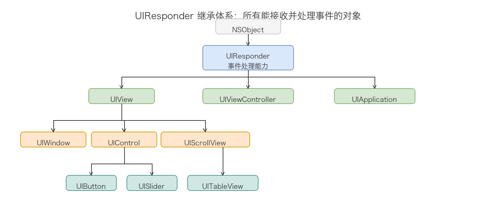
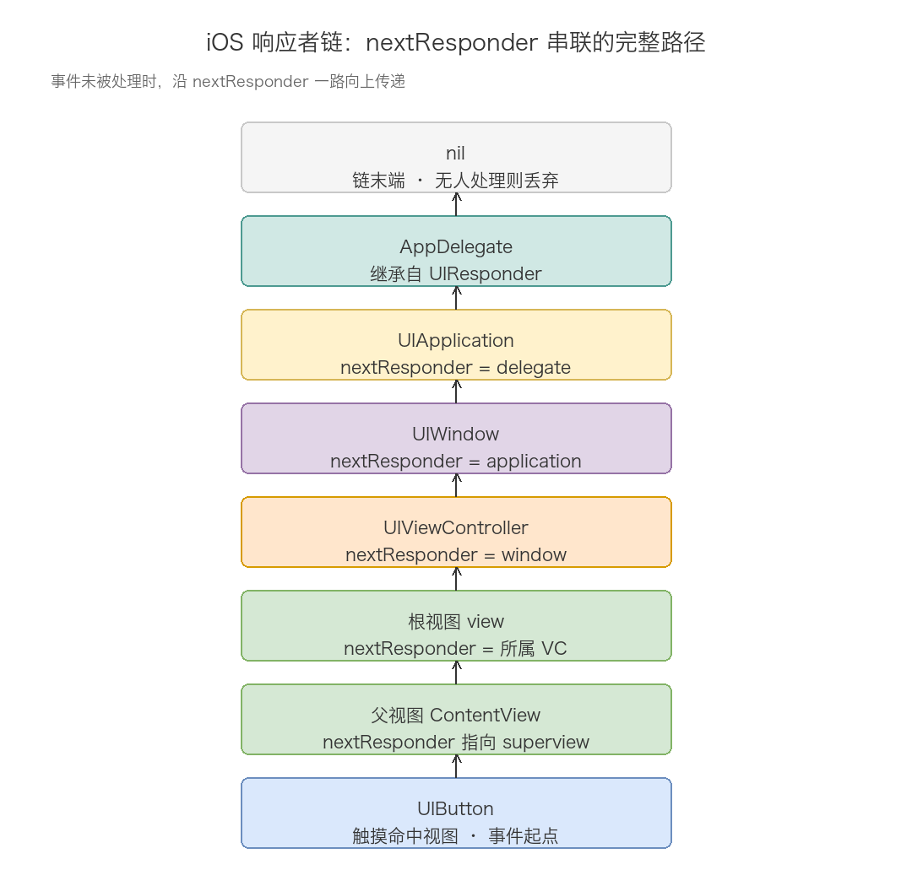
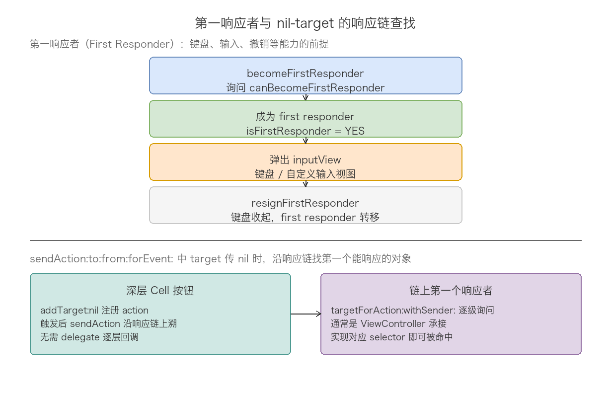
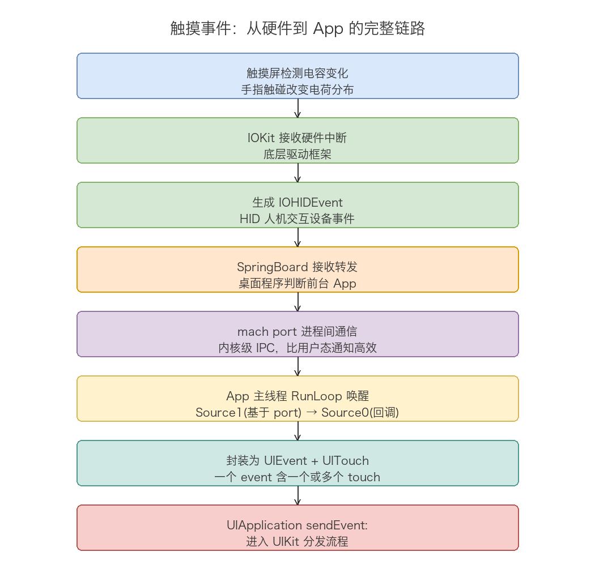
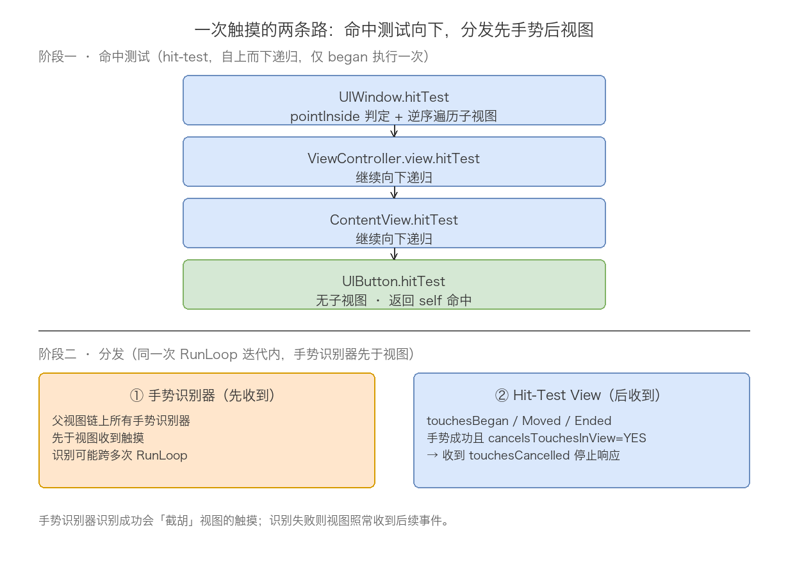
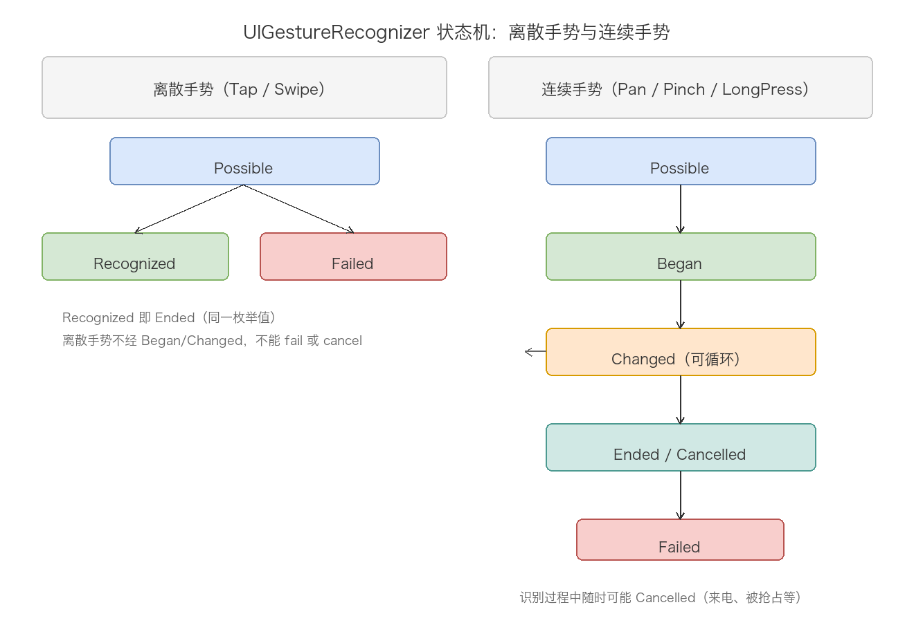

# 12. 事件响应链机制分析

> 当手指触碰 iPhone 屏幕上的一个按钮时，背后经历了从硬件感知、系统传递、命中测试、事件分发到最终响应的完整链路。本文按这条链路的推进顺序拆解每个环节：先立住「谁有能力处理事件」——响应者与响应者链；再追事件从硬件到 App 进程的诞生；然后是 UIKit 的两步核心处理——Hit-Testing 寻址与手势优先分发；接着是 UIControl 的 target-action 通道；最后给出完整流程总结、常见实践场景与高频面试问题。视图布局与渲染的视角见第 11 篇，本文聚焦事件这一条线。

## 目录

- [一、响应者与响应者链](#一响应者与响应者链)
- [二、触摸事件的产生与传递](#二触摸事件的产生与传递)
- [三、Hit-Testing 命中测试](#三hit-testing-命中测试)
- [四、事件分发与手势识别器](#四事件分发与手势识别器)
- [五、UIControl 的事件处理](#五uicontrol-的事件处理)
- [六、完整流程总结](#六完整流程总结)
- [七、常见实践场景](#七常见实践场景)
- [八、常见面试问题](#八常见面试问题)
- [附：高频速记](#附高频速记)

## 一、响应者与响应者链

理解事件处理的前提是理解「谁有能力处理事件」。在 iOS 中，这个问题的答案是响应者（Responder）。

### 1.1 UIResponder

所有能够接收并处理事件的对象都继承自 `UIResponder`：



`UIResponder` 定义了处理触摸事件的四个核心方法：

```objc
- (void)touchesBegan:(NSSet<UITouch *> *)touches withEvent:(nullable UIEvent *)event;
- (void)touchesMoved:(NSSet<UITouch *> *)touches withEvent:(nullable UIEvent *)event;
- (void)touchesEnded:(NSSet<UITouch *> *)touches withEvent:(nullable UIEvent *)event;
- (void)touchesCancelled:(NSSet<UITouch *> *)touches withEvent:(nullable UIEvent *)event;
```

除了 touches 族，UIResponder.h 还声明了 motion 族（摇一摇）、presses 族（iOS 9 实体按键）、remoteControl 族（耳机线控）三组事件回调，以及第一响应者资格管理和 action 链查找接口。完整的接口面：

```objc
@interface UIResponder : NSObject
@property(nonatomic, readonly, nullable) UIResponder *nextResponder;

// 触摸族（另有 motion / presses / remoteControl 三族）
- (void)touchesBegan:(NSSet<UITouch *> *)touches withEvent:(nullable UIEvent *)event;
// ... Moved / Ended / Cancelled

// 第一响应者资格
@property(nonatomic, readonly) BOOL canBecomeFirstResponder;  // default NO
- (BOOL)becomeFirstResponder;
@property(nonatomic, readonly) BOOL canResignFirstResponder;  // default YES
- (BOOL)resignFirstResponder;

// action 沿链查找的入口
- (BOOL)canPerformAction:(SEL)action withSender:(nullable id)sender;
- (nullable id)targetForAction:(SEL)action withSender:(nullable id)sender;
@end
```

头文件注释里有两句话值得原文记下。第一句针对 touches 族：「Generally, all responders which do custom touch handling should override all four of these methods」——重写任何一个都要考虑另外三个，尤其是 cancelled：「You must handle cancelled touches... Failure to do so is very likely to lead to incorrect behavior or crashes」。第二句针对 targetForAction：「By default checks canPerformAction:withSender: to either return self, or go up the responder chain」，默认实现要么自己能响应就返回自己，要么继续沿链向上——这两条路径正是本章和第五章的主线。

### 1.2 nextResponder 与响应者链

每个 `UIResponder` 都有一个 `nextResponder` 属性，指向「下一个响应者」。所有响应者通过这个属性串联成一条响应者链（Responder Chain）。

`nextResponder` 的默认指向规则：

| 响应者类型 | nextResponder 指向 |
| ---- | ---- |
| UIView（非根视图） | 其父视图（superview） |
| UIView（VC 的根视图） | 管理它的 UIViewController |
| UIViewController（有父 VC） | 其 view 的父视图（父 VC 中容纳它的那个视图） |
| UIViewController（根 VC） | UIWindow |
| UIViewController（presented VC） | presenting ViewController |
| UIWindow | UIApplication |
| UIApplication | AppDelegate（如果它继承自 UIResponder） |

以一个典型的视图层级为例，从触摸命中的按钮出发，链是这样串起来的：



响应者链的作用是：当某个响应者不处理事件时，事件沿着链向上传递，直到被某个响应者处理或到达链末端被丢弃。touches 方法的默认实现就是转发给 nextResponder 的同名方法，从而实现事件的自动传递。

所谓「不处理」包括两种情况：没有重写 touches 方法（默认实现直接转发给 nextResponder），或者重写了但调用了 `super`（处理后继续传递）。反过来，事件会在以下情况被「消费」而停止传递：重写 touches 方法且不调用 `super`，或者手势识别器识别成功（手势对事件的截胡见第四章）。走完全程无人接手（连 AppDelegate 都没重写），事件被丢弃，不崩溃也不提示。

### 1.3 第一响应者：链上的特殊位置

响应者链上有一个特殊节点：first responder。它不是固定的某个对象，而是「当前被选中处理文本输入等事件」的那个响应者，window 同一时刻只挂一个。键盘能不能弹出来，取决于文本控件能不能坐上这个位置：



```objc
// 弹出键盘的标准姿势
if ([textField canBecomeFirstResponder] && ![textField isFirstResponder]) {
    [textField becomeFirstResponder];
}
// 收起键盘
[textField resignFirstResponder];
// 或让任何持有它的对象沿 view 树统一收尾
[self.view endEditing:YES];
```

becomeFirstResponder 的调用流程比看起来曲折：控件先被询问 canBecomeFirstResponder（UIResponder 默认 NO，UITextControl 系列重写为 YES），通过后系统检查当前 first responder 是否需要 resign（canResignFirstResponder 默认 YES），旧响应者让位、新响应者上位，UIKit 随后沿着新响应者的链向上查找 inputView 和 inputAccessoryView——键盘视图就是这么被找到并弹出的。重写 inputView 返回自定义视图即可替换系统键盘；头文件注释「Called and presented when object becomes first responder. Goes up the responder chain」说明这个查找同样是链式的。

canBecomeFirstResponder 默认 NO 这件事解释了两个常见现象。一是自定义 view 想响应摇一摇（motion 事件派发给 first responder），必须重写 canBecomeFirstResponder 返回 YES 并确保它成为第一响应者；二是 VC 想直接 becomeFirstResponder 弹键盘弹不出来，因为 UIViewController 默认也不具备资格，正确姿势是对 textField 调用。

resign 的时机系统通常自动管理：点击别的控件、页面 push/pop、键盘收起按钮都会触发。手动收键盘的两个入口作用域不同——`resignFirstResponder` 只对当前第一响应者有效，`endEditing:` 沿 view 树找到第一响应者统一收尾，收键盘场景里后者更稳。

## 二、触摸事件的产生与传递

有了「响应者」的概念，接下来看事件本身从哪里来、怎么送达 App。

### 2.1 从硬件到 App

触摸事件从硬件到达 App 的完整路径：



几个关键细节：

- 触摸屏硬件感知电容变化后，IOKit.framework 接收硬件中断，生成 IOHIDEvent（Human Interface Device 事件，苹果把触摸、按键、加速度计统一抽象成 HID 事件流）。
- SpringBoard 是 iOS 的桌面管理程序，负责判断当前前台 App 并转发事件。
- 事件通过 mach port（内核级别的进程间通信机制）从 SpringBoard 传递到目标 App——用 port 而非通知，是因为这条路径要求极低延迟。
- App 主线程的 RunLoop 被唤醒后，先由 Source1（基于 port，负责接收系统内核和其他进程的消息）回调 `__IOHIDEventSystemClientQueueCallback` 接收，然后将事件包装后交给 Source0（基于回调）进一步处理。
- 最终事件被封装为 `UIEvent` 对象，包含一个或多个 `UITouch`。

RunLoop 在这条链路里的角色在第 04 篇细讲过：主线程平时挂在 mach_msg 上休眠，事件到达 port 就把它唤醒，处理完再次休眠——「事件驱动」三个字的底层就是这个循环。

### 2.2 UIEvent 与 UITouch

理解分发的前提是看清系统传给我们的数据结构。UIKit 层面的一个事件由 UIEvent 承载，一次物理交互对应一个 UIEvent，内部挂着一个或多个 UITouch——每根手指一个 touch 对象。

UIEvent 的完整公开接口不多，核心是类型与触摸集合：

```objc
@interface UIEvent : NSObject
@property(nonatomic, readonly) UIEventType     type;
@property(nonatomic, readonly) UIEventSubtype  subtype;
@property(nonatomic, readonly) NSTimeInterval  timestamp;
@property(nonatomic, readonly, nullable) NSSet<UITouch *> *allTouches;
- (nullable NSSet<UITouch *> *)touchesForWindow:(UIWindow *)window;
- (nullable NSSet<UITouch *> *)touchesForView:(UIView *)view;
@end
```

type 有七种取值：Touches（触摸）、Motion（摇晃）、RemoteControl（耳机线控）、Presses（按键，iOS 9）、以及 iOS 13.4 加入的 Scroll、Hover、Transform（指针与触控板场景）。motion 类事件的 subtype 是 `UIEventSubtypeMotionShake`，摇一摇走的就是这条线。

UITouch 携带的字段更丰富，挑关键的说：

| 字段 | 含义 | 备注 |
| ---- | ---- | ---- |
| phase | 触摸阶段 | Began / Moved / Stationary / Ended / Cancelled |
| tapCount | 短时间内点按次数 | 双击检测不依赖计时器，读它即可 |
| view | 触摸命中的视图 | 命中测试阶段确定，之后不变 |
| window | 触摸所在窗口 | 同上 |
| gestureRecognizers | 关联到该触摸的手势 | 印证手势与触摸同源 |
| force / majorRadius | 按压力度 / 触摸半径 | 3D Touch 与指尖面积 |

phase 是理解事件流的钥匙。一次完整触摸从 Began 出发，移动时反复进 Moved，抬手进 Ended；若中途被打断（来电、手势识别成功、父视图从 window 移除），走 Cancelled。Stationary 表示手指贴着屏幕没动——多指场景里，一根手指移动时，另一根不动的手指就以 Stationary 出现在同一个事件里。

view 属性值得单独强调：它在命中测试阶段就绑定到了目标视图，此后整个触摸序列里不再变化。第五章 UIControl 的覆盖视图问题、第八章的 Q3，根源都在这个「绑定后不变」上。

iOS 9 还引入了两组辅助触摸，做高帧率绘制（手写板、画笔）时有用：

```objc
// 同一 RunLoop 内被合并、未单独派发的触摸，可取回补画
- (nullable NSArray<UITouch *> *)coalescedTouchesForTouch:(UITouch *)touch;
// 系统预测接下来可能发生的触摸，仅供插值平滑，不精确
- (nullable NSArray<UITouch *> *)predictedTouchesForTouch:(UITouch *)touch;
```

60Hz 采样与 120Hz ProMotion 屏的节奏差靠这两组数据抹平。UITouch.h 里对 preciseLocation 有一句容易忽略的提醒：「Do not use precise locations for hit testing」——精确坐标可能落在视图外，即使粗坐标命中了视图，别拿它做命中相关的逻辑。

### 2.3 UIApplication 分发事件

`UIEvent` 创建后，进入 UIKit 的分发流程：

```objc
// UIApplication.h
- (void)sendEvent:(UIEvent *)event;
```

UIApplication 不做任何命中判断，直接把事件交给 window 处理（scene 体系下先找到事件所属的 UIWindowScene，再到 window）。真正决定「谁接收这个事件」的，是下一章的命中测试。

## 三、Hit-Testing 命中测试

### 3.1 核心问题

屏幕上可能存在大量视图层层叠叠，当触摸发生时，系统需要找到「最合适」的视图来接收事件。这个视图需要满足两个条件：

1. 触摸点在它的范围内；
2. 它是所有符合条件的视图中层级最深（最上层、最具体）的。

这个寻找过程就是 Hit-Testing，它在 touch 的 began 阶段由系统自动执行。找到的视图称为 Hit-Test View，后续该触摸序列的所有事件（moved、ended、cancelled）都会直接发送给这个视图。

### 3.2 核心方法

`UIView` 提供了两个方法支持 Hit-Testing：

```objc
// 返回应该处理触摸的视图
- (nullable UIView *)hitTest:(CGPoint)point withEvent:(nullable UIEvent *)event;

// 判断点是否在视图范围内
- (BOOL)pointInside:(CGPoint)point withEvent:(nullable UIEvent *)event;
```

### 3.3 hitTest:withEvent: 的默认实现

```objc
- (UIView *)hitTest:(CGPoint)point withEvent:(UIEvent *)event {
    // 1. 不能接收事件的视图直接返回 nil，其子视图也不会被检查
    if (!self.userInteractionEnabled || self.hidden || self.alpha <= 0.01) {
        return nil;
    }

    // 2. 触摸点不在自身 bounds 内，返回 nil
    if (![self pointInside:point withEvent:event]) {
        return nil;
    }

    // 3. 倒序遍历子视图（后添加的在视觉上层，优先检查）
    for (UIView *subview in [self.subviews reverseObjectEnumerator]) {
        CGPoint convertedPoint = [subview convertPoint:point fromView:self];
        UIView *hitView = [subview hitTest:convertedPoint withEvent:event];
        if (hitView) {
            return hitView;
        }
    }

    // 4. 没有子视图能处理，返回自身
    return self;
}
```

整个过程是一次从上到下的递归：从 UIWindow 开始，逐层深入子视图，最终找到最深层能响应的视图。四步里有三个值得咀嚼的细节。

第一，为什么倒序遍历。subviews 数组里后添加的视图「画在上层」，用户视觉预期也是上层优先接收点击。倒序遍历天然实现了「最上层优先」，且一旦命中立即返回，保证拿到的是 z 轴最靠前的那个。

第二，三个跳过条件是「一票否决」的。`userInteractionEnabled = NO`、`hidden = YES`、`alpha <= 0.01` 的视图连同它的整棵子树一起出局——即便子视图自身完全正常。想给被覆盖的按钮解锁，改的是父视图的这三个属性，光改子视图没用。

第三，判定基于 bounds 而非视觉。子视图超出父视图 bounds 的部分，即使父视图没开 clipsToBounds（视觉看得见），也点不到——父视图的 pointInside 返回 NO 后递归整棵终止。clipsToBounds 管画、pointInside 管 hit，两个属性互不干扰。想让超出部分可点，重写父视图的 hitTest 跳过 bounds 检查直接递归子视图即可（第七章 7.1 给出代码）。

### 3.4 执行流程示例

假设视图层级如下：

```
UIWindow
  └── ViewController.view
        └── ContentView
              └── UIButton [点我]   <-- 手指触摸点
```

命中过程是：UIWindow 的 hitTest 检查通过后遍历子视图，进入 ViewController.view 的 hitTest；同样检查通过后继续向下，进入 ContentView 的 hitTest；再到 UIButton 的 hitTest——它没有子视图，返回 self。于是 Hit-Test View 就是 UIButton，结果逐层向上返回。



每一层的检查逻辑相同：先判断自身能否接收事件，再判断点是否在范围内，然后倒序遍历子视图递归。命中测试完成后，UIKit 把目标视图写进 UITouch 的 view 属性，这个触摸序列后续的所有事件都直接投递给它，命中测试不再执行。手指从按钮滑到隔壁标签上再抬起，收到 ended 的仍是按钮——「滑出取消」是 UIControl 在第五章自己实现的，不是寻址层干的。

### 3.5 影响 Hit-Testing 的因素

| 情况 | 结果 | 说明 |
| ---- | ---- | ---- |
| `userInteractionEnabled = NO` | 视图及其所有子视图都无法命中 | 在父视图就停止了递归 |
| `hidden = YES` | 视图及其所有子视图都无法命中 | 同上 |
| `alpha <= 0.01` | 视图及其所有子视图都无法命中 | 同上 |
| 触摸点不在父视图 bounds 内 | 子视图无法命中 | 父视图的 `pointInside:` 返回 NO，不会继续遍历子视图 |

需要特别注意子视图超出父视图 bounds 的情况：即使子视图在视觉上可见（父视图没有设置 `clipsToBounds`），超出部分依然无法响应触摸。这是因为 Hit-Testing 的判断依据是 `pointInside:` 方法（基于 bounds），而不是视觉上是否可见。`clipsToBounds` 只控制视觉裁剪，不影响 Hit-Testing 的逻辑。

## 四、事件分发与手势识别器

Hit-Testing 找到目标视图后，`UIWindow` 的 `sendEvent:` 负责分发触摸事件——先发送给相关的手势识别器，再发送给 Hit-Test View。

### 4.1 手势识别器的角色

在实际开发中，我们很少直接重写 `touchesBegan:` 等方法，而是使用 `UIGestureRecognizer`。它将底层触摸抽象为高级手势：

| 手势识别器 | 识别的手势 | 类型 |
| ---- | ---- | ---- |
| UITapGestureRecognizer | 点击 | 离散手势 |
| UILongPressGestureRecognizer | 长按 | 连续手势 |
| UIPanGestureRecognizer | 拖动 | 连续手势 |
| UISwipeGestureRecognizer | 快速滑动 | 离散手势 |
| UIPinchGestureRecognizer | 捏合缩放 | 连续手势 |
| UIRotationGestureRecognizer | 旋转 | 连续手势 |

### 4.2 手势识别器的状态机

手势识别器内部维护一个有限状态机，state 是唯一驱动 action 的开关：



离散手势（Tap、Swipe）只有两个出口：Possible 直跳 Recognized，或 Possible 直跳 Failed。连续手势（Pan、Pinch、LongPress）走完整周期：Possible → Began → Changed（可循环任意次）→ Ended / Cancelled。注意 `Recognized` 和 `Ended` 实际上是同一个枚举值。子类通过 UIGestureRecognizerSubclass.h 暴露的 state 可写权限和 touches 方法自行驱动状态迁移，`reset` 在结束后被自动调用以复位内部状态。

### 4.3 手势识别器与触摸事件的竞争

`UIWindow` 的 `sendEvent:` 在主线程同步执行，分发顺序是固定的：先将触摸发送给手势识别器（包括 Hit-Test View 自身及其父视图链上所有关联的手势识别器），然后再发送给 Hit-Test View 的 `touchesBegan:` 等方法。也就是说，在同一次 RunLoop 迭代中，手势识别器总是比视图的 touches 方法更早收到触摸事件。

UIGestureRecognizerSubclass.h 里的两句原文注释印证了这个模型：

```objc
// UIGestureRecognizers aren't in the responder chain, but observe touches
// hit-tested to their view and their view's subviews
// UIGestureRecognizers receive touches before the view to which the touch was hit-tested
```

于是形成了一个「并行盘问、后到者认输」的模型：手势识别器和视图同时观察同一条触摸流，视图先正常处理，手势一旦识别成功立即反杀。反杀的武器是 touchesCancelled——手势的判定可能跨越多次 RunLoop 迭代（tap 要等手指抬起、longPress 要计时、swipe 要看位移方向和速度），一旦某个手势识别成功，系统对命中视图调用 `touchesCancelled:withEvent:`，视图停止接收后续触摸，手势的 action 方法随后被调用；手势识别失败，视图继续正常接收事件。

### 4.4 控制手势与触摸的交互

`UIGestureRecognizer` 提供三个属性控制与视图触摸事件的关系，头文件注释把它们的行为说得非常严谨：

```objc
@property(nonatomic) BOOL cancelsTouchesInView;
// default YES：手势识别成功后立即向视图发 touchesCancelled，
// 且发生在 action 方法被调用之前

@property(nonatomic) BOOL delaysTouchesBegan;
// default NO：设为 YES 后，视图要等该手势 Failed 才能收到
// began 及后续事件；手势成功则这些事件被直接丢弃

@property(nonatomic) BOOL delaysTouchesEnded;
// default YES：手势结果出来之前，视图的 touchesEnded 被暂缓，
// 确保本属于手势的触摸有机会被 cancel 而不是先走完视图流程
```

cancelsTouchesInView 默认 YES：手势识别成功后系统对 Hit-Test View 调用 `touchesCancelled:`，视图不再收到后续触摸事件；设为 NO 时，手势识别成功不影响视图的正常触摸流程。

delaysTouchesBegan 的语义最容易记反：它不是「手势先扣着事件等结果」，而是「视图先别收 began」——默认情况下视图立即收到 `touchesBegan:` 和 `touchesMoved:`；设为 YES 后系统暂扣该触摸的所有事件等待手势识别结果，手势失败才将积攒的 `touchesBegan:` 及后续事件补发给视图，成功则这些事件被直接丢弃，视图不会收到任何触摸回调。典型受益场景是按钮上叠了 pan 手势：默认配置下按钮会先高亮（收到 began），手指拖动后手势成功才取消；把 delaysTouchesBegan 设为 YES，按钮就不会闪一下高亮。

### 4.5 手势冲突处理

当多个手势识别器可能同时识别时，系统给了三个层级的调节手段：

```objc
// 1. 显式依赖：单击必须等双击失败后才允许识别
[singleTap requireGestureRecognizerToFail:doubleTap];

// 2. 代理放行：默认任何两个手势都不能同时识别
- (BOOL)gestureRecognizer:(UIGestureRecognizer *)g
    shouldRecognizeSimultaneouslyWithGestureRecognizer:(UIGestureRecognizer *)o {
    return YES;  // 缩放 + 旋转叠加的图片浏览器必须放行
}

// 3. 事件准入：决定手势是否接收某个 touch
- (BOOL)gestureRecognizer:(UIGestureRecognizer *)g
    shouldReceiveTouch:(UITouch *)touch;
```

判断口诀：互斥关系用 requireGestureRecognizerToFail，叠加关系用 simultaneous 代理，区域排除用 shouldReceiveTouch。

## 五、UIControl 的事件处理

`UIButton`、`UISlider` 等控件继承自 `UIControl`，它在 `UIView` 的基础上实现了 Target-Action 模式——这是除了 touches 回调之外的第二条响应通道。

### 5.1 UIControl 的工作方式

`UIControl` 重写了 `touchesBegan:`、`touchesMoved:`、`touchesEnded:` 等方法，在内部将底层触摸转换为控件事件：

```objc
typedef NS_OPTIONS(NSUInteger, UIControlEvents) {
    UIControlEventTouchDown       = 1 << 0,   // 按下
    UIControlEventTouchUpInside   = 1 << 6,   // 范围内抬起
    UIControlEventTouchUpOutside  = 1 << 7,   // 范围外抬起
    UIControlEventTouchCancel     = 1 << 8,   // 被取消
    UIControlEventValueChanged    = 1 << 12,  // 值变化（slider、textField）
    UIControlEventPrimaryActionTriggered = 1 << 13, // 语义主操作（iOS 9）
    UIControlEventEditingDidBegin = 1 << 16,  // textField 专属编辑族
    ...
};
```

UIControl 内部实现（简化）：

```objc
- (void)touchesBegan:(NSSet<UITouch *> *)touches withEvent:(UIEvent *)event {
    self.highlighted = YES;
    UITouch *touch = [touches anyObject];
    [self beginTrackingWithTouch:touch withEvent:event];
    [self sendActionsForControlEvents:UIControlEventTouchDown];
}

- (void)touchesEnded:(NSSet<UITouch *> *)touches withEvent:(UIEvent *)event {
    self.highlighted = NO;
    UITouch *touch = [touches anyObject];
    [self endTrackingWithTouch:touch withEvent:event];

    CGPoint location = [touch locationInView:self];
    if ([self pointInside:location withEvent:event]) {
        [self sendActionsForControlEvents:UIControlEventTouchUpInside];
    } else {
        [self sendActionsForControlEvents:UIControlEventTouchUpOutside];
    }
}
```

`sendActionsForControlEvents:` 最终通过 `UIApplication` 的 `sendAction:to:from:forEvent:` 将消息发送给 target：

```objc
// UIControl 内部逐个发送注册的 target/action
- (void)sendActionsForControlEvents:(UIControlEvents)controlEvents;
// 每对 target/action 走一次这里，子类可重写观察或拦截
- (void)sendAction:(SEL)action to:(nullable id)target forEvent:(nullable UIEvent *)event;

// 最终由 UIApplication 执行
// UIApplication.h
- (BOOL)sendAction:(SEL)action to:(nullable id)target
              from:(nullable id)sender forEvent:(nullable UIEvent *)event;
```

如果 target 为 nil，系统会沿着响应者链查找能响应该 action 的对象。这是响应者链的第二重身份（1.2 节讲的是冒泡通道，这里是查找通道）：UIApplication 拿到 nil target 后不报错也不丢弃，而是从 sender 所在位置沿链向上问 `targetForAction:withSender:`——默认实现先问自己的 canPerformAction，能响应返回 self，不能就问 nextResponder，直到链尾返回 nil。应用层可以直接利用这个机制解决深层嵌套 cell 的按钮事件传递问题：

```objc
// cell 里注册 action，target 传 nil
[button addTarget:nil
           action:@selector(cellButtonTapped:)
forControlEvents:UIControlEventTouchUpInside];

// 任何响应链上的祖先（通常是 VC）实现同名方法即可承接
- (void)cellButtonTapped:(UIButton *)sender {
    // sender 能拿回按钮，配合 indexPath 或 superview 反查模型
}
```

这条路径的代价是隐式耦合：selector 名字成了跨层契约，编译期没有检查，改名或漏实现只会静默失效。层级浅的场景 delegate、block 仍然是更可读的选择；nil-target 的最佳射程是「层级深但链路稳定」的场景。系统自己的大量应用也走的这条路：UIMenuController 的 cut/copy/paste 菜单，就是沿链查找 UIResponderStandardEditActions 里标准 edit action 的典型。

需要注意一个反直觉的细节：虽然上面的简化代码显示 UIControl 在 `touchesBegan:` 中直接调用了 `beginTracking:`，但实际实现中 UIControl 会检查 UITouch 的 `view` 属性——该属性在 Hit-Testing 阶段就已确定，指向 Hit-Test View。只有当 `touch.view` 是 UIControl 自身或其子视图时，才会启动 tracking 流程并最终触发 target-action。

由此产生一个经典问题：如果 UIControl 上覆盖了一个 `userInteractionEnabled = YES` 的普通 UIView，Hit-Testing 会命中该 UIView。即使该 UIView 不处理事件、事件通过响应者链传递回 UIControl 的 `touchesBegan:`，此时 `touch.view` 指向的是覆盖的 UIView 而非 UIControl 自身，UIControl 不会启动 tracking，target-action 无法触发。

```swift
let button = UIButton(type: .system)
button.addTarget(self, action: #selector(buttonTapped), for: .touchUpInside)

let overlay = UIView(frame: button.bounds)
button.addSubview(overlay)

// 点击 overlay 区域 → Hit-Test View 是 overlay，不是 button
// button 的 action 不会触发

// 解决方法：让覆盖视图不参与 Hit-Testing
overlay.isUserInteractionEnabled = false
// 此时 Hit-Test View 重新变为 button，action 正常触发
```

### 5.2 UIControl 与手势识别器的关系

iOS 6.0 之后，系统内置控件（UIButton、UISwitch、UISlider 等）的默认 action 会阻止父视图链上重叠的手势识别器。例如 UIButton 的默认 action 是单击，当父视图链上任意视图有 `UITapGestureRecognizer` 时，点击按钮只会触发按钮的 action，而不会触发该手势识别器。

这个行为的实现机制是：当控件作为 hit-test view 时，`UIWindow` 会把触摸同时发送给整个父视图链上所有关联的手势识别器。这些手势识别器在尝试从 Possible 状态转换时，会调用 hit-test view 的 `gestureRecognizerShouldBegin:`（非手势代理方法）。系统内置控件重写了该方法，对非自身视图上的、与自身默认交互方式冲突的手势识别器返回 NO，从而阻止它们识别成功。

每个内置控件只阻止与自身操作方式冲突的手势类型，而不是阻止所有手势识别器：

| 控件 | 阻止的手势类型 | 原因 |
| ---- | ---- | ---- |
| UIButton、UISwitch、UIStepper、UISegmentedControl、UIPageControl | 单指单击 UITapGestureRecognizer | 这些控件的默认交互是单击 |
| UISlider | 沿滑动方向的单指 UISwipeGestureRecognizer | 滑动 thumb 会与 swipe 冲突 |
| UISwitch | 沿开关方向的单指 UIPanGestureRecognizer | 拨动开关会与 pan 冲突 |

对于不冲突的手势，控件不需要主动阻止。例如父视图上有 `UIPanGestureRecognizer`，用户在 UIButton 上快速点击时，pan 手势识别器本身就无法满足识别条件（需要移动距离），会自行进入 Failed 状态，无需按钮干预。

四条边界要划清楚：

- 阻止的范围是父视图链上所有非自身的手势识别器，不限于直接父视图。但手势识别器只能添加在 UIView 上，所以这里是视图层级的父视图链，而非完整的响应者链（响应者链还包含 UIViewController 等非视图对象）。
- 这是 UIButton 等系统内置控件子类的行为，UIControl 基类本身不具备这个能力。无论是直接创建的 `UIControl` 实例，还是继承 UIControl 的自定义子类，都不会主动阻止父视图链上的手势识别器，因此手势识别器会照常识别并抢走触摸，导致控件的 target-action 无法触发。
- 如果手势识别器直接添加在控件自身上，即使是系统内置控件也不会阻止它。
- 自定义 UIControl 子类可以通过重写 `gestureRecognizerShouldBegin:` 返回 NO 来实现与 UIButton 类似的保护行为。

三个示例把边界走一遍。

示例一：UIButton 自动阻止父视图手势。

```swift
let container = UIView(frame: CGRect(x: 0, y: 0, width: 300, height: 300))
let tap = UITapGestureRecognizer(target: self, action: #selector(containerTapped))
container.addGestureRecognizer(tap)

let button = UIButton(type: .system)
button.setTitle("Tap Me", for: .normal)
button.addTarget(self, action: #selector(buttonTapped), for: .touchUpInside)
container.addSubview(button)

// 点击按钮 → 只触发 buttonTapped，containerTapped 不会触发
// 点击按钮以外的区域 → 触发 containerTapped
```

示例二：自定义 UIControl 子类无法阻止父视图手势。

```swift
class CustomControl: UIControl {}

// 同样的父视图和手势识别器
let control = CustomControl(frame: CGRect(x: 50, y: 50, width: 100, height: 44))
control.addTarget(self, action: #selector(controlTapped), for: .touchUpInside)
container.addSubview(control)

// 点击 control → 只触发 containerTapped，controlTapped 不会触发
// 父视图的手势识别器抢走了触摸，control 的 action 被吞掉
```

示例三：自定义 UIControl 通过重写恢复保护行为。

```swift
class ProtectedControl: UIControl {
    override func gestureRecognizerShouldBegin(_ gestureRecognizer: UIGestureRecognizer) -> Bool {
        // 只阻止非自身视图上的、与自身交互冲突的手势（模仿 UIButton 的行为）
        if gestureRecognizer.view != self,
           let tap = gestureRecognizer as? UITapGestureRecognizer,
           tap.numberOfTapsRequired == 1,
           tap.numberOfTouchesRequired == 1 {
            return false
        }
        return super.gestureRecognizerShouldBegin(gestureRecognizer)
    }
}

// 点击 ProtectedControl → 只触发 controlTapped，行为与 UIButton 一致
// 父视图上的其他手势（如 pan、swipe）不受影响
```

## 六、完整流程总结

从手指触碰屏幕到事件最终被处理，完整流程按顺序走一遍：

1. 触摸屏硬件检测到电容变化，IOKit.framework 接收硬件中断并生成 IOHIDEvent。
2. SpringBoard 接收事件，根据当前前台 App 判断转发目标，通过 mach port 将 IOHIDEvent 送进目标 App 进程。
3. App 主线程 RunLoop 被唤醒，Source1 回调先接收事件，包装后交由 Source0 处理，最终封装为 UIEvent（内含一个或多个 UITouch）。
4. `UIApplication` 调用 `sendEvent:` 将事件交给 `UIWindow`。
5. `UIWindow` 调用 `hitTest:withEvent:` 开始 Hit-Testing：从自身出发，对每个子视图先调用 `pointInside:withEvent:` 判断触摸点是否在 bounds 内，再倒序递归子视图，最终确定层级最深的可交互视图作为 Hit-Test View。三类视图（hidden、alpha ≤ 0.01、关闭交互）连同子树被跳过。
6. `UIWindow` 的 `sendEvent:` 在同一次 RunLoop 迭代中，先将触摸发送给 Hit-Test View 父视图链上所有关联的手势识别器，再将触摸发送给 Hit-Test View 的 `touchesBegan:` 等方法。
7. 若 Hit-Test View 是系统内置控件（UIButton 等），父视图链上的手势识别器尝试从 Possible 状态转换时，会在 Hit-Test View 上调用 `gestureRecognizerShouldBegin:`；内置控件对冲突手势返回 NO，手势直接进 Failed，控件正常 tracking 并在 `touchesEnded:` 时触发 target-action。UIControl 基类和自定义子类没有这个保护，手势会照常识别。
8. 手势识别结果（可能跨多次 RunLoop）：识别成功且 `cancelsTouchesInView = YES` 时，View 收到 `touchesCancelled:`，手势 action 被触发，事件被手势消费；识别失败时 View 继续正常接收触摸事件。
9. Hit-Test View 处理事件：重写了 touches 方法且不调 super，事件被消费，流程结束。
10. 未处理（默认实现或调了 super）：事件沿响应者链向上传递——Hit-Test View → 父 View → … → UIViewController → 父 VC（如有）→ UIWindow → UIApplication → AppDelegate。链上任意响应者重写触摸回调且未调用 super 则传递终止；到达链末端仍无人处理，事件被丢弃。

其中几个环节值得单独强调：

- Hit-Testing 只在 touch began 阶段执行一次，后续的 moved/ended 直接发给已确定的 Hit-Test View。
- 手势识别器始终先于 View 收到触摸，且识别结果可能跨越多次 RunLoop 迭代才能确定（取决于手势类型）。
- `delaysTouchesBegan = YES` 会改变第 6 步的时序：View 不会立即收到 `touchesBegan:`，而是等手势识别结果出来后才决定补发还是丢弃。
- 系统内置控件会通过 `gestureRecognizerShouldBegin:` 阻止与自身冲突的手势识别器，使手势识别器直接进入 Failed 状态，控件的 target-action 正常触发。

## 七、常见实践场景

### 7.1 子视图超出父视图 bounds 无法响应

原因：父视图的 `pointInside:` 返回 NO，Hit-Testing 不会继续检查子视图。

解决：重写父视图的 `pointInside:` 或 `hitTest:withEvent:`。

```objc
- (UIView *)hitTest:(CGPoint)point withEvent:(UIEvent *)event {
    for (UIView *subview in [self.subviews reverseObjectEnumerator]) {
        CGPoint convertedPoint = [subview convertPoint:point fromView:self];
        UIView *hitView = [subview hitTest:convertedPoint withEvent:event];
        if (hitView) {
            return hitView;
        }
    }
    return [super hitTest:point withEvent:event];
}
```

### 7.2 扩大按钮的点击区域

按钮太小不好点击时，重写 `pointInside:` 扩大响应范围，不需要改变按钮的实际 frame：

```objc
- (BOOL)pointInside:(CGPoint)point withEvent:(UIEvent *)event {
    CGRect expandedBounds = CGRectInset(self.bounds, -10, -10);
    return CGRectContainsPoint(expandedBounds, point);
}
```

### 7.3 穿透视图让下层响应

重写遮罩视图的 `hitTest:`，返回 nil 让事件穿透到下方的兄弟视图或父视图。注意这会导致遮罩视图及其所有子视图都无法响应事件：

```objc
- (UIView *)hitTest:(CGPoint)point withEvent:(UIEvent *)event {
    return nil;
}
```

如果遮罩层上有可交互的子视图（比如关闭按钮），只希望空白区域穿透：

```objc
- (UIView *)hitTest:(CGPoint)point withEvent:(UIEvent *)event {
    UIView *hitView = [super hitTest:point withEvent:event];
    return (hitView == self) ? nil : hitView;
}
```

### 7.4 手势与控件冲突

场景：父视图有拖动手势，导致子按钮无法正常响应。

```objc
// 方案 1：手势代理中排除 UIControl
- (BOOL)gestureRecognizer:(UIGestureRecognizer *)gestureRecognizer
       shouldReceiveTouch:(UITouch *)touch {
    if ([touch.view isKindOfClass:[UIControl class]]) {
        return NO;
    }
    return YES;
}

// 方案 2：不取消视图的触摸，让手势和控件并行响应
panGesture.cancelsTouchesInView = NO;
```

另一个常见组合是全局点击收起键盘：在根视图或 Window 上添加 UITapGestureRecognizer 并设置 `cancelsTouchesInView = NO`，点击空白区域时调用 `endEditing:` 收起键盘，同时不影响其他控件的正常交互。

## 八、常见面试问题

### Q1：描述一下 iOS 触摸事件从产生到响应的完整流程？

硬件与系统层：

1. 触摸屏硬件检测到电容变化（电容式触摸屏通过感应手指的电荷变化来定位触摸点），IOKit.framework 接收硬件中断并生成 IOHIDEvent（Human Interface Device 事件）。
2. SpringBoard（iOS 桌面管理程序，负责管理主屏幕、App 启动等）接收事件，根据当前前台 App 的信息判断事件应该转发给哪个进程。
3. 通过 mach port（内核级进程间通信机制，比用户态的通知更高效）将 IOHIDEvent 转发给目标 App 进程。
4. App 主线程 RunLoop 被唤醒。事件先由 Source1（基于 port，负责接收系统内核和其他进程的消息）回调接收，然后包装后交由 Source0（基于回调，处理 App 内部事件）进一步处理。
5. 事件被封装为 `UIEvent` 对象，内部包含一个或多个 `UITouch`。每个 UITouch 对应一根手指，记录了触摸的位置、阶段（began/moved/ended）、时间戳等信息。

Hit-Testing 阶段（自上而下）：

6. `UIApplication` 调用 `sendEvent:` 将事件交给 `UIWindow`。
7. `UIWindow` 调用 `hitTest:withEvent:` 开始 Hit-Testing：从自身出发，对每个子视图先调用 `pointInside:withEvent:` 判断触摸点是否在 bounds 内，再倒序递归子视图的 `hitTest:withEvent:`（倒序是因为后添加的子视图在视觉上更靠前，应该优先响应），最终确定层级最深的可交互视图作为 Hit-Test View。
8. Hit-Testing 过程中会跳过三类视图：`hidden = YES`、`alpha <= 0.01`、`userInteractionEnabled = NO`。
9. Hit-Testing 只在 touch began 阶段执行一次，后续同一触摸序列的 moved/ended 直接发给已确定的 Hit-Test View，不会因为手指移动到其他视图区域而重新寻址。

事件分发阶段（手势识别器优先）：

10. `UIWindow` 的 `sendEvent:` 在同一次 RunLoop 迭代中，先将触摸发送给 Hit-Test View 自身及其父视图链上所有关联的手势识别器。
11. 然后再将触摸发送给 Hit-Test View 的 `touchesBegan:` 等方法。如果手势识别器设置了 `delaysTouchesBegan = YES`，系统会暂扣 began 及后续 moved 事件，等手势结果确定后再决定补发还是丢弃。
12. 手势识别器的识别过程可能跨越多次 RunLoop 迭代，因为很多手势需要多个触摸事件才能判定（如 tap 需等到手指抬起，long press 需等待一段时间，swipe 需判断移动方向和速度）。

手势识别结果：

13. 手势识别成功且 `cancelsTouchesInView = YES`（默认）：系统对 View 发送 `touchesCancelled:`，View 不再收到后续触摸事件，手势识别器的 action 被触发。
14. 手势识别失败：View 继续正常接收后续触摸事件，手势识别器不产生任何 action。

UIControl 特殊处理：

15. 如果 Hit-Test View 是系统内置控件（UIButton 等），父视图链上的手势识别器尝试从 Possible 状态转换时，系统会在 Hit-Test View 上调用 `gestureRecognizerShouldBegin:`（非手势代理方法）。内置控件对与自身交互冲突的父视图手势返回 NO（如 UIButton 阻止单击 tap，UISlider 阻止 swipe），手势识别器直接进入 Failed 状态，控件的 target-action 正常触发。
16. UIControl 基类和自定义 UIControl 子类没有重写 `gestureRecognizerShouldBegin:` 实现，父视图链上的手势识别器正常识别成功后，cancel 掉控件的触摸，导致 target-action 无法触发。

响应者链传递（自下而上）：

17. 以上所有能接收触摸事件的对象（UIView、UIViewController、UIWindow、UIApplication）都继承自 `UIResponder`，`touchesBegan:withEvent:` 等触摸回调方法正是 `UIResponder` 定义的。如果 Hit-Test View 不处理事件（触摸回调中调用了 super），事件通过 `UIResponder` 的 `nextResponder` 属性沿响应者链向上传递：Hit-Test View → 父 View → … → UIViewController → UIViewController 的父 VC（如有）→ UIWindow → UIApplication → UIApplicationDelegate。
18. 链上任意响应者重写了触摸回调且未调用 super，传递终止。如果到达链末端仍无人处理，事件被丢弃。

### Q2：父视图添加了 UITapGestureRecognizer，点击子视图 UIButton 或自定义 UIControl，分别会发生什么？

UIButton：只触发按钮的 action，手势不会触发。UIButton 重写了 `gestureRecognizerShouldBegin:`，对非自身视图上的单指单击 UITapGestureRecognizer 返回 NO，手势识别器直接进入 Failed 状态，按钮的 target-action 正常触发。

自定义 UIControl：手势会触发，控件的 action 不会触发。UIControl 基类没有重写 `gestureRecognizerShouldBegin:`，父视图链上的手势识别器正常识别成功后，cancel 掉控件的触摸，导致 target-action 无法触发。解决方法是在自定义控件中重写 `gestureRecognizerShouldBegin:` 对冲突手势返回 NO（见 5.2 节示例三）。

### Q3：UIButton 上添加了一个 UIView，点击该 UIView，UIButton 的 action 会触发吗？

不会触发。虽然 UIControl 重写了 `touchesBegan:`，但其内部实现会检查 `touch.view` 是否是自身——UITouch 的 `view` 属性在 Hit-Testing 阶段就已确定，指向 Hit-Test View。覆盖在上面的 UIView（默认 `userInteractionEnabled = YES`）会成为 Hit-Test View，即使 UIView 不处理事件、事件通过响应者链传回 UIButton 的 `touchesBegan:`，此时 `touch.view` 指向的是覆盖的 UIView，UIButton 不会启动 tracking 流程，action 无法触发。

解决方法是将覆盖视图的 `isUserInteractionEnabled` 设为 `false`，使其在 Hit-Testing 中被跳过，Hit-Test View 重新落到 UIButton 上（见 5.1 节代码示例）。

### Q4：有哪些常见的应用场景需要利用响应者链和 Hit-Testing 机制？

扩大按钮的点击区域：按钮太小不好点击时，重写 `pointInside:withEvent:`，将判定范围扩大到 bounds 之外（例如四周各扩大 10pt），不需要改变按钮的实际 frame。

子视图超出父视图 bounds 仍可点击：默认情况下父视图的 `pointInside:` 返回 NO 会导致 Hit-Testing 提前终止，子视图即使可见也无法响应。重写父视图的 `hitTest:withEvent:`，跳过 `pointInside:` 的限制，直接对子视图坐标转换后递归检查。

穿透遮罩层让下层响应：全屏半透明遮罩层覆盖在内容上，希望空白区域的点击穿透到下方。重写遮罩层的 `hitTest:withEvent:`，当命中的是自身时返回 nil（穿透），命中子视图时正常返回（遮罩上的关闭按钮等仍可交互）。

利用响应者链实现跨层级通信：`UIApplication` 的 `sendAction:to:from:forEvent:` 中 target 为 nil 时，action 会沿响应者链向上查找第一个能响应该 selector 的对象。可以用来实现深层嵌套 Cell 中的按钮事件传递给 ViewController，无需逐层 delegate 或闭包回调。

手势与控件冲突处理：父视图有拖动手势导致子按钮无法响应时，可以通过手势代理的 `gestureRecognizer:shouldReceiveTouch:` 排除 UIControl 区域，或设置 `cancelsTouchesInView = NO` 让手势和控件同时响应。

全局点击收起键盘：在根视图或 Window 上添加 UITapGestureRecognizer 并设置 `cancelsTouchesInView = NO`，点击空白区域时调用 `endEditing:` 收起键盘，同时不影响其他控件的正常交互。

## 附：高频速记

事件全链路：硬件电容 → IOKit/IOHIDEvent → SpringBoard → mach port → RunLoop Source1→Source0 → UIEvent → UIApplication sendEvent: → UIWindow → 命中测试 → 手势 → 视图 touches → 响应链。

响应链 nextResponder：子 view → 父 view → 根 view → VC →（父 VC）→ window → application → delegate → nil；默认 touches 实现即转发，重写不调 super 即消费。

命中测试四步：交互三禁（hidden / alpha≤0.01 / 关交互）→ pointInside → 倒序递归子视图 → 返回 self；仅 began 执行一次，touch.view 绑定后不变。

分发顺序：手势识别器先于视图收到触摸；成功则视图收 touchesCancelled（cancelsTouchesInView 默认 YES），失败则视图照常。delaysTouchesBegan 是「视图先别收 began」，不是「手势扣着事件」。

UIControl 两条硬规则：touch.view 不是自己就不启动 tracking（覆盖视图问题）；只有系统内置控件会经 gestureRecognizerShouldBegin: 阻止父链冲突手势，UIControl 基类和自定义子类没有此保护。

方向口诀：命中测试向下（递归 hitTest:），响应链向上（nextResponder 冒泡），nil-target 沿链查找（sendAction:to:nil），第一响应者沿链找 inputView。
