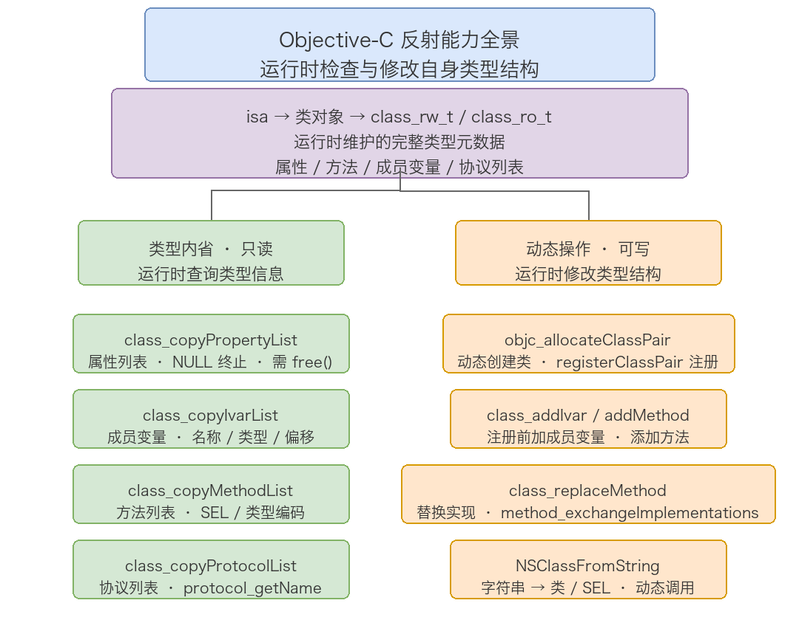
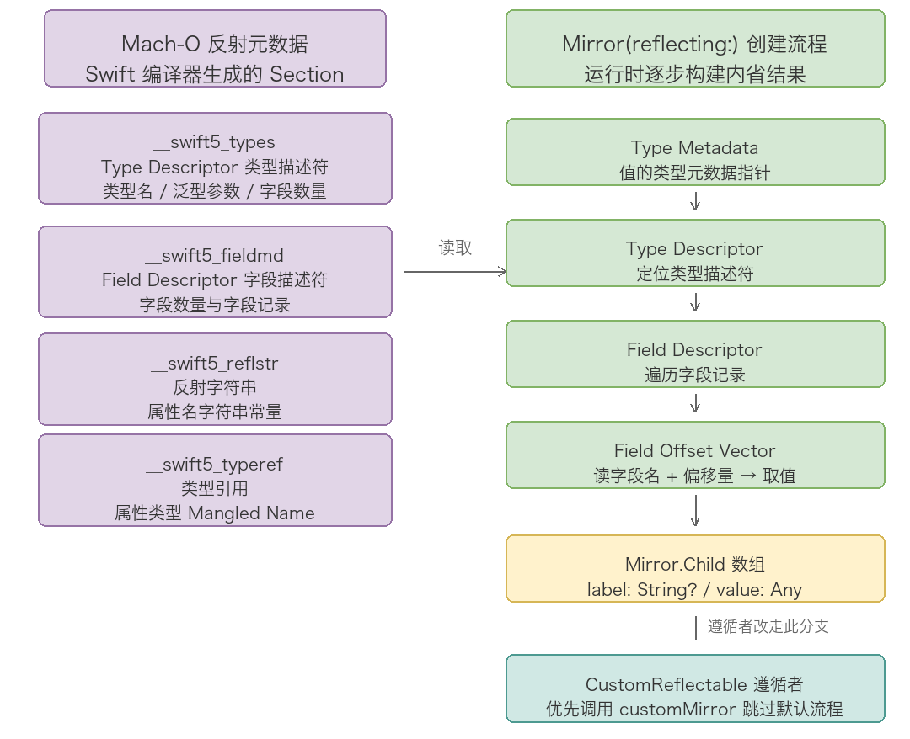

# 13. 反射机制分析

> 反射（Reflection）指程序在运行时检查、访问和修改自身结构（类型、属性、方法等）的能力。iOS 中有两套反射体系：Objective-C 依赖 Runtime 提供完整的动态反射——可读、可写、可增删改；Swift 则通过 Mirror 提供只读的内省——能看不能改。本文先拆 OC 这条线（类型内省、动态操作、字符串动态访问、局限性），再拆 Swift 这条线（Mirror 用法、底层元数据原理、局限性），然后给出两者的典型应用场景与对比，最后附高频面试问题。消息发送、消息转发、Method Swizzling 的完整链路见第 3 篇 Runtime 机制分析，本文只从「反射」这个视角切入，不重复展开。

## 目录

- [一、Objective-C 的反射能力](#一objective-c-的反射能力)
- [二、Swift 的反射能力](#二swift-的反射能力)
- [三、实际应用场景](#三实际应用场景)
- [四、OC 与 Swift 反射的对比](#四oc-与-swift-反射的对比)
- [五、常见面试问题](#五常见面试问题)
- [附：高频速记](#附高频速记)

## 一、Objective-C 的反射能力

OC 的反射能力完全建立在 Runtime 之上。Runtime 在运行时维护了完整的类型元数据——类对象、元类对象、方法列表、属性列表、成员变量列表、协议列表，并通过一系列 C 函数 API 暴露给开发者，使得程序可以在运行时动态查询和修改几乎所有类型信息。



按「只读」还是「可写」，这套能力可以分成两半：类型内省负责查，动态操作负责改。

### 1.1 类型内省：运行时查询类型信息

类型内省（Introspection）是反射中最基础的能力——在运行时查询一个对象「是什么、有什么」。

#### NSObject 提供的内省方法

NSObject 定义了一组内省方法，底层都依赖 isa 指针和类型元数据实现：

```objc
id obj = [[NSMutableArray alloc] init];

// 类型判断
[obj isKindOfClass:[NSArray class]];           // YES — 是否是某个类或其子类的实例
[obj isMemberOfClass:[NSMutableArray class]];  // YES — 是否是某个类的直接实例
[obj conformsToProtocol:@protocol(NSCoding)];  // 是否遵循某个协议

// 方法响应检查
[obj respondsToSelector:@selector(addObject:)]; // 是否能响应某个消息

// 获取类型信息
NSStringFromClass([obj class]);          // @"__NSArrayM"（真实的私有子类名）
NSStringFromSelector(@selector(count));  // @"count"
```

isKindOfClass: 和 isMemberOfClass: 的区别：前者沿继承链向上查找，后者只比较当前类。另外 [obj class] 返回的可能是私有子类——类簇 NSArray 的实际类是 __NSArrayI 或 __NSArrayM；而 object_getClass(obj) 获取的是 isa 真正指向的类，KVO 场景下会是 NSKVONotifying_ 前缀的动态子类（见第 6 篇 KVO 机制分析）。这两个细节在面试里经常被用来挖「你以为的类型」和「运行时真实的类型」之间的差距。

#### Runtime API 的类型查询

NSObject 的方法只能回答「是不是」，Runtime 的 C 函数 API 能进一步回答「有什么、长什么样」：

```objc
#import <objc/runtime.h>

Class cls = [MyClass class];

// 类名和继承关系
const char *name = class_getName(cls);           // "MyClass"
Class superCls = class_getSuperclass(cls);       // 父类
BOOL isMeta = class_isMetaClass(cls);            // 是否是元类
size_t size = class_getInstanceSize(cls);        // 实例大小（字节）

// 属性列表
unsigned int propCount;
objc_property_t *props = class_copyPropertyList(cls, &propCount);
for (unsigned int i = 0; i < propCount; i++) {
    const char *propName = property_getName(props[i]);
    const char *propAttrs = property_getAttributes(props[i]);
    NSLog(@"属性: %s, 特性: %s", propName, propAttrs);
}
free(props);

// 成员变量列表
unsigned int ivarCount;
Ivar *ivars = class_copyIvarList(cls, &ivarCount);
for (unsigned int i = 0; i < ivarCount; i++) {
    const char *ivarName = ivar_getName(ivars[i]);
    const char *ivarType = ivar_getTypeEncoding(ivars[i]);
    ptrdiff_t offset = ivar_getOffset(ivars[i]);
    NSLog(@"成员变量: %s, 类型编码: %s, 偏移量: %td", ivarName, ivarType, offset);
}
free(ivars);

// 方法列表
unsigned int methodCount;
Method *methods = class_copyMethodList(cls, &methodCount);
for (unsigned int i = 0; i < methodCount; i++) {
    SEL sel = method_getName(methods[i]);
    const char *typeEncoding = method_getTypeEncoding(methods[i]);
    NSLog(@"方法: %@, 类型编码: %s", NSStringFromSelector(sel), typeEncoding);
}
free(methods);

// 协议列表
unsigned int protocolCount;
Protocol * __unsafe_unretained *protocols = class_copyProtocolList(cls, &protocolCount);
for (unsigned int i = 0; i < protocolCount; i++) {
    NSLog(@"协议: %s", protocol_getName(protocols[i]));
}
free(protocols);
```

四个 copy 函数的返回值都是 copy 语义的数组，内部用 malloc 分配，调用方必须手动 free，否则内存泄漏。runtime.h 对 class_copyPropertyList 的注释里还有一句容易被忽略的话：

> Any properties declared by superclasses are not included.

也就是说 class_copyPropertyList 和 class_copyIvarList 都只返回本类声明的属性和成员变量，父类的不在其中。字典转模型框架要处理继承链时，需要自己沿着 class_getSuperclass 一层层向上重复拷贝。数组末尾还带一个 NULL 终止符，所以即便不传 outCount 也能确定边界。

#### 类型编码

Runtime 用类型编码（Type Encoding）字符串描述类型信息。编译器为每个方法的返回值和参数生成对应编码，存在方法元数据里。常见编码：

| 编码 | 类型 | 编码 | 类型 |
| ---- | ---- | ---- | ---- |
| `c` | char | `i` | int |
| `s` | short | `l` | long |
| `q` | long long | `f` | float |
| `d` | double | `B` | BOOL（C++ bool） |
| `v` | void | `@` | id（ObjC 对象） |
| `#` | Class | `:` | SEL |
| `^type` | type 指针 | `{name=...}` | struct |

"v@:" 表示返回 void、参数为 id（self）和 SEL（_cmd），这是最常见的无参方法编码。带偏移的完整形式如 "@24@0:8@16"：返回 id、参数总大小 24 字节、self 在偏移 0、_cmd 在偏移 8、第三个参数 id 在偏移 16。

属性的特性编码（property_getAttributes 的返回值）是另一套格式。例如 "T@\"NSString\",C,N,V_name" 表示：类型是 NSString *、copy 语义、nonatomic、对应实例变量名 _name。

| 属性编码 | 含义 |
| ---- | ---- |
| `T` | 类型 |
| `R` | readonly |
| `C` | copy |
| `&` | retain/strong |
| `N` | nonatomic |
| `W` | weak |
| `V` | 实例变量名 |

解析属性特性编码是字典转模型时判断「这个属性该不该 copy」「是不是 weak」的依据，MJExtension、YYModel 内部都有一套完整的编码解析器。

### 1.2 动态操作：运行时修改类型结构

OC Runtime 的反射不止「查看」，还支持运行时动态修改类型结构。

#### 动态创建类

```objc
// 1. 创建 NSObject 的子类 "DynamicPerson"
Class PersonClass = objc_allocateClassPair([NSObject class], "DynamicPerson", 0);

// 2. 添加成员变量（必须在 objc_registerClassPair 之前）
class_addIvar(PersonClass, "_name", sizeof(NSString *),
              log2(sizeof(NSString *)), @encode(NSString *));
class_addIvar(PersonClass, "_age", sizeof(int), log2(sizeof(int)), @encode(int));

// 3. 添加方法
class_addMethod(PersonClass, @selector(description), (IMP)personDescription, "@@:");

// 4. 注册类（注册后才能使用）
objc_registerClassPair(PersonClass);

// 5. 使用
id person = [[PersonClass alloc] init];
[person setValue:@"Tom" forKey:@"name"];
NSLog(@"%@", person);  // 调用 personDescription

NSString *personDescription(id self, SEL _cmd) {
    Ivar nameIvar = class_getInstanceVariable([self class], "_name");
    NSString *name = object_getIvar(self, nameIvar);
    return [NSString stringWithFormat:@"DynamicPerson: %@", name];
}
```

为什么注册后就不能再加成员变量？objc_registerClassPair 会把 instanceSize、ivar 布局固化进 class_ro_t，实例内存大小从此确定，再加 ivar 会让已创建实例的内存布局失效。而方法、属性、协议存在可写的 class_rw_t 里，注册后随时可以添加。

runtime.h 对 class_addIvar 的注释还有三条硬性约束值得记下：

1. 只能在 objc_allocateClassPair 之后、objc_registerClassPair 之前调用，给已存在的类添加 ivar 是不支持的；
2. 不能给元类添加 ivar；
3. alignment 参数是最小对齐字节数的 2 的幂（1 << align），指针类型传 log2(sizeof(pointer_type))。

KVO 的 NSKVONotifying_ 动态子类、以及部分热修复框架，底层都是 objc_allocateClassPair 这条路径。

#### 动态方法操作

```objc
// 添加方法
class_addMethod([MyClass class], @selector(newMethod), (IMP)newMethodIMP, "v@:");

// 替换方法实现
class_replaceMethod([MyClass class], @selector(existingMethod), (IMP)newIMP, "v@:");

// 交换两个方法的实现
Method m1 = class_getInstanceMethod([MyClass class], @selector(method1));
Method m2 = class_getInstanceMethod([MyClass class], @selector(method2));
method_exchangeImplementations(m1, m2);

// 获取和设置方法实现
IMP oldIMP = method_getImplementation(m1);
method_setImplementation(m1, (IMP)customIMP);
```

这组 API 里有两个注释里的语义细节容易踩坑。

class_addMethod 的注释明确写道：「class_addMethod will add an override of a superclass's implementation, but will not replace an existing implementation in this class」——如果本类已有该方法的实现，class_addMethod 直接返回 NO，什么也不做；它只会在本类没有实现时添加（相当于覆盖父类实现）。想改已有实现要用 method_setImplementation 或 class_replaceMethod。

class_replaceMethod 则是两种行为的合体：方法不存在时等价于 class_addMethod（使用传入的 types 编码）；方法已存在时等价于 method_setImplementation（忽略 types 参数）。这个「二合一」行为也是消息转发流程里动态方法解析阶段的标准配合——resolveInstanceMethod 里先用 class_addMethod，失败再走转发。

Method Swizzling 的完整原理见第 3 篇 Runtime 机制分析，此处不重复。

#### 通过字符串动态访问

OC 反射支持字符串和运行时对象的双向转换：

```objc
// 字符串 → 类
Class cls = NSClassFromString(@"UIViewController");
id vc = [[cls alloc] init];

// 字符串 → SEL
SEL sel = NSSelectorFromString(@"viewDidLoad");
if ([vc respondsToSelector:sel]) {
    [vc performSelector:sel];
}

// 反向转换
NSString *className = NSStringFromClass([vc class]);   // @"UIViewController"
NSString *selName = NSStringFromSelector(sel);         // @"viewDidLoad"
```

这在路由系统、模块解耦等场景中大量使用。组件化架构里，A 模块不需要 import B 模块的头文件，通过 NSClassFromString 和 NSSelectorFromString 就能动态创建对象、调用方法（完整例子见第三章 3.4）。

注意 NSClassFromString 找不到类时返回 nil 而不是崩溃，调用方必须判空。另一个容易忽略的点：Swift 类在 Runtime 里的名称带模块名前缀（如 MyApp.MyViewController），跨语言动态创建时必须传完整的「模块名.类名」。

### 1.3 Objective-C 反射的局限

Runtime 的反射能力很强大，但边界也很清楚：

1. 无法获取局部变量：Runtime 只能访问类的元数据（成员变量、方法等），函数内部的局部变量在栈上分配，不在 Runtime 管辖范围内；
2. 类型编码信息有限：泛型参数会被擦除，NSArray<NSString *> 的类型编码只有 @"NSArray"，运行时拿不到集合元素类型；
3. 安全性风险：Runtime 允许访问私有成员变量、修改方法实现，灵活性极大但也带来稳定性风险，App Store 审核会拒绝使用私有 API 的应用；
4. Swift 类型不完全兼容：纯 Swift 的 struct、enum 没有 OC Runtime 元数据，只有继承自 NSObject 的类才能使用 OC 反射 API。

## 二、Swift 的反射能力

Swift 的反射设计哲学与 OC 截然不同：OC 追求运行时最大灵活性，Swift 以编译时安全和性能优先，只提供有限的只读内省。

### 2.1 Mirror：Swift 的内省机制

Mirror 是 Swift 标准库提供的反射 API，能在运行时检查任意值的结构，但只支持只读内省——可以查看，不能修改。

```swift
struct Person {
    let name: String
    var age: Int
    private var secret: String = "hidden"
}

let person = Person(name: "Tom", age: 25)
let mirror = Mirror(reflecting: person)

// 类型信息
print(mirror.subjectType)        // Person
print(mirror.displayStyle)       // Optional(.struct)

// 遍历所有存储属性（包括 private）
for child in mirror.children {
    print("\(child.label ?? "nil"): \(child.value)")
}
// 输出：
// name: Tom
// age: 25
// secret: hidden
```

Mirror 有三个关键特点：

1. 能访问 private 属性：Mirror 绕过了 Swift 的访问控制，能看到所有存储属性；
2. 只反映存储属性：计算属性不会出现在 children 里；
3. 值是 Any 类型：child.value 的类型是 Any，使用前需要类型转换。

### 2.2 Mirror.Child 与 displayStyle

children 的元素类型是 Mirror.Child，一个 (label: String?, value: Any) 的命名元组：

```swift
for child in mirror.children {
    let label = child.label   // 属性名（可选，元组元素可能没有名字）
    let value = child.value   // 属性值（Any 类型）
    let valueMirror = Mirror(reflecting: value)
    print("属性: \(label ?? "?"), 值: \(value), 类型: \(valueMirror.subjectType)")
}
```

label 是 Optional，因为并非所有子结构都有名字——元组元素、数组元素就没有 label。对 value 再套一层 Mirror 就能递归展开任意深度的结构，标准库的 dump() 函数内部就是这么做的。

displayStyle 表示被反射值的展示风格，用于判断值的类型分类：

| displayStyle | 对应类型 |
| ---- | ---- |
| `.struct` | 结构体 |
| `.class` | 类 |
| `.enum` | 枚举 |
| `.tuple` | 元组 |
| `.optional` | Optional |
| `.collection` | Array |
| `.dictionary` | Dictionary |
| `.set` | Set |
| `nil` | 基础类型（Int、String 等） |

### 2.3 继承链反射

对类继承体系，Mirror 的 superclassMirror 可以获取父类的 Mirror，从而遍历整条继承链的属性：

```swift
class Animal {
    var species: String = "Unknown"
}

class Dog: Animal {
    var name: String = "Buddy"
    var breed: String = "Labrador"
}

let dog = Dog()
var currentMirror: Mirror? = Mirror(reflecting: dog)

while let mirror = currentMirror {
    print("--- \(mirror.subjectType) ---")
    for child in mirror.children {
        print("  \(child.label ?? "?"): \(child.value)")
    }
    currentMirror = mirror.superclassMirror
}
// 输出：
// --- Dog ---
//   name: Buddy
//   breed: Labrador
// --- Animal ---
//   species: Unknown
```

注意 Mirror(reflecting: dog) 的 children 只包含 Dog 自身定义的属性，不包含从 Animal 继承的属性——这一点和 OC 的 class_copyPropertyList 行为一致。要拿继承属性，得沿 superclassMirror 逐层向上。

### 2.4 枚举的反射

Mirror 对枚举有特殊处理：有关联值的 case，label 是 case 名称，value 是关联值（多个关联值时是元组）；无关联值的 case 不进 children：

```swift
enum NetworkError {
    case timeout
    case serverError(code: Int, message: String)
    case noConnection
}

let error = NetworkError.serverError(code: 500, message: "Internal Server Error")
let mirror = Mirror(reflecting: error)

print(mirror.displayStyle)       // Optional(.enum)

for child in mirror.children {
    print("case: \(child.label ?? "?"), 关联值: \(child.value)")
}
// 输出：
// case: serverError, 关联值: (code: 500, message: "Internal Server Error")
```

对 .timeout 这种无关联值的 case，children 为空，此时用 String(describing:) 直接拿 case 名称即可。

### 2.5 Mirror 的底层原理

Mirror 不是简单的语法糖，它的底层依赖 Swift 编译器在 Mach-O 中生成的元数据。



编译器会在 Mach-O 的特定 Section 里写入反射所需的元数据：

| Section | 内容 | 用途 |
| ---- | ---- | ---- |
| `__swift5_fieldmd` | 字段描述符（Field Descriptor） | 每个类型的存储属性名称和类型引用 |
| `__swift5_reflstr` | 反射字符串 | 属性名称的字符串常量 |
| `__swift5_types` | 类型描述符（Type Descriptor） | 类型的名称、泛型参数、字段数量等 |
| `__swift5_typeref` | 类型引用 | 属性类型的 Mangled Name 引用 |

Mirror(reflecting:) 的创建流程分五步：

1. 获取 value 的类型元数据指针（Type Metadata）——每个 Swift 类型的元数据在运行时都有固定布局；
2. 通过元数据找到 Type Descriptor，再从中定位 Field Descriptor；
3. 遍历 Field Descriptor 中的字段记录；
4. 每个字段读两样东西：字段名（从 __swift5_reflstr 取字符串）和字段偏移量（从类型元数据的 Field Offset Vector 区域取），字段值就是 value 内存地址加偏移量处读出的内容；
5. 把所有字段包装成 Mirror.Child 数组返回。

偏移量的存放位置有个区分：struct 的字段偏移在编译期就确定，直接存在元数据固定位置；class 因为可能有继承和运行时布局调整，偏移量在类初始化时计算存储。这也是为什么访问一个还没初始化完成的 Swift 类属性会拿到垃圾值——Mirror 读值走的就是「地址 + 偏移」这种最原始的方式，没有任何访问检查。

还有一条分支：如果值遵循了 CustomReflectable 协议，Mirror 会优先调用 customMirror 属性拿自定义结果，跳过上面整个元数据反射流程。

### 2.6 CustomReflectable 自定义反射

Swift 允许类型通过 CustomReflectable 协议自定义反射行为：

```swift
struct Credentials: CustomReflectable {
    let username: String
    let password: String

    var customMirror: Mirror {
        Mirror(self, children: [
            "username": username,
            "password": String(repeating: "*", count: password.count)
        ])
    }
}

let creds = Credentials(username: "admin", password: "secret123")
let mirror = Mirror(reflecting: creds)
for child in mirror.children {
    print("\(child.label ?? "?"): \(child.value)")
}
// 输出：
// username: admin
// password: *********
```

典型用途是调试输出和日志：隐藏敏感字段（密码、token），或者把复杂的内部结构转成更易读的形式。dump()、playground 的显示、错误描述里用到的反射结果都会被 customMirror 接管。

### 2.7 Swift 反射的局限

Mirror 提供的是有限的内省能力，与 OC Runtime 的完整反射相比限制明显：

| 能力 | OC Runtime | Swift Mirror |
| ---- | ---- | ---- |
| 读取属性值 | 支持 | 支持 |
| 修改属性值 | 支持（object_setIvar） | 不支持 |
| 获取方法列表 | 支持（class_copyMethodList） | 不支持 |
| 调用任意方法 | 支持（objc_msgSend） | 不支持 |
| 动态添加方法 | 支持（class_addMethod） | 不支持 |
| 动态创建类型 | 支持（objc_allocateClassPair） | 不支持 |
| 获取协议列表 | 支持（class_copyProtocolList） | 不支持 |
| 访问私有属性 | 支持 | 支持（只读） |

Swift 是故意限制反射能力的，这是设计上的取舍：

1. 编译时安全：Swift 强调类型安全，大量类型检查在编译期完成，不鼓励运行时动态操作；
2. 性能优化：Swift 编译器依赖静态类型信息做优化（内联、泛型特化），支持完整反射的话很多优化无法进行；
3. 二进制大小：完整的反射元数据会显著增加包体积，-Osize 优化级别下编译器甚至会裁剪部分反射元数据。

## 三、实际应用场景

### 3.1 通用调试输出

利用 Mirror 可以实现通用的对象描述函数，自动打印所有属性。Swift 标准库已经内置了全局 dump() 函数，内部基于 Mirror 实现，递归打印对象的属性结构，日常调试直接用：

```swift
func dump<T>(_ value: T, indent: Int = 0) -> String {
    let mirror = Mirror(reflecting: value)
    let prefix = String(repeating: "  ", count: indent)

    if mirror.children.isEmpty {
        return "\(value)"
    }

    var lines = ["\(mirror.subjectType) {"]
    for child in mirror.children {
        let childDesc = dump(child.value, indent: indent + 1)
        lines.append("\(prefix)  \(child.label ?? "?"): \(childDesc)")
    }
    lines.append("\(prefix)}")
    return lines.joined(separator: "\n")
}
```

### 3.2 JSON 序列化

Mirror 可以实现简单的 JSON 序列化（实际项目应优先用 Codable，见参考 Codable 底层原理）：

```swift
func toJSON<T>(_ value: T) -> Any {
    let mirror = Mirror(reflecting: value)

    if mirror.children.isEmpty {
        return value
    }

    if mirror.displayStyle == .collection {
        return mirror.children.map { toJSON($0.value) }
    }

    if mirror.displayStyle == .dictionary {
        var dict: [String: Any] = [:]
        for child in mirror.children {
            if let pair = child.value as? (key: AnyHashable, value: Any) {
                dict["\(pair.key)"] = toJSON(pair.value)
            }
        }
        return dict
    }

    var dict: [String: Any] = [:]
    for child in mirror.children {
        guard let label = child.label else { continue }
        let childMirror = Mirror(reflecting: child.value)
        if childMirror.displayStyle == .optional {
            if let firstChild = childMirror.children.first {
                dict[label] = toJSON(firstChild.value)
            }
        } else {
            dict[label] = toJSON(child.value)
        }
    }
    return dict
}
```

实现里能看到 Mirror 的几个细节在实际起作用：displayStyle 区分集合和字典；Optional 在 Mirror 里是一层 .optional 包装，真实值藏在 children.first 里；label 为 nil 的子结构直接跳过。

### 3.3 OC 字典转模型

这是 OC Runtime 反射最经典的应用——利用 class_copyPropertyList 或 class_copyIvarList 自动完成字典到模型的映射：

```objc
+ (instancetype)modelWithDict:(NSDictionary *)dict {
    id obj = [[self alloc] init];

    unsigned int count;
    objc_property_t *props = class_copyPropertyList(self, &count);

    for (unsigned int i = 0; i < count; i++) {
        NSString *propName = [NSString stringWithUTF8String:property_getName(props[i])];
        id value = dict[propName];
        if (value && value != [NSNull null]) {
            [obj setValue:value forKey:propName];
        }
    }

    free(props);
    return obj;
}
```

核心思路五步：拷贝属性列表 → property_getName 拿属性名 → 以属性名为 key 从字典取值 → KVC 的 setValue:forKey: 赋值 → free 释放。MJExtension、YYModel 的核心思路就是这个，完整实现还要处理类型转换（字符串转数字）、嵌套模型递归、数组元素类型识别、属性名与 JSON key 的映射、NSNull 处理。YYModel 为追求性能，用 objc_msgSend 直接调 setter 代替 KVC，并缓存属性类型信息避免重复解析。

### 3.4 路由系统

组件化架构中，模块间通过路由解耦通信，核心依赖 OC 的字符串-类型转换能力：

```objc
- (UIViewController *)viewControllerForURL:(NSURL *)url {
    NSString *path = url.path;  // 例如 "/user/profile"

    // 路由表：URL path → 类名
    NSDictionary *routeMap = @{
        @"/user/profile": @"UserProfileViewController",
        @"/order/detail": @"OrderDetailViewController",
    };

    NSString *className = routeMap[path];
    if (!className) return nil;

    Class cls = NSClassFromString(className);
    if (!cls) return nil;

    UIViewController *vc = [[cls alloc] init];

    // 通过 URL 参数自动设置属性
    NSDictionary *params = [self parseQueryParams:url];
    for (NSString *key in params) {
        if ([vc respondsToSelector:NSSelectorFromString(@"setUserId:")]) {
            [vc setValue:params[key] forKey:key];
        }
    }

    return vc;
}
```

短短一段代码集中了 OC 反射的多个能力：NSClassFromString 动态建类、NSSelectorFromString 动态构造 SEL、respondsToSelector: 运行时内省检查、KVC 的 setValue:forKey: 字符串动态赋值。生产级路由框架（如 JLRoutes、蘑菇街的 MGJRouter）在此基础上增加了注册制路由表、参数白名单、懒加载等设计，但底层都离不开这几个反射原语。

### 3.5 自动化测试辅助

利用 Mirror 验证模型对象的属性是否符合预期，无需为每个属性手写断言：

```swift
func assertEqual<T>(_ actual: T, _ expected: T, file: StaticString = #file, line: UInt = #line) {
    let actualMirror = Mirror(reflecting: actual)
    let expectedMirror = Mirror(reflecting: expected)

    for (actualChild, expectedChild) in zip(actualMirror.children, expectedMirror.children) {
        let actualStr = String(describing: actualChild.value)
        let expectedStr = String(describing: expectedChild.value)
        if actualStr != expectedStr {
            print("属性 \(actualChild.label ?? "?") 不匹配: 实际=\(actualStr), 期望=\(expectedStr)")
        }
    }
}
```

## 四、OC 与 Swift 反射的对比

| 维度 | Objective-C Runtime | Swift Mirror |
| ---- | ---- | ---- |
| 设计理念 | 最大灵活性，运行时决定一切 | 编译时安全优先，运行时内省为辅 |
| 反射深度 | 完整反射（读/写/增/删/改） | 只读内省（只能查看） |
| 支持类型 | ObjC 类（继承自 NSObject） | 所有 Swift 类型（struct/class/enum/tuple） |
| 方法反射 | 支持（方法列表、动态调用） | 不支持 |
| 属性修改 | 支持（object_setIvar、KVC） | 不支持 |
| 性能 | 有运行时开销（哈希查找、间接跳转） | 有运行时开销（元数据查找、Any 装箱） |
| 安全性 | 低（可访问私有 API、修改内部实现） | 高（只读，不影响运行时行为） |
| 元数据存储 | class_rw_t / class_ro_t | Mach-O 的 __swift5_fieldmd 等 Section |

对于继承自 NSObject 的 Swift 类，两套反射系统可以共存，但覆盖面不同：

```swift
class MyObject: NSObject {
    @objc var name: String = "Tom"
    var age: Int = 25    // 非 @objc 属性
}

let obj = MyObject()

// Swift Mirror：能看到所有存储属性
let mirror = Mirror(reflecting: obj)
for child in mirror.children {
    print("\(child.label ?? "?"): \(child.value)")
}
// name: Tom
// age: 25

// OC Runtime：只能看到 @objc 属性
var count: UInt32 = 0
let properties = class_copyPropertyList(type(of: obj), &count)
for i in 0..<Int(count) {
    let name = String(cString: property_getName(properties![i]))
    print("OC property: \(name)")
}
free(properties)
// OC property: name（age 不会出现，因为没有 @objc 标记）
```

记住这个差异的关键：OC Runtime 的元数据只来自 @objc 暴露给 OC 的部分；Mirror 读的是 Swift 自己的反射元数据，覆盖所有存储属性。同一个对象，两套系统看到的是两个不同颗粒度的视图。

## 五、常见面试问题

### Q1：iOS 中有哪些反射机制？OC 和 Swift 的反射有什么区别？

iOS 有两套反射机制。

OC Runtime 反射：完整的动态反射。通过 Runtime API 可以在运行时获取类的属性列表、方法列表、成员变量列表、协议列表，还可以动态创建类（objc_allocateClassPair）、添加方法（class_addMethod）、修改实现（method_setImplementation）、通过字符串创建对象（NSClassFromString）。元数据存在类对象的 class_rw_t / class_ro_t 结构中，只支持 ObjC 类。

Swift Mirror 反射：有限的只读内省。通过 Mirror(reflecting:) 可以获取任意 Swift 值的类型名、存储属性名和值、displayStyle，通过 superclassMirror 遍历继承链。底层依赖编译器在 Mach-O 中生成的元数据（__swift5_fieldmd、__swift5_reflstr 等 Section），支持所有 Swift 类型，但不能修改属性、不能拿方法列表、不能动态调用方法。

核心区别一句话：OC 追求最大灵活性（可读可写可改），Swift 追求编译时安全（只读内省）。对 NSObject 子类，两套系统共存，但 OC 只能看到 @objc 标记的成员。

### Q2：Swift 的 Mirror 底层是怎么实现的？

Mirror 底层依赖 Swift 编译器在 Mach-O 中生成的四个反射 Section：

- __swift5_types：类型描述符，存类型名、泛型参数、字段数量、Field Descriptor 的相对偏移；
- __swift5_fieldmd：字段描述符，存每个类型的字段数量和字段记录（名称引用 + 类型引用）；
- __swift5_reflstr：属性名字符串常量；
- __swift5_typeref：字段类型的 Mangled Name 引用。

创建 Mirror(reflecting: value) 时，Runtime 先通过值的类型元数据指针找到 Type Descriptor，经其中的引用定位 Field Descriptor，然后逐字段读取名称（__swift5_reflstr）和偏移量（元数据的 Field Offset Vector），从 value 内存地址加偏移处取出字段值，构建 Mirror.Child 数组。struct 偏移编译期固定，class 偏移在类初始化时计算。若类型遵循 CustomReflectable，则优先调用 customMirror 跳过整个默认流程。

### Q3：OC 的字典转模型是怎么通过反射实现的？

核心思路：Runtime 拿属性列表，KVC 完成赋值。

1. class_copyPropertyList（或 class_copyIvarList）获取属性列表；
2. 遍历列表，property_getName 取属性名；
3. 以属性名为 key 从字典取值；
4. setValue:forKey: 赋值给模型对象；
5. free 释放属性数组。

生产级框架还要补：类型转换、嵌套模型递归、数组元素类型识别（通常约定一个返回元素类型的类方法）、属性名与 JSON key 的映射、NSNull 处理。YYModel 额外用 objc_msgSend 直调 setter 代替 KVC、缓存属性元信息，把反射开销压到最低。

### Q4：NSClassFromString 在什么场景下使用？有什么注意事项？

常见场景：

1. 路由系统：组件化架构里 URL → 类名 → NSClassFromString → 创建对象，实现模块解耦；
2. 动态加载：根据配置或服务端下发的类名，动态创建不同的 VC 或策略对象；
3. 避免硬依赖：使用某个类但不想直接 import 头文件时（如可选依赖的 SDK）。

注意事项：

- 类不存在时返回 nil 而非崩溃，必须判空；
- Swift 类在 Runtime 中的名字带模块名前缀，必须传「模块名.类名」完整格式（如 MyApp.MyViewController），否则返回 nil；如果 Swift 类标记了 @objc(CustomName)，则用括号里的名字；
- 不要在性能敏感路径频繁调用，内部涉及全局类表的哈希查找。

## 附：高频速记

- 两套体系：OC Runtime 完整反射（读/写/增/删/改），Swift Mirror 只读内省（可看不可改）。
- 内省四件套：isKindOfClass:（含子类）、isMemberOfClass:（仅本类）、conformsToProtocol:、respondsToSelector:，底层全靠 isa 和元数据。
- 四个 copy API：class_copyPropertyList / copyIvarList / copyMethodList / copyProtocolList，只含本类声明（父类不含）、NULL 终止、必须 free。
- 类型编码："v@:" 即 void 返回 + self + _cmd；属性特性编码 "T@\"NSString\",C,N,V_name" 含类型/语义/ivar 名。
- 动态建类铁律：addIvar 必须在 registerClassPair 之前；注册后 instanceSize 冻结；方法属性协议随时可加（存于 class_rw_t）。
- class_addMethod 不替换本类已有实现（返回 NO）；class_replaceMethod 二合一（无则 add，有则 setImplementation）。
- 字符串互换：NSClassFromString / NSSelectorFromString 正向，NSStringFromClass / NSStringFromSelector 反向；Swift 类需「模块名.类名」。
- Mirror 三特点：可看 private、只反映存储属性、值是 Any；继承属性要沿 superclassMirror 逐层向上。
- Mirror 元数据四 Section：__swift5_types / __swift5_fieldmd / __swift5_reflstr / __swift5_typeref；读值 = 内存地址 + Field Offset Vector 偏移。
- 自定义反射：遵循 CustomReflectable，实现 customMirror 属性，优先于默认元数据反射。
- 经典应用：OC 字典转模型（MJExtension/YYModel）、路由解耦（NSClassFromString）、Swift 调试输出（dump）。
- NSObject 子类两套共存：Mirror 看到全部存储属性，OC Runtime 只看到 @objc 成员。
