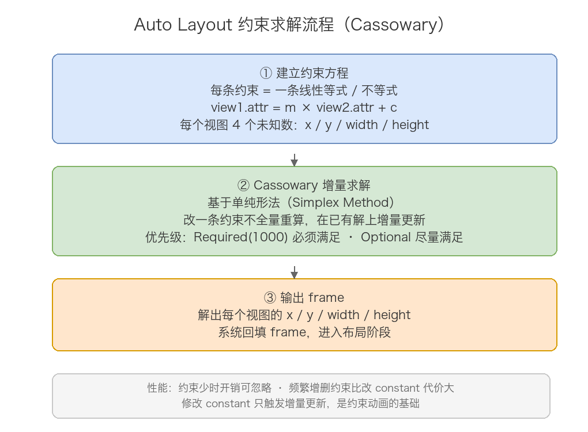
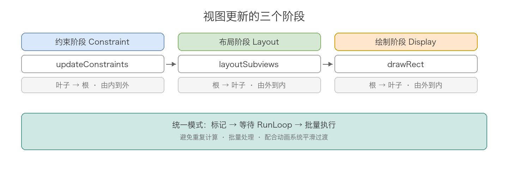
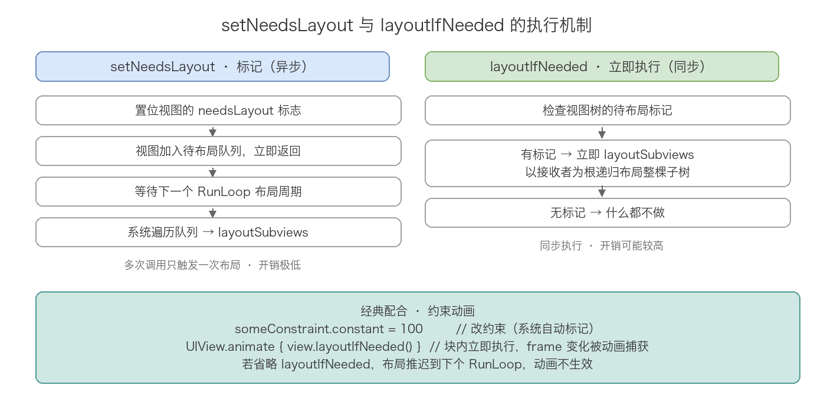

# 14. iOS 布局方法详解

> 本文系统梳理 iOS 布局体系：三种布局方式（Frame、Auto Layout、UIStackView）的原理与选型，Auto Layout 背后的 Cassowary 约束求解算法，视图更新的三个阶段（约束、布局、绘制），以及 `updateConstraints`、`layoutSubviews`、`setNeedsLayout`、`layoutIfNeeded`、`setNeedsDisplay` 等方法的作用、调用时机与区别。源码依据 Xcode 26 iOS SDK 真实头文件（NSLayoutConstraint.h / NSLayoutAnchor.h / UIStackView.h / UIView.h）。

## 目录

- 一、三种布局方式：Frame、Auto Layout、UIStackView
- 二、Frame 布局：直接指定位置与大小
- 三、Auto Layout：约束化布局体系
- 四、UIStackView：自动管理约束的容器
- 五、三种布局方式对比
- 六、视图更新三阶段
- 七、约束阶段：updateConstraints
- 八、布局阶段：layoutSubviews 与两个触发方法
- 九、绘制阶段：setNeedsDisplay 与 drawRect
- 十、UIView 与 CALayer：布局背后的分工
- 十一、实际应用场景
- 十二、常见面试题
- 附：高频速记

## 一、三种布局方式：Frame、Auto Layout、UIStackView

iOS 提供三种主要布局方式，按出现时间排列：

| 布局方式 | 引入版本 | 核心思想 | 核心 API |
|---------|---------|---------|-----|
| Frame 布局 | iOS 2 | 直接指定视图的位置和大小 | frame、bounds、center |
| Auto Layout | iOS 6 | 通过约束描述视图间关系，系统求解 frame | NSLayoutConstraint、NSLayoutAnchor |
| UIStackView | iOS 9 | 线性排列子视图，自动管理约束 | UIStackView |

三者是层层递进的关系：Frame 是最原始的手动模式；Auto Layout 把「计算」交给系统，开发者只声明关系；UIStackView 再把「关系声明」也封装掉，只暴露排列属性。实际项目中三者经常混合使用。

## 二、Frame 布局：直接指定位置与大小

```swift
let label = UILabel()
label.frame = CGRect(x: 20, y: 100, width: 200, height: 44)
view.addSubview(label)
```

frame 直接给出视图在父视图坐标系中的位置与大小，设置后立即生效，不需要任何求解过程。

优点：

- 性能最好，没有约束求解开销
- 逻辑直观，所见即所得
- 完全可控，适合像素级精确控制

缺点：

- 所有数值都要手动计算，屏幕适配（iPhone SE 到 iPad）全靠手写判断
- 动态内容（文字长度变化、字体缩放）需要手动重新计算 frame
- 维护成本高，界面一复杂就成了「算数题」

适用场景：简单固定布局、性能敏感场景（复杂 cell 的手动布局）、需要频繁更新 frame 的动画。

## 三、Auto Layout：约束化布局体系

### 3.1 约束的本质：线性方程

Auto Layout 中开发者不设置 frame，而是声明视图之间的关系，例如「label 左边距父视图左边 20pt」。每条约束在数学上就是一条线性等式或不等式：

```
view1.attr1 = view2.attr2 × multiplier + constant
```

头文件里 `constraintWithItem:` 方法的注释直接给出了这个公式（`firstItem.firstAttribute {==,<=,>=} secondItem.secondAttribute * multiplier + constant`）。所有约束组合成一个线性方程组，每个视图有 4 个未知数：x、y、width、height。

### 3.2 三种创建约束的 API

```objc
// 方式一：constraintWithItem 工厂方法（iOS 6+，官方已不推荐）
[NSLayoutConstraint constraintWithItem:label attribute:NSLayoutAttributeLeading
    relatedBy:NSLayoutRelationEqual toItem:view attribute:NSLayoutAttributeLeading
    multiplier:1.0 constant:20];

// 方式二：VFL 可视化格式语言（iOS 6+）
[NSLayoutConstraint constraintsWithVisualFormat:@"H:|-20-[label(200)]"
    options:0 metrics:nil views:@{@"label": label}];

// 方式三：Anchor 锚点 API（iOS 9+，官方推荐）
[label.leadingAnchor constraintEqualToAnchor:view.leadingAnchor constant:20];
```

头文件注释明确写道：constraintWithItem 的使用不被推荐（not recommended），约束应该用 view 上的 anchor 对象创建。Anchor API 让约束代码从「一行参数八连」变成可读的链式描述。

### 3.3 NSLayoutAnchor 体系

Anchor 把视图的每条边、中心点、宽高都包装成锚点对象，按维度分为三个子类：

| 类 | 对应锚点 | 特有方法 |
|---|---------|---------|
| NSLayoutXAxisAnchor | leadingAnchor、trailingAnchor、leftAnchor、rightAnchor、centerXAnchor | anchorWithOffsetToAnchor: |
| NSLayoutYAxisAnchor | topAnchor、bottomAnchor、centerYAnchor、firstBaselineAnchor | anchorWithOffsetToAnchor: |
| NSLayoutDimension | widthAnchor、heightAnchor | constraintEqualToConstant:、constraintEqualToAnchor:multiplier: |

两个容易忽略的细节，都来自头文件注释：

- Anchor 的 `constraintEqualToAnchor:` 系列方法返回的是未激活（inactive）的约束，需要设置 `active = YES` 或调用 `NSLayoutConstraint activateConstraints:` 才生效
- iOS 11 新增 `constraintEqualToSystemSpacingAfterAnchor:` 系列方法，直接使用系统标准间距，适配动态字体时不用硬编码 8/16/20 这类魔法数字

### 3.4 NSLayoutConstraint 关键属性

```objc
@interface NSLayoutConstraint : NSObject
@property UILayoutPriority priority;
@property CGFloat constant;
@property (getter=isActive) BOOL active;
@property (nullable, copy) NSString *identifier;
@end
```

头文件注释里有四条重要约束规则：

- priority 只能在初始化阶段或约束处于 optional 状态时修改。约束被添加到视图后，把优先级从 required（1000）改走（或改回）会直接抛异常
- constant 是唯一可以在约束创建后随意修改的属性，并且头文件明确说明：修改已有约束的 constant，比移除旧约束再添加一个只差 constant 的新约束，性能好得多（performs much better）。这是约束动画和cell 动态高度的基础
- active 默认为 NO，只有激活的约束参与布局计算；激活两个没有共同祖先（no common ancestor）的 item 之间的约束会抛异常
- identifier 用于调试，会打印在约束的描述里；NS、UI 前缀被系统保留

### 3.5 translatesAutoresizingMaskIntoConstraints

```objc
/* By default, the autoresizing mask on a view gives rise to constraints that fully determine 
 the view's position. ... When you elect to position the view using auto layout by adding your 
 own constraints, you must set this property to NO. */
@property(nonatomic) BOOL translatesAutoresizingMaskIntoConstraints;
```

这个属性默认为 YES，作用是把 autoresizing mask 转换成一组完全确定视图位置的约束。用代码写 Auto Layout 时最常见的崩溃「Unable to simultaneously satisfy constraints」，根源就是忘了把它设为 NO：系统生成的 autoresizing 约束和你手写的约束打架了。IB 里拖的视图会自动设为 NO，纯代码必须手动设置。

### 3.6 Cassowary 求解算法



Auto Layout 的核心是 Cassowary 约束求解算法，整个过程分三步：

第一步，把每条约束转成线性等式或不等式，组成方程组。

第二步，Cassowary 基于单纯形法（Simplex Method）求解。它是一种增量式求解算法：不是每次从头计算，而是在上一次的解基础上增量更新，修改一条约束不需要重新求解所有方程。约束带优先级，Required（1000）必须满足，Optional（1~999）尽量满足；冲突时低优先级约束被打破，系统输出警告。头文件里还有一句精确的表述：optional 约束 `a == b` 的含义是最小化 `abs(a-b)`，即尽量接近而不是完全满足。

第三步，解出每个视图的 x、y、width、height，系统回填 frame。

性能特征：

- 视图少、约束少时（30 条以内）求解开销可以忽略
- 得益于增量求解，约束数量与求解时间大致呈线性关系，但病态结构（深层嵌套、大量不等式）会退化
- 频繁增删约束比修改 constant 代价大得多，前者改变方程组结构，后者只是增量更新

### 3.7 固有尺寸与内容优先级

UILabel、UIButton 这类控件自带 `intrinsicContentSize`（固有尺寸），Auto Layout 会据此自动生成宽高约束，所以它们不需要显式设置宽高。头文件的几个关键点：

```objc
UIKIT_EXTERN const CGFloat UIViewNoIntrinsicMetric; // -1
@property(nonatomic, readonly) CGSize intrinsicContentSize;
- (void)invalidateIntrinsicContentSize;
```

- 普通 UIView 的默认实现返回 `UIViewNoIntrinsicMetric`（-1），表示该维度没有固有尺寸
- 固有尺寸只关心视图自身的数据（label 的文字），与其它视图无关
- 内容变化导致固有尺寸变化时，必须调用 `invalidateIntrinsicContentSize`，否则系统感知不到

固有尺寸生成的约束优先级由两个属性控制：

```swift
// 抗拉伸：优先级越高越不容易被拉伸（默认 250）
label.setContentHuggingPriority(.defaultHigh, for: .horizontal)
// 抗压缩：优先级越高越不容易被压缩（默认 750）
label.setContentCompressionResistancePriority(.required, for: .horizontal)
```

两个 label 并排时谁被压缩、谁被拉伸，就看这两个优先级的博弈。头文件注释里的默认值规则：Compression Resistance 默认 DefaultHigh（750，强抗压缩），Content Hugging 默认 DefaultLow（250，弱抗拉伸），所以按钮默认倾向于保持自己的固有尺寸不被拉变形。

另有一个冷知识：头文件明确指出约束关联的不是 frame，而是 alignment rect（对齐矩形）。alignment rect 通常是用户视角里控件的包围盒，不含阴影、雕饰线这类装饰。大多数视图两者重合，自定义视图若绘制了装饰，可以重写 `alignmentRectInsets` 相关方法修正。

### 3.8 第三方封装：Masonry / SnapKit

原生 NSLayoutConstraint 写起来太啰嗦，一个简单居中都要十几行。社区于是用链式语法把它包了一层，最主流的就是 Masonry（Objective-C）和它的 Swift 移植 SnapKit。二者都不是新的布局引擎，底层照样生成 NSLayoutConstraint 交给 Cassowary 求解，只是把 API 压成了声明式的一串调用。

Masonry 三个核心方法，SnapKit 一一对应：

```objc
// 新增约束
[view mas_makeConstraints:^(MASConstraintMaker *make) {
    make.center.equalTo(superview);
    make.size.mas_equalTo(CGSizeMake(100, 100));
}];
// 更新已有约束的 constant（找不到才新增）
[view mas_updateConstraints:^(MASConstraintMaker *make) {
    make.width.mas_equalTo(120);
}];
// 先清空本视图全部约束再重建
[view mas_remakeConstraints:^(MASConstraintMaker *make) {
    make.edges.equalTo(superview).insets(UIEdgeInsetsMake(10, 10, 10, 10));
}];
```

SnapKit 同款：

```swift
view.snp.makeConstraints { make in
    make.center.equalToSuperview()
    make.size.equalTo(CGSize(width: 100, height: 100))
}
view.snp.updateConstraints { make in
    make.width.equalTo(120)
}
view.snp.remakeConstraints { make in
    make.edges.equalToSuperview().inset(10)
}
```

make 后面跟的就是 NSLayoutAttribute 和约束关系，与原生一一映射：

| 需求 | 原生写法 | Masonry / SnapKit |
|------|---------|-------------------|
| 左对齐 | constraintWithItem...attribute:Left | make.left.equalTo(...) |
| 宽高相等 | relation:Equal | make.width.equalTo(other) |
| 倍数关系 | multiplier:2 | make.width.equalTo(other).multipliedBy(2) |
| 偏移 | constant:10 | make.left.equalTo(other).offset(10) |
| 优先级 | priority:750 | make.width.priority(750) |

两个容易踩的点：

- updateConstraints 只改「已存在约束」的 constant，约束不存在时才会新建；remakeConstraints 会先把自己身上所有约束清掉再重建，常用于动画前后整体重排。
- mas_equalTo 和 equalTo 的区别：mas_equalTo 包装了标量（CGFloat、CGSize、结构体），equalTo 只接受对象（view、NSNumber）。混用会导致类型不匹配的编译报错。

顺带一句现状：Masonry 已停止维护，新项目建议直接用 SnapKit；老项目里大量 Masonry 代码仍在服役，看懂即可。

## 四、UIStackView：自动管理约束的容器

```swift
let stack = UIStackView(arrangedSubviews: [label1, label2, label3])
stack.axis = .vertical
stack.spacing = 12
stack.alignment = .fill
stack.distribution = .fill
view.addSubview(stack)
```

头文件第一句注释就点明本质：UIStackView 是一个非渲染的 UIView 子类（non-rendering subclass），它不画任何内容，纯粹是约束管理器。`drawLayer:inContext:` 不会被发送给 UIStackView，也不能重写 `layerClass`。

### 4.1 arrangedSubviews 与 subviews 的强制关系

头文件明确了两条规则：

- arrangedSubviews 列表必须是 subviews 的子集。addArrangedSubview: 时如果视图还不是子视图，会自动 addSubview
- 对 arrangedSubview 调用 removeFromSuperview 时，它会同时从 arrangedSubviews 中移除

最大的坑在这里：removeArrangedSubview: 只把视图移出排列列表（移除相关约束），并不把它从 subviews 里移除，视图仍然显示在原来的位置。想彻底移除必须再调 removeFromSuperview。

### 4.2 四个核心属性

| 属性 | 作用 | 取值 |
|-----|------|-----|
| axis | 排列方向 | horizontal / vertical |
| spacing | 相邻子视图间距 | CGFloat，负值允许重叠 |
| alignment | 垂直于 axis 方向的对齐 | fill / leading(top) / center / trailing(bottom) / firstBaseline / lastBaseline |
| distribution | 沿 axis 方向的分布 | 见下表 |

distribution 五种取值的官方语义：

| distribution | 行为 |
|-------------|-----|
| fill | 所有视图紧贴首尾，空间多余/不足时按 hugging/compressionResistance 优先级调节 |
| fillEqually | 所有视图等大，以最大固有尺寸为准 |
| fillProportionally | 按固有尺寸比例分配空间 |
| equalSpacing | 等间距，多余空间均分到间隙 |
| equalCentering | 等中心距，同时保证最小边距 |

### 4.3 细粒度间距与基线

```objc
- (void)setCustomSpacing:(CGFloat)spacing afterView:(UIView *)arrangedSubview;
```

iOS 11 起支持给某个视图之后单独设间距，优先级高于 spacing 属性。系统还提供了两个哨兵值：`UIStackViewSpacingUseSystem`（用系统标准间距）和 `UIStackViewSpacingUseDefault`（回落到 spacing 属性，解析为 0）。text 类视图之间还可以用 baselineRelativeArrangement 让间距跟随字体基线，动态字体下排版更稳。

## 五、三种布局方式对比

| 对比维度 | Frame 布局 | Auto Layout | UIStackView |
|---------|-----------|-------------|-------------|
| 布局方式 | 手动计算 frame | 声明约束关系 | 配置排列属性 |
| 屏幕适配 | 手动处理 | 自动适配 | 自动适配 |
| 动态内容 | 手动更新 | 自动响应 | 自动响应 |
| 代码量 | 中等（计算逻辑多） | 较多（约束声明） | 最少 |
| 性能 | 最好 | 良好（有求解开销） | 良好（底层就是 Auto Layout） |
| 可维护性 | 低（改一处重算全部） | 高 | 最高 |
| 灵活性 | 最高 | 高 | 受限于线性排列 |

实际开发的选择策略：大部分界面用 Auto Layout；线性排列优先 UIStackView 减少样板约束代码；性能敏感或动画密集的局部（如复杂 cell）用 frame 手动布局。三者可以混合，例如 Auto Layout 页面里某个 cell 内部用 frame 布局跑量。

## 六、视图更新三阶段

视图更新分为约束、布局、绘制三个阶段，在每个 RunLoop 周期按顺序执行：



| 阶段 | 做什么 | 方向 | 标记方法 | 立即执行方法 | 系统回调 |
|------|-------|------|---------|------------|---------|
| 约束 | 计算约束方程组 | 叶子→根（由内到外） | setNeedsUpdateConstraints | updateConstraintsIfNeeded | updateConstraints |
| 布局 | 把结果应用到 frame | 根→叶子（由外到内） | setNeedsLayout | layoutIfNeeded | layoutSubviews |
| 绘制 | 渲染内容为像素 | 根→叶子（由外到内） | setNeedsDisplay | — | drawRect |

方向差异的原因：约束阶段由内到外，因为父视图的布局可能依赖子视图的固有尺寸，先把子视图算清楚；布局和绘制由外到内，因为子视图的位置大小依赖父视图的 bounds，得先定父级。`updateConstraintsIfNeeded` 的头文件注释直接写了 Updates the constraints from the bottom up（自底向上）。

每个阶段都遵循同一套延迟执行模式：标记 → 等待 RunLoop → 批量执行。这样设计的好处是多次修改合并为一次计算、批量处理降低开销、并且能配合动画系统平滑过渡。

## 七、约束阶段：updateConstraints

```objc
@interface UIView (UIConstraintBasedLayoutCoreMethods)
- (void)updateConstraintsIfNeeded;   // 自底向上更新以接收者为根的整棵树
- (void)updateConstraints NS_REQUIRES_SUPER;  // 重写点，必须调 super
- (BOOL)needsUpdateConstraints;
- (void)setNeedsUpdateConstraints;
@end
```

updateConstraints 是约束阶段的重写点，适合集中处理会变化的约束：

```swift
class CustomView: UIView {
    private var widthConstraint: NSLayoutConstraint!
    var isExpanded = false {
        didSet { setNeedsUpdateConstraints() }
    }

    override func updateConstraints() {
        widthConstraint.constant = isExpanded ? 200 : 100
        super.updateConstraints()  // 必须调用，文档标记 NS_REQUIRES_SUPER
    }
}
```

头文件里还有一个容易忽略的入口：`requiresConstraintBasedLayout` 类属性。约束布局是懒启用的（有人添加约束时才启动），如果一个视图把全部约束都写在 updateConstraints 里，而没有人先添加约束，updateConstraints 永远不会被调到。解决这个鸡生蛋问题的办法就是重写该属性返回 YES。

日常开发中，改 constant 这种单点修改直接改属性再 `setNeedsLayout` 即可，updateConstraints 适合约束的批量结构性调整。

## 八、布局阶段：layoutSubviews 与两个触发方法

### 8.1 layoutSubviews

layoutSubviews 是布局系统的核心回调，负责实际的子视图位置调整：

```swift
class CustomView: UIView {
    override func layoutSubviews() {
        super.layoutSubviews()
        let padding: CGFloat = 16
        subviewA.frame = CGRect(
            x: padding, y: padding,
            width: bounds.width - padding * 2, height: 44
        )
    }
}
```

头文件注释点明两个事实：它是 override point（重写点，不要手动调用）；iOS 6.0 起，若视图启用了约束布局，基类实现会把约束求解结果应用到 frame 上，否则基类什么都不做。这就是为什么重写它必须调 super——不调可能破坏 Auto Layout 的落地环节。

系统自动调用的时机：

| 触发条件 | 说明 |
|---------|------|
| 视图首次显示 | addSubview 后首次渲染 |
| bounds 改变 | size 或 origin 变化（frame.size 改变也会触发） |
| 子视图增删 | addSubview、removeFromSuperview |
| 滚动 | UIScrollView 滚动时（contentOffset 变化即 bounds.origin 变化） |
| 旋转 | 设备方向改变导致父视图尺寸变化 |
| 手动触发 | setNeedsLayout 后的下一周期、layoutIfNeeded |

一个经典错误：在 layoutSubviews 里修改约束。约束一改，系统重新标记布局，layoutSubviews 再次被调，形成无限循环。约束更新应放在 updateConstraints 中，布局阶段只消费结果。

### 8.2 setNeedsLayout：异步标记

```swift
view.setNeedsLayout()
view.setNeedsLayout()
view.setNeedsLayout()
// layoutSubviews 只会被调用一次
```

特点：异步（下一布局周期才执行）、合并（多次调用只触发一次）、低成本（仅置标志位）。日常改完约束后不需要手动调它——激活/修改约束时系统已自动标记。

### 8.3 layoutIfNeeded：同步执行

```swift
view.layoutIfNeeded()
```

检查以接收者为根的视图树是否存在待布局标记，有则立即对整棵子树执行 layoutSubviews，没有则直接返回。头文件对这一对的概括非常精炼：Allows you to perform layout before the drawing cycle happens. -layoutIfNeeded forces layout early（在绘制周期前提前执行布局）。

### 8.4 对比与约束动画



| 特性 | setNeedsLayout | layoutIfNeeded |
|-----|----------------|----------------|
| 执行时机 | 下一个布局周期（异步） | 立即执行（同步） |
| 主要作用 | 标记需要布局 | 强制执行布局 |
| 性能开销 | 极低 | 可能较高 |
| 使用场景 | 普通布局更新 | 动画、需要立即获取 frame |

两者最经典的配合是约束动画：

```swift
// 标准写法
someConstraint.constant = 100
UIView.animate(withDuration: 0.3) {
    view.layoutIfNeeded()  // 在动画 block 内立即执行
}

// 错误写法：动画不生效
UIView.animate(withDuration: 0.3) {
    someConstraint.constant = 100
}
```

原理：修改约束只是更新约束对象的值并标记布局，真正改变 frame 的是 layoutSubviews。动画系统只能捕获 block 内发生的可动画属性（frame、alpha 等）变化，所以必须在 block 内调 layoutIfNeeded，让 frame 的变化发生在动画上下文中。错误写法里约束值变了，但布局被推迟到动画结束后的下一个 RunLoop，视觉上就是「瞬间跳变」而不是动画。

## 九、绘制阶段：setNeedsDisplay 与 drawRect

```swift
class CustomDrawView: UIView {
    var progress: CGFloat = 0 {
        didSet { setNeedsDisplay() }
    }

    override func draw(_ rect: CGRect) {
        guard let context = UIGraphicsGetCurrentContext() else { return }
        context.setFillColor(UIColor.blue.cgColor)
        context.fill(CGRect(x: 0, y: 0, width: bounds.width * progress, height: bounds.height))
    }
}
```

- setNeedsDisplay 标记整个视图重绘，setNeedsDisplayInRect: 可只标记局部区域，系统在下一个绘制周期回调 drawRect:
- drawRect: 只有在自定义绘制时才需要重写；UILabel、UIImageView 这类视图内容由 layer 的 contents 承载，不走 drawRect
- 没有对应的「立即重绘」方法，绘制始终等待下一个绘制周期

setNeedsLayout 和 setNeedsDisplay 属于两个独立阶段，互不触发：

| 方法 | 触发的回调 | 用途 |
|-----|-----------|------|
| setNeedsLayout | layoutSubviews | 更新子视图位置和大小 |
| setNeedsDisplay | drawRect: | 重新绘制视图内容 |

既要重新布局又要重绘时，需要分别调用两个方法。

## 十、UIView 与 CALayer：布局背后的分工

### 10.1 基本关系

每个 UIView 内部持有一个 CALayer（view.layer），一对一绑定，UIView 是这个 layer 的 delegate。职责分工：

| 对比维度 | UIView | CALayer |
|---------|--------|---------|
| 所属框架 | UIKit | Core Animation（QuartzCore） |
| 继承链 | UIResponder → NSObject | NSObject |
| 事件处理 | 支持（hit-test、手势） | 不支持 |
| 响应链 | 参与 | 不参与 |
| Auto Layout | 支持 | 不支持 |
| 隐式动画 | 默认禁用 | 支持 |
| 坐标属性 | frame、bounds、center | frame、bounds、position、anchorPoint |
| 圆角/阴影/边框 | 需通过 layer 设置 | 直接支持 |

分离的设计动机是跨平台复用：CALayer 负责纯粹的视觉呈现，在 iOS（UIKit）与 macOS（AppKit）之间共享；UIView 封装平台特有的交互逻辑（触摸、响应链），macOS 对应的是 NSView。布局体系的分层也源于此——Auto Layout 挂在 UIView 这一层，求解结果最终落到 layer 的 position 和 bounds 上。

### 10.2 position 与 anchorPoint

CALayer 用 position + anchorPoint 定位，UIView 暴露的 center 是 anchorPoint 为 (0.5, 0.5) 时的特例：

```
position = frame.origin + frame.size × anchorPoint
```

anchorPoint 取值 (0,0)~(1,1)，默认 (0.5,0.5)。修改 anchorPoint 不改变 position 的值，但 frame.origin 会变，视觉上视图发生偏移。做旋转、缩放动画时经常通过调整 anchorPoint 改变变换中心。

### 10.3 隐式动画

独立创建的 CALayer（非 UIView 的 backing layer）修改可动画属性时自动产生 0.25 秒过渡动画。UIView 的 layer 默认没有隐式动画，因为 UIView 在 delegate 方法 actionLayer:forKey: 中返回了 NSNull，阻止了默认动画行为。给 UIView 加动画要走 UIView.animate 或显式 CAAnimation。

### 10.4 绘制阶段的协作

调用 UIView 的 setNeedsDisplay 实际是调用 layer 的 setNeedsDisplay，最终由 CALayer 驱动绘制：layer 先问 delegate 有没有实现 displayLayer:（纯位图模式），没有再问 drawLayer:inContext:（回调 UIView 的 drawRect:），都没有就直接显示 contents。UIView 作为 delegate 参与 layer 的绘制流程，这就是两者协作的全貌。

## 十一、实际应用场景

场景一：添加约束后立即获取 frame。

```swift
let label = UILabel()
label.translatesAutoresizingMaskIntoConstraints = false
view.addSubview(label)
NSLayoutConstraint.activate([
    label.centerXAnchor.constraint(equalTo: view.centerXAnchor),
    label.centerYAnchor.constraint(equalTo: view.centerYAnchor)
])
print(label.frame)        // (0, 0, 0, 0)，布局尚未执行
view.layoutIfNeeded()     // 强制立即布局
print(label.frame)        // 正确的 frame
```

添加约束只是标记了需要布局，frame 要等布局阶段才落地。需要立即读取 frame（如 present 前测量、快照）就调 layoutIfNeeded。

场景二：约束驱动的展开/收起。

```swift
func expand() {
    heightConstraint.constant = 200
    UIView.animate(withDuration: 0.3, delay: 0, options: .curveEaseInOut) {
        self.superview?.layoutIfNeeded()
    }
}
```

注意 layoutIfNeeded 调在受影响的最近公共父视图上（通常是 superview），保证覆盖整棵受影响的子树。

场景三：cell 高度自适应测量。

```swift
// 在模型绑定后，不渲染就能拿到自布局高度
let targetSize = CGSize(width: collectionView.bounds.width, height: UIView.layoutFittingCompressedSize.height)
let height = contentView.systemLayoutSizeFittingSize(
    targetSize,
    withHorizontalFittingPriority: .required,
    verticalFittingPriority: .fittingSizeLevel
).height
```

systemLayoutSizeFittingSize: 对以接收者为根的子树做一次约束求解，返回最贴近目标尺寸的结果；UILayoutFittingCompressedSize 是最小尺寸，UILayoutFittingExpandedSize 是最大尺寸。这是手写 self-sizing cell 的核心 API。

场景四：批量更新只标记一次。

```swift
func updateMultipleProperties() {
    subviewA.isHidden = false
    subviewB.backgroundColor = .red
    someConstraint.constant = 100
    setNeedsLayout()   // 只需标记一次，layoutSubviews 只执行一次
}
```

多个属性变化合并到同一布局周期处理，这正是延迟执行模式的价值。

## 十二、常见面试题

Q1：setNeedsLayout 和 layoutIfNeeded 的区别？

setNeedsLayout 是异步标记方法，仅置标志位，下一个 RunLoop 周期才执行 layoutSubviews；layoutIfNeeded 是同步执行方法，若存在待布局标记则立即对整棵子树执行布局。两者常配合使用：约束动画中先改约束（系统自动标记），再在动画 block 里调 layoutIfNeeded 让 frame 变化被动画捕获。

Q2：为什么约束动画要在动画 block 中调 layoutIfNeeded，而不是在 block 里改约束？

修改约束只是更新约束值并标记布局，不产生可动画的属性变化；真正改变 frame 的是 layoutSubviews。动画系统只捕获 block 内的可动画属性变化，所以必须让 layoutIfNeeded 触发的 frame 更新发生在 block 内。block 里只改约束的写法，布局推迟到动画结束后执行，表现为瞬间跳变。

Q3：layoutSubviews 在什么时候被调用？

视图首次显示、bounds 变化（含 frame.size 改变、ScrollView 滚动）、子视图增删、设备旋转、setNeedsLayout 后的下一周期、layoutIfNeeded 且存在待布局标记时。它是系统回调，永远不要手动直接调用。

Q4：为什么不能在 layoutSubviews 中修改约束？

修改约束会让系统重新标记需要布局，layoutSubviews 再次被调用，形成无限循环。约束更新应放在 updateConstraints（配合 setNeedsUpdateConstraints 标记）中，让约束更新在布局之前完成。

Q5：三个阶段的执行顺序和方向？

顺序固定为约束 → 布局 → 绘制。方向上约束由内到外（自底向上），因为父视图可能依赖子视图的固有尺寸；布局和绘制由外到内，因为子视图的位置大小依赖父视图 bounds，内容渲染依赖父级裁剪。

Q6：Auto Layout 的工作原理？

约束转线性方程组（每视图 4 个未知数），Cassowary 算法基于单纯形法增量求解，支持优先级（Required 1000 必须满足，Optional 尽量满足即最小化差值），解出 frame 回填。UILabel 等通过 intrinsicContentSize 自动提供宽高约束，优先级由 Content Hugging（抗拉伸）和 Compression Resistance（抗压缩）控制。

Q7：translatesAutoresizingMaskIntoConstraints 是干什么的？

默认 YES，把 autoresizing mask 转换为一组完全确定视图位置的约束。纯代码写 Auto Layout 时必须设为 NO，否则系统生成的 autoresizing 约束与手写约束冲突，报「Unable to simultaneously satisfy constraints」。IB 里的视图已自动设置。

Q8：UIStackView 是怎么布局子视图的？removeArrangedSubview 后视图为什么还在？

UIStackView 本身不渲染，是约束管理器：arrangedSubviews 变化时自动增删子视图之间的约束，distribution/alignment/spacing 属性变化时更新内部约束。removeArrangedSubview: 只把视图移出排列列表并移除相关约束，不移出 subviews，所以视图仍显示，彻底移除需再调 removeFromSuperview。

Q9：UIView 和 CALayer 的区别？

UIView 属 UIKit，继承 UIResponder，负责事件处理、响应链和 Auto Layout；CALayer 属 Core Animation，负责内容渲染、圆角阴影和动画。每个 UIView 持有一个 layer 且作为其 delegate。分离的原因是职责分离与跨平台复用：CALayer 在 iOS/macOS 间共享，交互逻辑由各平台 View 层封装。

Q10：为什么 UIView 的 layer 没有隐式动画？

独立 CALayer 修改可动画属性会自动产生 0.25 秒过渡动画；UIView 作为 layer 的 delegate 在 actionLayer:forKey: 中返回 NSNull 阻止了隐式动画。给 UIView 做动画需用 UIView.animate 或显式 CAAnimation。

Q11：约束修改后为什么拿不到新 frame？

约束修改只触发标记，frame 在布局阶段才更新。要立即获取需调用 layoutIfNeeded 强制布局，或等下一个 RunLoop 周期自然执行。

## 附：高频速记

- 三种布局：Frame 手动算（性能最好）、Auto Layout 声明关系（Cassowary 增量求解）、UIStackView 非渲染的约束管理器。
- 约束公式：`view1.attr = view2.attr × multiplier + constant`，每视图 4 未知数，纯代码必设 translatesAutoresizingMaskIntoConstraints = NO。
- 优先级：Required 1000 不可打破，Hugging 抗拉伸默认 250，Compression Resistance 抗压缩默认 750；optional 约束 = 最小化差值。
- 改 constant 远比增删约束便宜；active 约束必须有共同祖先；priority 加载后不可改 required。
- 三阶段顺序：约束（由内到外）→ 布局（由外到内）→ 绘制（由外到内）；统一模式：标记 → 等待 RunLoop → 批量执行。
- setNeedsLayout 异步标记合并调用，layoutIfNeeded 同步强制执行；约束动画 = 改 constant + 动画块内 layoutIfNeeded。
- layoutSubviews 只能在其中消费布局，不能改约束（死循环）；重写必调 super；updateConstraints 必调 super。
- 固有尺寸：默认无（-1），变化需 invalidateIntrinsicContentSize；测量用 systemLayoutSizeFittingSize:。
- removeArrangedSubview 只移出排列列表不移除视图；UIStackView 无 drawRect。
- UIView 管交互与布局，CALayer 管渲染与动画；center = anchorPoint (0.5,0.5) 时的 position。
