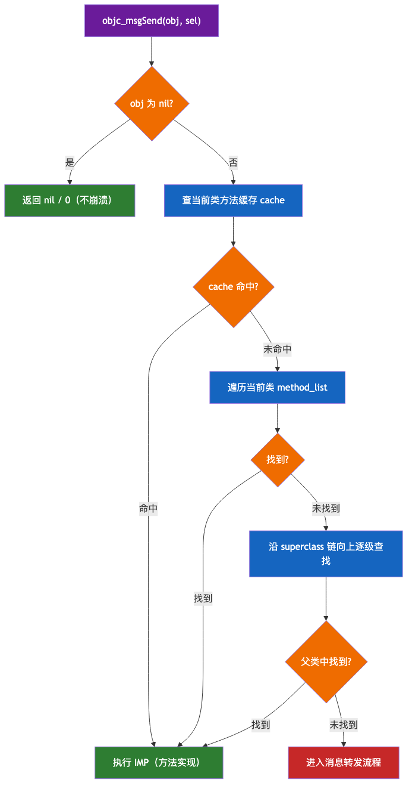
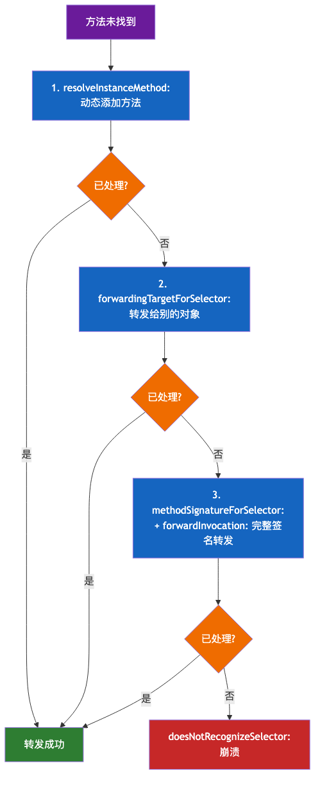
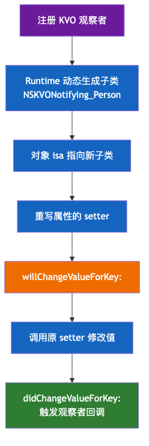

# 01. OC 基础语法

> Objective-C（简称 OC）是 C 语言的超集，在 C 之上增加了面向对象与消息传递机制，是 iOS / macOS 开发的基石语言。本文按知识点全覆盖梳理 OC 基础语法，配合代码示例与对比表格，兼顾 MRC 与 ARC 两套内存管理模型。

## 目录

- [一、语言概述](#一语言概述)
- [二、程序结构与编译](#二程序结构与编译)
- [三、数据类型与字面量](#三数据类型与字面量)
- [四、类与对象](#四类与对象)
- [五、属性与内存管理](#五属性与内存管理)
- [六、消息传递机制](#六消息传递机制)
- [七、协议与委托](#七协议与委托)
- [八、Category 与 Extension](#八category-与-extension)
- [九、Block](#九block)
- [十、KVC 与 KVO](#十kvc-与-kvo)
- [十一、常用集合类](#十一常用集合类)
- [十二、错误处理](#十二错误处理)
- [十三、常用设计模式](#十三常用设计模式)
- [十四、与 Swift 互操作要点](#十四与-swift-互操作要点)

---

## 一、语言概述

### 1. OC 与 C 的关系

OC 是 **C 的严格超集**：任何合法的 C 代码都是合法的 OC 代码。在 C 的基础上，OC 通过一套运行时（Runtime）增加了：

- 面向对象（类、对象、继承、多态）；
- 消息传递（区别于 C++ 的虚函数表调用）；
- 动态特性（运行时增删方法、动态类型判断）。

```c
// OC 文件里可以混写 C 代码
#include <stdio.h>
int add(int a, int b) { return a + b; }

// 也可以写 OC 代码
#import <Foundation/Foundation.h>
NSString *s = @"hello";
```

### 2. OC 与 C++ / Swift 的定位对比

| 维度   | C++                      | Objective-C    | Swift          |
| ---- | ------------------------ | -------------- | -------------- |
| 编程范式 | 多范式（强静态）                 | 面向对象 + 动态消息    | 多范式（协议导向）      |
| 类型系统 | 静态强类型                    | 动态类型（id）+ 静态可选 | 静态强类型          |
| 方法调用 | 虚函数表（编译期绑定）              | 消息传递（运行时绑定）    | 直接调用 + 动态派发    |
| 内存管理 | new/delete / RAII / 智能指针 | MRC / ARC      | ARC            |
| 编译产物 | 机器码                      | 机器码（经 Runtime） | 机器码（经 Runtime） |

### 3. 编译流程

OC 的编译从 `.m` 源码到可执行文件，关键在 **Clang 前端**把 OC 语法翻译成 C 的 Runtime 调用：

```text
.m / .mm 源文件
   │  Clang 前端（OC 语法 → C + objc_msgSend 调用）
   ▼
C / IR 中间表示
   │  LLVM 后端
   ▼
机器码 + Mach-O
```

> `.m` 是纯 OC 源文件，`.mm` 是 OC/C++ 混编源文件，`.h` 是头文件。

### 4. OC 的核心特性：动态性

OC 最大的特点是**运行时动态性**——很多「编译期必须确定」的事，在 OC 里可以推迟到运行期：

| 动态特性 | 说明 | 示例 |
|---------|------|------|
| 动态类型 | 用 `id` 表示任意对象，类型在运行期才确定 | `id obj = [[Person alloc] init];` |
| 动态绑定 | 方法调用在运行期才查找具体实现 | `[obj eat];` 运行期才确定调哪个实现 |
| 动态加载 | 运行期按名字创建类、加载模块 | `NSClassFromString(@"Person")` |
| 动态方法决议 | 运行期动态添加/替换方法 | `class_addMethod(...)` |

```objc
// 动态类型 + 动态创建：编译器不知道 obj 的类型，也不生成固定的方法调用
Class cls = NSClassFromString(@"Person");   // 运行期拿类
id obj = [[cls alloc] init];                // 动态创建实例
[obj performSelector:@selector(eat)];       // 动态发消息
```

### 5. 为什么需要 Runtime

OC 的面向对象能力几乎全部由 **Runtime**（一套 C 语言库，`<objc/runtime.h>`）在**运行期**提供，而非编译期固化：

- 编译器把 `[obj eat]` 翻译成 `objc_msgSend(obj, @selector(eat))`；
- 类的结构（方法列表、属性、协议）以元数据形式存在 Mach-O 的 `__DATA` 段；
- Runtime 在运行期读取这些元数据，动态构建类、查找方法、实现消息转发。

> 理解 OC 的关键一句话：**语法是编译期的糖，能力是运行期的 Runtime**。这正是 OC 比 C++ 更灵活（也更"难优化"）的根源。

---

## 二、程序结构与编译

### 1. 文件结构

一个 OC 类通常由头文件（`.h`）与实现文件（`.m`）组成：

**Person.h（接口声明）**

```objc
#import <Foundation/Foundation.h>

@interface Person : NSObject {
    // 实例变量（ivar）可写在这里
    NSString *_name;   // 现代 OC 更推荐写在 @implementation 中
}

// 属性声明
@property (nonatomic, copy) NSString *name;
@property (nonatomic, assign) NSInteger age;

// 方法声明
- (instancetype)initWithName:(NSString *)name age:(NSInteger)age;
- (void)sayHello;
+ (instancetype)personWithName:(NSString *)name;

@end
```

**Person.m（实现）**

```objc
#import "Person.h"

@implementation Person

- (instancetype)initWithName:(NSString *)name age:(NSInteger)age {
    self = [super init];
    if (self) {
        _name = [name copy];
        _age = age;
    }
    return self;
}

- (void)sayHello {
    NSLog(@"Hello, I'm %@", self.name);
}

+ (instancetype)personWithName:(NSString *)name {
    return [[self alloc] initWithName:name age:0];
}

@end
```

### 2. #import 与 #include

| 指令         | 行为                              |
| ---------- | ------------------------------- |
| `#include` | C 风格头文件包含，可能重复包含                |
| `#import`  | 自动去重，同一头文件只包含一次（OC 推荐）          |
| `@class`   | 前置声明，只告诉编译器「这是类」，不导入头文件，可减少编译依赖 |

```objc
@class Person;   // 前置声明，仅在 .h 中用到指针时可用
#import "Person.h"  // 真正需要访问其成员时才导入
```

### 3. 方法定义与调用

OC 的方法签名由**多段冒号参数**组成，调用方式为**方括号消息传递**：

```objc
// 方法声明：3 个参数，每个参数前有标签
- (void)setName:(NSString *)name age:(NSInteger)age city:(NSString *)city;

// 调用
[person setName:@"Tom" age:20 city:@"Shanghai"];
```

方法类型前缀：

| 前缀  | 含义   | 调用者  |
| --- | ---- | ---- |
| `-` | 实例方法 | 对象实例 |
| `+` | 类方法  | 类本身  |

### 4. 命名约定

- 类名：首字母大写的驼峰（`Person`、`UIViewController`）；
- 方法/变量：首字母小写驼峰（`sayHello`、`userName`）；
- 常量：`k` 前缀或全大写（`kMaxCount`）；
- 类名 2~3 个字母前缀避免符号冲突（`NS`、`UI`、自定义 `XX`）。

### 5. @interface 的完整结构

`@interface` 块可以包含五部分：类名与父类、遵守的协议、实例变量区、属性声明、方法声明：

```objc
@interface Person : NSObject <NSCopying, NSCoding>  // 类名 : 父类 <协议列表>
{
    // ① 实例变量区（可省略，现代 OC 移到 @implementation）
    NSString *_name;
    NSInteger _age;
}

// ② 属性声明（自动生成 ivar + getter/setter）
@property (nonatomic, copy) NSString *name;
@property (nonatomic, assign) NSInteger age;

// ③ 方法声明
- (instancetype)initWithName:(NSString *)name;   // 实例方法
+ (instancetype)person;                          // 类方法

@end
```

### 6. 编译命令与预处理

**编译单个文件**（Clang 编译器）：

```bash
# 编译 .m 为可执行文件（链接 Foundation 框架）
clang -fobjc-arc Person.m main.m -framework Foundation -o app

# 只编译不链接，生成目标文件
clang -c Person.m -o Person.o
```

**预处理指令**（OC 继承 C 全部预处理能力）：

```objc
#define MAX_COUNT 100          // 宏定义
#ifdef DEBUG                  // 条件编译
    NSLog(@"debug mode");
#endif

#define SQUARE(x) ((x) * (x)) // 带参宏（注意括号防优先级问题）
```

> **头文件循环依赖**：`.h` 里能用 `@class` 前置声明就用 `@class`，只有真正需要（继承、实现协议、访问成员）才 `#import`，可显著减少编译依赖与编译时间。

---

## 三、数据类型与字面量

### 1. 基本类型

OC 完整继承 C 的基本类型，并补充了 Foundation 的封装类型：

| 类型                                | 说明                        | 字面量                  |
| --------------------------------- | ------------------------- | -------------------- |
| `int` / `long` / `short` / `char` | C 整型                      | `42`                 |
| `float` / `double`                | 浮点                        | `3.14`               |
| `BOOL`                            | 布尔（YES/NO，本质 signed char） | `YES` / `NO`         |
| `NSInteger` / `NSUInteger`        | 平台自适应整型（32/64 位自动）        | `42`                 |
| `CGFloat`                         | 平台自适应浮点                   | `3.14`               |
| `NSString`                        | 字符串                       | `@"hello"`           |
| `NSNumber`                        | 数值对象                      | `@42`、`@3.14`、`@YES` |
| `id`                              | 任意对象类型                    | `nil`                |

```objc
BOOL flag = YES;                 // YES == 1
NSInteger i = 100;
CGFloat f = 3.14;
NSNumber *num = @42;             // 装箱
int raw = num.intValue;          // 拆箱
```

### 2. 字符串 NSString

OC 字符串以 `@` 前缀表示，是 Foundation 的类（非 C 字符串）：

```objc
NSString *s1 = @"hello";
NSString *s2 = [NSString stringWithFormat:@"value = %d", 42];
NSMutableString *ms = [@"hello" mutableCopy];
[ms appendString:@" world"];     // 可变字符串拼接
```

常用操作：

```objc
NSString *s = @"Hello, Objective-C";
NSUInteger len = s.length;                              // 长度
NSString *sub = [s substringToIndex:5];                 // 截取
BOOL has = [s hasPrefix:@"Hello"];                      // 前缀判断
NSRange r = [s rangeOfString:@"Obj"];                   // 查找
NSArray *parts = [s componentsSeparatedByString:@", "]; // 分割
NSString *joined = [parts componentsJoinedByString:@"-"]; // 拼接
```

### 3. 数组 NSArray

```objc
// 不可变数组
NSArray *arr = @[@"a", @"b", @"c"];     // 字面量
NSString *first = arr[0];               // 下标访问
NSInteger count = arr.count;

// 可变数组
NSMutableArray *marr = [@[@"a"] mutableCopy];
[marr addObject:@"b"];
[marr insertObject:@"x" atIndex:0];
[marr removeObject:@"a"];
```

### 4. 字典 NSDictionary

```objc
NSDictionary *dict = @{@"name": @"Tom", @"age": @20};
NSString *name = dict[@"name"];         // 下标访问

NSMutableDictionary *mdict = [@{} mutableCopy];
mdict[@"city"] = @"Shanghai";
[mdict removeObjectForKey:@"city"];
```

### 5. 集合 NSSet / 常用类

```objc
NSSet *set = [NSSet setWithObjects:@"a", @"b", @"c", nil];
BOOL contains = [set containsObject:@"a"];

// 其他常用：NSDate、NSData、NSValue、NSNull
NSDate *now = [NSDate date];
NSData *data = [s1 dataUsingEncoding:NSUTF8StringEncoding];
NSNull *null = [NSNull null];   // 集合中不能存 nil，用 NSNull 占位
```

### 6. 字面量语法汇总

| 类型   | 字面量写法                 |
| ---- | --------------------- |
| 字符串  | `@"text"`             |
| 数值   | `@42`、`@3.14f`、`@YES` |
| 数组   | `@[a, b, c]`          |
| 字典   | `@{key: value}`       |
| 下标访问 | `arr[i]`、`dict[key]`  |

### 7. NSNumber 装箱与拆箱详解

`NSNumber` 是「数值 → 对象」的桥，用于把基本类型放进集合（`NSArray`/`NSDictionary` 只能存对象）：

```objc
// 装箱（基本类型 → NSNumber）
NSNumber *intNum   = @42;
NSNumber *floatNum = @3.14f;
NSNumber *doubleNum= @3.1415926;
NSNumber *boolNum  = @YES;
NSNumber *charNum  = @'A';

// 拆箱（NSNumber → 基本类型）
int i   = intNum.intValue;
float f = floatNum.floatValue;
BOOL b  = boolNum.boolValue;

// 判断类型与比较
NSString *type = intNum.objCType;                 // "i" 类型编码
NSComparisonResult r = [intNum compare:@100];      // 数值比较
BOOL equal = [intNum isEqualToNumber:@42];         // 相等判断
```

### 8. 类型转换与格式化

```objc
// 字符串 ↔ 数值
NSString *numStr = @"123";
int parsed = numStr.intValue;                    // 字符串转整数
NSString *back = [NSString stringWithFormat:@"%d", parsed];  // 数值转字符串

// NSLog 常用格式化占位符
// %@ 对象   %d/%ld 整数   %f 浮点   %p 指针地址   %c 字符
NSLog(@"name=%@ age=%ld score=%.2f ptr=%p", name, (long)age, 3.14159, obj);

// C 字符串 ↔ NSString
const char *cstr = [s UTF8String];               // NSString → C 字符串
NSString *ocstr = [NSString stringWithUTF8String:cstr];  // C → NSString
```

> **易错点**：`NSInteger` 在 32/64 位平台上位数不同，`NSLog` 打印时用 `%ld` 并强转 `(long)`，避免 `%d` 在 64 位下截断告警。

---

## 四、类与对象

### 1. 类的完整定义

```objc
@interface Animal : NSObject
@property (nonatomic, copy) NSString *name;
- (void)eat;
@end

@implementation Animal
- (void)eat {
    NSLog(@"%@ is eating", self.name);
}
@end
```

### 2. 继承与多态

- OC **单继承**（一个类只能有一个父类），根类通常是 `NSObject`；
- 多态通过**消息传递**实现：同一方法名，不同对象响应不同实现。

```objc
@interface Dog : Animal
- (void)eat;   // 重写父类方法
@end

@implementation Dog
- (void)eat {
    NSLog(@"Dog %@ eats bone", self.name);
}
@end

// 多态调用
Animal *a = [[Dog alloc] init];
[a eat];   // 运行时动态绑定到 Dog 的 eat
```

### 3. 对象创建

```objc
// 两段式创建：alloc 分配内存 + init 初始化
Person *p1 = [[Person alloc] init];
Person *p2 = [[Person alloc] initWithName:@"Tom" age:20];

// new = alloc + init 的简写（无法传自定义 init 参数）
Person *p3 = [Person new];

// 便利构造器（类方法）
Person *p4 = [Person personWithName:@"Jerry"];
```

### 4. 指定初始化器（Designated Initializer）

```objc
// 指定初始化器：参数最全、子类必须调用的那个
- (instancetype)initWithName:(NSString *)name age:(NSInteger)age {
    self = [super init];
    if (self) {
        _name = [name copy];
        _age = age;
    }
    return self;
}

// 次级初始化器：收敛到指定初始化器
- (instancetype)init {
    return [self initWithName:@"Unknown" age:0];
}
```

> 初始化器链：次级初始化器最终调用指定初始化器；子类的指定初始化器必须调用父类的指定初始化器。

### 5. self 与 super

| 关键字     | 含义                                       |
| ------- | ---------------------------------------- |
| `self`  | 当前对象的指针（可用于调用自己方法）                       |
| `super` | 编译器标记，从父类开始查找方法实现（调用父类方法用 `[super xxx]`） |

```objc
- (void)viewDidLoad {
    [super viewDidLoad];   // 先调用父类实现
    [self setupUI];        // 再调用自己的方法
}
```

### 6. 实例变量与可见性

```objc
@interface Demo : NSObject {
    @public    NSString *pubVar;   // 所有可访问
    @protected NSString *protVar;  // 本类 + 子类（默认）
    @private   NSString *privVar;  // 仅本类
    @package   NSString *pkgVar;   // 同 framework 可访问
}
@end
```

现代 OC 推荐把实例变量写在 `@implementation` 里，配合 `@property` 自动生成：

```objc
@implementation Demo {
    NSString *_privateIvar;   // 私有实例变量
}
@end
```

### 7. isa 指针：对象与类的桥梁

每个 OC 对象的内存布局，第一个成员都是一个 `isa` 指针，指向它所属的**类对象**：

```text
对象实例（内存布局）
┌─────────────────┐
│  isa 指针        │  ← 指向 Person 类对象
├─────────────────┤
│  _name           │  ← 实例变量
├─────────────────┤
│  _age            │
└─────────────────┘
```

- 对象的方法调用通过 `isa` 找到类对象，再从类的方法列表中查找；
- 类对象里存的是**类方法 + 实例方法列表**，类对象本身也有 `isa`，指向**元类（Meta Class）**；
- 元类的 `isa` 最终指向**根元类**（NSObject 的元类），根元类的 `isa` 指向自己，形成闭环。

```text
实例对象 --isa--> 类对象(Person) --isa--> 元类(Person Meta)
                                              │
                    实例方法在这里查找        类方法在这里查找
```

### 8. 类对象与元类（Meta Class）

| 概念 | 说明 | 获取方式 |
|------|------|---------|
| 实例对象 | 类的具体实例 | `[[Person alloc] init]` |
| 类对象 | 描述类的「对象」，存实例方法 | `[Person class]` / `obj.class` |
| 元类 | 描述类对象的「类」，存类方法 | `object_getClass([Person class])` |

```objc
Person *p = [[Person alloc] init];

Class cls1 = [p class];                    // Person 类对象
Class cls2 = object_getClass(p);           // 也是 Person 类对象
Class meta = object_getClass(cls1);        // Person 元类
BOOL isMeta = class_isMetaClass(meta);     // YES

// 类方法其实存在元类里
[Person sayHello];   // 运行期通过类对象的 isa 找到元类，查类方法
```

> 面试常考：**类方法存在元类里，实例方法存在类对象里**；类对象与实例对象一样有 `isa`。

---

## 五、属性与内存管理

### 1. @property 属性声明

```objc
@property (nonatomic, strong) NSString *name;   // 对象强引用
@property (nonatomic, copy)   NSString *title;  // 拷贝语义（字符串常用）
@property (nonatomic, assign) NSInteger age;    // 基本类型直接赋值
@property (nonatomic, weak)   id<Delegate> delegate;  // 弱引用（防循环）
@property (nonatomic, readonly) NSString *uid;  // 只读
```

### 2. 属性修饰符全解

**所有权修饰符**（决定内存语义）：

| 修饰符                 | 语义                      | 适用                     |
| ------------------- | ----------------------- | ---------------------- |
| `strong`            | 强引用，持有对象（引用计数 +1）       | 对象类型（ARC 默认）           |
| `weak`              | 弱引用，不持有，对象释放后自动置 nil    | 委托、避免循环引用              |
| `copy`              | 赋值时拷贝一份新对象              | NSString、Block、NSArray |
| `assign`            | 直接赋值，不管理引用计数            | 基本类型、id（MRC 下）         |
| `retain`            | MRC 下的强引用（ARC 用 strong） | MRC 对象类型               |
| `unsafe_unretained` | 不持有也不置 nil（悬垂风险）        | 极少用                    |

**读写修饰符**：

| 修饰符         | 说明            |
| ----------- | ------------- |
| `readwrite` | 可读可写（默认）      |
| `readonly`  | 只读，只生成 getter |

**原子性修饰符**：

| 修饰符         | 说明                              |
| ----------- | ------------------------------- |
| `atomic`    | 原子性（默认，加锁保证 getter/setter 原子操作） |
| `nonatomic` | 非原子（性能更好，iOS 开发几乎都用它）           |

**其他**：

```objc
@property (nonatomic, strong, getter=isFinished) BOOL finished;  // 自定义 getter
@property (nonatomic, copy, setter=setDisplayName:) NSString *name; // 自定义 setter
```

### 3. 属性自动合成

编译器为 `@property` 自动生成：

1. 实例变量（默认名 `_propertyName`）；
2. getter 方法；
3. setter 方法。

可用 `@synthesize` / `@dynamic` 干预：

```objc
@implementation Demo
@synthesize name = _myName;   // 手动指定底层 ivar 名
// @dynamic name;             // 告诉编译器「我自己实现/运行时提供」，不做自动合成
@end
```

### 4. MRC 手动引用计数

MRC（Manual Reference Counting）需手动管理对象生命周期：

```objc
// MRC 环境
NSString *s = [[NSString alloc] init];  // 引用计数 = 1
NSString *t = [s retain];               // 计数 = 2
[s release];                            // 计数 = 1
[t release];                            // 计数 = 0，对象被销毁

NSString *tmp = [NSString stringWithFormat:@"%d", 42];  // autorelease 对象
[tmp retain];   // 需要持有的话先 retain
```

**MRC 黄金法则**：谁 `alloc/new/copy/mutableCopy/retain`，谁 `release`。

```objc
@property (nonatomic, retain) NSString *name;   // MRC 下用 retain
- (void)dealloc {
    [_name release];   // MRC 下必须手动释放 ivar
    [super dealloc];
}
```

### 5. ARC 自动引用计数

ARC（Automatic Reference Counting）由编译器自动插入 `retain/release`，开发者只关注**引用关系**：

```objc
// ARC 环境（默认）
NSString *s = [[NSString alloc] init];  // 无需手动 release
// 离开作用域自动释放
```

ARC 规则：

- 不能手动调用 `retain/release/autorelease/dealloc`；
- 用 `strong`/`weak`/`copy`/`assign` 表达所有权；
- 对象释放时自动调用 `dealloc`（可重写做清理，但不能再调 `[super dealloc]`）。

### 6. 循环引用与打破

对象 A 强引用 B、B 强引用 A，形成循环引用导致内存泄漏：

```objc
@interface Person : NSObject
@property (nonatomic, strong) Pet *pet;
@end

@interface Pet : NSObject
@property (nonatomic, weak) Person *owner;   // 用 weak 打破循环
@end
```

Block 中的循环引用（详见 Block 章节）：

```objc
__weak typeof(self) weakSelf = self;
self.completion = ^{
    [weakSelf doSomething];   // 弱引用捕获，避免循环
};
```

### 7. autoreleasepool

自动释放池延迟对象的释放时机，RunLoop 每个循环都包一层：

```objc
@autoreleasepool {
    NSString *s = [NSString stringWithFormat:@"temp %d", 1];  // 加入池
    // 离开作用域时池 drain，s 被 release
}
```

### 8. 引用计数原理

每个 OC 对象内部维护一个引用计数（`retainCount`），核心规则：

- `alloc/new/copy/mutableCopy` 创建的对象计数为 1；
- `retain` 计数 +1，`release` 计数 -1；
- 计数归 0 时，`dealloc` 被调用，内存回收。

```objc
// 引用计数变化示意（MRC 下可观察）
NSString *s = [[NSString alloc] init];  // retainCount = 1
[s retain];                             // retainCount = 2
[s release];                            // retainCount = 1
[s release];                            // retainCount = 0 → dealloc
```

> 现代 OC 用**散列表（SideTable）**管理引用计数，而非简单的对象内整型字段；ARC 下 `retainCount` 已无实际意义，不要依赖它做逻辑判断。

### 9. weak 表的实现

`weak` 修饰的指针不增加引用计数，但对象释放后要能自动置 nil，靠的是 Runtime 维护的 **weak 表**：

```text
对象 Person(地址 0x1000)
      │
      ▼
weak 表（SideTable）
┌──────────────────────────────┐
│ 0x1000 → [weakPtr1, weakPtr2]│  ← 记录所有指向该对象的 weak 指针
└──────────────────────────────┘
```

- 对象被 `release` 到计数为 0 时，Runtime 遍历 weak 表，把所有指向它的 weak 指针置为 `nil`；
- 这也是 `weak` 比 `assign`（悬垂指针，不置 nil）更安全的原因。

```objc
__weak NSString *weakStr = nil;
{
    NSString *s = [[NSString alloc] init];
    weakStr = s;          // weak 表记录 weakStr
}
// s 释放后，weakStr 自动置 nil
NSLog(@"%@", weakStr);    // (null)
```

### 10. autorelease 的底层机制

`autorelease` 对象不是立即释放，而是登记到**自动释放池**，等池 `drain` 时统一 `release`：

```objc
// MRC 下 autorelease 的等价行为
NSString *s = [[NSString alloc] init];
[s autorelease];   // 登记到当前 autoreleasepool，稍后统一 release
return s;          // 调用方拿到的仍是有用的对象
```

- **池是栈结构**：`@autoreleasepool { ... }` 每进入一层压栈，离开时出栈并 drain；
- **主线程 RunLoop** 每个事件循环前后会自动创建/释放一个池，`autorelease` 对象在循环结束时释放；
- **子线程**需手动加 `@autoreleasepool`，否则 autorelease 对象会累积（如循环里大量创建临时对象）。

```objc
// 子线程/循环里显式加池，避免峰值内存过高
for (int i = 0; i < 100000; i++) {
    @autoreleasepool {
        NSString *tmp = [NSString stringWithFormat:@"%d", i];
        // tmp 在每次循环结束时及时释放
    }
}
```

---

## 六、消息传递机制

### 1. 消息传递本质

OC 方法调用 `[obj method]` 本质是发送消息，编译成 C 函数：

```objc
[obj methodWithArg:x];
// 等价于
objc_msgSend(obj, @selector(methodWithArg:), x);
```



> **给 nil 发消息不崩溃**：`objc_msgSend` 对 nil 直接返回 0/nil，这是 OC 与 Java/C++ 的重要区别。

### 2. SEL 与 IMP

| 概念       | 含义                                 |
| -------- | ---------------------------------- |
| `SEL`    | 方法选择器（方法名的唯一编号）`@selector(method)` |
| `IMP`    | 方法实现的函数指针                          |
| `Method` | SEL + IMP 的封装                      |

```objc
SEL sel = @selector(sayHello);
BOOL responds = [obj respondsToSelector:sel];   // 判断是否能响应
IMP imp = [obj methodForSelector:sel];          // 取函数指针
```

### 3. 消息转发（三步）

当对象无法响应某方法时，Runtime 提供三次补救机会：



```objc
// 第一步：动态方法决议
+ (BOOL)resolveInstanceMethod:(SEL)sel {
    if (sel == @selector(dynamicMethod)) {
        class_addMethod(self, sel, (IMP)myDynamicIMP, "v@:");
        return YES;
    }
    return [super resolveInstanceMethod:sel];
}

// 第二步：快速转发
- (id)forwardingTargetForSelector:(SEL)aSelector {
    if ([self.backupTarget respondsToSelector:aSelector]) {
        return self.backupTarget;   // 转给别人
    }
    return [super forwardingTargetForSelector:aSelector];
}

// 第三步：完整转发
- (NSMethodSignature *)methodSignatureForSelector:(SEL)aSelector {
    return [NSMethodSignature signatureWithObjCTypes:"v@:"];
}
- (void)forwardInvocation:(NSInvocation *)anInvocation {
    if ([self.backupTarget respondsToSelector:anInvocation.selector]) {
        [anInvocation invokeWithTarget:self.backupTarget];
    } else {
        [super forwardInvocation:anInvocation];
    }
}
```

### 4. 动态类型判断

```objc
BOOL isKind = [obj isKindOfClass:[Person class]];   // 是否本类或子类实例
BOOL isMember = [obj isMemberOfClass:[Person class]]; // 是否恰好本类实例
BOOL responds = [obj respondsToSelector:@selector(foo)]; // 能否响应方法
BOOL conforms = [obj conformsToProtocol:@protocol(P)];   // 是否遵守协议
Class cls = [obj class];      // 获取类
Class superCls = [obj superclass]; // 获取父类
```

### 5. 方法缓存 cache：查找加速

每次都遍历方法列表太慢，所以每个类都带一个**方法缓存 `cache`**（哈希表，key 是 SEL，value 是 IMP）：

```text
类对象
├── isa
├── superclass
├── cache        ← 方法缓存（SEL → IMP 哈希表）
├── methodList   ← 方法列表（Method 数组）
└── ...
```

**查找流程**：先查 cache（O(1)），未命中再遍历 methodList，命中后**把结果写入 cache**，下次直接命中：

```objc
// 第一次调用：查 methodList 找到，写入 cache
[obj eat];
// 第二次调用：直接从 cache 命中，跳过遍历
[obj eat];
```

> 这是 OC 方法调用在「动态派发」前提下仍能保持不错性能的关键——热点方法走缓存。

### 6. super 的底层实现

`[super eat]` 不是「父类对象发消息」，而是**告诉编译器从父类开始查找**，实现是 `objc_msgSendSuper`：

```objc
// [super eat] 等价于
struct objc_super superInfo = {
    .receiver = self,              // 消息接收者仍是 self
    .super_class = [self superclass]  // 但从父类开始查找
};
objc_msgSendSuper(&superInfo, @selector(eat));
```

关键点：

- **接收者仍是 `self`**（对象没变），只是方法查找的起点从父类开始；
- 用于子类重写方法时调用父类实现，避免递归调用自己。

```objc
@implementation Dog
- (void)eat {
    [super eat];     // 从父类 Animal 开始查找 eat，接收者还是这个 Dog 实例
    NSLog(@"dog extra");
}
@end
```

---

## 七、协议与委托

### 1. 协议定义

```objc
@protocol AnimalBehavior <NSObject>   // 可继承协议
@required
- (void)eat;                          // 必须实现
- (void)sleep;

@optional
- (void)play;                         // 可选实现
@end
```

### 2. 遵守协议

```objc
@interface Dog : NSObject <AnimalBehavior>
@end

@implementation Dog
- (void)eat { NSLog(@"eat"); }
- (void)sleep { NSLog(@"sleep"); }
// play 可选，可不实现
@end
```

### 3. 委托模式（Delegate）

iOS 最核心的设计模式——对象把「该怎么做」交给委托对象：

```objc
// 协议 + 委托属性（weak 防循环引用）
@protocol TableViewDelegate <NSObject>
- (void)didSelectRowAtIndex:(NSInteger)index;
@optional
- (void)didScroll;
@end

@interface TableView : NSObject
@property (nonatomic, weak) id<TableViewDelegate> delegate;
@end

@implementation TableView
- (void)userDidTapRow:(NSInteger)index {
    if ([self.delegate respondsToSelector:@selector(didSelectRowAtIndex:)]) {
        [self.delegate didSelectRowAtIndex:index];   // 回调委托
    }
}
@end
```

> **为何 delegate 用 weak**：委托方（如 VC）通常持有着被委托方（如 TableView），若 TableView 再强引用 delegate 会形成循环引用，故 delegate 必须 weak。

### 4. 协议继承与组合

协议可以「继承」多个协议，也可以用一个协议「组合」多个协议：

```objc
// 协议继承：子协议包含父协议的全部方法
@protocol BaseProtocol <NSObject>
- (void)base;
@end

@protocol SubProtocol <BaseProtocol>   // SubProtocol 继承 BaseProtocol
- (void)sub;
@end

// 协议组合：要求同时遵守多个协议
@protocol A <NSObject> @end
@protocol B <NSObject> @end
- (void)doSomething:(id<A, B>)obj;   // obj 需同时遵守 A 和 B
```

### 5. 协议在 Runtime 中的存储

协议在编译期被记录到 Mach-O 的 `__objc_protolist` 段，运行期由 Runtime 读取并建立 `protocol_t` 结构：

```objc
#import <objc/runtime.h>

Protocol *proto = @protocol(AnimalBehavior);
const char *name = protocol_getName(proto);         // 协议名
unsigned int count = 0;
struct objc_method_description *methods =
    protocol_copyMethodDescriptionList(proto, YES, YES, &count);  // 协议方法列表

// 运行时动态创建遵守协议的类
Class cls = objc_allocateClassPair([NSObject class], "NewClass", 0);
class_addProtocol(cls, proto);
objc_registerClassPair(cls);
```

### 6. 调用可选方法前的安全判断

`@optional` 方法可能未被实现，直接调用会崩溃，必须先判断：

```objc
// 方式一：respondsToSelector 判断
if ([self.delegate respondsToSelector:@selector(didScroll)]) {
    [self.delegate didScroll];
}

// 方式二：instancesRespondToSelector（类级别判断，不创建实例）
if ([[self.delegate class] instancesRespondToSelector:@selector(didScroll)]) {
    [self.delegate didScroll];
}
```

---

## 八、Category 与 Extension

### 1. Category（分类）

在**不修改原类、无需子类化**的情况下，给已有类（包括系统类）扩展方法：

```objc
// NSString+Util.h
@interface NSString (Util)
- (BOOL)isNotEmpty;
@end

// NSString+Util.m
@implementation NSString (Util)
- (BOOL)isNotEmpty {
    return self.length > 0;
}
@end

// 使用
BOOL b = [@"abc" isNotEmpty];
```

**Category 的特点与限制**：

| 能力     | 是否支持                         |
| ------ | ---------------------------- |
| 添加实例方法 | ✅                            |
| 添加类方法  | ✅                            |
| 添加实例变量 | ❌（需用关联对象）                    |
| 添加属性   | ⚠️ 只生成声明，需手动实现 getter/setter |

**关联对象**给 Category 补属性：

```objc
#import <objc/runtime.h>

@implementation NSString (Util)
static const void *kTagKey = &kTagKey;
- (void)setTag:(NSString *)tag {
    objc_setAssociatedObject(self, kTagKey, tag, OBJC_ASSOCIATION_COPY_NONATOMIC);
}
- (NSString *)tag {
    return objc_getAssociatedObject(self, kTagKey);
}
@end
```

> **风险**：Category 方法会「覆盖」原类同名方法（实际是插入到方法列表头部，优先命中）。多个 Category 同名方法时，编译顺序靠后的生效，行为不可预期，需谨慎。

### 2. Extension（类扩展）

`@interface ClassName ()` 匿名分类，写在 `.m` 里，是**编译期**能力，比 Category 更强：

```objc
// Person.m 内部
@interface Person () <PrivateDelegate>   // 私有协议
@property (nonatomic, strong) NSString *privateProp;   // 私有属性
@end

@implementation Person
// ...
@end
```

**Category 与 Extension 对比**：

| 维度     | Category   | Extension |
| ------ | ---------- | --------- |
| 时机     | 运行时        | 编译期       |
| 添加实例变量 | ❌          | ✅         |
| 添加属性   | 需关联对象      | ✅（自动合成）   |
| 作用范围   | 全局可用       | 仅本文件      |
| 常见用途   | 拆分大文件、扩系统类 | 声明私有成员    |

### 3. Category 的底层结构（category_t）

每个 Category 在 Mach-O 里是一个 `category_t` 结构体，存方法/属性/协议的**独立列表**：

```c
// objc-runtime 中的结构（简化）
typedef struct category_t {
    const char *name;                       // 分类名 "Util"
    classref_t cls;                         // 目标类
    struct method_list_t *instanceMethods;  // 实例方法列表
    struct method_list_t *classMethods;     // 类方法列表
    struct protocol_list_t *protocols;      // 协议列表
    struct property_list_t *instanceProperties; // 属性列表
} category_t;
```

运行期 `_read_images` 阶段，Runtime 把这些列表**合并**到目标类：方法插入到类方法列表**头部**（所以 Category 方法「覆盖」原方法），属性只有声明、需手动实现。

### 4. 关联对象的底层实现

Category 无法直接加实例变量，但可以通过**关联对象**（Associated Object）变相实现——本质是一个全局的哈希表：

```text
AssociationsManager（全局单例）
  └── 哈希表
        key: 对象地址（伪装成指针的地址）
        value: 该对象的所有关联对象
                 └── 以「void* 常量键」为 key 的字典
```

```objc
#import <objc/runtime.h>

// 关联策略（内存语义）对照表
// OBJC_ASSOCIATION_ASSIGN            = 相当于 assign（弱，不持有）
// OBJC_ASSOCIATION_RETAIN_NONATOMIC  = 相当于 strong, nonatomic
// OBJC_ASSOCIATION_COPY_NONATOMIC    = 相当于 copy, nonatomic
// OBJC_ASSOCIATION_RETAIN            = 相当于 strong, atomic
// OBJC_ASSOCIATION_COPY              = 相当于 copy, atomic

objc_setAssociatedObject(obj, &key, value, OBJC_ASSOCIATION_RETAIN_NONATOMIC);
id v = objc_getAssociatedObject(obj, &key);
objc_removeAssociatedObjects(obj);   // 移除全部（慎用，会清掉别人加的）
```

> **注意**：关联对象的 `key` 通常用「静态变量自身的地址」`&key`，保证全局唯一；策略要与属性的内存语义匹配（如字符串用 COPY）。

---

## 九、Block

Block 是 OC 的匿名函数（闭包），可捕获上下文变量。

### 1. 基本语法

```objc
// 定义：^返回值类型(参数列表){ 实现 }
int (^sumBlock)(int, int) = ^int(int a, int b) {
    return a + b;
};
int r = sumBlock(3, 4);   // 7

// 无参无返回
void (^hello)(void) = ^{
    NSLog(@"hello");
};
hello();
```

### 2. typedef 简化

```objc
typedef void (^CompletionBlock)(BOOL success, id result);

- (void)loadDataWithCompletion:(CompletionBlock)completion {
    // ...
    if (completion) completion(YES, data);
}
```

### 3. 变量捕获规则

| 变量类型           | 捕获方式            |
| -------------- | --------------- |
| 局部变量           | 值拷贝（const，不可修改） |
| `__block` 局部变量 | 引用捕获（可修改）       |
| 静态/全局变量        | 直接访问（不捕获）       |
| `self` / 对象    | 强引用捕获（需注意循环引用）  |

```objc
NSInteger local = 10;
__block NSInteger mutable = 10;

void (^block)(void) = ^{
    // local = 20;        // 编译错误：局部变量默认只读
    NSLog(@"%ld", (long)local);   // 读到拷贝值 10
    mutable = 20;         // __block 可修改
};
local = 99;               // block 内读到的仍是捕获时的 10
block();                  // 打印 10，mutable 变 20
```

### 4. Block 内存管理（栈 → 堆）

Block 默认在**栈**上，只有被 **copy** 后才移到堆上（ARC 下大多数场景编译器自动 copy）：

```objc
// MRC 下 Block 属性必须用 copy
@property (nonatomic, copy) void (^completion)(void);

// ARC 下同样用 copy 语义（保证 Block 在堆上）
```

### 5. Block 循环引用与解决

Block 强捕获 `self`，而 `self` 强持有 block 属性时，形成循环引用：

```objc
// 错误：self → completion → self
self.completion = ^{
    [self refresh];
};

// 正确：weak-strong dance
__weak typeof(self) weakSelf = self;
self.completion = ^{
    __strong typeof(weakSelf) strongSelf = weakSelf;  // 执行期间强持有，防止中途释放
    [strongSelf refresh];
};
```

### 6. Block 常见用途

- 异步回调、动画完成回调；
- 数组/字典遍历（enumerateObjectsUsingBlock）；
- GCD 任务封装。

```objc
[array enumerateObjectsUsingBlock:^(id obj, NSUInteger idx, BOOL *stop) {
    if (/* 条件 */) *stop = YES;   // 提前终止
}];
```

### 7. Block 底层结构

Block 本质是一个**结构体对象**（含 `isa` 指针，故 Block 也是 OC 对象），核心结构（简化）：

```c
struct __block_impl {
    void *isa;              // isa 指针（指向 _NSConcreteStackBlock 等）
    int Flags;
    int Reserved;
    void *FuncPtr;          // 函数指针，指向 block 的实际代码
};

// 捕获了变量的 block，编译器会生成一个「包装结构体」
struct __Person_block_impl_0 {
    struct __block_impl impl;         // 通用部分
    struct __Person_block_desc_0 *Desc;
    NSInteger local;                  // 捕获的局部变量（值拷贝）
    // __block 变量则存指针
};
```

### 8. 三类 Block

| 类型 | isa 指向 | 存放位置 | 何时产生 |
|------|---------|---------|---------|
| `__NSGlobalBlock__` | 全局区 | 数据段 | 不捕获任何变量 |
| `__NSStackBlock__` | 栈区 | 栈 | 捕获变量但未 copy（MRC 下） |
| `__NSMallocBlock__` | 堆区 | 堆 | 栈 Block 被 copy 后 |

```objc
// 不捕获变量 → 全局 Block
void (^g)(void) = ^{ NSLog(@"global"); };
NSLog(@"%@", g);   // __NSGlobalBlock__

// ARC 下捕获变量 → 编译器自动 copy 到堆
int x = 1;
void (^m)(void) = ^{ NSLog(@"%d", x); };
NSLog(@"%@", m);   // __NSMallocBlock__
```

> MRC 下栈 Block 出了作用域就失效，作为属性必须 `copy` 到堆；ARC 下大多数场景编译器已自动 copy，但仍建议 Block 属性用 `copy` 语义。

### 9. __block 的底层实现

普通局部变量在 block 里是「值拷贝」；加了 `__block` 后，编译器把变量**包装成一个结构体**，block 捕获的是指向它的指针，因此能修改：

```c
// __block NSInteger mutable = 10;  编译后等价于：
struct __Block_byref_mutable_0 {
    void *__isa;
    struct __Block_byref_mutable_0 *__forwarding;  // 指向自身（跨栈堆转发）
    int __flags;
    int __size;
    NSInteger mutable;    // 真正的值存这里
};
```

- block 内读写 `mutable` 实际是通过 `__forwarding` 指针间接访问；
- 栈 Block 被 copy 到堆时，`__forwarding` 会指向堆上的副本，保证栈/堆两份指向同一份数据。

---

## 十、KVC 与 KVO

### 1. KVC（键值编码）

通过字符串 key 间接访问属性：

```objc
Person *p = [[Person alloc] init];
[p setValue:@"Tom" forKey:@"name"];        // 等价 p.name = @"Tom"
NSString *name = [p valueForKey:@"name"];  // 等价 p.name

[p setValue:@"Shanghai" forKeyPath:@"address.city"];  // 键路径访问嵌套
```

**KVC 查找顺序**：`setValue:forKey:` 依次找 `set<Key>:`、`_key`、`key`、`setIs<Key>:`，都找不到则抛 `NSUnknownKeyException`。

### 2. KVO（键值观察）

监听对象属性变化：

```objc
// 注册观察者
[p addObserver:self forKeyPath:@"name"
        options:NSKeyValueObservingOptionNew | NSKeyValueObservingOptionOld
        context:nil];

// 回调
- (void)observeValueForKeyPath:(NSString *)keyPath
                      ofObject:(id)object
                        change:(NSDictionary *)change
                       context:(void *)context {
    if ([keyPath isEqualToString:@"name"]) {
        NSLog(@"name changed: %@ -> %@", change[NSKeyValueChangeOldKey],
              change[NSKeyValueChangeNewKey]);
    }
}

// 移除观察者（必须，否则崩溃）
[p removeObserver:self forKeyPath:@"name"];
```

### 3. KVO 实现原理

KVO 通过 **isa-swizzling（isa 混写）** 实现：



> 关键点：① KVO 依赖 setter，直接改 ivar 不会触发；② 手动 KVO 需 `willChangeValueForKey:` / `didChangeValueForKey:` 配合；③ 一定要成对 `removeObserver`。

### 4. KVC 查找顺序详解

**`setValue:forKey:` 的查找顺序**（依次尝试）：

```text
1. set<Key>:           → 优先找标准 setter
2. _set<Key>:          → 找带下划线的 setter
3. 直接访问 _key       → 若 +accessInstanceVariablesDirectly 返回 YES
4. 直接访问 key        → 实例变量
5. 都找不到           → 抛 NSUnknownKeyException
```

**`valueForKey:` 的查找顺序**（依次尝试）：

```text
1. get<Key> / <key> / is<Key>   → getter 系列
2. _<key> / _is<Key> / <key>    → 实例变量系列
3. 都找不到 → 抛 NSUnknownKeyException
```

```objc
// 关闭「直接访问实例变量」后，KVC 只能走 setter/getter
+ (BOOL)accessInstanceVariablesDirectly {
    return NO;
}
```

### 5. 手动触发 KVO

某些场景（如直接改 ivar、批量更新）需要手动通知观察者：

```objc
- (void)updateNameWithoutSetter:(NSString *)newName {
    [self willChangeValueForKey:@"name"];   // 通知「即将改变」
    _name = [newName copy];                 // 直接改 ivar
    [self didChangeValueForKey:@"name"];    // 通知「已改变」，触发观察回调
}
```

### 6. 集合类型 KVO

监听 `NSMutableArray` 等集合的增删，不能用普通 setter 方式，需用**可变集合的 KVO 方法**：

```objc
// 集合代理方法：返回被观察的可变集合
- (NSMutableArray *)items {
    return [self mutableArrayValueForKey:@"items"];
}

// 通过代理方法操作，才会触发 KVO
[[self mutableArrayValueForKey:@"items"] addObject:newItem];  // 触发
[[self mutableArrayValueForKey:@"items"] removeObjectAtIndex:0]; // 触发
```

> 直接用 `_items` 数组的 `addObject:` 不会触发 KVO——必须走 `mutableArrayValueForKey:` 返回的代理集合。

---

## 十一、常用集合类

### 1. 集合体系

| 类型             | 可变版                   | 特点         |
| -------------- | --------------------- | ---------- |
| `NSArray`      | `NSMutableArray`      | 有序、可重复     |
| `NSDictionary` | `NSMutableDictionary` | 键值对、键唯一    |
| `NSSet`        | `NSMutableSet`        | 无序、不重复     |
| `NSCountedSet` | —                     | 可统计重复次数的集合 |

### 2. 遍历方式

```objc
NSArray *arr = @[@"a", @"b", @"c"];

// 1. for 循环
for (NSInteger i = 0; i < arr.count; i++) { NSLog(@"%@", arr[i]); }

// 2. for-in 快速枚举
for (NSString *s in arr) { NSLog(@"%@", s); }

// 3. Block 枚举（可拿到下标、可提前终止）
[arr enumerateObjectsUsingBlock:^(id obj, NSUInteger idx, BOOL *stop) {
    NSLog(@"%lu: %@", (unsigned long)idx, obj);
    if (idx == 1) *stop = YES;
}];
```

### 3. 排序与过滤

```objc
NSArray *nums = @[@3, @1, @2];

// 升序排序
NSArray *sorted = [nums sortedArrayUsingComparator:^NSComparisonResult(id a, id b) {
    return [a compare:b];
}];

// 谓词过滤
NSPredicate *pred = [NSPredicate predicateWithFormat:@"self > %@", @1];
NSArray *filtered = [nums filteredArrayUsingPredicate:pred];
```

### 4. 深拷贝与浅拷贝

```objc
NSArray *a = @[@1, @2];
NSArray *shallow = [a copy];          // 浅拷贝：数组新对象，元素共享
NSArray *deep = [a mutableCopy];      // 可变拷贝（元素仍是浅拷贝）
// 真正的深拷贝需 archivedDataWithRootObject 或逐元素 copy
```

### 5. 深拷贝的两种实现

```objc
// 方式一：归档/反归档（要求元素遵守 NSCoding）
NSData *data = [NSKeyedArchiver archivedDataWithRootObject:a];
NSArray *deep = [NSKeyedUnarchiver unarchiveObjectWithData:data];

// 方式二：集合的初始化方法（只深拷贝一层）
NSArray *deep2 = [[NSArray alloc] initWithArray:a copyItems:YES];
```

### 6. NSCountedSet 与快速枚举底层

`NSCountedSet` 统计元素出现次数：

```objc
NSCountedSet *cs = [NSCountedSet set];
[cs addObject:@"a"];
[cs addObject:@"a"];
[cs addObject:@"b"];
NSUInteger countOfA = [cs countForObject:@"a"];   // 2
```

`for-in` 快速枚举的底层依赖 `NSFastEnumeration` 协议：

```objc
// 快速枚举本质是调用 countByEnumeratingWithState:
// for (id obj in arr) { ... }
//   ↓ 等价于
NSFastEnumerationState state = {0};
id buffer[16];
id *items;
NSUInteger count = [arr countByEnumeratingWithState:&state
                                            objects:buffer count:16];
```

> 遍历可变集合时，若在遍历中修改集合会抛异常；需要边遍历边删除时，用倒序遍历或先收集再删。

---

## 十二、错误处理

### 1. NSError（推荐方式）

OC 用 `NSError` 通过指针参数回传错误，而不是抛异常：

```objc
NSError *error = nil;
NSString *content = [NSString stringWithContentsOfFile:@"path"
                                              encoding:NSUTF8StringEncoding
                                                 error:&error];
if (error) {
    NSLog(@"错误码: %ld, 描述: %@", (long)error.code, error.localizedDescription);
}
```

### 2. 异常 NSException（用于致命错误）

OC 异常仅用于**可恢复的编程错误**（如数组越界、未实现方法），iOS 上不建议用异常做流程控制：

```objc
@try {
    id obj = arr[100];   // 越界
}
@catch (NSException *exception) {
    NSLog(@"异常: %@", exception.reason);
}
@finally {
    // 无论如何都执行
}
```

### 3. NSError 的 domain 与 code

`NSError` 用 `domain`（错误域）+ `code`（错误码）分类错误：

```objc
// 系统常见错误域
// NSCocoaErrorDomain          Cocoa 通用错误
// NSURLErrorDomain            网络错误
// NSPOSIXErrorDomain          底层 POSIX 错误

NSError *err = nil;
NSData *d = [NSData dataWithContentsOfFile:@"path" options:0 error:&err];
if (err) {
    NSString *domain = err.domain;                 // NSCocoaErrorDomain
    NSInteger code = err.code;                     // 具体错误码
    NSDictionary *info = err.userInfo;             // 附加信息
    NSString *reason = err.localizedDescription;   // 本地化描述
}
```

### 4. 自定义错误

```objc
// 定义错误域和错误码
static NSString *const MyErrorDomain = @"com.example.app";
typedef NS_ENUM(NSInteger, MyErrorCode) {
    MyErrorCodeNetworkFailed = 1001,
    MyErrorCodeDataInvalid   = 1002,
};

// 构造 NSError
NSError *myErr = [NSError errorWithDomain:MyErrorDomain
                                    code:MyErrorCodeNetworkFailed
                                userInfo:@{NSLocalizedDescriptionKey: @"网络请求失败"}];

// 通过 NSError ** 回传
- (BOOL)doSomething:(NSError **)error {
    if (/* 失败 */) {
        if (error) {
            *error = [NSError errorWithDomain:MyErrorDomain
                                        code:MyErrorCodeNetworkFailed
                                    userInfo:nil];
        }
        return NO;
    }
    return YES;
}
```

---

## 十三、常用设计模式

### 1. 单例（dispatch_once）

```objc
@implementation ConfigManager

+ (instancetype)sharedInstance {
    static ConfigManager *instance = nil;
    static dispatch_once_t onceToken;
    dispatch_once(&onceToken, ^{
        instance = [[self alloc] init];
    });
    return instance;
}

@end
```

> `dispatch_once` 保证线程安全且只执行一次，是 OC 单例的标准写法。若要防 `alloc` 绕过，可重写 `allocWithZone:` 与 `copyWithZone:`。

### 2. 工厂方法 / 便利构造器

```objc
+ (instancetype)buttonWithTitle:(NSString *)title {
    UIButton *btn = [self buttonWithType:UIButtonTypeSystem];
    [btn setTitle:title forState:UIControlStateNormal];
    return btn;
}
```

### 3. 观察者（NSNotificationCenter）

```objc
// 注册
[[NSNotificationCenter defaultCenter] addObserver:self
                                         selector:@selector(handleNoti:)
                                             name:@"MyNotification"
                                           object:nil];
// 发送
[[NSNotificationCenter defaultCenter] postNotificationName:@"MyNotification"
                                                    object:nil];
// 移除
[[NSNotificationCenter defaultCenter] removeObserver:self];
```

### 4. 单例的完整防御实现

基础 `dispatch_once` 单例仍可被 `alloc` / `copy` 绕过，严谨的单例要一并重写：

```objc
@implementation ConfigManager

+ (instancetype)sharedInstance {
    static ConfigManager *instance = nil;
    static dispatch_once_t onceToken;
    dispatch_once(&onceToken, ^{
        instance = [[super allocWithZone:NULL] init];  // 注意调 super，防递归
    });
    return instance;
}

// 防 alloc / allocWithZone 绕过
+ (instancetype)allocWithZone:(struct _NSZone *)zone {
    return [self sharedInstance];
}

// 防 copy 绕过
- (id)copyWithZone:(NSZone *)zone {
    return self;
}

// 防 mutableCopy 绕过
- (id)mutableCopyWithZone:(NSZone *)zone {
    return self;
}

@end
```

> MRC 下还要重写 `retain`/`release`/`autorelease`/`retainCount` 返回固定值，ARC 下无需。

### 5. 通知的细节

- `name` + `object` 两者都匹配才收到通知（`object:nil` 表示不限定对象）；
- 通知是**同步**发送的：`postNotification` 会阻塞直到所有观察者处理完；
- 频繁事件（如键盘、输入）可改用 `addObserverForName:object:queue:usingBlock:`，用队列异步处理。

```objc
// Block 方式注册（注意移除时用返回的 observer token）
id token = [[NSNotificationCenter defaultCenter]
            addObserverForName:@"MyNotification" object:nil queue:nil
            usingBlock:^(NSNotification *note) {
                // 处理通知
            }];
[[NSNotificationCenter defaultCenter] removeObserver:token];
```

---

## 十四、与 Swift 互操作要点

### 1. OC 调 Swift

在 OC 文件中 `#import "ModuleName-Swift.h"`，即可使用 Swift 类（Swift 类需继承 NSObject 或标记 `@objc`）。

```objc
#import "MyApp-Swift.h"
SwiftClass *obj = [[SwiftClass alloc] init];
```

### 2. Swift 调 OC

通过 **Bridging Header**（桥接头文件）导入 OC 头文件：

```swift
// 桥接头文件里
#import "Person.h"
// Swift 中直接使用
let p = Person(name: "Tom", age: 20)
```

### 3. 关键差异速查

| 特性   | Objective-C                 | Swift           |
| ---- | --------------------------- | --------------- |
| 可空性  | 默认允许 nil                    | 默认非空，`?`/`!` 显式 |
| 泛型   | 轻量泛型（`NSArray<NSString *>`） | 完整泛型            |
| 方法调用 | 消息传递                        | 直接调用            |
| 内存管理 | ARC（对象）/ 手动（C 指针）           | ARC             |
| 命名   | 多段参数标签                      | 外部/内部参数名        |

### 4. @objc 与 NS_SWIFT_NAME

控制 OC 代码在 Swift 中的可见性与命名：

```objc
// @objc：让 Swift 类/成员暴露给 OC Runtime（KVO、Selector 等需要）
// NS_SWIFT_NAME：自定义在 Swift 中的名字
- (void)setName:(NSString *)name NS_SWIFT_NAME(setName(_:));

// 让某个 OC 方法在 Swift 中不暴露
- (void)internalMethod NS_SWIFT_UNAVAILABLE("请使用新方法");
```

```objc
// 标记可空性，Swift 才能正确推断 Optional
- (nullable NSString *)maybeString;   // 对应 Swift 的 String?
- (nonnull NSString *)requiredString; // 对应 Swift 的 String
- (instancetype _Nullable)initWithName:(NSString *)name;
```

### 5. Nullability 标注

OC 默认所有指针「可能为 nil」，为让 Swift 正确生成 Optional，用可空性标注：

| 宏 | 含义 | Swift 对应 |
|----|------|-----------|
| `nullable` | 可能为 nil | `String?` |
| `nonnull` | 不可能为 nil | `String` |
| `null_unspecified` | 未指定（默认） | `String?` |
| `null_resettable` | set 可为 nil，get 非 nil | — |

```objc
// 区块级标注：整个区域默认 nonnull
NS_ASSUME_NONNULL_BEGIN
@interface Person : NSObject
@property (nonatomic, copy) NSString *name;      // 默认 nonnull
@property (nonatomic, copy, nullable) NSString *nickname; // 显式 nullable
@end
NS_ASSUME_NONNULL_END
```

---

## 附：高频速记

- **给 nil 发消息不崩溃**，返回值默认 0 / nil。
- **`copy` 用于 NSString / Block / NSArray**，`strong` 用于普通对象，`weak` 用于 delegate 与打破循环引用，`assign` 用于基本类型。
- **delegate 必须 weak**，否则循环引用。
- **Category 不能加 ivar**，要加属性得用关联对象；Extension 能加。
- **Block 捕获局部变量是值拷贝**，要改加 `__block`；Block 属性用 `copy`；防循环引用用 `__weak`。
- **KVO 靠 setter 触发**，直接改 ivar 不触发；要成对 `removeObserver`。
- **OC 异常仅用于致命错误**，日常错误用 `NSError`。
- **`dispatch_once`** 是线程安全单例的标准实现。
